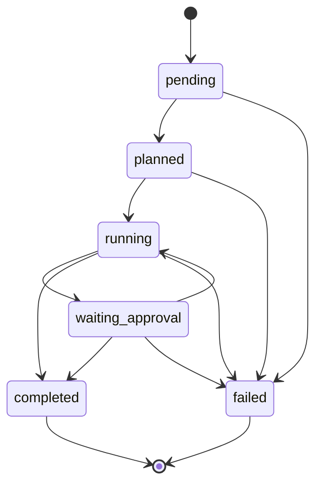
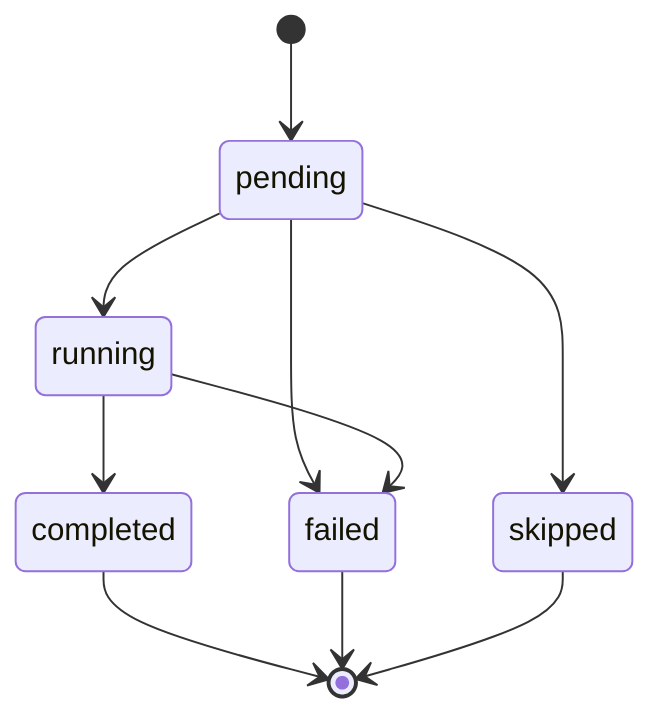

# Case / Step 状态机（T1 冻结）

本文档与 `rootseeker/contracts/state_machine.py` 中的允许转移表一致。运行时应用 `validate_case_transition` / `validate_step_transition` 校验，避免各模块重复定义规则。

## 责任边界

- **Case** 顶层状态：仅由总控（Supervisor / Case orchestrator）发起变更；工具层不得直接修改。
- **Step** 状态：由执行引擎或审批引擎发起变更。

## Case 状态

- `pending`：已创建，尚未生成计划。
- `planned`：已选定 Skill / 计划步骤。
- `running`：执行中。
- `waiting_approval`：等待人工或策略审批。
- `completed`：成功结束（终态）。
- `failed`：失败结束（终态）。

### 允许转移

| 当前               | 可转移到                                |
| ---------------- | ----------------------------------- |
| pending          | planned, failed                     |
| planned          | running, failed                     |
| running          | waiting_approval, completed, failed |
| waiting_approval | running, completed, failed          |
| completed        | （无）                                 |
| failed           | （无）                                 |

## Step 状态

- `pending`：未开始。
- `running`：执行中。
- `completed`：成功（终态）。
- `failed`：失败（终态）。
- `skipped`：跳过（终态）。

### 允许转移

| 当前        | 可转移到                     |
| --------- | ------------------------ |
| pending   | running, skipped, failed |
| running   | completed, failed        |
| completed | （无）                      |
| failed    | （无）                      |
| skipped   | （无）                      |

## 非法转移

未列于上表的转移一律非法，应抛出 `StateTransitionError`（见 `state_machine.py`）。

## 关联代码

- `rootseeker/contracts/case.py`：`CaseStatus`、`StepStatus`
- `rootseeker/contracts/state_machine.py`：允许表与校验函数

