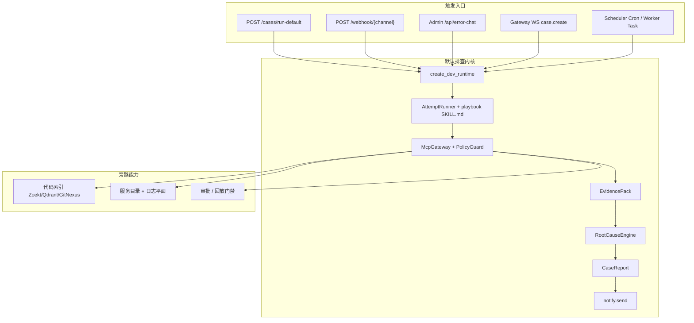

# RootSeeker V2 业务链路总览

本目录是对当前仓库**已实现业务逻辑**的代码调用链文档，按业务域拆分，便于按入口顺着文件与函数往下读。

配套计划：[`docs/superpowers/plans/2026-08-17-business-logic-traces.md`](../superpowers/plans/2026-08-17-business-logic-traces.md)。  
章节模板：[`_TEMPLATE.md`](./_TEMPLATE.md)。

---

## 如何读

1. 先读本页，建立端到端地图。
2. 再读 **[03-default-triage-flow.md](./03-default-triage-flow.md)**：默认排查主链路（告警 → Agent playbook → MCP → 证据 → 报告）。
3. 然后按需要下钻：
   - 工具怎么调：**[07-mcp-plane.md](./07-mcp-plane.md)**
   - 证据怎么变成根因：**[08-evidence-root-cause.md](./08-evidence-root-cause.md)**
   - HTTP / Admin 入口：**[18-apps-api-admin-cli.md](./18-apps-api-admin-cli.md)**
4. 契约与状态机作为词典：**[02-contracts-state-machines.md](./02-contracts-state-machines.md)**。

---

## 端到端地图

主链符号（从外到内）：

1. `apps/api/main.py` / `apps/admin/main.py` / Gateway `case_create`
2. `rootseeker/bootstrap/runtime.py:create_dev_runtime` / `run_default_flow_from_case_request`
3. `rootseeker/agent_runtime/attempt_runner.py:AttemptRunner`（当前 playbook `SKILL.md`）
4. `rootseeker/mcp_plane` → `mcp_servers/internal` / `mcp_servers/external`
5. `rootseeker/analysis` → `CaseReport` → 可选 `notify.send`

---

## 文档索引

| 文档 | 覆盖入口 / 关键符号 | 读它当… |
| --- | --- | --- |
| [01-bootstrap-wiring.md](./01-bootstrap-wiring.md) | `create_dev_runtime`、`DevRuntime`、`ROOTSEEKER_STORAGE_BACKEND` | 运行时怎么装配 |
| [02-contracts-state-machines.md](./02-contracts-state-machines.md) | `rootseeker/contracts/`、`validate_*_transition` | 类型词典与状态机 |
| [03-default-triage-flow.md](./03-default-triage-flow.md) | `/cases/run-default`、webhook、error-chat、Agent playbook | **主链路（必读）** |
| [04-skill-system.md](./04-skill-system.md) | Skill 发现/解析/注册、草稿评审发布 | Skill 资产怎么进运行时 |
| [05-skill-runtime-flow-executor.md](./05-skill-runtime-flow-executor.md) | YAML 步进器已删除 | 默认路径为 Agent playbook |
| [06-plugin-system.md](./06-plugin-system.md) | manifest、capability、`flow_plugin_id` | 插件如何声明能力 |
| [07-mcp-plane.md](./07-mcp-plane.md) | `McpGateway`、PolicyGuard、内外部 adapter | 工具调用平面 |
| [08-evidence-root-cause.md](./08-evidence-root-cause.md) | `EvidencePack`、`RootCauseEngine`、LLM 报告 | 证据与根因 |
| [09-agent-runtime.md](./09-agent-runtime.md) | `AgentRunLoop`、LLM tool plan、compaction | 默认执行器（AttemptRunner） |
| [10-channel-routing.md](./10-channel-routing.md) | inbound 归一化、出站飞书/钉钉等、`notify.send` | 告警进、通知出 |
| [11-gateway-control-plane.md](./11-gateway-control-plane.md) | `/gateway/ws`、case/flow/skill/tool/approval 方法 | 控制面协议 |
| [12-task-runtime.md](./12-task-runtime.md) | `CASE_RUN` / `CRON` / `REPLAY` / `FLOW_*` | 异步任务统一执行 |
| [13-cron-scheduler.md](./13-cron-scheduler.md) | `apps/scheduler`、Admin cron jobs、repo sync job | 定时调度 |
| [14-code-index.md](./14-code-index.md) | `RepoSyncService`、Zoekt/Qdrant/GitNexus、`code.*` | 私有代码索引 |
| [15-service-catalog-log-data.md](./15-service-catalog-log-data.md) | catalog.resolve / log.query_* | 服务映射与日志查询 |
| [16-storage.md](./16-storage.md) | memory / sqlite / mysql Store 对照 | 持久化选型 |
| [17-approval-governance-replay.md](./17-approval-governance-replay.md) | ApprovalStore、quality gate、部署策略 | 审批与发布门禁 |
| [18-apps-api-admin-cli.md](./18-apps-api-admin-cli.md) | API/Admin/Worker/Scheduler/CLI 路由表 | 进程入口总表 |
| [19-observability-infra.md](./19-observability-infra.md) | `/healthz` `/metrics`、audit、secret、guards | 可观测与防护 |

---

## 按触发场景跳转

| 你想跟的场景 | 从哪篇开始 | 再跟 |
| --- | --- | --- |
| 粘贴一段报错跑默认排查 | [18](./18-apps-api-admin-cli.md) Admin error-chat 或 [03](./03-default-triage-flow.md) | 07 → 08 |
| 告警 Webhook 进系统 | [10](./10-channel-routing.md) | 03 → 08 |
| 看某一步工具实际打到哪 | [03](./03-default-triage-flow.md) 步骤表 | [07](./07-mcp-plane.md) |
| 仓库同步 / 代码搜不到 | [14](./14-code-index.md) | [13](./13-cron-scheduler.md) |
| Flow 中途失败要续跑 | [05](./05-skill-runtime-flow-executor.md)（按步 resume 已删除） | [09](./09-agent-runtime.md) |
| 写工具被拦住要审批 | [17](./17-approval-governance-replay.md) | [07](./07-mcp-plane.md)、[11](./11-gateway-control-plane.md) |
| 换 sqlite/mysql | [16](./16-storage.md) | [01](./01-bootstrap-wiring.md) |

---

## 分析时记下的实现差距（文档已写明，不是漏写）

这些是**历史上**记录过的差距；下列条目已在当前分支修复，详细见各域文档与代码：

| 原差距 | 当前状态 |
| --- | --- |
| `flow_plugin_id` 未消费 | 步进器已删除；默认路径不再读取该字段驱动 YAML 步骤 |
| `SkillPublisher` 未注册 registry | 已修复 |
| `stable_stagger_seconds` 未接入 tick | 已接入 `CronScheduler.tick` |
| Gateway 鉴权/限流未注入 API | 已通过 `build_gateway_server` 按设置注入 |
| Replay Store 未接入运行时 | sqlite/mysql 已接入 `DevRuntime.replay_store` |
| `NetworkGuard` / `ExecApprovalGuard` 未进 bootstrap | 已装配到 `DevRuntime` |
| `AgentRuntime` 未接入生产入口 | 已支持 API/Webhook/Gateway/Task/CLI/Admin + `ROOTSEEKER_AGENT_FLOW_ENABLED` |
| `RootCauseEngine` 单轮迭代 | 已支持多轮聚焦 + MCP 可选补证（`McpGatewayEvidenceExpander`） |
| Gateway WS 与内存订阅桥接 | 已通过 `GatewayWsBridge` 同步 WS 帧订阅与 `SubscriptionRegistry`，`broadcast` 支持 `case.*` 通配 |
| `EventBus` 未进 bootstrap | 已装配；`case.completed` 经 EventBus → Gateway WS 推送 |
| `PresenceRegistry` 未进 bootstrap | 已装配；各 app 按角色 heartbeat |

## 第二轮重审（2026-08-17）

计划：[`docs/superpowers/plans/2026-08-17-business-logic-reaudit.md`](../superpowers/plans/2026-08-17-business-logic-reaudit.md)

| 修复项 | 说明 |
| --- | --- |
| Webhook `ChannelSecurity` | `ROOTSEEKER_WEBHOOK_*` 配置后 API 入口校验签名/IP |
| 文档同步 | 09/11/16/02/10/01 等篇已对照当前代码更新 |

---

## 文件清单

`docs/business-logic/` 下应有：`_TEMPLATE.md`、`00-overview.md`（本文件）、以及 `01`–`19` 共 19 篇域文档。
