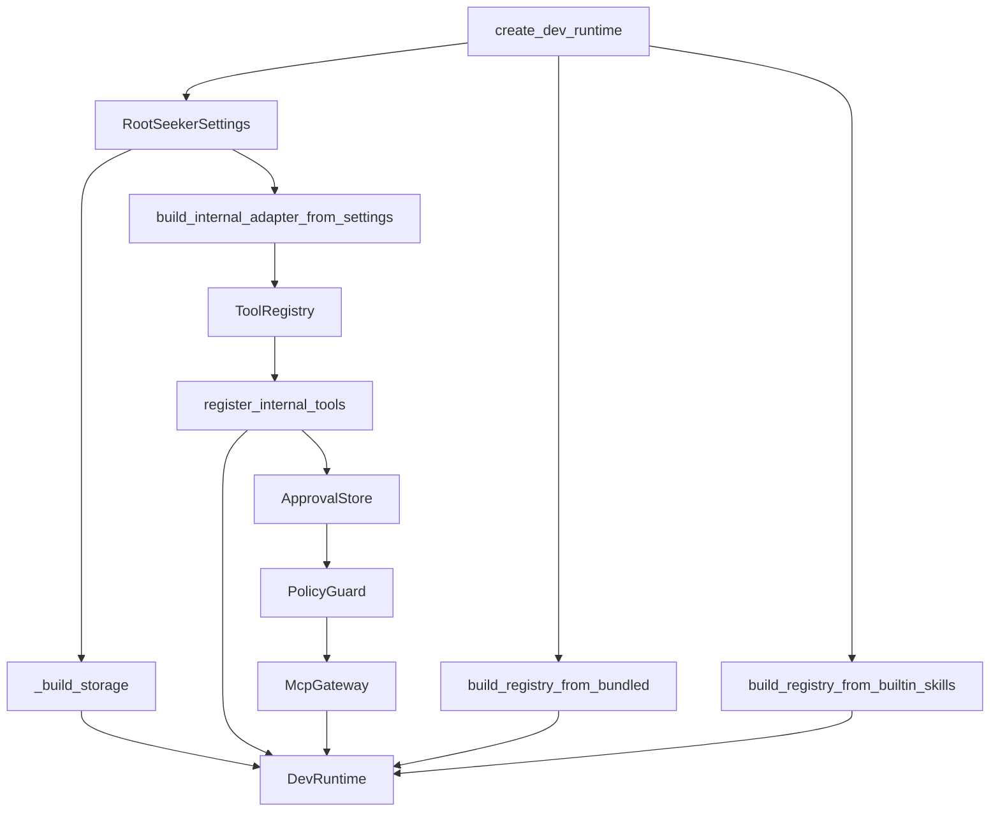
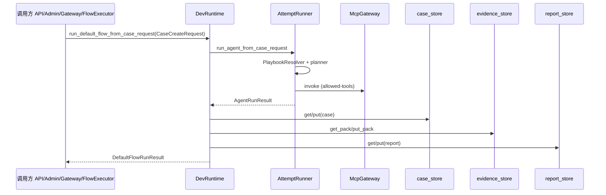

# Bootstrap 装配与默认 Flow 触发

## 1. 业务目标

RootSeeker V2 在本地开发、冒烟测试与多个应用进程（API / Admin / Worker / CLI / Scheduler）中，需要一套**可重复装配**的运行时容器 `DevRuntime`。该容器把内置插件、Skill、内部 MCP 工具、策略网关与持久化 Store 一次性连线，使上层只需持有 `DevRuntime` 即可触发默认日志排查 Flow。

**谁触发：** `apps/api`、`apps/admin`、`apps/worker`、`apps/cli`、`apps/scheduler` 在进程启动或任务执行时调用 `create_dev_runtime`；业务入口再通过 `run_default_flow_from_case_request`（或其 payload 包装）执行一次完整排查。

**解决什么问题：** 避免每个入口重复手工 new Store / Registry / Gateway；统一从 `RootSeekerSettings`（环境变量 `ROOTSEEKER_*`）读取配置，并按 `ROOTSEEKER_STORAGE_BACKEND` 选择 memory / sqlite / mysql 后端。

**成功时产出：** `DefaultFlowRunResult`（含 `CaseRecord`、`EvidencePack`、`CaseReport`），且三者已通过 `case_store.put` / `evidence_store.put_pack` / `report_store.put` 写入运行时 Store。

**失败时落到哪里：** Agent/planner 失败时 Case 带错误码（如 `SKILL_PLANNER_FAILED`），**不会**调用已删除的 `execute_skill_flow`；HTTP 适配器缺 URL 时 `build_internal_adapter_from_settings` fail-fast。

---

## 2. 入口一览

| 入口类型 | 路径 / 符号 | 说明 |
| --- | --- | --- |
| 装配工厂 | `rootseeker/bootstrap/runtime.py:create_dev_runtime` | 创建完整 `DevRuntime`（dev/smoke 默认路径） |
| 公开 re-export | `rootseeker/bootstrap/__init__.py` | 导出 `DevRuntime`、`create_dev_runtime` |
| 默认 Flow（Case 契约） | `DevRuntime.run_default_flow_from_case_request` | 接受 `CaseCreateRequest`，执行默认 triage 并写 Store |
| 默认 Flow（Webhook dict） | `DevRuntime.run_default_flow_from_payload` | `webhook_payload_to_case_create` 后转调 case_request 路径 |
| HTTP REST | `apps/api/main.py:create_app` | 启动时 `create_dev_runtime`；`/cases/run-default` 与 `/webhook/{channel}` 触发 Flow |
| Admin UI | `apps/admin/main.py:_create_admin_runtime` | 带 `RepoSyncService` 的 `create_dev_runtime`；错误排查聊天调用 `run_default_flow_from_payload` |
| Worker | `apps/worker/main.py:run_once` / `run_loop` | `create_dev_runtime` + `TaskRuntime`，间接经 `FlowRuntime.run_default` 触发 |
| CLI | `apps/cli/main.py` | `demo` 直接 `run_default_flow_from_payload`；`resume` / `resume-list` 用 `create_dev_runtime` |
| Scheduler | `apps/scheduler/main.py` | `replay.default_flow` 任务内 `create_dev_runtime` + `TaskRuntime` |
| Gateway WS | `rootseeker/gateway/methods/case_methods.py:case_create` | `run_default_flow_from_case_request` |
| Flow 编排层 | `rootseeker/flow_runtime/flow_executor.py:FlowExecutor.execute_default` | 包装 runtime 方法并构建 `ExecutionTrace` |

---

## 3. 主调用链（逐步）

### 3.1 `create_dev_runtime` 装配顺序

装配在 `rootseeker/bootstrap/runtime.py` 的 `create_dev_runtime` 中完成。严格顺序如下（括号内为可选覆盖参数）：

| 序号 | 步骤 | 文件 | 函数 / 类型 | 说明 |
| --- | --- | --- | --- | --- |
| 1 | 仓库根 | `runtime.py` | `Path.cwd()` 或 `repo_root` | 定位 `plugins/builtin`、`skills/builtin` |
| 2 | 审计 | `runtime.py` | `InMemoryAuditLog()` | 进程内审计，供 `McpGateway` 记录工具调用 |
| 3 | 插件注册表 | `runtime.py` | `build_registry_from_bundled` | 扫描 `{repo_root}/plugins/builtin` |
| 4 | Skill 注册表 | `runtime.py` | `build_registry_from_builtin_skills` | 扫描 `{repo_root}/skills/builtin` |
| 5 | 工具注册表 | `runtime.py` | `ToolRegistry()` | 空 registry，待注册内部 MCP handler |
| 6 | **Settings** | `infra_core/settings.py` | `RootSeekerSettings()` | 读取 `ROOTSEEKER_*` 环境变量 |
| 7 | **Internal Adapter** | `config/internal_adapter.py` | `build_internal_adapter_from_settings` | 或由调用方传入 `internal_adapter` |
| 8 | **注册内部工具** | `mcp_servers/internal/handlers.py` | `register_internal_tools(tools, adapter=adapter)` | 绑定 adapter → handler；返回 `MemoryServiceCatalog` |
| 9 | 审批 Store | `runtime.py` | `ApprovalStore` | 若 `approval_webhook_url` 非空则挂 `WebhookApprovalEventSink` |
| 10 | **PolicyGuard** | `runtime.py` | `PolicyGuard(...)` | `deny_write` 参数 + settings 审批策略 |
| 11 | **McpGateway** | `runtime.py` | `McpGateway(tools, policy, audit)` | 工具调用统一入口 |
| 12 | **Stores** | `runtime.py` | `_build_storage(root, settings)` | 按 `storage_backend` 实例化四类 Store |
| 13 | 组装 | `runtime.py` | `DevRuntime(...)` | 返回完整运行时 |

**Settings → Adapter 分支**（`config/internal_adapter.py`）：

1. `settings.internal_adapter_kind == "http"` → `HttpInternalToolAdapter`（要求 `ROOTSEEKER_INTERNAL_HTTP_BASE_URL`）
2. 否则（默认 `composite`）→ `CompositeProductionAdapter.from_env`，内部通过 `_repo_sync_from_settings` 构造 `RepoSyncService`

**Adapter → Tools**：`register_internal_tools` 将 SLS/Jaeger/代码索引/catalog 等内部 tool 名注册到 `ToolRegistry`，handler 委托给 adapter 实例方法。

**Policy → Gateway**：`McpGateway.invoke` 在调用 handler 前经 `PolicyGuard` 校验写权限与审批；每次调用写入 `audit_log`。

**Gateway → Stores**：Gateway 本身不持有 Store；Store 在 `DevRuntime` 字段上，由 Flow 执行完毕后写入。



#### 逐步明细（装配）

1. `rootseeker/bootstrap/runtime.py` → `create_dev_runtime`
   - 入：`repo_root`（可选）、`deny_write`、`catalog`、`internal_adapter`、`repo_sync_service`
   - 出：`DevRuntime` 实例
   - 下一步：调用方持有 runtime，按需触发 Flow 或 `gateway.invoke`

2. `rootseeker/infra_core/settings.py` → `RootSeekerSettings`
   - 入：环境变量 `ROOTSEEKER_STORAGE_BACKEND`、`ROOTSEEKER_INTERNAL_ADAPTER_KIND` 等
   - 出：settings 对象（`storage_backend` 默认 `"memory"`）
   - 下一步：`build_internal_adapter_from_settings`、`_build_storage`

3. `rootseeker/config/internal_adapter.py` → `build_internal_adapter_from_settings`
   - 入：`settings`、可选 `catalog`、`repo_sync_service`
   - 出：`InternalToolAdapter` 实现
   - 下一步：`register_internal_tools`

4. `mcp_servers/internal/handlers.py` → `register_internal_tools`
   - 入：`ToolRegistry`、adapter
   - 出：`MemoryServiceCatalog`（作为 `DevRuntime.service_catalog`）
   - 下一步：构造 `PolicyGuard` → `McpGateway`

5. `rootseeker/bootstrap/runtime.py` → `_build_storage`
   - 入：`repo_root`、`settings.storage_backend`
   - 出：`(case_store, evidence_store, report_store, flow_checkpoint_store)` 元组
   - 下一步：传入 `DevRuntime` 构造函数

### 3.2 `ROOTSEEKER_STORAGE_BACKEND` 存储选择

环境变量 `ROOTSEEKER_STORAGE_BACKEND` 映射到 `RootSeekerSettings.storage_backend`（合法值：`memory` | `sqlite` | `mysql`，默认 `memory`）。

选择逻辑在 `rootseeker/bootstrap/runtime.py` 的 **`_build_storage`** 中：

| `storage_backend` | 辅助函数 / 构造 | 产出的 Store 类型 |
| --- | --- | --- |
| `"mysql"` | **`mysql_config_from_settings(settings)`**（`rootseeker/storage/mysql_conn.py`） | `MysqlCaseStore`、`MysqlEvidenceStore`、`MysqlReportStore`、`MysqlCheckpointStore` |
| `"sqlite"` | 解析 **`settings.sqlite_db_path`**（相对路径则 `{repo_root}/{path}`，并 `mkdir` 父目录） | `SqliteCaseStore`、`SqliteEvidenceStore`、`SqliteReportStore`、`SqliteCheckpointStore` |
| 其他（含默认 `"memory"`） | 无额外 helper；memory 分支 lazy import **`FlowCheckpointStore`**（`rootseeker/flow_runtime/checkpoint.py`） | `InMemoryCaseStore`、`InMemoryEvidenceStore`、`InMemoryReportStore`、`FlowCheckpointStore` |

**说明：**

- `_build_storage` 是唯一的 bootstrap 层分支点；各 Store 类本身不再二次解析 backend。
- sqlite 路径由 `ROOTSEEKER_SQLITE_DB_PATH` 控制（默认 `data/rootseeker.db`）。
- mysql 连接参数来自 `ROOTSEEKER_MYSQL_*` 系列字段，经 `mysql_config_from_settings` 转为 `MysqlConnectConfig`。

### 3.3 默认 Flow 执行链

从 `run_default_flow_from_case_request` 到 Store 写入：



#### 逐步明细（默认 Agent playbook）

1. 调用方 → `DevRuntime.run_default_flow_from_case_request`
   - 入：`CaseCreateRequest`
   - 出：`DefaultFlowRunResult`
   - 下一步：`run_agent_from_case_request` → `AttemptRunner`

2. `rootseeker/agent_runtime/attempt_runner.py` → `AttemptRunner.run_once`
   - 入：case_request、skill_registry、overlay
   - 出：Case / Evidence / Report 已由 Agent 写入 Store
   - **不**调用 `execute_skill_flow`

3. `DevRuntime.run_default_flow_from_case_request`（读 Store 并适配）
   - 从 `case_store` / `evidence_store` / `report_store` 读取 Agent 产物
   - 包装为 `DefaultFlowRunResult`

4. **Payload 快捷路径** → `run_default_flow_from_payload`
   - `rootseeker/channel_routing/webhook_payload_to_case_create(payload)` → `CaseCreateRequest`
   - 转调 `run_default_flow_from_case_request`

#### 经 `FlowRuntime` 的间接路径

`TaskRuntime` 与需要 execution trace / checkpoint 的入口不直接调 `DevRuntime`，而是：

1. `rootseeker/task_runtime/task_executor.py`：`TaskKind.CASE_RUN` → `FlowRuntime.run_default(req)`
2. `rootseeker/flow_runtime/runtime.py`：`FlowRuntime.run_default` → `FlowExecutor.execute_default`
3. `rootseeker/flow_runtime/flow_executor.py`：`execute_default` → `runtime.run_default_flow_from_case_request` → `build_execution_trace` → 返回 `FlowExecutionResult`
4. `FlowRuntime.run_default` 额外 `checkpoints.save` 到 `runtime.flow_checkpoint_store`

### 3.4 谁调用 `create_dev_runtime`

| 调用方 | 文件 | 函数 / 上下文 | 备注 |
| --- | --- | --- | --- |
| API | `apps/api/main.py` | `create_app` | `create_dev_runtime(repo_root or Path.cwd())` |
| Admin | `apps/admin/main.py` | `_create_admin_runtime` | 注入 `repo_sync_service`；随后 `_load_admin_config` 填充 catalog/skill |
| Worker | `apps/worker/main.py` | `run_once`、`run_loop` | 每次启动新建 runtime + `TaskRuntime` |
| CLI | `apps/cli/main.py` | `_run_demo`、`_run_resume`、`_run_resume_list` | demo 直接跑 Flow；resume 走 Task/FlowRuntime |
| Scheduler | `apps/scheduler/main.py` | `replay.default_flow` job handler | cron 回放套件 |
| 脚本 / 测试 | `scripts/verify_all_tools.py`、`tests/**` | 各类集成/单元测试 | 非生产入口，证明装配可重复 |

**可选参数使用：**

- `deny_write=True`：测试写工具策略时使用（grep 可见于 gateway 测试）
- `internal_adapter=...`：集成测试注入 `StubInternalToolAdapter`
- `repo_sync_service=...`：Admin 与 verify 脚本注入自定义 sync 服务

### 3.5 谁调用 `run_default_flow_from_case_request`

| 调用方 | 文件 | 说明 |
| --- | --- | --- |
| `DevRuntime` 自身 | `run_default_flow_from_payload` | payload → case_request 包装 |
| `FlowExecutor` | `flow_executor.py` | `execute_default`（无 `execute_from_checkpoint`） |
| API Webhook | `apps/api/main.py` | `POST /webhook/{channel}` 归一化后直接调用 |
| Gateway | `gateway/methods/case_methods.py` | `case.create` 业务方法 |

**调用 `run_default_flow_from_payload`（间接同一链路）的入口：**

- API `POST /cases/run-default`
- Admin 错误排查聊天
- CLI `demo`
- `rootseeker/replay/runner.py` 回放套件

---

## 4. 关键数据结构

### 4.1 `DevRuntime` 字段表

定义文件：`rootseeker/bootstrap/runtime.py`

| 字段 | 类型 | 职责 | 谁填充 | 谁消费 |
| --- | --- | --- | --- | --- |
| `repo_root` | `Path` | 仓库根，定位 builtin 资源 | `create_dev_runtime` | Admin 配置加载、路径解析 |
| `audit_log` | `InMemoryAuditLog` | MCP 工具调用审计 | 装配时 new | Gateway、`/cases/{id}/audit` |
| `plugin_registry` | `ManifestRegistry` | 内置 plugin manifest | `build_registry_from_bundled` | Admin / 健康检查 |
| `skill_registry` | `SkillRegistry` | 三根目录 skill 定义 | `build_skill_registry` | PlaybookResolver / AttemptRunner |
| `tool_registry` | `ToolRegistry` | MCP 工具 spec + handler | `register_internal_tools` | Gateway lookup |
| `service_catalog` | `MemoryServiceCatalog` | 服务目录条目 | `register_internal_tools` 返回值；Admin 可 upsert | catalog.* 工具 |
| `policy` | `PolicyGuard` | 写权限 / 审批策略 | `create_dev_runtime` | `McpGateway.invoke` |
| `gateway` | `McpGateway` | 工具调用门面 | `create_dev_runtime` | Flow step、REST tool invoke |
| `case_store` | `InMemory*` / `Sqlite*` / `Mysql*` | Case 持久化 | `_build_storage` | `run_default_flow_from_case_request` 写入；API GET |
| `evidence_store` | 同上 | 证据包 | `_build_storage` | Flow 写入；API GET evidence |
| `report_store` | 同上 | 排查报告 | `_build_storage` | Flow 写入；API GET report |
| `flow_checkpoint_store` | `FlowCheckpointStore` / `Sqlite*` / `Mysql*` | Flow 断点 | `_build_storage` | `FlowRuntime` save/get |
| `approval_store` | `ApprovalStore` | 审批记录 | `create_dev_runtime` | PolicyGuard 写工具审批 |
| `replay_store` | `ReplayStore` / `SqliteReplayHistoryStore` / `MysqlReplayHistoryStore` | 回放用例与运行历史 | `_build_replay_store` | `ReplayRunner`、Cron/Task REPLAY |
| `network_guard` | `NetworkGuard` | 出站 URL 私网拦截 | `create_dev_runtime` | 审批 webhook、HTTP 出站 |
| `exec_approval_guard` | `ExecApprovalGuard` | Shell 执行审批 | `create_dev_runtime` | 待集成的 exec 路径 |
| `event_bus` | `EventBus` | 进程内事件总线 | `create_dev_runtime` | `case.completed` → Gateway WS |
| `presence_registry` | `PresenceRegistry` | 节点心跳 | `create_dev_runtime` | `/system/presence`、`system.list_presence` |
| `node_id` | `str` | 本进程节点标识 | `_resolve_node_id` | `heartbeat_presence` |

### 4.2 Flow 输入 / 输出契约

| 类型 | 定义文件 | 关键字段 | 说明 |
| --- | --- | --- | --- |
| `CaseCreateRequest` | `rootseeker/contracts/case.py` | `title`, `symptom`, `service_name`, `source`, `metadata` | 所有 Flow 入口的统一输入 |
| `DefaultFlowRunResult` | `rootseeker/bootstrap/results.py` | `case`, `evidence_pack`, `report`, `tool_results`, `step_traces?` | Agent 产物适配；DevRuntime 取前三项 |
| `CaseRecord` | `rootseeker/contracts/case.py` | `case_id`, `status`, `steps`, `selected_skills`, ... | `case_store.put` 的对象 |
| `EvidencePack` | `rootseeker/contracts/evidence.py` | `case_id`, `items` | `evidence_store.put_pack` |
| `CaseReport` | `rootseeker/contracts/report.py` | `case_id`, `title`, `summary`, ... | `report_store.put` |
| `FlowExecutionResult` | `rootseeker/flow_runtime/flow_executor.py` | `case_id`, `trace`, `step_outputs` | FlowRuntime 层包装，非 DevRuntime 直接返回 |

### 4.3 Settings 中与装配相关的字段

| 环境变量 | Settings 属性 | 默认值 | 影响 |
| --- | --- | --- | --- |
| `ROOTSEEKER_STORAGE_BACKEND` | `storage_backend` | `memory` | `_build_storage` 分支 |
| `ROOTSEEKER_SQLITE_DB_PATH` | `sqlite_db_path` | `data/rootseeker.db` | sqlite Store 文件路径 |
| `ROOTSEEKER_MYSQL_*` | `mysql_host` 等 | 见 settings | `mysql_config_from_settings` |
| `ROOTSEEKER_INTERNAL_ADAPTER_KIND` | `internal_adapter_kind` | `composite` | adapter 种类 |
| `ROOTSEEKER_INTERNAL_HTTP_BASE_URL` | `internal_http_base_url` | `None` | http adapter 必填 |
| `ROOTSEEKER_APPROVAL_REQUIRED_FOR_WRITE_TOOLS` | `approval_required_for_write_tools` | `False` | PolicyGuard |
| `ROOTSEEKER_APPROVAL_WEBHOOK_URL` | `approval_webhook_url` | `None` | 审批事件 webhook |

---

## 5. 状态与副作用

### 5.1 Case / Step 状态

Case 执行由 `AttemptRunner` 驱动，更新 `CaseRecord.steps[*].status`（`StepStatus`）与 `CaseRecord.status`（`CaseStatus`）。具体转移规则见 [02-contracts-state-machines.md](./02-contracts-state-machines.md) 与 [03-default-triage-flow.md](./03-default-triage-flow.md)。

Bootstrap 层保证：**仅在 Flow 函数正常返回后**才调用 Store 写入；中途异常不会部分写入 case/evidence/report。

### 5.2 写入的 Store

| Store | 写入时机 | 写入函数 | 键 |
| --- | --- | --- | --- |
| `case_store` | `run_default_flow_from_case_request` 末尾 | `put(result.case)` | `case_id` |
| `evidence_store` | 同上 | `put_pack(result.evidence_pack)` | `case_id` |
| `report_store` | 同上 | `put(result.report)` | `case_id` |
| `flow_checkpoint_store` | **非** DevRuntime 方法内；由 `FlowRuntime` / API 额外 save | `checkpoints.save(execution_id, payload)` | `execution_id` |
| `audit_log` | 每次 `gateway.invoke` | Gateway 内部 append | 按 `case_id` 查询 |
| `approval_store` | 写工具需审批时 | PolicyGuard 协调 | approval id |

### 5.3 对外 I/O

- **MCP 工具**：Flow step 经 `McpGateway` → `register_internal_tools` handler → `InternalToolAdapter`（SLS、Jaeger、代码搜索、notify 等）。详见 [07-mcp-plane.md](./07-mcp-plane.md)。
- **通知渠道**：若 step 调用 `notify.send`，走 adapter 出站（非 bootstrap 装配本身）。
- **索引服务**：composite adapter 通过 `RepoSyncService` 连接 Zoekt/Qdrant（settings 中 endpoint）。详见 [14-code-index.md](./14-code-index.md)。

---

## 6. 分支与错误

| 条件 | 代码位置 | 行为 |
| --- | --- | --- |
| `storage_backend == "mysql"` | `runtime.py:_build_storage` | `mysql_config_from_settings` → 四个 Mysql*Store |
| `storage_backend == "sqlite"` | `runtime.py:_build_storage` | 解析 db 路径并创建目录 → 四个 Sqlite*Store |
| 默认 / 其他值 | `runtime.py:_build_storage` | 四个 InMemory* + `FlowCheckpointStore` |
| `internal_adapter_kind == "http"` 且缺 base URL | `config/internal_adapter.py` | `ValueError` fail-fast |
| `internal_adapter_kind == "mock"` | `infra_core/settings.py` validator | `ValueError`（已废弃 mock） |
| 默认 flow plugin 未注册 | `runner.py:_validate_default_flow_registration` | `ValueError` |
| `deny_write=True` | `PolicyGuard` | 写工具 invoke 被拒绝 |
| `approval_required_for_write_tools=True` | `PolicyGuard` + `ApprovalStore` | 写工具可能阻塞待审批 |
| Agent / planner 失败 | `AttemptRunner` | Case `failed` + 错误码；**不**调用 `execute_skill_flow` |
| Admin 未找到 plugins 目录 | `admin/main.py:_create_admin_runtime` | 回退 `Path.cwd()` 作为 runtime_root |

---

## 7. 相关测试

| 测试文件 | 覆盖点 |
| --- | --- |
| `tests/unit/test_bootstrap_storage.py` | `ROOTSEEKER_STORAGE_BACKEND=sqlite` 时 case/report/evidence/checkpoint 跨 `create_dev_runtime` 实例持久化；TaskRuntime 跨实例执行 pending 任务 |
| `tests/integration/test_dev_runtime_smoke.py` | 装配后 `gateway.invoke` catalog 工具、审计计数、evidence 组装 smoke |
| `tests/integration/test_default_flow.py` | 完整 `run_default_flow_from_payload` 闭环；stub adapter 分支 |
| `tests/integration/test_e2e_full_chain.py` | 端到端 payload → default flow |
| `tests/unit/gateway/test_gateway_business_methods.py` | `create_dev_runtime` + Gateway `case.create` / `flow.run` |
| `tests/unit/task_runtime/test_task_executor.py` | `CASE_RUN` 任务经 `FlowRuntime.run_default` 间接调用 bootstrap Flow |
| `tests/unit/mcp_plane/test_gateway.py` | Policy / audit 与 `register_internal_tools` 连线 |

`tests/unit/test_bootstrap_smoke.py` 仅为占位断言，**不**验证装配逻辑。

---

## 8. 与其他文档的关系

| 文档 | 关系 |
| --- | --- |
| [02-contracts-state-machines.md](./02-contracts-state-machines.md) | `CaseCreateRequest` / `CaseRecord` 字段与 Case/Step 状态机 |
| [03-default-triage-flow.md](./03-default-triage-flow.md) | Agent playbook 默认路径、工具与证据细节 |
| [06-plugin-system.md](./06-plugin-system.md) | `build_registry_from_bundled` 与 bundled plugin |
| [04-skill-system.md](./04-skill-system.md) | `build_skill_registry` 与 `default-log-triage` playbook |
| [05-skill-runtime-flow-executor.md](./05-skill-runtime-flow-executor.md) | YAML 步进器已删除 |
| [07-mcp-plane.md](./07-mcp-plane.md) | `ToolRegistry` / `PolicyGuard` / `McpGateway.invoke` 全链路 |
| [16-storage.md](./16-storage.md) | 各 Store 后端读写实现细节 |
| [12-task-runtime.md](./12-task-runtime.md) | Worker / Scheduler 如何通过 `TaskRuntime` 间接使用 DevRuntime |
| [18-apps-api-admin-cli.md](./18-apps-api-admin-cli.md) | 各 app 进程入口与 HTTP 路由汇总 |

---

## 附录：关键代码锚点

`create_dev_runtime` 核心装配（节选）：

```python
# rootseeker/bootstrap/runtime.py (约 91–131 行)
settings = RootSeekerSettings()
adapter = internal_adapter or build_internal_adapter_from_settings(...)
mem_cat = register_internal_tools(tools, adapter=adapter)
policy = PolicyGuard(deny_write=deny_write, approval_store=approval_store, ...)
gateway = McpGateway(tools, policy, audit)
case_store, evidence_store, report_store, flow_checkpoint_store = _build_storage(root, settings)
return DevRuntime(...)
```

`run_default_flow_from_case_request` 写 Store（节选）：

```python
# rootseeker/bootstrap/runtime.py
agent_result = self.run_agent_from_case_request(case_request)
case = self.case_store.get(agent_result.case_id)
pack = self.evidence_store.get_pack(agent_result.case_id)
report = self.report_store.get(agent_result.case_id)
return DefaultFlowRunResult(case=case, evidence_pack=pack, report=report, tool_results=[])
```

`_build_storage` 三分支（节选）：

```python
# rootseeker/bootstrap/runtime.py (约 143–171 行)
if settings.storage_backend == "mysql":
    mysql = mysql_config_from_settings(settings)
    return (MysqlCaseStore(mysql), ...)
if settings.storage_backend == "sqlite":
    ...
return (InMemoryCaseStore(), ..., FlowCheckpointStore())
```
