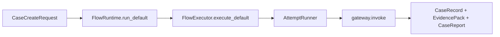
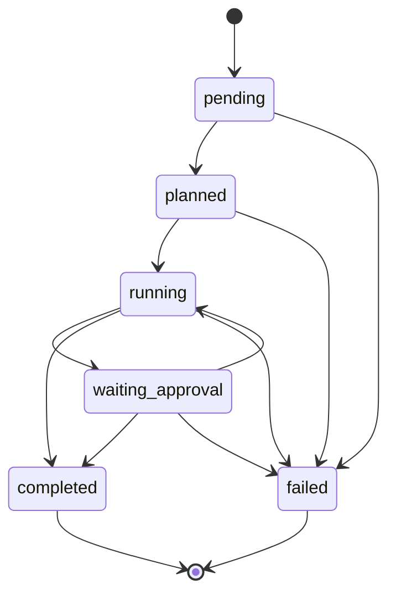
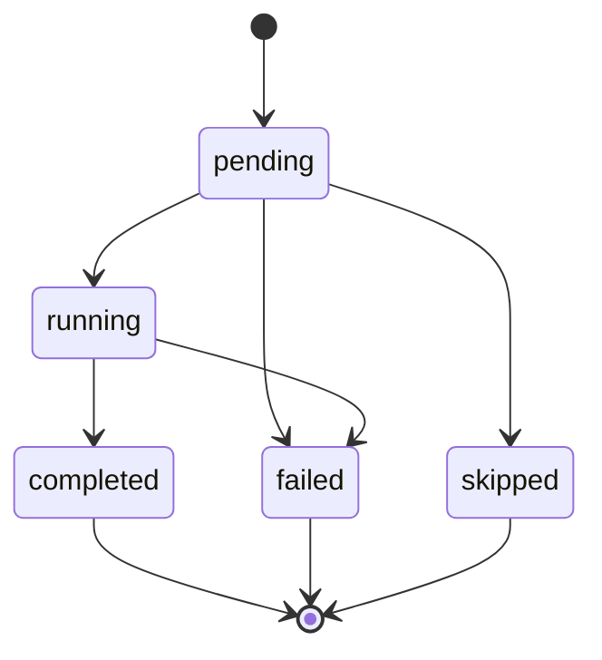

# 契约与 Case/Step 状态机

## 1. 业务目标

`rootseeker/contracts/` 是 RootSeeker V2 的 **T1 冻结契约层**：各业务域（Case、Skill、Tool、Evidence、Flow 等）共享同一套 Pydantic 模型与枚举，避免 API、运行时、存储层各自定义重复结构。

契约层本身不执行业务，但规定了 **Case / Step 生命周期** 的合法状态与转移表（`state_machine.py`），供总控与执行引擎在变更状态前校验。成功时，上下游模块通过 `from rootseeker.contracts import ...` 或子模块导入获得类型安全的入参/出参；非法状态转移应抛出 `StateTransitionError`。失败时，API/工具层通过 `FailureEnvelope` + `ErrorShape` 返回统一错误形态。

本模块是后续所有业务链路文档的 **数据字典与状态机基准**；运行时是否已接入校验函数，见第 5、6 节。

## 2. 入口一览

| 入口类型 | 路径 / 符号 | 说明 |
| --- | --- | --- |
| 统一导出 | `rootseeker/contracts/__init__.py` | 聚合导出全部公开契约符号 |
| 状态机 | `rootseeker/contracts/state_machine.py` | `ALLOWED_*_TRANSITIONS`、`validate_*_transition`、`StateTransitionError` |
| 架构文档 | `docs/architecture/state-machines.md` | Case/Step 状态语义与责任边界（与代码表一致） |
| 运行时消费 | `rootseeker/skill_runtime/flow_executor.py` | 读写 `CaseRecord` / `CaseStep` 状态 |
| 运行时消费 | `rootseeker/agent_runtime/attempt_runner.py` | LLM 工具规划路径下读写 Case/Step 状态 |
| 运行时消费 | `rootseeker/flow_runtime/flow_executor.py` | 将 `CaseCreateRequest` 交给 bootstrap 默认 flow |
| 存储层 | `rootseeker/storage/*` | 持久化 `CaseRecord`、`EvidencePack`、`CaseReport` 等 |
| 单元测试 | `tests/unit/contracts/` | 契约序列化与状态机校验 |

## 3. 主调用链（逐步）

契约层无独立 HTTP/CLI 入口；以下为 **典型消费顺序**（以默认排查 flow 为例）：

1. `rootseeker/flow_runtime/runtime.py` → `FlowRuntime.run_default`
   - 入：`CaseCreateRequest(title, symptom, service_name, source, metadata)`
   - 出：调用 `FlowExecutor.execute_default`
2. `rootseeker/flow_runtime/flow_executor.py` → `FlowExecutor.execute_default`
   - 入：`CaseCreateRequest`
   - 出：调用 `DevRuntime.run_default_flow_from_case_request`，再 `build_execution_trace` 组装 `ExecutionTrace`
3. `rootseeker/agent_runtime/attempt_runner.py` → `AttemptRunner.run_once`
   - 入：`CaseCreateRequest`、Skill registry、MCP gateway
   - 出：`CaseRecord` / `EvidencePack` / `CaseReport` 写入 Store
   - **Case 创建时**设 `status=CaseStatus.RUNNING`；工具调用对应 `CaseStep`

**状态校验调用点（grep 结果）：**

| 符号 | 生产代码调用 | 测试调用 |
| --- | --- | --- |
| `validate_case_transition` | `agent_runtime/attempt_runner.py` | `tests/unit/contracts/test_t1_io_and_state_machine.py` |
| `validate_step_transition` | 同上 | 同上 |

校验函数已通过 `rootseeker/contracts/__init__.py` 公开导出；`agent_runtime/attempt_runner.py` 在状态变更前调用 `validate_*_transition`。

## 4. 关键数据结构

以下按业务域分组；定义文件均为 `rootseeker/contracts/` 下相对路径。带 `RootSeekerModel` 基类的类型禁止未知字段（`extra="forbid"`）。

### Case（`case.py`）

| 符号 | 说明 | 主要填充方 | 主要消费方 |
| --- | --- | --- | --- |
| `CaseStatus` | 顶层 Case 枚举：`pending/planned/running/waiting_approval/completed/failed` | 总控 / flow 执行器 | Store、API 响应、状态机 |
| `StepStatus` | 步骤枚举：`pending/running/completed/failed/skipped` | 执行引擎 / 审批引擎 | `CaseStep`、执行 trace |
| `CaseCreateRequest` | 创建 Case 入参：title、symptom、service_name、source、metadata | 通道/API/webhook | `FlowRuntime`、`AttemptRunner` |
| `CaseStep` | 单步：step_id、name、skill_name、action、status、tool_name、inputs/outputs、requires_approval | Skill 定义展开 | 执行引擎、checkpoint |
| `CaseRecord` | 完整 Case：case_id、字段镜像 request、status、selected_skills、steps、时间戳 | flow 执行器 | case_store、报告 |
| `CasePlanSnapshot` | 计划快照：selected_skill、planned_steps | Skill composer（规划阶段） | 审计 / 回放对比 |

### Skill（`skill.py`）

| 符号 | 说明 |
| --- | --- |
| `SkillSourceKind` | `builtin` / `custom` / `generated` |
| `SkillKind` | `flow` / `tool` / `tool_group` |
| `SkillCondition` | 步骤条件：field、operator、value |
| `SkillStepDefinition` | Skill 内一步：action、tool_skill_slug、defer_until、requires_tools、conditions |
| `SkillSpec` | 完整 Skill：slug、steps、triggers、bound_tools、version |
| `SkillExecutionPlan` | 运行时计划：skill_slug + steps |
| `GeneratedSkillDraft` | 合成草稿：draft_id、spec、source_case_ids |

### Tool（`tool.py`）

| 符号 | 说明 |
| --- | --- |
| `ToolPermissionLevel` | `read` / `write` / `admin` |
| `ToolScope` | `internal` / `external` |
| `ToolSpec` | MCP 工具元数据：name、parameters_schema、server_name |
| `ToolCallRequest` | 一次调用：case_id、step_id、skill_name、tool_name、arguments |
| `ToolError` | 工具失败：code、message、retryable |
| `ToolCallResult` | 调用结果：ok、content、error、latency_ms |

### Evidence（`evidence.py`）

| 符号 | 说明 |
| --- | --- |
| `EvidenceType` | `log/trace/code/metric/topology/service_catalog/other` |
| `EvidenceItem` | 单条证据：item_id、type、source、content |
| `EvidencePack` | Case 级证据包：case_id、items、summary |
| `ContextWindow` | Token 预算视图（非原始 store） |
| `Hypothesis` / `HypothesisStatus` | 假设与 open/confirmed/rejected |
| `RootCauseConclusion` | 根因结论：title、narrative、confidence |
| `TraceSpanRef` / `TraceChainEvidence` | 链路 trace 结构化 |
| `CodeHit` / `CodeEvidence` | 代码搜索命中 |

### Flow（`flow.py`）

| 符号 | 说明 |
| --- | --- |
| `FlowStepSpec` |  bundled flow 单步：capability（常映射 MCP tool） |
| `FlowSpec` | flow_id、plugin_id、skill_slug、steps |

### Task（`task.py`）

| 符号 | 说明 |
| --- | --- |
| `TaskKind` | `case_run/flow_resume/flow_step/cron/replay` |
| `TaskStatus` | `pending/running/completed/failed/cancelled`（**独立于 Case/Step 状态机**） |
| `TaskRecord` | 异步任务记录：task_id、kind、case_id、payload、error |

### Audit（`audit.py`）

| 符号 | 说明 |
| --- | --- |
| `AuditCategory` | `tool_call/approval/state_change/security/system` |
| `AuditEvent` | event_id、category、action、actor、target、detail |

### Plugin（`plugin.py`）

| 符号 | 说明 |
| --- | --- |
| `PluginKind` | `flow/connector/channel/policy` |
| `PluginManifest` | plugin_id、capabilities、mcp_tools、entry_point、config_schema |

### Report（`report.py`）

| 符号 | 说明 |
| --- | --- |
| `CaseReport` | case_id、title、summary、root_cause、evidence_item_ids |

### 其他支撑契约（同目录）

| 模块 | 核心符号 | 用途 |
| --- | --- | --- |
| `common.py` | `RootSeekerModel`、`EntityRef`、`Page`、`PagedResult`、`SortSpec`、`new_id`、`utc_now` | 公共基类与分页 |
| `errors.py` | `StandardErrorCode`、`ErrorShape`、`FailureEnvelope` | 统一 API/工具失败包装 |
| `io.py` | `SkillFilterRequest`、`EvidenceCollectRequest`、`CaseAccepted` | 入站/查询请求与 Case 受理响应 |
| `execution_trace.py` | `StepExecutionRecord`、`ExecutionTrace`、`SkillExecutionTrace`、`CaseExecutionTrace` | 运行时执行 trace（非 APM） |
| `indexing.py` | `IndexKind`、`IndexStatus` | 代码索引健康 |
| `log_source.py` | `LogSource` | 日志存储定位 |
| `log_query.py` | `LogQueryTemplate`、`LogQueryByTraceIdRequest`、`LogRecord`、`LogQueryResult` | 日志查询平面 |
| `repository.py` | `RepositoryRef`、`RepoSyncState`、`RepoSyncStatus` | 代码仓同步 |
| `service_catalog.py` | `ServiceCatalogEntry` | 租户/环境/服务 → 数据面映射 |
| `replay.py` | `ReplayCaseSpec`、`ReplayRunSnapshot` | 回放 fixture 与结果快照 |

## 5. 状态与副作用

### 5.1 Case 状态语义

| 状态 | 含义 |
| --- | --- |
| `pending` | 已创建，尚未生成计划（`CaseRecord` / `CaseAccepted` 默认值） |
| `planned` | 已选定 Skill / 计划步骤（`CasePlanSnapshot` 常用） |
| `running` | 执行中 |
| `waiting_approval` | 等待人工或策略审批 |
| `completed` | 成功终态 |
| `failed` | 失败终态 |

### 5.2 Case 允许转移

| 当前 | 可转移到 |
| --- | --- |
| `pending` | `planned`, `failed` |
| `planned` | `running`, `failed` |
| `running` | `waiting_approval`, `completed`, `failed` |
| `waiting_approval` | `running`, `completed`, `failed` |
| `completed` | （无） |
| `failed` | （无） |

### 5.3 Step 状态语义与允许转移

| 状态 | 含义 |
| --- | --- |
| `pending` | 未开始 |
| `running` | 执行中 |
| `completed` | 成功终态 |
| `failed` | 失败终态 |
| `skipped` | 跳过终态 |

| 当前 | 可转移到 |
| --- | --- |
| `pending` | `running`, `skipped`, `failed` |
| `running` | `completed`, `failed` |
| `completed` | （无） |
| `failed` | （无） |
| `skipped` | （无） |

### 5.4 谁可以变更 Case vs Step

**文档约定**（`docs/architecture/state-machines.md` + `state_machine.py` 注释）：

| 层级 | 发起方 | 约束 |
| --- | --- | --- |
| **Case** 顶层状态 | Supervisor / Case orchestrator（总控） | 工具层 **不得** 直接修改 Case 顶层 status |
| **Step** 状态 | 执行引擎或审批引擎 | 工具调用本身不翻转 Case 顶层状态 |

**代码中的实际写入方**（截至当前仓库，**均未调用** `validate_*_transition`）：

| 模块 | 变更 Case status | 变更 Step status | 典型转移 |
| --- | --- | --- | --- |
| `rootseeker/skill_runtime/flow_executor.py` | `PENDING→PLANNED→RUNNING→COMPLETED/FAILED`（经 `validate_case_transition`） | `PENDING→RUNNING→COMPLETED/FAILED`；恢复时预标记 `COMPLETED`（`validate=False`） | 与冻结状态机一致 |
| `rootseeker/agent_runtime/attempt_runner.py` | `PENDING→PLANNED→RUNNING→COMPLETED/FAILED` | `PENDING→SKIPPED/RUNNING→COMPLETED/FAILED` | LLM 规划路径经 `validate_*_transition` |
| `rootseeker/flow_runtime/run_trace.py` | — | 构建 trace 时使用 `COMPLETED` | 只读映射 |

**与冻结状态机的已知差距：**

- `waiting_approval` 在契约与转移表中已定义，但 **生产代码中未找到** 对该状态的赋值或转移（审批流尚未驱动 Case 顶层状态）。
- Store 写入层尚未二次校验状态转移（校验在 `flow_executor` / `attempt_runner` 执行期完成）。

### 5.5 关联 Store 与副作用

契约类型本身不写 Store；消费方典型副作用：

- `CaseRecord` → `case_store.put`
- `EvidencePack` → `evidence_store.put_pack`
- `CaseReport` → `report_store.put`
- `ExecutionTrace` / checkpoint payload → `flow_checkpoint_store.save`
- `AuditEvent` → 审计 sink（见 MCP / 审批链路）
- `TaskRecord` → 任务运行时（独立状态机）

## 6. 分支与错误

### 6.1 状态机错误（`state_machine.py`）

| 条件 | 代码位置 | 行为 |
| --- | --- | --- |
| Case 非法转移 | `validate_case_transition` | 抛出 `StateTransitionError`（继承 `ValueError`），消息含允许目标列表 |
| Step 非法转移 | `validate_step_transition` | 同上 |
| 终态再转移 | 同上 | `completed/failed/skipped` 的允许集为空，必失败 |

### 6.2 契约层标准错误（`errors.py`）

| 符号 | 说明 |
| --- | --- |
| `StandardErrorCode` | `validation_error`、`not_found`、`conflict`、`unauthorized`、`forbidden`、`internal_error`、`tool_error`、`timeout` |
| `ErrorShape` | 通用错误体：code、message、details |
| `FailureEnvelope` | API/工具统一失败包装：`ok=False` + `error: ErrorShape` |

`StateTransitionError` 定义在 `state_machine.py`，**不在** `errors.py` 中；与 `StandardErrorCode` 无直接映射，上层需自行捕获并转换为 `FailureEnvelope`（若暴露给 API）。

### 6.3 工具层错误（`tool.py`）

| 符号 | 说明 |
| --- | --- |
| `ToolError` | MCP 调用失败细节，嵌入 `ToolCallResult.error` |

### 6.4 执行 trace 错误（`execution_trace.py`）

| 字段 | 说明 |
| --- | --- |
| `StepExecutionRecord.error` | 类型为 `ErrorShape \| None`，记录步骤级失败 |

## 7. 相关测试

| 测试文件 | 覆盖点 |
| --- | --- |
| `tests/unit/contracts/test_t1_io_and_state_machine.py` | `SkillFilterRequest`、`CaseAccepted`、`EvidenceCollectRequest`；**状态机 happy path 与终态拦截** |
| `tests/unit/contracts/test_case_contracts.py` | `CaseCreateRequest`、`CaseStep`、`CaseRecord`、`CasePlanSnapshot` 构造与默认值 |
| `tests/unit/contracts/test_skill_contracts.py` | Skill 契约序列化 |
| `tests/unit/contracts/test_tool_contracts.py` | Tool 契约与权限枚举 |
| `tests/unit/contracts/test_evidence_report_audit_contracts.py` | Evidence、Report、Audit 模型 |
| `tests/unit/contracts/test_phase1_contracts_coverage.py` | Phase1 广度覆盖：errors、flow、plugin、task、replay、repository、indexing、log_query、service_catalog、execution_trace |
| `tests/integration/test_default_flow.py` | 端到端默认 flow 完成后 `CaseStatus.COMPLETED` 与全步骤 `COMPLETED` |
| `tests/integration/test_e2e_full_chain.py` | 全链路持久化 Case 状态断言 |

## 8. 与其他文档的关系

| 文档 | 关系 |
| --- | --- |
| [`docs/architecture/state-machines.md`](../architecture/state-machines.md) | Case/Step 状态语义与责任边界的架构级说明；与 `state_machine.py` 表一致 |
| [`01-bootstrap-wiring.md`](01-bootstrap-wiring.md) | DevRuntime 如何装配 Store 与 registry，为契约消费提供运行时上下文 |
| [`03-default-triage-flow.md`](03-default-triage-flow.md) | 默认排查主链路：`CaseCreateRequest` → `AttemptRunner` |
| [`05-skill-runtime-flow-executor.md`](05-skill-runtime-flow-executor.md) | Step 执行、参数规划、checkpoint 恢复对 `CaseStep` 状态的实际写入 |
| [`09-agent-runtime.md`](09-agent-runtime.md) | LLM 工具规划路径对 Case/Step 状态的写入 |
| [`12-task-runtime.md`](12-task-runtime.md) | `TaskRecord` / `TaskStatus` 异步任务状态（与 Case 状态机独立） |
| [`17-approval-governance-replay.md`](17-approval-governance-replay.md) | 审批与 `waiting_approval` 预期衔接点（契约已预留） |
| [`16-storage.md`](16-storage.md) | `CaseRecord`、`EvidencePack`、`CaseReport` 持久化后端 |
