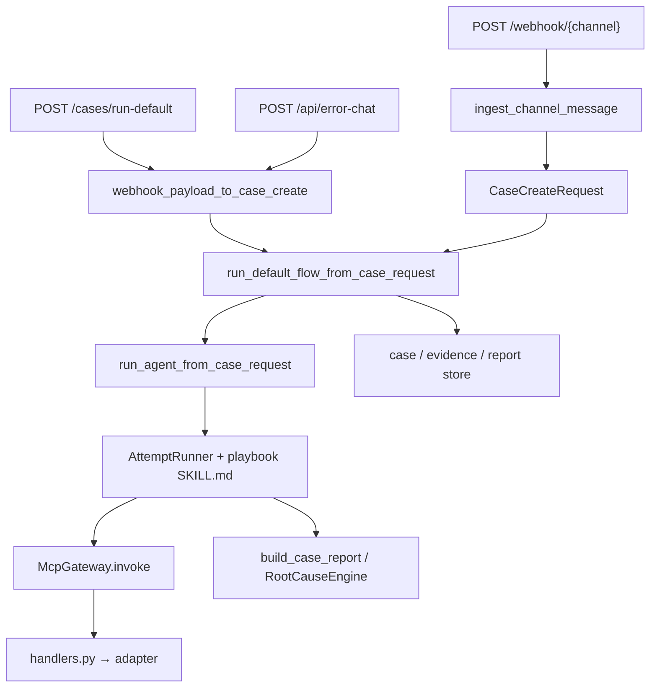
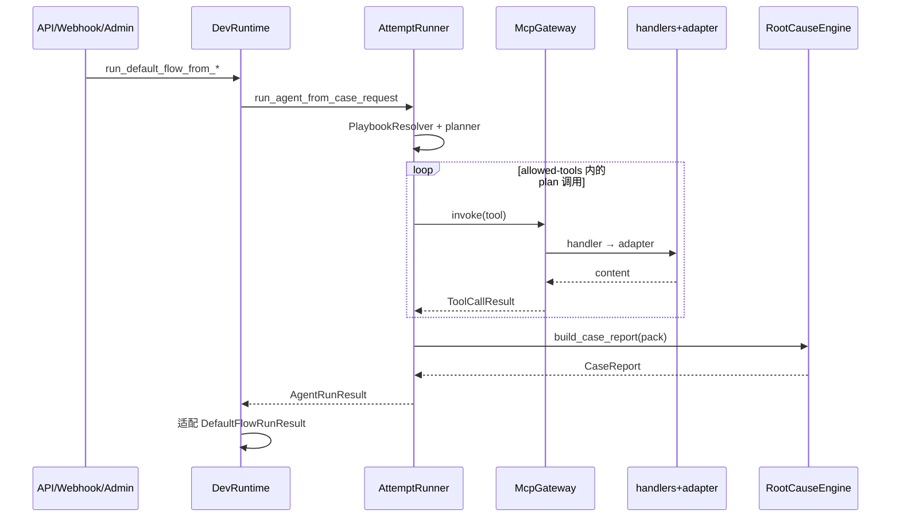

# 默认日志排查 Flow（Default Log Triage）

## 1. 业务目标

RootSeeker V2 的**默认排查链路**是产品核心路径：从告警、API 或 Admin 错误聊天收到一次故障输入，自动走完 **Case → 当前 playbook Skill → Agent 工具规划 → MCP 工具调用 → 证据 → 根因分析 → 报告** 的完整闭环。YAML 步进器 `execute_skill_flow` **已删除**；默认路径是 `AttemptRunner` + playbook `SKILL.md`。

**谁触发：** 运维/告警系统经 `POST /webhook/{channel}` 投递；开发者经 `POST /cases/run-default` 或 Admin UI 的 `/api/error-chat` 手动提交堆栈/错误文本。

**解决什么问题：** 将分散在日志（SLS）、链路（Jaeger）、代码索引（Zoekt）、知识图谱（GitNexus）与 Service Catalog 中的信息，按当前主流程 playbook 的正文与 `allowed-tools` 编排成可审计的排查 Run。出厂 playbook `default-log-triage` 的正文给出 14 步推荐顺序，由 Agent 执行，不是 YAML 逐步引擎。

**成功时产出：** `DefaultFlowRunResult`（由 Agent 结果适配）——含 `CaseRecord`、`EvidencePack`、`CaseReport`；`selected_skills` 为当前 playbook 的 `name`（出厂为 `default-log-triage`）；三者写入 `case_store` / `evidence_store` / `report_store`。

**失败时落到哪里：** Planner 失败、缺主流程、缺必需 env、工具不在 `allowed-tools` 内时 Case 失败并带错误码，**不会**回退到已删除的步进器；工具未注册时 gateway 返回 `TOOL_NOT_REGISTERED`。

装配与 Store 写入边界见 [01-bootstrap-wiring.md](./01-bootstrap-wiring.md)，本篇从三条业务入口汇合后开始逐步展开。

---

## 2. 入口一览

三条外部入口最终汇合到 `DevRuntime.run_default_flow_from_case_request`（或经 payload 包装的同一路径）：

| 入口类型 | 路径 / 符号 | 说明 |
| --- | --- | --- |
| HTTP REST | `apps/api/main.py:run_default_case` | `POST /cases/run-default`；`RunCaseRequest` → `model_dump` → `run_default_flow_from_payload` |
| HTTP Webhook | `apps/api/main.py:handle_webhook` | `POST /webhook/{channel}`；经 `ingest_channel_message` 归一化后构造 `CaseCreateRequest`，直接 `run_default_flow_from_case_request` |
| Admin 错误聊天 | `apps/admin/main.py:submit_error_chat` | `POST /api/error-chat`；堆栈文本 + 可选 `service_name` → 构造 dict payload → `run_default_flow_from_payload`；完成后 `_save_default_flow_checkpoint` 并可异步 LLM 二次分析 |
| Bootstrap 封装 | `rootseeker/bootstrap/runtime.py:DevRuntime.run_default_flow_from_case_request` | 转调 `run_agent_from_case_request`（AttemptRunner），再适配为 `DefaultFlowRunResult` 并读 Store |
| 默认执行器 | `rootseeker/agent_runtime/attempt_runner.py:AttemptRunner` | 解析当前 playbook，规划并经 MCP 执行；**无** YAML 步进回退 |
| 已删除 | `execute_skill_flow` / `execute_default_log_triage_flow` | YAML 步进器与 runner 委托均已删除 |
| FlowRuntime（Worker/CLI） | `rootseeker/flow_runtime/runtime.py:FlowRuntime.run_default` | 经 `FlowExecutor.execute_default` 包装同一 bootstrap 路径，并 **额外** `checkpoints.save` |
| Gateway WS | `rootseeker/gateway/methods/case_methods.py:case_create` | WebSocket 控制面创建 Case 并触发默认 Flow（与 API 同 bootstrap 路径） |

通道归一化细节见 [10-channel-routing.md](./10-channel-routing.md)。

---

## 3. 主调用链（逐步）

### 3.1 三入口汇合



#### 入口 A：`POST /cases/run-default`

1. `apps/api/main.py` → `run_default_case`
   - 入：`RunCaseRequest`（title、symptom、service_name、source、metadata 等）
   - 出：`runtime.run_default_flow_from_payload(req.model_dump(mode="json"))`
   - 下一步：`rootseeker/channel_routing/webhook.py` → `webhook_payload_to_case_create`

2. `rootseeker/bootstrap/runtime.py` → `run_default_flow_from_payload`
   - 入：原始 dict payload
   - 出：`CaseCreateRequest`
   - 下一步：`run_default_flow_from_case_request`

#### 入口 B：`POST /webhook/{channel}`

1. `apps/api/main.py` → `handle_webhook`
   - 入：HTTP JSON body + path `channel`；注入 `payload["_channel"] = channel`
   - 出：`ChannelMessage` → `ingest_channel_message` → `NormalizedInboundMessage`
   - 下一步：手工组装 `CaseCreateRequest`（title/symptom/service_name/source=channel，metadata 含 trace_id/tenant/environment/severity/team）

2. `run_default_flow_from_case_request(case_request)`（**跳过** `webhook_payload_to_case_create`，归一化已在通道层完成；playbook 仍可能让 Agent 调用 `incident.normalize` 二次结构化）

#### 入口 C：Admin 错误聊天

1. `apps/admin/main.py` → `submit_error_chat`
   - 入：`AdminErrorChatSubmitRequest`（content、service_name、environment、severity、trace_id）
   - 经 `resolve_service_name` 推断服务名，构造 payload（`source=admin-error-chat`，`message=content`）
   - 出：`runtime.run_default_flow_from_payload(...)` → `_save_default_flow_checkpoint` → 可选后台 `_run_and_store_llm_analysis`
   - Admin runtime 经 `_create_admin_runtime` 注入 `RepoSyncService`（代码索引能力更完整）

#### 汇合后：Bootstrap → Agent playbook

3. `rootseeker/bootstrap/runtime.py` → `run_default_flow_from_case_request`
   - 入：`CaseCreateRequest`
   - 出：`DefaultFlowRunResult`（从 Agent 已写入的 Store 再读 case / evidence / report）
   - 下一步：`run_agent_from_case_request` → `AttemptRunner`

4. `rootseeker/agent_runtime/attempt_runner.py` → `AttemptRunner.run_once`
   - 入：case_request、skill_registry、overlay
   - 选 playbook：`PlaybookResolver.resolve` → 默认 `default-log-triage`（`skills/builtin/default-log-triage/SKILL.md`）
   - 加载 playbook 正文与非密 env；planner 产出 tool plan；仅执行 `allowed-tools` 内的 MCP 调用
   - 出：Case / Evidence / Report 写入 Store
   - **不**调用 `execute_skill_flow`

5. **按步 checkpoint 恢复已删除**：Gateway `flow.resume` / `flow.step`、Task `FLOW_RESUME` / `FLOW_STEP`、`FlowExecutor.execute_from_checkpoint` 均不再作为成功路径；CLI `resume` 返回 `FLOW_STEP_UNSUPPORTED`。详见 [05-skill-runtime-flow-executor.md](./05-skill-runtime-flow-executor.md)。

### 3.2 Agent playbook 执行（`AttemptRunner`）

YAML `_run_step` 循环已删除。当前顺序：

1. `PlaybookResolver.resolve` — 当前已启用 playbook
2. `resolve_skill_env` — playbook 声明的 env；缺失必需键则 `SKILL_ENV_MISSING`
3. 加载 `SKILL.md` body（非密 `${KEY}` 替换）+ 技能目录（name+description）
4. LLM tool planner 产出 plan；失败则 `SKILL_PLANNER_FAILED`，不回退步进器
5. 过滤 `allowed-tools`；计划外工具 → `SKILL_TOOL_NOT_ALLOWED`，不执行
6. `McpGateway.invoke` → sanitize → evidence → `build_case_report`

playbook 正文约定：生成报告之后再调用 `notify.send`；引擎不强制 `defer_until`。未调用 `notify.send` 时报告 metadata 可记 `notify_skipped`，默认不当硬失败。

### 3.3 出厂 playbook 推荐工具（给 Agent 读，非 YAML 步进表）

Skill 定义：`skills/builtin/default-log-triage/SKILL.md`（`name=default-log-triage`，`metadata.role=playbook`）。正文推荐 14 步顺序；实际调用集合由 planner 在 `allowed-tools` 内决定。

| # | step_id | action | tool_skill_slug | MCP handler（`mcp_servers/internal/handlers.py`） | Adapter 方法（`InternalToolAdapter`） | 证据类型 |
| --- | --- | --- | --- | --- | --- | --- |
| 1 | normalize-incident | incident.normalize | tools/incident-normalize | `_invoke_incident_normalize` | 无（本地：`webhook_payload_to_case_create` + `extract_call_chain_summary` 等） | OTHER |
| 2 | resolve-service | catalog.resolve_service | tools/catalog-resolve-service | `_invoke_catalog_resolve` | `adapter.resolve_service(tenant, environment, service_name)` | SERVICE_CATALOG |
| 3 | resolve-log-sources | catalog.get_log_sources | tools/catalog-log-sources | `_invoke_catalog_log_sources` | `adapter.get_log_sources(...)` | SERVICE_CATALOG |
| 4 | query-logs-trace | log.query_by_trace_id | tools/log-query-trace | `_invoke_log_by_trace` | `adapter.query_logs_by_trace_id(trace_id, service_name=...)` | LOG |
| 5 | query-logs-template | log.query_by_template | tools/log-query-template | `_invoke_log_by_template` | `adapter.query_logs_by_template(template_id, service_name=...)` | LOG |
| 6 | trace-chain | trace.get_chain | tools/trace-chain | `_invoke_trace_chain` | `adapter.get_trace_chain(trace_id)` | TRACE |
| 7 | index-status | index.get_status | tools/index-repo-context | `_invoke_index_status` | `adapter.get_index_status()` | OTHER |
| 8 | repo-list | repo.list | tools/index-repo-context | `_repo_list` | `adapter.repo_list(args)` | CODE |
| 9 | code-search | code.search | tools/code-lookup | `_invoke_code_search` | `adapter.search_code(query)` | CODE |
| 10 | code-read | code.read | tools/code-lookup | `_invoke_code_read` | `adapter.read_code(path, repo=...)` | CODE |
| 11 | graph-impact | graph.impact | tools/graph-lookup | `_invoke_graph_impact` | `adapter.graph_impact(args)` | OTHER（graph 前缀回退） |
| 12 | graph-context | graph.context | tools/graph-lookup | `_invoke_graph_context` | `adapter.graph_context(args)` | OTHER |
| 13 | find-callers | code.find_callers | tools/code-lookup | `_invoke_code_find_callers` | `adapter.find_callers(args)` | CODE |
| 14 | notify | notify.send | tools/notify-send | `_invoke_notify_send` | `adapter.send_notification(channel, message)` | **none**（不写入 EvidencePack） |

**Gateway 调用链（每步相同）：**

```
AttemptRunner
  → McpGateway.invoke (rootseeker/mcp_plane/gateway.py)
    → PolicyGuard.enforce
    → ToolRegistry.get_handler(tool_name)
    → handler(args)  # handlers.py 闭包
    → InternalToolAdapter 方法
```

默认 adapter 为 `CompositeProductionAdapter`（`rootseeker/config/internal_adapter.py` → `build_internal_adapter_from_settings`），内部委托 SLS / Jaeger / Zoekt / GitNexus / RepoSync / notify 等子适配器；HTTP 模式则走 `HttpInternalToolAdapter` 转发至外部 REST。MCP 平面细节见 [07-mcp-plane.md](./07-mcp-plane.md)。

**规则回退参数要点**（`RuleStepArgumentResolver`，`rootseeker/skill_runtime/rule_step_argument_resolver.py`）：

| action | 主要参数来源 |
| --- | --- |
| incident.normalize | 原始 case_request + metadata 拼 `payload` |
| catalog.* | normalize 输出的 tenant/environment/service_name |
| log.query_by_trace_id | metadata.trace_id + service_name |
| log.query_by_template | `template_id=default.error_window` |
| trace.get_chain | trace_id |
| code.search | 从 symptom 构建 Zoekt query |
| code.read | code-search 命中路径 / metadata.code_path / symptom 内路径；缺路径则 skip |
| graph.impact / graph.context | normalize 的 call_chain 或 symptom 提取 symbol；impact 方向 upstream |
| code.find_callers | normalize 的 call_chain；缺则 skip |
| index.get_status / repo.list | 空参数 `{}` |
| notify.send | **defer 阶段**：`build_notify_args(case_request, report)` — message 含 root_cause 与 evidence 计数 |

### 3.4 证据 → 根因 → 报告 → 通知

工具结果经 `map_tool_result_to_evidence`（`rootseeker/skill_runtime/evidence_mapper.py`）写入内存 `EvidencePack`：

- 日志类：`append_log_query_evidence`
- 其余：`append_tool_json_evidence`（经 `sanitize_tool_result_for_evidence` 压缩）
- `notify.send` 的 tool skill metadata `evidence_type: none` — **不**入 pack

报告生成 `build_case_report`（`rootseeker/analysis/report_builder.py`）：

1. `build_context_window(pack)` — `rootseeker/evidence/context_assembler.py`
2. `RootCauseEngine.analyze(pack, context)` — `rootseeker/analysis/root_cause_engine.py`
   - `HypothesisGenerator` → `HypothesisValidator` → `EvidenceWeighting` → `ConvergenceChecker` → `RootCauseConclusion`
   - **只读**：不发起 MCP 调用
3. 组装 `CaseReport`（summary、root_cause、evidence_item_ids、hypotheses metadata）
4. 若 `ROOTSEEKER_LLM_ENABLED`：`OpenAICompatibleReportClient.analyze_case` + `apply_llm_report_result` 增强 narrative

最后一步 `notify.send`（`defer_until: after_report`）经 `adapter.send_notification` 发出，消息模板见 `build_notify_args`。

深度分析见 [08-evidence-root-cause.md](./08-evidence-root-cause.md)。

### 3.5 FlowRuntime 包装层（Worker / 任务路径）

非 HTTP 入口经 `FlowRuntime` 包装时：

1. `rootseeker/flow_runtime/runtime.py` → `FlowRuntime.run_default`
2. `rootseeker/flow_runtime/flow_executor.py` → `FlowExecutor.execute_default`
   - 调用 `DevRuntime.run_default_flow_from_case_request`
   - `build_execution_trace` → `FlowExecutionResult`（含 `ExecutionTrace` + `step_outputs`）
3. `FlowRuntime.run_default` 末尾 `checkpoints.save`

`resume_default` / `execute_from_checkpoint` **已删除**；按步恢复不再作为成功路径，见 [05-skill-runtime-flow-executor.md](./05-skill-runtime-flow-executor.md)。

---

## 4. 关键数据结构

| 类型 | 定义文件 | 谁填充 | 谁消费 |
| --- | --- | --- | --- |
| `CaseCreateRequest` | `rootseeker/contracts/case.py` | 三入口 / `webhook_payload_to_case_create` / `incident.normalize` 回写 | `AttemptRunner`、planner |
| `CaseRecord` | `rootseeker/contracts/case.py` | `AttemptRunner` 创建并更新 | Store、`build_execution_trace`、API 响应 |
| `CaseStep` | `rootseeker/contracts/case.py` | Agent 工具调用写入 inputs/outputs/status | ExecutionTrace |
| `SkillSpec` | `rootseeker/contracts/skill.py` | `SKILL.md` 加载（`default-log-triage`） | PlaybookResolver、AttemptRunner |
| `ToolCallRequest` | `rootseeker/contracts/tool.py` | tool plan 执行 | `McpGateway.invoke` |
| `ToolCallResult` | `rootseeker/contracts/tool.py` | gateway handler 返回 | step outputs、tool_results 列表 |
| `EvidencePack` / `EvidenceItem` | `rootseeker/contracts/evidence.py` | `map_tool_result_to_evidence` | `RootCauseEngine`、`CaseReport` |
| `CaseReport` / `RootCauseConclusion` | `rootseeker/contracts/report.py` | `build_case_report` | notify、Store、Admin LLM 分析 |
| `DefaultFlowRunResult` | `rootseeker/bootstrap/results.py` | Agent 结果适配 | bootstrap Store 读取 |
| `AgentRunResult` | `rootseeker/agent_runtime/result.py` | `AgentRuntime` | `run_default_flow_from_case_request` 适配 |
| `FlowExecutionResult` | `rootseeker/flow_runtime/flow_executor.py` | `FlowExecutor` | `FlowRuntime`、checkpoint |
| `ExecutionTrace` | `rootseeker/contracts/execution_trace.py` | `build_execution_trace` | checkpoint `flow_run_id` |

契约与状态枚举详见 [02-contracts-state-machines.md](./02-contracts-state-machines.md)。

---

## 5. 状态与副作用

### 5.1 Case / Step 状态

| 阶段 | Case.status | Step.status | 代码位置 |
| --- | --- | --- | --- |
| 开始 | `running` | 按 plan 生成 steps | `AttemptRunner` |
| 工具执行中 | `running` | `running` | tool call loop |
| 工具失败 | `failed` | `failed` | gateway `ok=False` 或 `SKILL_TOOL_NOT_ALLOWED` |
| 全部成功 | `completed` | 已执行步骤 `completed` | Attempt 成功结束 |
| Planner / playbook / env 失败 | `failed` | 可能无完整 steps | `SKILL_PLANNER_FAILED` / `SKILL_DEFAULT_UNAVAILABLE` / `SKILL_ENV_MISSING` |

状态转移规则与已知差距见 [02-contracts-state-machines.md](./02-contracts-state-machines.md)。

### 5.2 Store 写入

| Store | 写入时机 | 键 | 写入方 |
| --- | --- | --- | --- |
| `case_store` | Flow 成功返回后 | `case_id` | `run_default_flow_from_case_request` |
| `evidence_store` | 同上 | `case_id` | `put_pack(evidence_pack)` |
| `report_store` | 同上 | `case_id` | `put(report)` |
| `flow_checkpoint_store` | API/Webhook/Admin/FlowRuntime 成功路径 | `trace.execution_id` | 各入口 handler / `FlowRuntime.run_default` |

Flow 抛异常时 **三类业务 Store 均不写入**。

### 5.3 对外 I/O

| 步骤 action | 典型外部依赖 |
| --- | --- |
| catalog.* | `MemoryServiceCatalog`（bootstrap 注册） |
| log.* | SLS（`SlsLogAdapter`） |
| trace.get_chain | Jaeger（`JaegerTraceAdapter`） |
| code.search / code.read | Zoekt（`ZoektCodeAdapter`） |
| repo.list / index.get_status | `RepoSyncService` / 索引状态 |
| graph.* / code.find_callers | GitNexus CLI / KG |
| notify.send | `ROOTSEEKER_NOTIFY_*_URL` 或 recording adapter |

每次工具调用写入 `InMemoryAuditLog`（`AuditCategory.TOOL_CALL`，detail 含 case_id、step_id、plugin_id、latency_ms）。

---

## 6. 分支与错误

| 条件 | 代码位置 | 行为 |
| --- | --- | --- |
| 无可用 playbook | `PlaybookResolver.resolve` | `SKILL_DEFAULT_UNAVAILABLE`，Case 失败 |
| Planner 失败 | `AttemptRunner` | `SKILL_PLANNER_FAILED`，不回退步进器 |
| 工具未注册 | `gateway.py:invoke` | `ToolCallResult ok=False`，code=`TOOL_NOT_REGISTERED` |
| 策略拒绝 / 需审批 | `PolicyGuard.enforce` | `POLICY_DENIED` / `APPROVAL_REQUIRED` |
| Handler 异常 | `gateway.py:invoke` | `TOOL_EXEC_ERROR` |
| 计划工具不在 allowed-tools | `AttemptRunner` | `SKILL_TOOL_NOT_ALLOWED`，不执行 |
| 缺必需 skill env | `SkillEnvResolver` | `SKILL_ENV_MISSING`，不规划 |
| Webhook JSON 解析失败 | `handle_webhook` | 使用空 `{}` 继续归一化 |
| Admin 无 LLM provider | `submit_error_chat` | 跳过异步 AI，同步返回 Agent 结果 |

---

## 7. 相关测试

| 测试文件 | 覆盖点 |
| --- | --- |
| `tests/integration/test_default_flow.py` | `run_default_flow_from_payload` 走 Agent playbook；断言无 `execute_skill_flow` |
| `tests/integration/test_api_default_flow.py` | `POST /cases/run-default` HTTP 端到端；GET case/report/evidence |
| `tests/integration/test_e2e_full_chain.py` | 跨模块全链路 smoke；无 YAML 步进器 |
| `tests/unit/agent_runtime/test_playbook_attempt.py` | playbook 注入、planner 失败不回退 Flow |
| `tests/unit/flow_runtime/test_flow_runtime.py` | `FlowRuntime.run_default` 与 checkpoint save |
| `tests/unit/flow_runtime/test_flow_executor.py` | `FlowExecutor.execute_default` trace 构建；无按步恢复 API |
| `tests/unit/plugin_system/test_bundled_plugins.py` | 默认 flow plugin manifest 与 capability |
| `tests/unit/apps/test_admin_main.py` | Admin error-chat API、overlay / install |
| `tests/unit/task_runtime/test_task_runtime.py` | `CASE_RUN` 任务经 `FlowRuntime.run_default` |

---

## 8. 与其他文档的关系

| 文档 | 关系 |
| --- | --- |
| [01-bootstrap-wiring.md](./01-bootstrap-wiring.md) | `create_dev_runtime` 装配、Store 写入边界；本篇三入口汇合后的 bootstrap 层 |
| [02-contracts-state-machines.md](./02-contracts-state-machines.md) | Case/Step/Evidence/Report 契约与状态枚举 |
| [04-skill-system.md](./04-skill-system.md) | 标准 `SKILL.md`、PlaybookResolver、三根目录 |
| [05-skill-runtime-flow-executor.md](./05-skill-runtime-flow-executor.md) | YAML 步进器已删除；按步 resume 不受支持 |
| [06-plugin-system.md](./06-plugin-system.md) | `builtin.default_log_triage_flow` manifest 与 capability 校验 |
| [07-mcp-plane.md](./07-mcp-plane.md) | ToolRegistry、PolicyGuard、adapter 分层 |
| [08-evidence-root-cause.md](./08-evidence-root-cause.md) | EvidencePack 组装、RootCauseEngine、LLM report 增强 |
| [10-channel-routing.md](./10-channel-routing.md) | Webhook 归一化、`webhook_payload_to_case_create`、通道 metadata |

---

## 附录：主链路 sequenceDiagram（精简）


