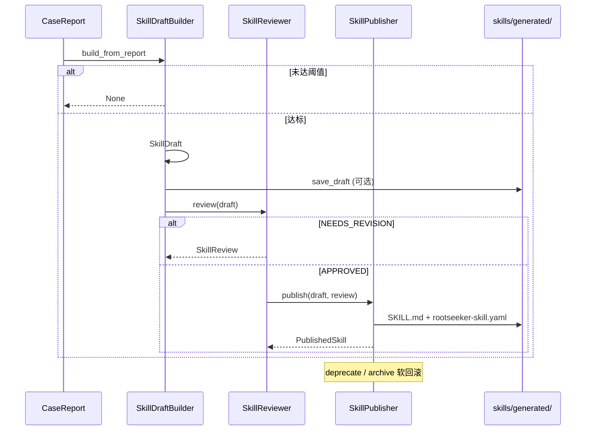

# Skill 系统

## 1. 业务目标

Skill 系统负责将 `skills/` 目录下的 Markdown + YAML 技能定义加载为内存注册表，供 Flow 编排与步骤执行消费。运维或开发者通过维护 `skills/builtin/` 中的 Flow / Tool Skill 文件，声明排查链路的步骤顺序、触发条件与工具绑定关系；运行时由 `SkillComposer` 根据 Case 入站来源与元数据选出合适的 Flow Skill，生成 `SkillExecutionPlan`（本链路只到计划产出，步骤实际执行见 Task 5）。

Case 结案后，`SkillDraftBuilder` 可从 `CaseReport` 自动合成技能草稿；经 `SkillReviewer` 质量门禁与人工审批后，由 `SkillPublisher` 写入 `skills/generated/` 并跟踪发布状态。发布失败或需下线时，Publisher 提供 `deprecate` / `archive` 软回滚；独立的 `skill_system/rollback.py` 尚未实现。

成功时：内存 `SkillRegistry` 包含全部 builtin（及可选 generated）Skill，`resolve_tool_skill(action)` 可按 MCP action 反查 Tool Skill。失败时：解析校验错误在加载阶段 fail-fast；草稿/评审/发布各阶段返回 `None` 或 `NEEDS_REVISION` / `REJECTED`，不污染注册表。

## 2. 入口一览

| 入口类型 | 路径 / 符号 | 说明 |
| --- | --- | --- |
| 内部（Bootstrap） | `rootseeker/bootstrap/runtime.py:create_dev_runtime` | 启动时调用 `build_registry_from_builtin_skills` 装配 `DevRuntime.skill_registry` |
| 内部（Flow 编排） | `rootseeker/skill_runtime/flow_executor.py:execute_skill_flow` | 注入 `SkillComposer` / `SkillContentLoader` 选 Flow 与加载步骤文档（执行细节见 05 文档） |
| 内部（草稿合成） | `rootseeker/skill_system/draft_builder.py:SkillDraftBuilder.build_from_report` | 从结案报告生成 `SkillDraft` |
| 内部（评审） | `rootseeker/skill_system/review.py:SkillReviewer.review` | 对草稿做质量检查，产出 `SkillReview` |
| 内部（发布） | `rootseeker/skill_system/publisher.py:SkillPublisher.publish` | 将已批准草稿写入磁盘并登记 `PublishedSkill` |
| 内部（回滚/下线） | `rootseeker/skill_system/publisher.py:SkillPublisher.deprecate` / `.archive` | 标记已发布 Skill 为 DEPRECATED / ARCHIVED |
| 包导出 | `rootseeker/skill_system/__init__.py` | 统一 re-export 上述公共 API |

## 3. 主调用链（逐步）

### 3.1 内置 Skill 发现 → 解析 → 注册


1. `rootseeker/bootstrap/runtime.py` → `create_dev_runtime`
   - 入：`repo_root: Path`
   - 出：调用 `build_registry_from_builtin_skills(root / "skills" / "builtin")`
   - 下一步：`SkillRegistry` 注入 `DevRuntime`

2. `rootseeker/skill_system/registry.py` → `build_registry_from_builtin_skills`
   - 入：`builtin_skills_root: Path`
   - 出：`SkillRegistry`（已 register 全部发现的 Skill）
   - 下一步：遍历 `discover_skill_files` 结果

3. `rootseeker/skill_system/discovery.py` → `discover_skill_files`
   - 入：`builtin_skills_root`
   - 出：排序后的 `SKILL.md` 路径列表（`rglob("SKILL.md")`）
   - 下一步：对每个路径调用 `load_skill_from_path`

4. `rootseeker/skill_system/parser.py` → `load_skill_from_path`
   - 入：`path: Path`（指向 `.../SKILL.md`）
   - 出：`SkillSpec`
   - 下一步：`SkillRegistry.register`

   **解析分支（sidecar 优先）：**

   - **有 `rootseeker-skill.yaml`**：读取 sidecar YAML 作为运行时主数据；`name` / `description` 从 SKILL.md frontmatter 补全（`setdefault`）；经 `_normalize_skill_dict` 注入 `metadata.skill_dir`、推断 `skill_kind`。
   - **无 sidecar**：仅解析 SKILL.md frontmatter YAML 为完整 `SkillSpec`（适用于纯 frontmatter 定义的测试/简易 Skill）。

5. `rootseeker/skill_system/parser.py` → `_split_frontmatter` / `parse_skill_document`
   - 入：SKILL.md 全文
   - 出：frontmatter dict + body；或经 Pydantic 校验的 `SkillSpec`
   - 约束：必须以 `---` 开头并闭合；否则 `ValueError`

6. `rootseeker/skill_system/registry.py` → `SkillRegistry.register`
   - 入：`SkillSpec`
   - 出：写入 `_by_slug`；对 TOOL / TOOL_GROUP 建立 `_tool_action_index[action] → slug`
   - 下一步：消费方通过 `get` / `resolve_tool_skill` / `execution_plan` 读取

### 3.2 Flow 选择（Composer 过滤）

1. `rootseeker/skill_runtime/flow_executor.py` → `execute_skill_flow`（选 Skill 段）
   - 入：`CaseCreateRequest`、`SkillRegistry`、`ToolRegistry`
   - 出：构造 `SkillComposer(registry, registered_tool_names=tool_registry.known_tools())`
   - 下一步：`composer.compose(case_request)`

2. `rootseeker/skill_system/composer.py` → `SkillComposer.compose`
   - 入：`CaseCreateRequest`
   - 出：`SkillExecutionPlan(skill_slug, steps)`
   - 选择优先级：
     1. `metadata.preferred_skill` / `metadata.skill_slug` / `metadata.selected_skills[0]` 指定的 Flow slug
     2. 按 `_case_trigger(source)` 映射 trigger（`webhook_alarm` / `replay` / `error_chat`），在 `list_by_kind(FLOW)` 中匹配 `triggers` 字段
     3. 若配置了 `registered_tool_names`，过滤 `required_tools` 未全部就绪的 Flow；若无就绪候选则回退全量匹配列表
     4. 兜底：`settings.skill_composer_default_flow`（默认 `flows/default-log-triage`）

### 3.3 步骤文档加载（ContentLoader）

1. `rootseeker/skill_system/content_loader.py` → `SkillContentLoader.load_step_context`
   - 入：`flow_skill: SkillSpec`、`step: SkillStepDefinition`、`tool_skill: SkillSpec`
   - 出：`SkillStepContext`（含 SKILL.md body、references、prompt 文本）
   - 下一步：供 LLM 参数规划（Task 5）调用 `to_prompt_text()`

   参考文件解析顺序：`tool_skill.metadata.reference(s)` → `step.metadata.reference(s)` → 自动扫描 `references/*.md`；超 `settings.skill_context_max_chars`（默认 12000）时先截 references 再截 body。

### 3.4 草稿合成 → 评审 → 发布 → 回滚



1. `rootseeker/skill_system/draft_builder.py` → `SkillDraftBuilder.build_from_report`
   - 入：`CaseReport`（需 `evidence_item_ids` ≥ `min_evidence_count` 默认 3，且 `root_cause.confidence` ≥ `min_confidence` 默认 0.6）
   - 出：`SkillDraft | None`
   - 字段来源：slug/name/description/triggers/steps 从 report 根因与证据模式抽取；`required_tools` 与 `steps` 当前为固定默认模板

2. `rootseeker/skill_system/draft_builder.py` → `SkillDraft.save_draft` / `to_skill_md` / `to_rootseeker_spec_yaml`
   - 入：`SkillDraft`
   - 出：写入 `{output_dir}/{slug-with-dashes}/SKILL.md` + `rootseeker-skill.yaml`
   - 默认目录：`skills/generated`

3. `rootseeker/skill_system/review.py` → `SkillReviewer.review`
   - 入：`SkillDraft`、`existing_slugs`（可选）
   - 出：`SkillReview(review_id, status, comments, suggestions)`
   - 检查项：置信度 ≥ 0.7（默认）、slug 唯一、steps 非空、required_tools 非空
   - 分支：有问题 → `NEEDS_REVISION`；否则 → `APPROVED`
   - 人工：`approve(review_id)` / `reject(review_id, reason)` 可覆盖状态

4. `rootseeker/skill_system/publisher.py` → `SkillPublisher.publish`
   - 入：`SkillDraft` + `SkillReview`（必须 `APPROVED` 且 `draft_slug` 匹配）
   - 出：`PublishedSkill | None`
   - 副作用：`_write_skill_file` 写入 target_dir；`_published[slug]` 记录版本与元数据
   - 注意：docstring 提到「Register in skill registry」，但当前实现**仅写文件与内存 `_published` 字典**，未调用 `SkillRegistry.upsert`

5. **回滚 / 下线**（Publisher 层，非独立 rollback 模块）
   - `SkillPublisher.deprecate(slug, reason)` → `PublishStatus.DEPRECATED`
   - `SkillPublisher.archive(slug)` → `PublishStatus.ARCHIVED`
   - `SkillRegistry.unregister(slug)` 可从内存注册表移除（builtin 需重启重建；generated 需重新 load）
   - `rootseeker/skill_system/rollback.py`：**未在代码中找到**

## 4. 关键数据结构

| 类型 | 定义文件 | 说明 |
| --- | --- | --- |
| `SkillSpec` | `rootseeker/contracts/skill.py` | 技能完整规格：slug、skill_kind(FLOW/TOOL/TOOL_GROUP)、triggers、required_tools、steps、bound_tools、metadata |
| `SkillStepDefinition` | 同上 | 单步：step_id、action（MCP tool action）、tool_skill_slug、defer_until、conditions/skip_if |
| `SkillExecutionPlan` | 同上 | Composer 输出：选定 flow slug + steps 快照 |
| `SkillKind` / `SkillSourceKind` | 同上 | 区分 flow/tool 与 builtin/custom/generated 来源 |
| `SkillDraft` | `rootseeker/skill_system/draft_builder.py` | 草稿 dataclass；`to_skill_md()` / `to_rootseeker_spec_yaml()` 序列化 |
| `SkillReview` | `rootseeker/skill_system/review.py` | 评审记录：review_id、status、comments、suggestions |
| `ReviewStatus` | 同上 | PENDING / APPROVED / REJECTED / NEEDS_REVISION |
| `PublishedSkill` | `rootseeker/skill_system/publisher.py` | 发布记录：slug、version、status、skill_path、source_review_id |
| `PublishStatus` | 同上 | DRAFT / PUBLISHED / DEPRECATED / ARCHIVED |
| `SkillStepContext` | `rootseeker/skill_system/content_loader.py` | 步骤 prompt 上下文：flow/tool 描述、body、references、truncated 标记 |
| `GeneratedSkillDraft` | `rootseeker/contracts/skill.py` | 契约层生成草稿（Pydantic）；与 `SkillDraft` dataclass 并存，当前 builder 使用后者 |
| `CaseReport` | `rootseeker/contracts/report.py` | Draft 输入：case_id、root_cause、evidence_item_ids |

**Parser 归一化规则**（`parser._normalize_skill_dict`）：

- 顶层 `flow_plugin_id` → 移入 `metadata.flow_plugin_id`
- 始终写入 `metadata.skill_dir`（Skill 目录绝对路径字符串）
- 若 YAML 未显式 `skill_kind`，按路径推断：`flows/` → FLOW，`tools/` → TOOL

## 5. 状态与副作用

| 组件 | 存储 | 副作用 |
| --- | --- | --- |
| `SkillRegistry` | 进程内存 `_by_slug`、`_tool_action_index` | 只读加载 builtin；`upsert`/`unregister` 可变更（Publisher 当前未调用） |
| `SkillReviewer` | 内存 `_reviews` | 无持久化；进程重启丢失 |
| `SkillPublisher` | 内存 `_published` | 写 `skills/generated/{slug}/SKILL.md` + `rootseeker-skill.yaml` |
| `SkillDraftBuilder.save_draft` | 文件系统 | 同上目录布局 |
| `SkillContentLoader` | 无 | 只读 SKILL.md 与 references；按 char budget 截断 |

不直接写入 Case / Evidence / Report / Checkpoint / Audit Store；与 Flow 执行的衔接在 `flow_executor`（Task 5）。

## 6. 分支与错误

| 条件 | 代码位置 | 行为 |
| --- | --- | --- |
| builtin 根目录不存在 | `discovery.discover_skill_files` | 返回空列表，注册表为空 |
| SKILL.md 缺少/未闭合 frontmatter | `parser._split_frontmatter` | `ValueError` |
| SkillSpec Pydantic 校验失败 | `parser.load_skill_from_path` | `ValueError`（含 ValidationError 链） |
| 重复 slug | `SkillRegistry.register` | `ValueError: Duplicate skill slug` |
| 同一 action 绑定多个 tool skill | `SkillRegistry._index_bound_tools` | `ValueError: Tool action ... already bound` |
| 默认 Flow 缺失 | `registry.get_default_log_triage_skill` / `composer.compose` 兜底 | `ValueError` |
| Report 证据或置信度不足 | `SkillDraftBuilder._meets_thresholds` | `build_from_report` 返回 `None` |
| 评审未通过 | `SkillReviewer.review` | `ReviewStatus.NEEDS_REVISION` + issues 列表 |
| 发布时 review 非 APPROVED 或 slug 不匹配 | `SkillPublisher.publish` | 返回 `None` |
| Tool skill 缺 metadata.skill_dir | `SkillContentLoader._skill_dir` | `ValueError` |
| 找不到 tool skill | `flow_executor._resolve_tool_skill`（Task 5） | `ValueError: No tool skill for action` |

## 7. 相关测试

| 测试文件 | 覆盖点 |
| --- | --- |
| `tests/unit/skill_system/test_skill_registry.py` | builtin 发现加载、`get_default_log_triage_skill`、frontmatter/sidecar 解析、`parse_skill_document` |
| `tests/unit/skill_system/test_skill_driven_flow.py` | registry 同时加载 flow+tool、`resolve_tool_skill("code.search")`、Composer 默认 Flow 选择、ContentLoader body/references |
| `tests/unit/contracts/test_skill_contracts.py` | `SkillSpec` / `SkillExecutionPlan` / `GeneratedSkillDraft` 契约序列化 |

**未覆盖（代码存在但无单测）：** `SkillDraftBuilder`、`SkillReviewer`、`SkillPublisher` 全链路。

## 8. 与其他文档的关系

| 文档 | 关系 |
| --- | --- |
| [01-bootstrap-wiring.md](./01-bootstrap-wiring.md) | `create_dev_runtime` 装配 `skill_registry` 的时机与依赖 |
| [03-default-triage-flow.md](./03-default-triage-flow.md) | 默认排查业务链路；消费 `flows/default-log-triage` |
| [05-skill-runtime-flow-executor.md](./05-skill-runtime-flow-executor.md) | `execute_skill_flow` 步骤执行、参数解析、checkpoint（本文件边界之外） |
| [06-plugin-system.md](./06-plugin-system.md) | Flow Skill `metadata.flow_plugin_id` 与 plugin manifest 的对应 |
| [07-mcp-plane.md](./07-mcp-plane.md) | Tool Skill `bound_tools` / step `action` 与 MCP ToolRegistry 的注册关系 |

---

## 附录 A：`skills/builtin/` 目录布局

```
skills/builtin/
├── flows/
│   └── default-log-triage/
│       ├── SKILL.md                 # Codex 风格 frontmatter（name, description）+ 人类可读说明
│       └── rootseeker-skill.yaml    # 运行时主数据：slug, steps, triggers, required_tools, flow_plugin_id
└── tools/
    └── {tool-name}/
        ├── SKILL.md                 # 工具 Skill 说明（LLM 读 body 生成参数）
        ├── rootseeker-skill.yaml    # slug, skill_kind: tool, bound_tools, metadata.reference
        └── references/
            └── guide.md             # 可选参考文档，由 ContentLoader 注入 prompt
```

每个 Skill 目录必须含 `SKILL.md`；生产 builtin Skill 均配有 `rootseeker-skill.yaml` sidecar。`discover_skill_files` 只认 `SKILL.md` 文件名（常量 `SKILL_FILENAME`）。

## 附录 B：Builtin Flow ↔ Tool Skill 映射

唯一 Flow Skill：`flows/default-log-triage`（14 步，`flow_plugin_id: builtin.default_log_triage_flow`）。

| Flow step_id | action | tool_skill_slug |
| --- | --- | --- |
| normalize-incident | incident.normalize | tools/incident-normalize |
| resolve-service | catalog.resolve_service | tools/catalog-resolve-service |
| resolve-log-sources | catalog.get_log_sources | tools/catalog-log-sources |
| query-logs-trace | log.query_by_trace_id | tools/log-query-trace |
| query-logs-template | log.query_by_template | tools/log-query-template |
| trace-chain | trace.get_chain | tools/trace-chain |
| index-status | index.get_status | tools/index-repo-context |
| repo-list | repo.list | tools/index-repo-context |
| code-search | code.search | tools/code-lookup |
| code-read | code.read | tools/code-lookup |
| graph-impact | graph.impact | tools/graph-lookup |
| graph-context | graph.context | tools/graph-lookup |
| find-callers | code.find_callers | tools/code-lookup |
| notify | notify.send | tools/notify-send（defer_until: after_report） |

**Tool Skill → bound_tools 索引：**

| tool_skill_slug | bound_tools（registry 索引） |
| --- | --- |
| tools/incident-normalize | incident.normalize |
| tools/catalog-resolve-service | catalog.resolve_service |
| tools/catalog-log-sources | catalog.get_log_sources |
| tools/log-query-trace | log.query_by_trace_id |
| tools/log-query-template | log.query_by_template |
| tools/trace-chain | trace.get_chain |
| tools/index-repo-context | index.get_status, repo.list |
| tools/code-lookup | code.search, code.read, code.find_callers |
| tools/graph-lookup | （sidecar 使用 `tools:` 字段而非 `bound_tools:`，见下方说明） |
| tools/notify-send | notify.send |

Flow 步骤均显式设置 `tool_skill_slug`，运行时优先 `registry.get(slug)`，其次才 `resolve_tool_skill(action)`。因此 graph-lookup 虽 sidecar 字段名不一致，Flow 执行不受影响；但 `resolve_tool_skill("graph.impact")` 等可能返回 `None`。

## 附录 C：Frontmatter / YAML 解析链小结

```
SKILL.md
  └─ _split_frontmatter → yaml_text + body
       ├─ [无 sidecar] yaml_text → SkillSpec（全字段在 frontmatter）
       └─ [有 rootseeker-skill.yaml]
            ├─ sidecar YAML → 主 spec dict
            ├─ frontmatter.name/description → setdefault 补全
            └─ _normalize_skill_dict(skill_dir) → SkillSpec
                 ├─ flow_plugin_id → metadata
                 ├─ metadata.skill_dir = 目录路径
                 └─ infer skill_kind from path (flows|tools)
```

`load_skill_body(path)` 单独提取 Markdown body（去掉 frontmatter），供 ContentLoader 注入 LLM prompt。
