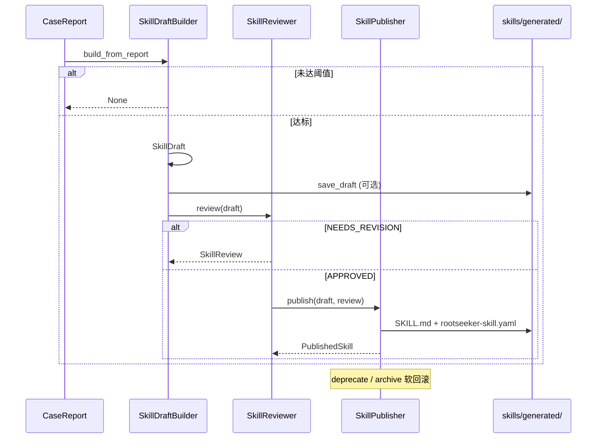

# Skill 系统

## 1. 业务目标

Skill 系统负责将 `skills/` 下标准 `SKILL.md` 包加载为内存注册表，供默认 Agent playbook 路径消费。解析器只读 `SKILL.md`（忽略同目录 `rootseeker-skill.yaml` sidecar）；主键是 `name`（kebab-case，与目录名一致）。`SkillRegistry` 扫描 `builtin` / `custom` / `external` 三根目录并套 Admin overlay；`PlaybookResolver` 决定当前主流程。YAML 步进器 `execute_skill_flow` 已删除，默认执行见 [03-default-triage-flow.md](./03-default-triage-flow.md) 与 [09-agent-runtime.md](./09-agent-runtime.md)。

Case 结案后，`SkillDraftBuilder` 可从 `CaseReport` 自动合成技能草稿；经 `SkillReviewer` 质量门禁与人工审批后，由 `SkillPublisher` 写入 `skills/generated/` 并跟踪发布状态。发布失败或需下线时，Publisher 提供 `deprecate` / `archive` 软回滚；独立的 `skill_system/rollback.py` 尚未实现。

成功时：内存 `SkillRegistry` 包含全部 builtin（及可选 generated）Skill，`resolve_tool_skill(action)` 可按 MCP action 反查 Tool Skill。失败时：解析校验错误在加载阶段 fail-fast；草稿/评审/发布各阶段返回 `None` 或 `NEEDS_REVISION` / `REJECTED`，不污染注册表。

## 2. 入口一览

| 入口类型 | 路径 / 符号 | 说明 |
| --- | --- | --- |
| 内部（Bootstrap） | `rootseeker/bootstrap/runtime.py:create_dev_runtime` | 启动时调用 `build_skill_registry` 扫描 builtin/custom/external 并套 overlay，装配 `DevRuntime.skill_registry` |
| 内部（主流程） | `rootseeker/skill_system/playbook.py:PlaybookResolver` | 按 overlay `default_playbook` 与 `metadata.role=playbook` 选出当前主流程 |
| 内部（默认执行） | `rootseeker/agent_runtime/attempt_runner.py:AttemptRunner` | Agent playbook 路径；**不**调用已删除的 `execute_skill_flow` |
| 内部（草稿合成） | `rootseeker/skill_system/draft_builder.py:SkillDraftBuilder.build_from_report` | 从结案报告生成 `SkillDraft` |
| 内部（评审） | `rootseeker/skill_system/review.py:SkillReviewer.review` | 对草稿做质量检查，产出 `SkillReview` |
| 内部（发布） | `rootseeker/skill_system/publisher.py:SkillPublisher.publish` | 将已批准草稿写入磁盘并登记 `PublishedSkill` |
| 内部（回滚/下线） | `rootseeker/skill_system/publisher.py:SkillPublisher.deprecate` / `.archive` | 标记已发布 Skill 为 DEPRECATED / ARCHIVED |
| 包导出 | `rootseeker/skill_system/__init__.py` | 统一 re-export 上述公共 API |

## 3. 主调用链（逐步）

### 3.1 内置 Skill 发现 → 解析 → 注册


1. `rootseeker/bootstrap/runtime.py` → `create_dev_runtime`
   - 入：`repo_root: Path`
   - 出：调用 `build_skill_registry`（builtin/custom/external + overlay）
   - 下一步：`SkillRegistry` 注入 `DevRuntime`

2. `rootseeker/skill_system/registry.py` → `build_skill_registry`
   - 入：三根目录路径与 `SkillOverlayState`
   - 出：`SkillRegistry`（已 register 全部发现的 Skill，并 apply overlay）
   - 下一步：对各根调用 `discover_skill_files`

3. `rootseeker/skill_system/discovery.py` → `discover_skill_files`
   - 入：`builtin_skills_root`
   - 出：排序后的 `SKILL.md` 路径列表（`rglob("SKILL.md")`）
   - 下一步：对每个路径调用 `load_skill_from_path`

4. `rootseeker/skill_system/parser.py` → `load_skill_from_path`
   - 入：`path: Path`（指向 `.../SKILL.md`）
   - 出：`SkillSpec`
   - 下一步：`SkillRegistry.register`

   **解析规则（只读 `SKILL.md`）：**

   - 忽略同目录 `rootseeker-skill.yaml` sidecar；`name` 必须等于目录名；`slug` 与 `name` 相同。
   - `allowed-tools`（空格分隔）写入 `bound_tools`；`metadata.role` 缺省 `helper`；`metadata.env` / `metadata.env_optional` 为字符串列表。

5. `rootseeker/skill_system/parser.py` → `_split_frontmatter` / `parse_skill_document`
   - 入：SKILL.md 全文
   - 出：frontmatter dict + body；或经 Pydantic 校验的 `SkillSpec`
   - 约束：必须以 `---` 开头并闭合；否则 `ValueError`

6. `rootseeker/skill_system/registry.py` → `SkillRegistry.register`
   - 入：`SkillSpec`
   - 出：写入 `_by_slug`；对 TOOL / TOOL_GROUP 建立 `_tool_action_index[action] → slug`
   - 下一步：消费方通过 `get` / `resolve_tool_skill` / `execution_plan` 读取

### 3.2 主流程选择（PlaybookResolver）

1. `rootseeker/agent_runtime/attempt_runner.py` → `AttemptRunner.run_once`
   - 入：`CaseCreateRequest`、`SkillRegistry`、overlay
   - 出：调用 `PlaybookResolver.resolve`
   - 下一步：加载 playbook `SKILL.md` body，注入非密 env，交给 LLM tool planner

2. `rootseeker/skill_system/playbook.py` → `PlaybookResolver.resolve`
   - 入：`CaseCreateRequest`
   - 出：当前已启用、有效 role 为 `playbook` 的 `SkillSpec`
   - 选择：overlay `default_playbook`（加载时把旧 slug `flows/default-log-triage` 归一成 `default-log-triage`）；出厂主流程 `name` 为 `default-log-triage`
   - 无可用 playbook 时 `SkillError("SKILL_DEFAULT_UNAVAILABLE")`，不回退 YAML 步进器

### 3.3 步骤文档加载（ContentLoader）

1. `rootseeker/skill_system/content_loader.py` → `SkillContentLoader.load_step_context`
   - 入：`flow_skill: SkillSpec`、`step: SkillStepDefinition`、`tool_skill: SkillSpec`
   - 出：`SkillStepContext`（含 SKILL.md body、references、prompt 文本）
   - 下一步：供 LLM 参数规划（Task 5）调用 `to_prompt_text()`

   参考文件解析顺序：`tool_skill.metadata.reference(s)` → `step.metadata.reference(s)` → 自动扫描 `references/*.md`；超 `settings.skill_context_max_chars`（默认 12000）时先截 references 再截 body。

### 3.4 草稿合成 → 评审 → 发布 → 回滚



1. `rootseeker/skill_system/draft_builder.py` → `SkillDraftBuilder.build_from_report`
   - 入：`CaseReport`（需 `evidence_item_ids` ≥ `min_evidence_count` 默认 3，且 `root_cause.confidence` ≥ `min_confidence` 默认 0.6）
   - 出：`SkillDraft | None`
   - 字段来源：slug/name/description/triggers/steps 从 report 根因与证据模式抽取；`required_tools` 与 `steps` 当前为固定默认模板

2. `rootseeker/skill_system/draft_builder.py` → `SkillDraft.save_draft` / `to_skill_md` / `to_rootseeker_spec_yaml`
   - 入：`SkillDraft`
   - 出：写入 `{output_dir}/{slug-with-dashes}/SKILL.md` + `rootseeker-skill.yaml`
   - 默认目录：`skills/generated`

3. `rootseeker/skill_system/review.py` → `SkillReviewer.review`
   - 入：`SkillDraft`、`existing_slugs`（可选）
   - 出：`SkillReview(review_id, status, comments, suggestions)`
   - 检查项：置信度 ≥ 0.7（默认）、slug 唯一、steps 非空、required_tools 非空
   - 分支：有问题 → `NEEDS_REVISION`；否则 → `APPROVED`
   - 人工：`approve(review_id)` / `reject(review_id, reason)` 可覆盖状态

4. `rootseeker/skill_system/publisher.py` → `SkillPublisher.publish`
   - 入：`SkillDraft` + `SkillReview`（必须 `APPROVED` 且 `draft_slug` 匹配）
   - 出：`PublishedSkill | None`
   - 副作用：`_write_skill_file` 写入 target_dir；`_published[slug]` 记录版本与元数据
   - 注意：docstring 提到「Register in skill registry」，但当前实现**仅写文件与内存 `_published` 字典**，未调用 `SkillRegistry.upsert`

5. **回滚 / 下线**（Publisher 层，非独立 rollback 模块）
   - `SkillPublisher.deprecate(slug, reason)` → `PublishStatus.DEPRECATED`
   - `SkillPublisher.archive(slug)` → `PublishStatus.ARCHIVED`
   - `SkillRegistry.unregister(slug)` 可从内存注册表移除（builtin 需重启重建；generated 需重新 load）
   - `rootseeker/skill_system/rollback.py`：**未在代码中找到**

## 4. 关键数据结构

| 类型 | 定义文件 | 说明 |
| --- | --- | --- |
| `SkillSpec` | `rootseeker/contracts/skill.py` | 技能完整规格：slug、skill_kind(FLOW/TOOL/TOOL_GROUP)、triggers、required_tools、steps、bound_tools、metadata |
| `SkillStepDefinition` | 同上 | 单步：step_id、action（MCP tool action）、tool_skill_slug、defer_until、conditions/skip_if |
| `SkillExecutionPlan` | 同上 | Composer 输出：选定 flow slug + steps 快照 |
| `SkillKind` / `SkillSourceKind` | 同上 | 区分 flow/tool 与 builtin/custom/generated 来源 |
| `SkillDraft` | `rootseeker/skill_system/draft_builder.py` | 草稿 dataclass；`to_skill_md()` / `to_rootseeker_spec_yaml()` 序列化 |
| `SkillReview` | `rootseeker/skill_system/review.py` | 评审记录：review_id、status、comments、suggestions |
| `ReviewStatus` | 同上 | PENDING / APPROVED / REJECTED / NEEDS_REVISION |
| `PublishedSkill` | `rootseeker/skill_system/publisher.py` | 发布记录：slug、version、status、skill_path、source_review_id |
| `PublishStatus` | 同上 | DRAFT / PUBLISHED / DEPRECATED / ARCHIVED |
| `SkillStepContext` | `rootseeker/skill_system/content_loader.py` | 步骤 prompt 上下文：flow/tool 描述、body、references、truncated 标记 |
| `GeneratedSkillDraft` | `rootseeker/contracts/skill.py` | 契约层生成草稿（Pydantic）；与 `SkillDraft` dataclass 并存，当前 builder 使用后者 |
| `CaseReport` | `rootseeker/contracts/report.py` | Draft 输入：case_id、root_cause、evidence_item_ids |

**Parser 规则**（`parser.load_skill_from_path`）：

- 只解析 `SKILL.md` frontmatter；忽略 sidecar
- `name` 必须等于目录名；`slug = name`
- `allowed-tools` → `bound_tools` / `required_tools`
- `metadata.role` 缺省 `helper`；playbook 时 `skill_kind=FLOW`，否则 `TOOL`
- 写入 `metadata.skill_dir`

## 5. 状态与副作用

| 组件 | 存储 | 副作用 |
| --- | --- | --- |
| `SkillRegistry` | 进程内存 `_by_slug`、`_tool_action_index` | 只读加载 builtin；`upsert`/`unregister` 可变更（Publisher 当前未调用） |
| `SkillReviewer` | 内存 `_reviews` | 无持久化；进程重启丢失 |
| `SkillPublisher` | 内存 `_published` | 写 `skills/generated/{slug}/SKILL.md` + `rootseeker-skill.yaml` |
| `SkillDraftBuilder.save_draft` | 文件系统 | 同上目录布局 |
| `SkillContentLoader` | 无 | 只读 SKILL.md 与 references；按 char budget 截断 |

不直接写入 Case / Evidence / Report / Checkpoint / Audit Store；与默认执行的衔接在 `AttemptRunner`（见 [03-default-triage-flow.md](./03-default-triage-flow.md)）。DraftBuilder / Publisher 未接入默认执行路径。

## 6. 分支与错误

| 条件 | 代码位置 | 行为 |
| --- | --- | --- |
| builtin 根目录不存在 | `discovery.discover_skill_files` | 返回空列表，注册表为空 |
| SKILL.md 缺少/未闭合 frontmatter | `parser._split_frontmatter` | `ValueError` |
| SkillSpec Pydantic 校验失败 | `parser.load_skill_from_path` | `ValueError`（含 ValidationError 链） |
| 重复 slug | `SkillRegistry.register` | `ValueError: Duplicate skill slug` |
| 同一 action 绑定多个 tool skill | `SkillRegistry._index_bound_tools` | `ValueError: Tool action ... already bound` |
| 找不到当前 playbook | `PlaybookResolver.resolve` | `SkillError("SKILL_DEFAULT_UNAVAILABLE")` |
| 工具不在 playbook `allowed-tools` 内 | `AttemptRunner` | Case 失败 `SKILL_TOOL_NOT_ALLOWED`，不执行该调用 |
| Report 证据或置信度不足 | `SkillDraftBuilder._meets_thresholds` | `build_from_report` 返回 `None` |
| 评审未通过 | `SkillReviewer.review` | `ReviewStatus.NEEDS_REVISION` + issues 列表 |
| 发布时 review 非 APPROVED 或 slug 不匹配 | `SkillPublisher.publish` | 返回 `None` |
| Tool skill 缺 metadata.skill_dir | `SkillContentLoader._skill_dir` | `ValueError` |
| 找不到 tool skill | （默认路径不再按 YAML `tool_skill_slug` 解析步骤） | Agent 只执行 playbook `allowed-tools` 内的 MCP 工具 |

## 7. 相关测试

| 测试文件 | 覆盖点 |
| --- | --- |
| `tests/unit/skill_system/test_skill_registry.py` | builtin 发现加载、`get_default_log_triage_skill`、`SKILL.md` frontmatter 解析、`parse_skill_document` |
| `tests/unit/skill_system/test_skill_parser.py` | 标准 frontmatter、`name`=目录名、忽略 sidecar |
| `tests/unit/skill_system/test_skill_registry_roots.py` | 三根目录扫描与 overlay |
| `tests/unit/skill_system/test_playbook_resolver.py` | 主流程指针、enable/disable、builtin 保护 |
| `tests/unit/skill_system/test_skill_driven_flow.py` | registry 加载 helper、`resolve_tool_skill`、ContentLoader body/references |
| `tests/unit/contracts/test_skill_contracts.py` | `SkillSpec` / `SkillExecutionPlan` / `GeneratedSkillDraft` 契约序列化 |

**未覆盖（代码存在但无单测）：** `SkillDraftBuilder`、`SkillReviewer`、`SkillPublisher` 全链路。

## 8. 与其他文档的关系

| 文档 | 关系 |
| --- | --- |
| [01-bootstrap-wiring.md](./01-bootstrap-wiring.md) | `create_dev_runtime` 装配 `skill_registry` 的时机与依赖 |
| [03-default-triage-flow.md](./03-default-triage-flow.md) | 默认排查业务链路；消费 playbook `default-log-triage` |
| [05-skill-runtime-flow-executor.md](./05-skill-runtime-flow-executor.md) | YAML 步进器已删除；默认路径为 Agent playbook |
| [06-plugin-system.md](./06-plugin-system.md) | Flow Skill `metadata.flow_plugin_id` 与 plugin manifest 的对应 |
| [07-mcp-plane.md](./07-mcp-plane.md) | Tool Skill `bound_tools` / step `action` 与 MCP ToolRegistry 的注册关系 |

---

## 附录 A：`skills/builtin/` 目录布局

```
skills/builtin/
├── default-log-triage/
│   └── SKILL.md                 # 标准 frontmatter（name, description, allowed-tools, metadata.role=playbook）+ playbook 正文
├── incident-normalize/
│   └── SKILL.md                 # helper；allowed-tools 绑定 MCP 工具
└── {helper-name}/
    ├── SKILL.md
    └── references/              # 可选，由 ContentLoader 按需读入
```

每个 Skill 目录必须含 `SKILL.md`；builtin 为扁平标准包，**无** `rootseeker-skill.yaml` sidecar，也无 `flows/` / `tools/` 前缀。`discover_skill_files` 只认 `SKILL.md` 文件名（常量 `SKILL_FILENAME`）。

## 附录 B：出厂 playbook 与 helper

出厂主流程：`default-log-triage`（`metadata.role: playbook`）。正文给出 14 步**推荐顺序**（给 Agent 读，不是 YAML 步进器）。`allowed-tools` 含 `incident.normalize`、`catalog.*`、`log.*`、`trace.get_chain`、`index.get_status`、`repo.list`、`code.*`、`graph.*`、`notify.send`。

Helper 目录名即 `name`（如 `incident-normalize`、`code-lookup`），不再使用 `tools/` 前缀。

## 附录 C：Frontmatter 解析链小结

```
SKILL.md
  └─ _split_frontmatter → yaml_text + body
       └─ frontmatter → SkillSpec
            ├─ name 必须等于目录名；slug = name
            ├─ allowed-tools → bound_tools
            ├─ metadata.role 缺省 helper
            └─ 忽略同目录 rootseeker-skill.yaml
```

`load_skill_body(path)` 单独提取 Markdown body（去掉 frontmatter），供 playbook / helper 按需注入 planner。
