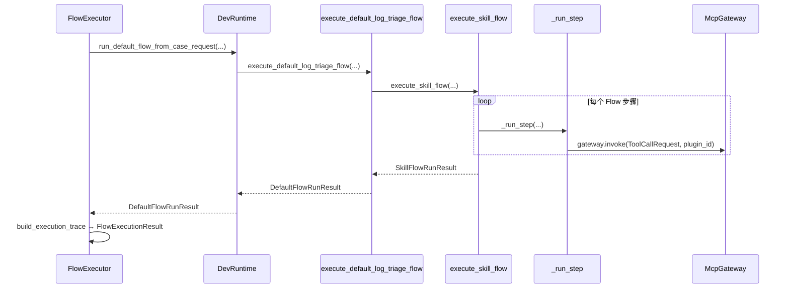
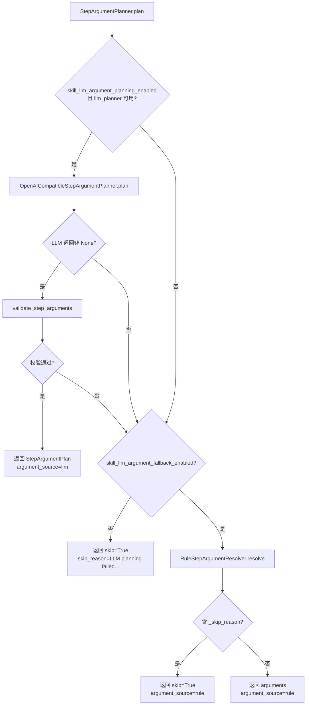

# Skill 运行时 · 步骤执行引擎

## 1. 业务目标

Skill 运行时步骤执行引擎负责在已选定 Flow Skill 之后，逐步驱动 MCP 工具调用、参数规划、结果清洗与证据映射，最终产出 `CaseRecord`、`EvidencePack` 与 `CaseReport`。调用方包括默认排查 Flow Runner（`execute_default_log_triage_flow`）、`FlowExecutor` 恢复路径，以及 Gateway / Task 层的 checkpoint 恢复。

成功时：所有（或从 checkpoint 起）步骤执行完毕，`CaseRecord.status` 为 `completed`，`EvidencePack` 累积各步证据，`SkillFlowRunResult` 返回完整三元组。`FlowRuntime.run_default` 还会将执行轨迹写入 checkpoint Store。

失败时：任一步骤工具调用返回 `ok=False` 或缺少 `ToolSpec`，当前 `CaseStep` 与 `CaseRecord` 置为 `failed`，主循环中断；异常向上抛出，Store 写入由 bootstrap 层决定（Flow 异常时不写 Store，见 [01-bootstrap-wiring.md](./01-bootstrap-wiring.md)）。

本文件覆盖 **步骤执行引擎**（参数解析 → gateway 调用 → sanitize → evidence map → checkpoint 恢复语义），**不包含** Skill 加载/注册（见 [04-skill-system.md](./04-skill-system.md)）与 MCP Gateway 内部路由（见 [07-mcp-plane.md](./07-mcp-plane.md)）。

## 2. 入口一览

| 入口类型 | 路径 / 符号 | 说明 |
| --- | --- | --- |
| 内部（Flow Runner） | `plugins/builtin/default_log_triage_flow/runner.py:execute_default_log_triage_flow` | 校验插件注册后委托 `execute_skill_flow` |
| 内部（步骤引擎） | `rootseeker/skill_runtime/flow_executor.py:execute_skill_flow` | 本文件核心：逐步执行 Flow Skill |
| 内部（单步驱动） | `rootseeker/skill_runtime/flow_executor.py:_run_step` | 单步：参数规划 → gateway → sanitize → evidence |
| 内部（参数规划） | `rootseeker/skill_runtime/flow_executor.py:StepArgumentPlanner.plan` | LLM 优先、规则回退 |
| 内部（Flow 编排） | `rootseeker/flow_runtime/flow_executor.py:FlowExecutor.execute_default` | 包装 `run_default_flow_from_case_request` 并组装 `ExecutionTrace` |
| 内部（Checkpoint 恢复） | `rootseeker/flow_runtime/flow_executor.py:FlowExecutor.execute_from_checkpoint` | 传入 `start_from_step_index` / `prior_step_outputs` / `prior_case_id` |
| 内部（恢复编排） | `rootseeker/flow_runtime/runtime.py:FlowRuntime.resume_default` | 读取 checkpoint、判定 `resume_status`、调用 `execute_from_checkpoint` 或全量 replay |
| Gateway WS | `rootseeker/gateway/methods/flow_methods.py:flow_resume` / `flow_step` | 对外暴露 checkpoint 恢复与单步执行 |
| Task | `rootseeker/task_runtime/task_executor.py:TaskExecutor.execute` | `FLOW_RESUME` / `FLOW_STEP` 任务种类委托 FlowRuntime / FlowExecutor |

## 3. 主调用链（逐步）

### 3.1 自顶向下：从 FlowExecutor 到 execute_skill_flow

1. `rootseeker/flow_runtime/flow_executor.py` → `FlowExecutor.execute_default`
   - 入：`CaseCreateRequest`
   - 出：调用 `DevRuntime.run_default_flow_from_case_request`，再 `build_execution_trace` 组装 `ExecutionTrace` 与 `step_outputs`
   - 下一步：`rootseeker/bootstrap/runtime.py` → `run_default_flow_from_case_request`

2. `rootseeker/bootstrap/runtime.py` → `run_default_flow_from_case_request`
   - 入：可选 `start_from_step_index`、`prior_step_outputs`、`prior_case_id`（恢复路径）
   - 出：调用 `execute_default_log_triage_flow`，成功后写 case / evidence / report Store
   - 下一步：`plugins/builtin/default_log_triage_flow/runner.py`

3. `plugins/builtin/default_log_triage_flow/runner.py` → `execute_default_log_triage_flow`
   - 入：同上恢复参数
   - 出：委托 `execute_skill_flow(...)`，包装为 `DefaultFlowRunResult`
   - 下一步：`rootseeker/skill_runtime/flow_executor.py` → `execute_skill_flow`

### 3.2 execute_skill_flow 内部有序链路

以下按 **实际执行顺序** 编号；Skill 选择（`SkillComposer.compose`）仅在未注入 `flow_skill` 时发生，细节见 [04-skill-system.md](./04-skill-system.md)。

1. **初始化依赖**
   - 文件：`rootseeker/skill_runtime/flow_executor.py`
   - 函数：`execute_skill_flow`
   - 构造 `SkillComposer`、`SkillContentLoader`、`StepArgumentPlanner`（均可注入覆盖）
   - 若 `flow_skill is None`：调用 `composer.compose(case_request)` 选 skill slug，再从 registry 取 `SkillSpec`；否则跳过 compose

2. **创建 Case 与步骤骨架**
   - 入：`case_request`、`flow_skill.steps`
   - `case_id = prior_case_id or new_id("case-")` — 恢复时复用原 case_id
   - 为每个 `SkillStepDefinition` 创建 `CaseStep`（初始 `StepStatus.PENDING`）
   - `CaseRecord.status = CaseStatus.RUNNING`

3. **应用 checkpoint 前置状态**（`start_from_step_index` / `prior_step_outputs`）
   - 对 `idx < start_from_step_index` 的步骤：标记 `StepStatus.COMPLETED`
   - 若 `step_id ∈ prior_outputs`：将 `prior_outputs[step_id]` 写入 `case_step.outputs`
   - `step_outputs` 初始化为 `dict(prior_outputs)`

4. **初始化运行时容器**
   - `EvidencePack(case_id=...)`
   - 空列表：`tool_results`、`step_traces`、`deferred_steps`

5. **主循环** — 遍历 `zip(flow_skill.steps, case.steps)`
   - **5a. 已完成步骤（恢复跳过）**：若 `case_step.status == COMPLETED` 且 `step_id ∈ prior_outputs`
     - 调用 `sanitize_tool_result_for_persistence` 规范化 prior 输出
     - 调用 `map_tool_result_to_evidence` 补写证据（恢复时重建 EvidencePack）
     - `continue`（不调用 gateway）
   - **5b. 延迟步骤**：若 `flow_step.defer_until` 为真，加入 `deferred_steps`，本轮跳过
   - **5c. 正常执行**：调用 `_run_step(...)`（见 3.3）
   - 若 `case.status == FAILED`，`break`

6. **首次报告构建**（供延迟步骤参数规划）
   - `report = build_case_report(case_id, title, pack=pack)`

7. **延迟步骤第二轮**
   - 遍历 `deferred_steps`，再次调用 `_run_step(..., report=report)`
   - `notify.send` 等延迟步骤可读取 report 摘要

8. **结案**
   - 若未失败：`case.status = CaseStatus.COMPLETED`
   - `case.updated_at = utc_now()`
   - 再次 `build_case_report` 得到最终 report
   - 返回 `SkillFlowRunResult(case, evidence_pack, report, tool_results, step_traces)`

### 3.3 单步执行：_run_step

1. **解析 Tool Skill** — `_resolve_tool_skill(skill_registry, flow_step)`
   - 优先 `flow_step.tool_skill_slug`，否则 `skill_registry.resolve_tool_skill(step.action)`
   - 找不到则 `raise ValueError`

2. **加载步骤上下文** — `SkillContentLoader.load_step_context(flow_skill, step, tool_skill)`
   - 产出 `SkillStepContext`，供 LLM 参数规划 prompt 使用

3. **获取 ToolSpec** — `tool_registry.get_spec(flow_step.action)`
   - 若 `None`：`case_step.status = FAILED`，`case.status = FAILED`，返回

4. **参数规划** — `StepArgumentPlanner.plan(...)`（见 §3.4）
   - `case_step.status = StepStatus.RUNNING`
   - 写入 `case_step.inputs`（含 `arguments` 与 `to_step_metadata()`）
   - 追加 `step_traces`

5. **跳过路径**（`arg_plan.skip == True`）
   - 构造 synthetic `ToolCallResult(ok=True, content={skipped, reason})`
   - `sanitize_tool_result_for_persistence` → `case_step.outputs`
   - `step_outputs[step_id]` 更新
   - `map_tool_result_to_evidence`
   - `case_step.status = COMPLETED`

6. **Gateway 调用**
   - 构造 `ToolCallRequest(case_id, step_id, skill_name, tool_name, arguments)`
   - `gateway.invoke(req, plugin_id=plugin_id, actor="skill-flow-executor")`
   - Gateway 内部路由见 [07-mcp-plane.md](./07-mcp-plane.md)

7. **结果处理**
   - `persisted = sanitize_tool_result_for_persistence(result.content)`
   - `case_step.outputs = dict(persisted)`
   - 若 `result.ok`：
     - `step_outputs[step_id] = persisted`
     - `case_step.status = COMPLETED`
     - **特例**：`incident.normalize` 成功时，从 `persisted["case_request"]["service_name"]` 回写 `case.service_name` 与 `case_request.service_name`
     - `map_tool_result_to_evidence(pack, action, content=persisted, tool_skill)`
   - 否则：`case_step.status = FAILED`，`case.status = FAILED`

### 3.4 参数规划：Rule vs LLM

`StepArgumentPlanner.plan`（`rootseeker/skill_runtime/flow_executor.py`）决策顺序：

| 路径 | 实现文件 | 行为 |
| --- | --- | --- |
| **LLM 规划** | `rootseeker/skill_runtime/llm_step_argument_planner.py` | `build_step_argument_messages` 组装 case、tool schema、prior outputs、skill 文档；`OpenAICompatibleReportClient.complete` 获取 JSON；`parse_step_argument_content` 解析为 `StepArgumentPlan` |
| **LLM 校验** | `rootseeker/skill_runtime/step_argument_validation.py` | 非 skip 时检查 `parameters_schema.required` 字段是否存在且非空 |
| **规则回退** | `rootseeker/skill_runtime/rule_step_argument_resolver.py` | 按 `action` 名确定性构造参数；缺前置数据时返回 `{"_skip_reason": "..."}` 触发 skip |
| **notify 特例** | 同上 `build_notify_args` | 当 `action == "notify.send"` 且传入 `report` 时，直接用 report 根因标题构造通知消息 |

规则解析器主要 action 映射（节选）：

- `incident.normalize` → 从 case metadata 构造 payload
- `catalog.*` / `log.*` / `trace.*` → 从 normalized case 与 metadata 提取 tenant、service_name、trace_id
- `code.search` / `code.semantic_search` → 从 symptom 构造查询
- `code.read` / `code.find_callers` / `graph.*` → 依赖前序 `step_outputs`（如 `normalize-incident`、`code-search`）；缺依赖则 skip

配置开关（`rootseeker/infra_core/settings.py`）：

- `skill_llm_argument_planning_enabled`（默认 `True`）
- `skill_llm_argument_fallback_enabled`（默认 `True`）

### 3.5 结果清洗与证据映射

| 阶段 | 函数 | 文件 | 用途 |
| --- | --- | --- | --- |
| 持久化清洗 | `sanitize_tool_result_for_persistence` | `rootseeker/skill_runtime/result_sanitize.py` | 写入 `case_step.outputs` / checkpoint 前截断：`hits`≤50、列表≤100、文本≤100k 字符 |
| 证据清洗 | `sanitize_tool_result_for_evidence` | 同上 | 证据包用更紧凑上限（code hits≤20、文本≤32k） |
| 证据映射 | `map_tool_result_to_evidence` | `rootseeker/skill_runtime/evidence_mapper.py` | 按 action → `EvidenceType` 映射；`log.query_by_trace_id` 走 `LogQueryResult` 专用路径；其余走 `append_tool_json_evidence` |

### 3.6 Checkpoint 写入与恢复

#### 3.6.1 首次运行写入

`FlowRuntime.run_default`（`rootseeker/flow_runtime/runtime.py`）在 `execute_default` 返回后调用 `_build_checkpoint_payload` 并 `checkpoints.save(execution_id, payload)`。

#### 3.6.2 Checkpoint payload 字段

由 `_build_checkpoint_payload`（`rootseeker/flow_runtime/runtime.py`）构造：

| 字段 | 类型 | 含义 |
| --- | --- | --- |
| `case_id` | `str` | 本次 Flow 关联的 Case ID |
| `flow_id` | `str` | 固定为 `builtin.default_log_triage_flow`（来自 `ExecutionTrace`） |
| `skill_slug` | `str` | 执行的 Flow Skill slug |
| `status` | `str` | 运行状态，成功时为 `"completed"` |
| `next_step_index` | `int` | 等于 `len(result.trace.steps)`，表示全部步骤已执行 |
| `steps` | `list[dict]` | 每步 `{step_id, name, status, tool_name, outputs}` |
| `resumed_from_execution_id` | `str`（可选） | 恢复时记录源 `flow_run_id` |
| `resume_status` | `str`（可选） | 恢复语义，见下表 |

Store 实现：`FlowCheckpointStore`（内存）或 bootstrap 装配的 Sqlite/Mysql 变体（`rootseeker/flow_runtime/checkpoint.py`）。

#### 3.6.3 resume_status 三种取值

| 值 | 触发条件 | 代码位置 | 行为 |
| --- | --- | --- | --- |
| `resumed_from_step` | checkpoint 存在 prior 状态：`next_step_index > 0` 且 `prior_step_outputs` 非空且 `prior_case_id` 非空 | `FlowRuntime.resume_default` | 调用 `FlowExecutor.execute_from_checkpoint`，从 `resolve_resume_step_index` 映射的索引继续 |
| `replayed` | 上述 prior 条件不满足（如无 step outputs） | 同上 | 调用 `FlowExecutor.execute_default` 全量重跑 |
| `skipped_completed` | checkpoint `status == "completed"` 且 `force=False` | 同上 | 返回 `None`，仅更新 checkpoint 的 `resume_status`，不执行 Flow |

`force=True` 时即使 checkpoint 已完成也会进入 `resumed_from_step` 或 `replayed` 路径。

#### 3.6.4 start_from_step_index 与 prior_step_outputs 语义

由 `FlowExecutor.execute_from_checkpoint` 传入 `run_default_flow_from_case_request`，最终到达 `execute_skill_flow`：

| 参数 | 作用 |
| --- | --- |
| `start_from_step_index` | 索引 `< start_from_step_index` 的步骤标记为 `COMPLETED`，不再调用 gateway |
| `prior_step_outputs` | `dict[step_id → outputs]`；已完成步骤从此读取输出并写入 `case_step.outputs`；主循环中对已完成步骤仍执行 sanitize + evidence map 以重建 `EvidencePack` |
| `prior_case_id` | 复用原 `case_id`（测试断言：`resumed.case_id == first.case_id`） |

`resolve_resume_step_index`（`rootseeker/flow_runtime/runtime.py`）在 Flow 步骤布局变更时，按 **step_id** 对齐：找当前 Flow 中第一个未完成（非 completed/skipped/success）的步骤索引，避免旧 checkpoint 的 `next_step_index` 错位。

#### 3.6.5 恢复调用链

1. `FlowRuntime.resume_default(flow_run_id, case_request, force?)`
2. 从 checkpoint `steps[*].outputs` 重建 `prior_step_outputs`
3. `resolve_resume_step_index` → `next_step_index`
4. 分支：
   - 有 prior 状态 → `FlowExecutor.execute_from_checkpoint(start_from_step_index=next_step_index, ...)`
   - 无 prior 状态 → `FlowExecutor.execute_default(case_request)`
5. `_build_checkpoint_payload(..., resume_status=...)` 覆写原 checkpoint

Gateway `flow_step` 与 Task `FLOW_STEP` 也直接调用 `execute_from_checkpoint`，但不设置 `resume_status`（仅 `flow_resume` / `resume_default` 写入）。

## 4. 关键数据结构

| 名称 | 定义文件 | 字段 / 含义 | 谁填充 | 谁消费 |
| --- | --- | --- | --- | --- |
| `SkillFlowRunResult` | `rootseeker/skill_runtime/flow_executor.py` | `case`, `evidence_pack`, `report`, `tool_results`, `step_traces` | `execute_skill_flow` | Runner、bootstrap Store 写入 |
| `StepArgumentPlan` | `rootseeker/skill_runtime/llm_step_argument_planner.py` | `arguments`, `skip`, `skip_reason`, `rationale`, `argument_source` | LLM / Rule planner | `_run_step` 构造 `ToolCallRequest` 或 skip |
| `ToolCallRequest` | `rootseeker/contracts/tool.py` | `case_id`, `step_id`, `skill_name`, `tool_name`, `arguments` | `_run_step` | `McpGateway.invoke` |
| `ToolCallResult` | 同上 | `ok`, `tool_name`, `content` | Gateway | sanitize、evidence map、step status |
| `FlowExecutionResult` | `rootseeker/flow_runtime/flow_executor.py` | `case_id`, `trace`, `step_outputs` | `FlowExecutor` | `_build_checkpoint_payload` |
| `ExecutionTrace` | `rootseeker/contracts/execution_trace.py` | `execution_id`, `case_id`, `skill_slug`, `flow_id`, `steps` | `build_execution_trace` | checkpoint key、`FlowRuntime` |
| `FlowCheckpointRecord` | `rootseeker/flow_runtime/checkpoint.py` | `flow_run_id`, `revision`, `payload`, `updated_at` | `FlowCheckpointStore.save` | `resume_default`、Gateway |
| `EvidencePack` | `rootseeker/contracts/evidence.py` | 按步骤追加的 evidence items | `map_tool_result_to_evidence` | `build_case_report` |

`step_traces` 每步记录：`step_id`, `action`, `tool_skill_slug`, 以及 `StepArgumentPlan.to_step_metadata()`（`argument_source`, `rationale`, `skip`, `skip_reason`）。

## 5. 状态与副作用

### Case / Step 状态

| 时机 | 变化 |
| --- | --- |
| `execute_skill_flow` 开始 | `CaseRecord.status = running`；各 `CaseStep.status = pending` |
| `_run_step` 开始 | 当前 `CaseStep.status = running` |
| 工具成功或 planner skip | `CaseStep.status = completed` |
| 工具失败或缺 ToolSpec | `CaseStep.status = failed`，`CaseRecord.status = failed` |
| 全部步骤完成且未失败 | `CaseRecord.status = completed` |
| checkpoint 恢复 | `idx < start_from_step_index` 的步骤预置为 `completed` |

### Store 写入

| Store | 写入时机 | 写入方 |
| --- | --- | --- |
| `case_store` | Flow 成功返回后 | `DevRuntime.run_default_flow_from_case_request` |
| `evidence_store` | 同上 | 同上 |
| `report_store` | 同上 | 同上 |
| `flow_checkpoint_store` | `FlowRuntime.run_default` / `resume_default` | `FlowCheckpointStore.save` |

步骤引擎本身 **不直接写 Store**；仅产出内存对象。Checkpoint 由 `FlowRuntime` 层写入。

### 对外 I/O

- **MCP 工具调用**：每步经 `McpGateway.invoke(..., plugin_id=DEFAULT_FLOW_PLUGIN_ID, actor="skill-flow-executor")`；plugin 路由见 [07-mcp-plane.md](./07-mcp-plane.md)
- **LLM 参数规划**（可选）：`OpenAICompatibleStepArgumentPlanner` → `OpenAICompatibleReportClient.complete`

## 6. 分支与错误

| 条件 | 代码位置 | 行为 |
| --- | --- | --- |
| 缺 ToolSpec | `_run_step` → `tool_registry.get_spec` | step + case 置 `failed`，不调用 gateway |
| LLM 规划失败且禁止回退 | `StepArgumentPlanner.plan` | 返回 `skip=True`，步骤以 synthetic 成功跳过 |
| 规则解析缺前置数据 | `RuleStepArgumentResolver._build_step_args` | 返回 `_skip_reason`，步骤 skip |
| LLM 参数未通过 schema 校验 | `validate_step_arguments` | 回退到规则解析器 |
| 工具调用 `ok=False` | `_run_step` | step + case 置 `failed`，主循环 break |
| 无法解析 tool skill | `_resolve_tool_skill` | `raise ValueError` |
| checkpoint 不存在 | `FlowRuntime.resume_default` | `raise ValueError("checkpoint not found: ...")` |
| 已完成 checkpoint 且 `force=False` | `FlowRuntime.resume_default` | 返回 `None`，`resume_status=skipped_completed` |
| 默认 Flow 插件未注册 | `execute_default_log_triage_flow` → `_validate_default_flow_registration` | `raise ValueError` |
| Flow 步骤布局变更 | `resolve_resume_step_index` | 按 step_id 重映射索引，避免错位 |

## 7. 相关测试

| 测试文件 | 覆盖点 |
| --- | --- |
| `tests/unit/flow_runtime/test_flow_executor.py` | `execute_default` 产出 trace 与 step_outputs；`execute_from_checkpoint` 复用 `prior_case_id` 并从指定索引恢复 |
| `tests/unit/flow_runtime/test_flow_runtime.py` | checkpoint payload 字段；`resume_default` 三种 `resume_status`；`force=True` 重跑；未知 checkpoint 抛错 |
| `tests/unit/skill_runtime/test_step_argument_validation.py` | LLM 参数 schema 必填校验 |
| `tests/unit/skill_runtime/test_result_sanitize.py` | persistence / evidence 截断上限；evidence mapper 与 sanitize 联动 |
| `tests/unit/skill_system/test_skill_driven_flow.py` | `RuleStepArgumentResolver` 各 action 参数；`parse_step_argument_content` LLM JSON 解析 |
| `tests/unit/task_runtime/test_task_runtime.py` | Task `FLOW_RESUME` 完成后 `resume_status == skipped_completed` |
| `tests/unit/task_runtime/test_task_runtime_orchestrator.py` | Task 恢复路径 `resume_status` 为 `resumed_from_step` 或 `replayed` |

## 8. 与其他文档的关系

| 文档 | 关系 |
| --- | --- |
| [03-default-triage-flow.md](./03-default-triage-flow.md) | 默认排查 Flow 逐步 YAML 定义、各 step action 业务含义与端到端 triage 链路；本篇聚焦执行引擎机制 |
| [04-skill-system.md](./04-skill-system.md) | Skill 加载、`SkillComposer` 选 Flow、`SkillContentLoader` 供 LLM prompt；本篇从 `execute_skill_flow` 接手 |
| [07-mcp-plane.md](./07-mcp-plane.md) | `McpGateway.invoke` 内部路由、ToolRegistry、plugin 分发；本篇仅到 gateway 边界 |
| [01-bootstrap-wiring.md](./01-bootstrap-wiring.md) | `DevRuntime` 装配与 Store 写入时机 |
| [02-contracts-state-machines.md](./02-contracts-state-machines.md) | `CaseStatus` / `StepStatus` 枚举与状态机规则 |
| [06-plugin-system.md](./06-plugin-system.md) | 默认 Flow Plugin 注册校验与 `plugin_id` 传入 gateway |
