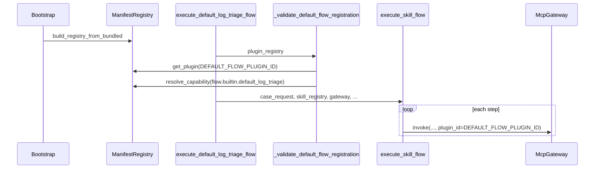

# Plugin 系统

## 1. 业务目标

RootSeeker V2 将「可插拔能力单元」抽象为 **Plugin**：每个 Plugin 通过 `plugin.yaml` 声明身份、类型、逻辑能力与 MCP 工具名，并在启动时装配进内存注册表 `ManifestRegistry`。Bootstrap（`create_dev_runtime`）扫描 `plugins/builtin/` 下全部内置插件，供 Admin 列表展示、健康检查计数，以及默认排查流执行前的注册校验。

**Capability 解析** 建立「能力 ID → 所属 plugin_id」的全局索引：`capabilities` 列表索引逻辑能力（如 `flow.builtin.default_log_triage`），`mcp_tools` 列表索引 MCP 工具名（如 `catalog.resolve_service`），二者不可重复注册。运行时 MCP 工具调用仍走 `ToolRegistry` + `McpGateway`；`plugin_id` 主要写入审计 detail，供链路追踪。

**Skill ↔ Flow Plugin 绑定**：Flow 类 Skill 在 `rootseeker-skill.yaml` 中声明 `flow_plugin_id`，解析后落入 `SkillSpec.metadata["flow_plugin_id"]`；对应 Flow Plugin 的 manifest 通过 `capabilities` 与 `metadata.skill_slug` 形成双向声明。内置默认流 `execute_default_log_triage_flow` 在委托 `execute_skill_flow` 前，会 fail-fast 校验 registry 中是否存在 `DEFAULT_FLOW_PLUGIN_ID` 及其 capability。

成功时：registry 持有完整 manifest 与 capability 索引，默认流可运行且审计事件带 `plugin_id`。失败时：manifest 解析/重复注册在启动期抛 `ValueError`；默认流校验失败在运行期抛 `ValueError`，不进入步骤执行。

## 2. 入口一览

| 入口类型 | 路径 / 符号 | 说明 |
| --- | --- | --- |
| Bootstrap 装配 | `rootseeker/bootstrap/runtime.py` → `create_dev_runtime` | 调用 `build_registry_from_bundled(plugins/builtin)` 构建 `DevRuntime.plugin_registry` |
| 默认排查流 | `plugins/builtin/default_log_triage_flow/runner.py` → `execute_default_log_triage_flow` | 校验注册后委托 `execute_skill_flow` |
| DevRuntime 封装 | `rootseeker/bootstrap/runtime.py` → `DevRuntime.run_default_flow_from_case_request` | 调用 runner 并写 case/evidence/report store |
| Skill 解析 | `rootseeker/skill_system/parser.py` → `_normalize_skill_dict` | 将 YAML `flow_plugin_id` 写入 `SkillSpec.metadata` |
| Admin HTTP | `apps/admin/main.py` → `GET /api/plugins` | 列出 `plugin_registry.list_plugins()` |
| Admin HTTP | `apps/admin/main.py` → `GET /api/status` | 返回 `plugins_total` |
| 健康检查 | `rootseeker/observability/health.py` → `build_runtime_health` | 统计已注册 plugin 数量 |
| 回放追踪 | `rootseeker/replay/runner.py` | 快照与 trace 写入 `flow_plugin_id=DEFAULT_FLOW_PLUGIN_ID` |
| 公开 API | `rootseeker/plugin_system/__init__.py` | 导出 registry、discovery、manifest 加载与 `build_registry_from_bundled` |

## 3. 主调用链（逐步）

### 3.1 Manifest 发现与 Registry 构建

1. `rootseeker/bootstrap/runtime.py` → `create_dev_runtime`
   - 入：`repo_root`（默认 `Path.cwd()`）
   - 出：`DevRuntime`，其中 `plugin_registry` 为已填充的 `ManifestRegistry`
   - 下一步：`build_registry_from_bundled`

2. `rootseeker/plugin_system/plugin_api.py` → `build_registry_from_bundled`
   - 入：`builtin_root: Path`（通常为 `{repo}/plugins/builtin`）
   - 出：新建 `ManifestRegistry`，逐个注册 manifest
   - 下一步：`discover_bundled_plugin_manifests` → `load_manifest_from_path` → `register_manifest`

3. `rootseeker/plugin_system/discovery.py` → `discover_bundled_plugin_manifests`
   - 入：`builtin_root`
   - 出：按子目录名字母序排列的 `plugin.yaml` 路径列表；目录不存在则 `[]`
   - 规则：仅扫描 **一级子目录** `{builtin_root}/{plugin_name}/plugin.yaml`，文件名固定为 `DEFAULT_MANIFEST_NAME = "plugin.yaml"`

4. `rootseeker/plugin_system/manifest.py` → `load_manifest_from_path`
   - 入：manifest 文件路径
   - 出：`PluginManifest`（Pydantic 校验后的契约对象）
   - 下一步：`manifest_from_dict` → `_normalize_keys` 后 `PluginManifest.model_validate`

5. `rootseeker/plugin_system/registry.py` → `ManifestRegistry.register`
   - 入：`PluginManifest`
   - 出：写入 `_plugins[plugin_id]`；遍历 `capabilities` 与 `mcp_tools` 建立 `_capability_index`
   - 下一步：重复 `plugin_id` 或 capability/tool id 时抛 `ValueError`

### 3.2 Manifest 字段与 Capability 索引

YAML 键名经 `_normalize_keys` 映射到 `PluginManifest` 字段：

| YAML 字段 | 契约字段 | 索引行为 |
| --- | --- | --- |
| `id` | `plugin_id` | 插件主键；重复注册 fail-fast |
| `name` | `display_name` | 仅展示，不参与索引 |
| `entrypoint` | `entry_point` | 契约字段；**当前 plugin_system 未读取执行** |
| `kind` | `kind` | 写入 `RegisteredCapability.kind` |
| `version` | `version` | 元数据 |
| `description` | `description` | 元数据 |
| `enabled_by_default` | `enabled_by_default` | 契约字段；**当前 registry 未按此过滤** |
| `capabilities` | `capabilities: list[str]` | 每条 → `_index_capability(..., is_mcp_tool=False)` |
| `mcp_tools` | `mcp_tools: list[str]` | 每条 → `_index_capability(..., is_mcp_tool=True)` |
| `config_schema` | `config_schema` | 契约字段；**当前未校验实例配置** |
| `metadata` | `metadata` | 自由扩展；如 default flow 的 `skill_slug` |

`resolve_capability(capability_id)` 与 `resolve_capability(tool_name)` 使用同一索引：`RegisteredCapability` 通过 `is_mcp_tool` 区分来源列表。

**内置 bundled 插件一览**（`plugins/builtin/`）：

| plugin_id | kind | capabilities（逻辑） | mcp_tools（节选） |
| --- | --- | --- | --- |
| `builtin.default_log_triage_flow` | `flow` | `flow.builtin.default_log_triage` | （空） |
| `builtin.service_catalog` | `connector` | `connector.service_catalog` | `catalog.resolve_service`, `catalog.get_log_sources` |
| `builtin.log_query` | `connector` | `connector.log_query` | `log.query_by_trace_id`, `log.query_by_template`, `trace.get_chain` |
| `builtin.code_index` | `connector` | `connector.code_index` | `code.search`, `repo.list`, … |
| `builtin.notify` | `channel` | `channel.notify` | `notify.send` |

### 3.3 Skill `flow_plugin_id` 与 Plugin 绑定

1. `skills/builtin/flows/default-log-triage/rootseeker-skill.yaml`
   - 声明：`flow_plugin_id: builtin.default_log_triage_flow`
   - 同文件 `slug: flows/default-log-triage` 定义步骤列表

2. `rootseeker/skill_system/parser.py` → `_normalize_skill_dict`
   - 入：sidecar YAML 字典
   - 行为：`flow_plugin_id` 从顶层 pop，写入 `metadata["flow_plugin_id"]`
   - 出：供 `SkillSpec.model_validate` 的字典

3. `rootseeker/skill_system/registry.py` → `build_registry_from_builtin_skills`（见 [04-skill-system.md](./04-skill-system.md)）
   - 加载后 `get_default_log_triage_skill(registry)` 可读到 `metadata["flow_plugin_id"]`

4. `plugins/builtin/default_log_triage_flow/plugin.yaml`
   - `id: builtin.default_log_triage_flow` ↔ Skill 的 `flow_plugin_id`
   - `capabilities: [flow.builtin.default_log_triage]` ↔ runner 中 `DEFAULT_FLOW_CAPABILITY_ID`
   - `metadata.skill_slug: flows/default-log-triage` ↔ Skill 的 `slug`（声明性关联，runtime 未自动校验二者一致）

**当前运行时绑定方式**（重要）：

- `execute_skill_flow` 的 `plugin_id` 参数默认 `DEFAULT_FLOW_PLUGIN_ID`（`rootseeker/skill_runtime/flow_executor.py`），**未**从 `flow_skill.metadata["flow_plugin_id"]` 自动读取。
- `execute_default_log_triage_flow` 同样不传递 skill metadata 中的值；常量与 Skill YAML 保持一致，由测试与 manifest 声明保证对齐。
- `flow_plugin_id` 在 replay / execution trace 契约中作为记录字段（`ReplayRunSnapshot.flow_plugin_id`、`CaseExecutionTrace.flow_plugin_id`）。

### 3.4 默认 Flow Plugin：校验注册 → 委托执行

1. `rootseeker/bootstrap/runtime.py` → `DevRuntime.run_default_flow_from_case_request`
   - 入：`CaseCreateRequest`、可选 checkpoint 参数
   - 出：`DefaultFlowRunResult`；并 `case_store` / `evidence_store` / `report_store` 持久化
   - 下一步：`execute_default_log_triage_flow`

2. `plugins/builtin/default_log_triage_flow/runner.py` → `execute_default_log_triage_flow`
   - 入：`case_request`, `skill_registry`, `plugin_registry`, `gateway`, `tool_registry`, 可选恢复参数
   - 第一步：`_validate_default_flow_registration(plugin_registry)`
   - 第二步：`execute_skill_flow(...)`（未显式传 `plugin_id`，使用默认值）
   - 出：包装为 `DefaultFlowRunResult`（字段与 `SkillFlowRunResult` 一致）

3. `plugins/builtin/default_log_triage_flow/runner.py` → `_validate_default_flow_registration`
   - `get_plugin(DEFAULT_FLOW_PLUGIN_ID)` 必须非空，否则 `ValueError("Default flow plugin not found: ...")`
   - `resolve_capability(DEFAULT_FLOW_CAPABILITY_ID)` 必须存在且 `cap.plugin_id == DEFAULT_FLOW_PLUGIN_ID`，否则 `ValueError("Default flow capability missing: ...")`
   - 常量：`DEFAULT_FLOW_PLUGIN_ID` 自 `flow_executor` 导入；`DEFAULT_FLOW_CAPABILITY_ID = "flow.builtin.default_log_triage"` 定义于 runner

4. `rootseeker/skill_runtime/flow_executor.py` → `execute_skill_flow`
   - 逐步执行 flow skill 各 step（详见 [05-skill-runtime-flow-executor.md](./05-skill-runtime-flow-executor.md)）
   - 每步 `gateway.invoke(req, plugin_id=plugin_id, actor="skill-flow-executor")`
   - 下一步：[07-mcp-plane.md](./07-mcp-plane.md) 中的 `McpGateway.invoke`

### 3.5 Capability 解析（查询语义）

`ManifestRegistry.resolve_capability(capability_id: str) -> RegisteredCapability | None`：

- 命中：返回 `RegisteredCapability(capability_id, plugin_id, kind, is_mcp_tool)`
- 未命中：返回 `None`（不抛异常）

典型用法：

- 启动后测试与运维侧验证工具归属（如 `catalog.resolve_service` → `builtin.service_catalog`）
- 默认流 runner 校验 flow capability 是否挂在正确 plugin 上
- **不**参与 `McpGateway` 工具分发；工具路由见 `ToolRegistry.get_spec` / `get_handler`

## 4. 关键数据结构

- `PluginKind` — `rootseeker/contracts/plugin.py`
  - 枚举：`flow` | `connector` | `channel` | `policy`
  - 写入 manifest 与 `RegisteredCapability.kind`

- `PluginManifest` — `rootseeker/contracts/plugin.py`
  - 字段：`plugin_id`, `kind`, `version`, `display_name`, `description`, `enabled_by_default`, `capabilities`, `mcp_tools`, `entry_point`, `config_schema`, `metadata`
  - 填充：`load_manifest_from_path` / `manifest_from_dict`
  - 消费：`ManifestRegistry.register`、Admin `GET /api/plugins`

- `RegisteredCapability` — `rootseeker/plugin_system/capability.py`
  - 字段：`capability_id`, `plugin_id`, `kind`, `is_mcp_tool`
  - 填充：`ManifestRegistry._index_capability`
  - 消费：`resolve_capability`、`list_capabilities`

- `ManifestRegistry` — `rootseeker/plugin_system/registry.py`
  - 内存结构：`_plugins: dict[str, PluginManifest]`、`_capability_index: dict[str, RegisteredCapability]`
  - 方法：`register`, `get_plugin`, `list_plugins`, `resolve_capability`, `list_capabilities`

- `SkillSpec.metadata["flow_plugin_id"]` — 来自 Skill YAML，见 `rootseeker/contracts/skill.py`
  - 填充：`rootseeker/skill_system/parser.py` → `_normalize_skill_dict`
  - 消费：测试断言、与 plugin manifest 声明对齐；执行路径目前使用硬编码 `DEFAULT_FLOW_PLUGIN_ID`

- `DEFAULT_FLOW_PLUGIN_ID` — `rootseeker/skill_runtime/flow_executor.py`
  - 值：`"builtin.default_log_triage_flow"`
  - 再导出：`rootseeker/skill_runtime/__init__.py`、`plugins/builtin/default_log_triage_flow/__init__.py`

- `DEFAULT_FLOW_CAPABILITY_ID` — `plugins/builtin/default_log_triage_flow/runner.py`
  - 值：`"flow.builtin.default_log_triage"`

- `DefaultFlowRunResult` — `plugins/builtin/default_log_triage_flow/runner.py`
  - 字段：`case`, `evidence_pack`, `report`, `tool_results`, `step_traces`
  - 与 `SkillFlowRunResult` 同构，供 bootstrap / replay 使用

## 5. 状态与副作用

本链路 **不** 直接修改 Case / Step 状态机；状态变化发生在 `execute_skill_flow` 内部（见 [05-skill-runtime-flow-executor.md](./05-skill-runtime-flow-executor.md)）。

Plugin 系统自身的副作用：

| 操作 | 存储 | 说明 |
| --- | --- | --- |
| `build_registry_from_bundled` | 进程内 `ManifestRegistry` | 只读 manifest 文件，无写盘 |
| `register` | `_plugins` / `_capability_index` | 纯内存；进程重启后重新扫描 |
| `execute_default_log_triage_flow` 校验失败 | 无 | 抛异常，不写 store |
| `execute_skill_flow` 经 gateway | `InMemoryAuditLog` | 审计 detail 可选含 `plugin_id` |
| `run_default_flow_from_case_request` | case / evidence / report store | bootstrap 层持久化，非 plugin 模块职责 |

对外 I/O：manifest 读取本地 YAML；无 MCP / HTTP 出站。Admin `GET /api/plugins` 只读 registry。

## 6. 分支与错误

| 条件 | 代码位置 | 行为 |
| --- | --- | --- |
| `builtin_root` 非目录 | `discovery.discover_bundled_plugin_manifests` | 返回空列表，registry 无插件 |
| YAML 非 mapping / Pydantic 校验失败 | `manifest.load_manifest_from_path` | `ValueError("Invalid plugin manifest: ...")` |
| 重复 `plugin_id` | `registry.ManifestRegistry.register` | `ValueError("Duplicate plugin_id: ...")` |
| capability 或 mcp_tool 名已被其他插件占用 | `registry._index_capability` | `ValueError("Capability or tool '...' already registered by ...")` |
| 默认 flow 插件未注册 | `runner._validate_default_flow_registration` | `ValueError("Default flow plugin not found: builtin.default_log_triage_flow")` |
| flow capability 缺失或归属错误 plugin | 同上 | `ValueError("Default flow capability missing: flow.builtin.default_log_triage")` |
| 步骤工具未注册 | `flow_executor._run_step` | step/case → `FAILED`（非 plugin registry 职责） |
| MCP 策略/审批拦截 | `McpGateway.invoke` | 返回 `APPROVAL_REQUIRED` / `POLICY_DENIED`（见 [07-mcp-plane.md](./07-mcp-plane.md)） |

**未在 plugin_system 代码中找到的行为**（契约已预留）：

- 按 `enabled_by_default` 过滤插件
- 读取 `entry_point` 动态加载 runner
- 校验 `metadata.skill_slug` 与 Skill `slug` / `flow_plugin_id` 三角一致
- 从 `SkillSpec.metadata["flow_plugin_id"]` 驱动 `execute_skill_flow(plugin_id=...)`

## 7. 相关测试

| 测试文件 | 覆盖点 |
| --- | --- |
| `tests/unit/plugin_system/test_bundled_plugins.py` | `build_registry_from_bundled` 发现 5 个内置插件；`resolve_capability` 解析 MCP 工具与 flow 逻辑能力 |
| `tests/unit/skill_system/test_skill_registry.py` | 默认 log triage skill 的 `metadata["flow_plugin_id"]` 为 `builtin.default_log_triage_flow` |
| `tests/integration/test_default_flow.py` | 端到端默认流审计事件 `detail.plugin_id` 为默认 flow plugin |
| `tests/integration/test_api_default_flow.py` | API 触发默认流后审计含 `plugin_id` |
| `tests/unit/contracts/test_phase1_contracts_coverage.py` | 契约层 flow / plugin id 字段覆盖 |

## 8. 与其他文档的关系

| 文档 | 关系 |
| --- | --- |
| [01-bootstrap-wiring.md](./01-bootstrap-wiring.md) | `create_dev_runtime` 调用 `build_registry_from_bundled`，将 `plugin_registry` 注入 `DevRuntime` |
| [03-default-triage-flow.md](./03-default-triage-flow.md) | 默认排查业务链；本系统的 flow plugin 是该链的执行入口包装 |
| [04-skill-system.md](./04-skill-system.md) | Skill 发现与 `flow_plugin_id` 解析；`flows/default-log-triage` 步骤定义 |
| [05-skill-runtime-flow-executor.md](./05-skill-runtime-flow-executor.md) | `execute_skill_flow` 步骤循环、`plugin_id` 传入 gateway |
| [07-mcp-plane.md](./07-mcp-plane.md) | `mcp_tools` 实际注册在 `ToolRegistry`；gateway 执行与审计 |
| [02-contracts-state-machines.md](./02-contracts-state-machines.md) | `PluginManifest`、`PluginKind` 契约定义 |
| [17-approval-governance-replay.md](./17-approval-governance-replay.md) | 回放快照与 trace 中的 `flow_plugin_id` 字段 |
| [18-apps-api-admin-cli.md](./18-apps-api-admin-cli.md) | Admin `GET /api/plugins` 与 status 中的插件计数 |

**目录约定**：

- 插件 manifest / runner：`plugins/builtin/{plugin_name}/`
- 插件框架代码：`rootseeker/plugin_system/`
- 插件契约：`rootseeker/contracts/plugin.py`
