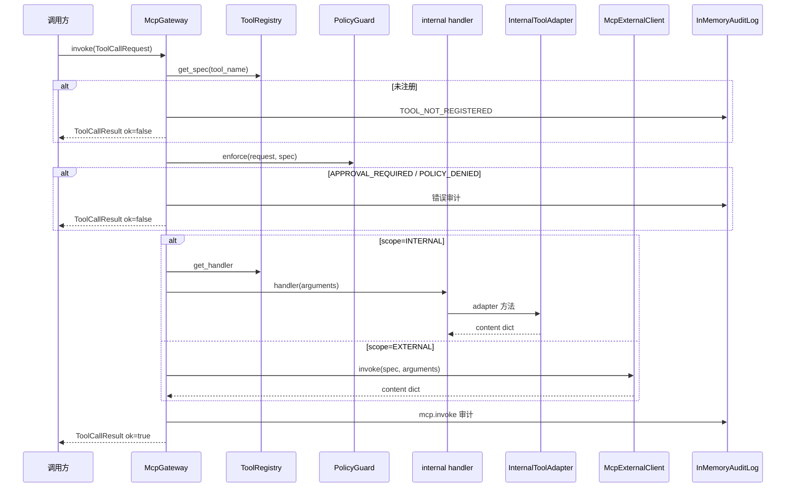

# MCP 工具平面

## 1. 业务目标

RootSeeker V2 将所有 MCP 工具调用收敛到 **`McpGateway.invoke`**：Flow 步骤、Agent 工具循环、Admin/Gateway HTTP 方法、公开 API 均构造 `ToolCallRequest` 后走同一条链路。启动时 `register_internal_tools` 将内置工具名绑定到 `ToolRegistry`（spec + handler），handler 再委托 `InternalToolAdapter` 实现（默认 `CompositeProductionAdapter`，或 HTTP 代理 `HttpInternalToolAdapter`）。

**PolicyGuard** 在 handler 执行前拦截写工具：可 dry-run 拒绝（`deny_write`）、或要求人工审批（`require_approval_for_write` + `ApprovalStore`）。**审计** 在每次 invoke 结束时写入 `InMemoryAuditLog`，记录 latency、参数键名、错误与 content 预览。

成功时返回 `ToolCallResult(ok=True, content=...)` 并 append 审计事件。失败时按阶段返回结构化 `ToolError`（`TOOL_NOT_REGISTERED` / `APPROVAL_REQUIRED` / `POLICY_DENIED` / `TOOL_EXEC_ERROR`），Flow 层将 step 标为 `FAILED`；外部子适配器缺配置时 **不抛异常**，在 content/metadata 中返回 `configured: false` 与明确 error 文案（非合成假数据）。

## 2. 入口一览

| 入口类型 | 路径 / 符号 | 说明 |
| --- | --- | --- |
| Bootstrap 装配 | `rootseeker/bootstrap/runtime.py` → `create_dev_runtime` | 创建 `ToolRegistry`、`register_internal_tools`、`PolicyGuard`、`McpGateway` |
| Adapter 工厂 | `rootseeker/config/internal_adapter.py` → `build_internal_adapter_from_settings` | `composite`（默认）或 `http` 两种 internal adapter |
| Flow 步骤 | `rootseeker/skill_runtime/flow_executor.py` → `_execute_flow_step_tool` | 构造 `ToolCallRequest`，`gateway.invoke(..., actor="skill-flow-executor")` |
| Agent 循环 | `rootseeker/agent_runtime/tool_call_loop.py` → `ToolCallLoop.execute_records` | 批量/并发调用 `gateway.invoke` |
| Gateway RPC | `rootseeker/gateway/methods/tool_methods.py` | 对外 Gateway 方法转发 invoke |
| Admin HTTP | `apps/admin/main.py` | 代码索引等管理操作经 `runtime.gateway.invoke` |
| 公开 API | `apps/api/main.py` | 仓库 REST 路由统一走 MCP internal 工具 |
| 内部注册 | `mcp_servers/internal/handlers.py` → `register_internal_tools` | 注册全部 `ToolScope.INTERNAL` 工具与 handler |
| 外部客户端 | `rootseeker/mcp_plane/external_client.py` → `McpExternalClient` | 仅服务 `ToolScope.EXTERNAL` 工具 |

## 3. 主调用链（逐步）

### 3.1 启动装配

1. `rootseeker/bootstrap/runtime.py` → `create_dev_runtime`
   - 入：`repo_root`、可选 `internal_adapter`、`deny_write`
   - 出：`DevRuntime.gateway`、`tool_registry`、`policy`、`audit_log`
   - 下一步：`build_internal_adapter_from_settings` → `register_internal_tools`

2. `rootseeker/config/internal_adapter.py` → `build_internal_adapter_from_settings`
   - 入：`RootSeekerSettings`（`internal_adapter_kind` 默认 `composite`）
   - 出：`CompositeProductionAdapter` 或 `HttpInternalToolAdapter`
   - 分支：`kind=http` 且缺 `ROOTSEEKER_INTERNAL_HTTP_BASE_URL` → `ValueError` fail-fast

3. `mcp_servers/internal/handlers.py` → `register_internal_tools(registry, adapter=...)`
   - 入：`ToolRegistry`、实现 `InternalToolAdapter` 的 adapter
   - 出：对每个工具 `registry.register(ToolSpec, handler)`；返回 `MemoryServiceCatalog`（来自 adapter.catalog 或 seeded default）

4. `rootseeker/bootstrap/runtime.py` → `PolicyGuard(...)` + `McpGateway(tools, policy, audit)`
   - `require_approval_for_write=settings.approval_required_for_write_tools`
   - `approval_store=ApprovalStore(event_sink=...)`（可选 webhook）

### 3.2 运行时 invoke 链

1. 调用方构造 `ToolCallRequest`（`case_id`、`step_id`、`skill_name`、`tool_name`、`arguments`）
   - 下一步：`McpGateway.invoke`

2. `rootseeker/mcp_plane/gateway.py` → `McpGateway.invoke`
   - 入：`ToolCallRequest`；可选 `actor`、`plugin_id`、`request_id`
   - **步骤 2a**：`registry.get_spec(tool_name)` — 缺失则 `TOOL_NOT_REGISTERED` + audit
   - **步骤 2b**：`policy.enforce(request, spec)` — 见 §6 审批/拒绝分支
   - **步骤 2c**：按 `spec.scope` 分发执行：
     - `ToolScope.INTERNAL` → `registry.get_handler(tool_name)(arguments)`
     - `ToolScope.EXTERNAL` → `external_client.invoke(spec, arguments)`（需已注册 server invoker）
   - **步骤 2d**：成功则 `ToolCallResult(ok=True, content, latency_ms)`；异常则 `TOOL_EXEC_ERROR`
   - **步骤 2e**：`_audit(...)` append `AuditEvent(category=TOOL_CALL, action="mcp.invoke")`
   - 出：`ToolCallResult`

3. INTERNAL handler（`handlers.py` 内闭包，以 `catalog.resolve_service` 为例）
   - 入：`arguments` dict
   - 出：调用 `adapter.resolve_service(...)` 并包装为 `{"entry": ...}`
   - 下一步：adapter 方法（composite / http / stub）

4. `CompositeProductionAdapter`（`mcp_servers/external/composite_adapter.py`）委派示例如下：
   - 日志 → `SlsLogAdapter.query_logs_by_*`
   - 链路 → `JaegerTraceAdapter.get_trace_chain`
   - 代码搜索/读文件/索引状态 → `ZoektCodeAdapter`
   - 通知 → `dispatch_env_resolved_notify`
   - 仓库/GitNexus/LSP → `RepoSyncService` 与各 `*_tool` 辅助函数

## 4. 关键数据结构

| 符号 | 定义文件 | 说明 |
| --- | --- | --- |
| `ToolScope` | `rootseeker/contracts/tool.py` | `internal`：registry handler；`external`：McpExternalClient |
| `ToolPermissionLevel` | `rootseeker/contracts/tool.py` | `read`（默认）/ `write` / `admin`；PolicyGuard 按级别拦截 |
| `ToolSpec` | `rootseeker/contracts/tool.py` | 工具元数据：`name`、`scope`、`server_name`、`permission_level`、`parameters_schema` |
| `ToolCallRequest` | `rootseeker/contracts/tool.py` | 一次调用上下文；审批重试时在 `arguments` 中带 `approval_id` |
| `ToolCallResult` | `rootseeker/contracts/tool.py` | `ok`、`content`、`error`、`latency_ms` |
| `ToolError` | `rootseeker/contracts/tool.py` | `code`、`message`、`details`、`retryable` |
| `ToolRegistry` | `rootseeker/mcp_plane/registry.py` | `_specs` + `_handlers`；`register_external` 仅注册 spec |
| `ToolHandler` | `rootseeker/mcp_plane/registry.py` | `Callable[[dict], dict]` 同步 handler |
| `PolicyGuard` | `rootseeker/mcp_plane/policy.py` | `deny_write`、`require_approval_for_write`、`approval_store` |
| `ApprovalRequiredError` | `rootseeker/mcp_plane/policy.py` | 携带 `ApprovalRequest`，Gateway 转为 `APPROVAL_REQUIRED` |
| `McpExternalClient` | `rootseeker/mcp_plane/external_client.py` | `server_name` → invoker 映射 |
| `InternalToolAdapter` | `mcp_servers/internal/adapters.py` | Protocol：catalog/log/trace/code/graph/repo/lsp/notify 方法集 |
| `AuditEvent` | `rootseeker/contracts/audit.py` | Gateway 写入：`category=TOOL_CALL`，`detail` 含 tool_name、latency、plugin_id 等 |

### 4.1 内部工具名 → handler / adapter 映射

所有 INTERNAL 工具 `server_name="internal"`，由 `register_internal_tools` 注册。

| 工具名 | handler（handlers.py） | adapter 方法 |
| --- | --- | --- |
| `incident.normalize` | `_invoke_incident_normalize` | 无（纯内存：webhook 解析 + 分析辅助） |
| `catalog.resolve_service` | `_invoke_catalog_resolve` | `resolve_service` |
| `catalog.get_log_sources` | `_invoke_catalog_log_sources` | `get_log_sources` |
| `log.query_by_trace_id` | `_invoke_log_by_trace` | `query_logs_by_trace_id` |
| `log.query_by_template` | `_invoke_log_by_template` | `query_logs_by_template` |
| `trace.get_chain` | `_invoke_trace_chain` | `get_trace_chain` |
| `code.search` | `_invoke_code_search` | `search_code` |
| `code.semantic_search` | `_invoke_code_semantic_search` | `semantic_search_code` |
| `code.read` | `_invoke_code_read` | `read_code` |
| `code.find_callers` | `_invoke_code_find_callers` | `find_callers` |
| `graph.impact` | `_invoke_graph_impact` | `graph_impact` |
| `graph.context` | `_invoke_graph_context` | `graph_context` |
| `graph.query` | `_invoke_graph_query` | `graph_query` |
| `graph.cypher` | `_invoke_graph_cypher` | `graph_cypher` |
| `graph.trace` | `_invoke_graph_trace` | `graph_trace` |
| `graph.list_repos` | `_invoke_graph_list_repos` | `graph_list_repos` |
| `graph.detect_changes` | `_invoke_graph_detect_changes` | `graph_detect_changes` |
| `index.get_status` | `_invoke_index_status` | `get_index_status` |
| `notify.send` | `_invoke_notify_send` | `send_notification` |
| `repo.register` | `_repo_register` | `repo_register` |
| `repo.sync` | `_repo_sync` | `repo_sync` |
| `repo.list` | `_repo_list` | `repo_list` |
| `repo.get` | `_repo_get` | `repo_get` |
| `repo.unregister` | `_repo_unregister` | `repo_unregister` |
| `repo.sync_all` | `_repo_sync_all` | `repo_sync_all` |
| `repo.sync_changed` | `_repo_sync_changed` | `repo_sync_changed` |
| `repo.index_status` | `_repo_index_status` | `repo_index_status` |
| `repo.semantic_search` | `_repo_semantic_search` | `repo_semantic_search` |
| `lsp.references` | `_lsp_references` | `lsp_references` |
| `lsp.definition` | `_lsp_definition` | `lsp_definition` |
| `lsp.hover` | `_lsp_hover` | `lsp_hover` |
| `lsp.symbols` | `_lsp_symbols` | `lsp_symbols` |

参数 JSON Schema 见 `mcp_servers/internal/tool_schemas.py` → `INTERNAL_TOOL_PARAMETER_SCHEMAS` / `parameter_schema_for`。

### 4.2 INTERNAL vs EXTERNAL 范围

| 维度 | `ToolScope.INTERNAL` | `ToolScope.EXTERNAL` |
| --- | --- | --- |
| 注册 | `ToolRegistry.register(spec, handler)` | `ToolRegistry.register_external(spec)`（无 handler） |
| 执行 | `registry.get_handler(name)(args)` | `McpExternalClient.invoke(spec, args)` |
| 典型来源 | `register_internal_tools` 批量注册 | 测试或扩展方手动 `register_external` + `client.register_server` |
| `server_name` | 固定 `"internal"` | 外部 MCP 服务标识，映射到 invoker |
| Gateway 依赖 | 仅需 registry | 还需构造 `McpGateway(..., external_client=client)` |
| 缺 client | — | `RuntimeError: external client not configured` → `TOOL_EXEC_ERROR` |

当前生产 bootstrap **仅注册 INTERNAL 工具**；EXTERNAL 路径在 `tests/unit/mcp_plane/test_gateway.py` 中验证，供未来独立 MCP Server 接入。

## 5. 状态与副作用

### 5.1 Case / Step / Approval

- Flow 中 `gateway.invoke` 返回 `ok=False` 时，`flow_executor` 将当前 step 标为 `StepStatus.FAILED`，case 标为 `CaseStatus.FAILED`（`APPROVAL_REQUIRED` 亦视为失败，等待重试）。
- `APPROVAL_REQUIRED` 时 `ApprovalStore.create_for_tool` 创建 pending 审批；用户 approve 后，调用方在 **同一** `ToolCallRequest` 的 `arguments` 中附带 `approval_id`（或 `_approval_id`）重试 invoke。
- READ 工具不受 `require_approval_for_write` 影响。

### 5.2 Store 与审计

| 目标 | 写入时机 | 键/内容 |
| --- | --- | --- |
| `InMemoryAuditLog` | 每次 invoke（成功/失败均写） | `AuditCategory.TOOL_CALL`，`action="mcp.invoke"`，`target=tool_name`，`detail` 含 case_id、latency_ms、error、content_preview |
| `ApprovalStore` | 写工具首次 invoke 且无有效 approval_id | 内存 dict `approval_id` → `ApprovalRequest`；可选 webhook 事件 |
| Case/Evidence Store | Gateway **不直接写**；由 Flow 在 step 完成后持久化 tool content | — |

### 5.3 对外 I/O（CompositeProductionAdapter）

| 子系统 | 适配器 | 环境变量（摘要） |
| --- | --- | --- |
| 阿里云 SLS | `SlsLogAdapter` | `SLS_ACCESS_KEY_ID`、`SLS_ACCESS_KEY_SECRET`、`SLS_ENDPOINT`、`SLS_PROJECT`、`SLS_LOGSTORE` |
| Jaeger | `JaegerTraceAdapter` | `JAEGER_ENDPOINT`、`JAEGER_TIMEOUT_SECONDS` |
| Zoekt | `ZoektCodeAdapter` | `ZOEKT_ENDPOINT`（或 `ROOTSEEKER_ZOEKT_ENDPOINT`）、timeout 变量 |
| GitNexus | `GitNexusAdapter` | `GitNexusCliConfig.from_env()` |
| 通知 | `dispatch_env_resolved_notify` | `ROOTSEEKER_NOTIFY_DEFAULT_URL`、`ROOTSEEKER_NOTIFY_<CHANNEL>_URL` |
| 仓库索引 | `RepoSyncService` | settings 中 zoekt/qdrant/repo base path |

`HttpInternalToolAdapter` 则将上述能力代理到 `ROOTSEEKER_INTERNAL_HTTP_BASE_URL` 对应 REST 路由（见 `adapters.py` 中 `route_*` 字段）。

## 6. 分支与错误

| 条件 | 代码位置 | 行为 |
| --- | --- | --- |
| 工具未注册 | `gateway.py` → `get_spec` 为 None | `TOOL_NOT_REGISTERED`，`retryable=False`，写 audit |
| `deny_write=True` 且非 READ 工具 | `policy.py` → `PolicyGuard.enforce` | `POLICY_DENIED`，如拦截 `notify.send` |
| `require_approval_for_write=True` 且无 approval_store | `policy.py` | `POLICY_DENIED`（配置不完整） |
| 写工具无有效 `approval_id` | `policy.py` → `create_for_tool` + `ApprovalRequiredError` | Gateway 返回 **`APPROVAL_REQUIRED`**，`retryable=True`，`details` 含 `approval_id` 等 payload |
| 写工具带已 approve 的 `approval_id` | `policy.py` → `is_approved_for` | 放行，正常执行 handler |
| INTERNAL handler 抛异常 | `gateway.py` except 块 | `TOOL_EXEC_ERROR`，`details.type=异常类名` |
| EXTERNAL 无 `external_client` | `gateway.py` | `RuntimeError` → `TOOL_EXEC_ERROR` |
| EXTERNAL server 未注册 | `external_client.py` → `invoke` | `RuntimeError: external server not configured` → `TOOL_EXEC_ERROR` |
| `internal_adapter_kind=http` 缺 base URL | `config/internal_adapter.py` | 启动期 **`ValueError` fail-fast**（非 invoke 时） |
| SLS 未配置 | `sls_adapter.py` → `_not_configured_response` | **不 fail-fast**；返回空 records + `metadata.configured=false` + error 文案 |
| Jaeger 未配置 | `jaeger_adapter.py` → `_not_configured_trace_chain` | 空 spans + `configured=false` |
| Zoekt 未配置 | `zoekt_adapter.py` → `_not_configured_*` | 空 hits/content + `configured=false` |
| Notify 无启用渠道 / legacy URL 未配置 | `notify_dispatch.py` → `dispatch_broadcast_notify` / `dispatch_env_resolved_notify` | **不 fail-fast**；`ok=True`，`metadata.skipped=True`（Gateway 仍 `ok=True`） |
| Notify 已配置但 HTTP 失败 | `outbound.send_outbound_notification` / 广播 `results[]` | 由 outbound 层决定；部分失败时 `dispatch_broadcast_notify` 可返回 `ok=False` |

### 6.1 审批拦截行为（摘要）

启用条件：`ROOTSEEKER_APPROVAL_REQUIRED_FOR_WRITE_TOOLS=true`（映射 `settings.approval_required_for_write_tools`）。

当前内置 **WRITE** 工具（`handlers.py` 中显式 `permission_level=ToolPermissionLevel.WRITE`）：

- `notify.send`
- `repo.register`、`repo.sync`、`repo.unregister`、`repo.sync_all`、`repo.sync_changed`

流程：

1. 首次 invoke → `PolicyGuard` 创建 `ApprovalRequest` → Gateway 返回 `APPROVAL_REQUIRED`（不执行 adapter）。
2. 操作员通过 `ApprovalStore.approve(approval_id)` 或 Admin 审批 API 批准。
3. 调用方重试，arguments 增加 `approval_id` → `is_approved_for` 校验 case_id/step_id/tool_name/permission_level 一致 → 执行 adapter。

完整审批生命周期、回放与治理见 **[17-approval-governance-replay.md](./17-approval-governance-replay.md)**（规划文档）。

### 6.2 Composite 缺配置时的「显式失败」语义

`composite_adapter.py` 模块注释说明：外部服务未配置时，子适配器返回 **explicit errors**，不生成 synthetic 日志/span/代码命中。这与 Gateway 层 fail-fast 不同——invoke 仍 `ok=True`（adapter 正常返回 dict），由上层 Skill/Flow 根据 `configured=false` 或空结果决定后续步骤。唯一启动期 fail-fast 是 HTTP adapter 模式缺 URL。

## 7. 相关测试

| 测试文件 | 覆盖点 |
| --- | --- |
| `tests/unit/mcp_plane/test_gateway.py` | invoke 成功审计、未知工具、`deny_write`、`APPROVAL_REQUIRED` 重试、EXTERNAL client 路径 |
| `tests/unit/mcp_plane/test_all_internal_tools.py` | 全部 internal 工具经 Gateway → handler → adapter 方法 |
| `tests/unit/mcp_plane/test_internal_adapter.py` | `register_internal_tools` 与自定义 adapter |
| `tests/unit/mcp_plane/test_http_internal_adapter.py` | HTTP adapter POST/GET 路由 |
| `tests/unit/mcp_plane/test_http_adapter_all_routes.py` | HTTP 路由与 Gateway 端到端 |
| `tests/unit/mcp_plane/test_http_adapter_force_reclone.py` | repo sync force_reclone HTTP 参数 |
| `tests/unit/mcp_plane/test_repo_sync_real_docker.py` | 真实 Docker 环境下 repo 工具 + Gateway |
| `tests/unit/contracts/test_tool_contracts.py` | `ToolScope` / `ToolSpec` 契约 |
| `tests/unit/config/test_internal_adapter_config.py` | `build_internal_adapter_from_settings` composite/http 分支 |
| `tests/unit/gateway/test_gateway_business_methods.py` | `create_dev_runtime` + 写工具审批 env |
| `tests/integration/test_dev_runtime_smoke.py` | 装配后 catalog 工具 invoke smoke |

## 8. 与其他文档的关系

| 文档 | 关系 |
| --- | --- |
| [01-bootstrap-wiring.md](./01-bootstrap-wiring.md) | `create_dev_runtime` 如何装配 registry、adapter、gateway、policy |
| [02-contracts-state-machines.md](./02-contracts-state-machines.md) | `ToolCallRequest/Result`、`ToolScope`、Step/Case 失败状态 |
| [04-skill-system.md](./04-skill-system.md) | Flow 步骤如何规划参数并调用 gateway |
| [06-plugin-system.md](./06-plugin-system.md) | Plugin manifest 声明 `mcp_tools`；invoke 时 `plugin_id` 写入 audit |
| [10-channel-routing.md](./10-channel-routing.md) | `notify.send` → `dispatch_env_resolved_notify` 出站细节 |
| [17-approval-governance-replay.md](./17-approval-governance-replay.md) | 审批治理、重试与回放（规划） |
| [14-code-index.md](./14-code-index.md) | RepoSync、Zoekt、Qdrant、GitNexus 索引（若已编写） |
