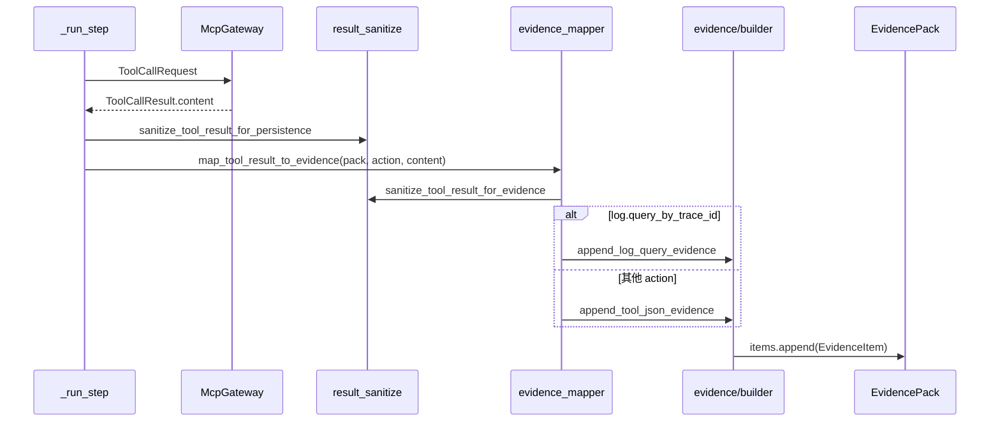
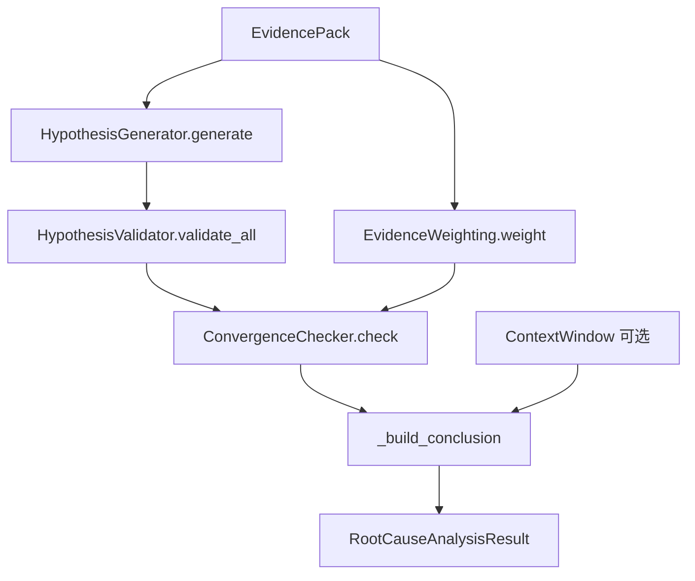

# 证据组装与根因分析

## 1. 业务目标

默认排查 Flow 与 Agent Runtime 在执行 MCP 工具后，需要将分散的工具输出收敛为统一的 `EvidencePack`，再经 `RootCauseEngine` 做多假设根因推理，最终产出 `CaseReport` 供通知、API 查询与技能草稿合成消费。

**谁触发：** `AttemptRunner` 在工具执行结束后调用 `build_case_report`；Admin 调试页可单独调用 LLM 报告客户端。YAML 步进器 `execute_skill_flow` 已删除。

**成功产出：** 内存中的 `EvidencePack`（含若干 `EvidenceItem`）、`CaseReport`（含 `RootCauseConclusion`、证据 ID 列表与 metadata）；Bootstrap 路径下写入 `evidence_store` / `report_store`。

**失败/降级：** 证据为空时引擎返回「证据不足」假设；LLM 未配置、禁用或请求失败时保留规则引擎结论，仅在 `metadata.llm` 记录 skip/error；`RootCauseEngine` 本身只读，**不会**自行触发日志、代码搜索或 MCP 调用。

## 2. 入口一览

| 入口类型 | 路径 / 符号 | 说明 |
| --- | --- | --- |
| 内部（Agent playbook） | `rootseeker/agent_runtime/attempt_runner.py:AttemptRunner` | 工具执行后累积 `EvidencePack` 并调用 `build_case_report` |
| 内部（报告构建） | `rootseeker/analysis/report_builder.py:build_case_report` | 规则分析 + 可选 LLM 增强的统一入口 |
| 内部（根因引擎） | `rootseeker/analysis/root_cause_engine.py:RootCauseEngine.analyze` | 多假设 generate → validate → weight → convergence |
| 内部（证据映射） | `rootseeker/skill_runtime/evidence_mapper.py:map_tool_result_to_evidence` | 将单步工具 JSON 写入 `EvidencePack` |
| 内部（证据追加） | `rootseeker/evidence/builder.py:append_*` | 构造 `EvidenceItem` 并 append 到 pack |
| 内部（上下文裁剪） | `rootseeker/evidence/context_assembler.py:build_context_window` | 从 pack 生成 token 预算内的 `ContextWindow` |
| 内部（Agent） | `rootseeker/agent_runtime/attempt_runner.py` | LLM 规划路径直接 `append_tool_json_evidence` 后 `build_case_report` |
| 内部（Bootstrap 持久化） | `rootseeker/bootstrap/runtime.py:DevRuntime.run_default_flow_from_case_request` | Flow 结束后 `evidence_store.put_pack` + `report_store.put` |
| HTTP（只读） | `apps/api/main.py:GET /reports/{case_id}` | 从 `report_store` 读取已持久化报告 |
| HTTP（只读） | `apps/api/main.py:GET /evidence/{case_id}` | 从 `evidence_store` 读取证据包 |
| 内部（调用链解析） | `rootseeker/analysis/call_chain.py` | 从堆栈文本提取运行时 call_chain（**上游**工具/incident 阶段） |
| 内部（静态 caller 追踪） | `rootseeker/analysis/find_callers.py:analyze_call_chain` | GitNexus 优先、Zoekt 回退（**经 MCP 工具** `code.find_callers` 间接进入证据） |
| 包导出 | `rootseeker/analysis/__init__.py` | 导出 `RootCauseEngine`、`build_case_report`、LLM 报告类型等 |

## 3. 主调用链（逐步）

### 3.1 工具结果 → EvidencePack

1. `rootseeker/agent_runtime/attempt_runner.py` → `AttemptRunner.run_once`
   - 入：`CaseCreateRequest`、Skill registry、MCP gateway
   - 出：初始化并累积 `EvidencePack`；工具成功后映射证据
   - 下一步：工具循环结束后 `build_case_report`

3. `rootseeker/skill_runtime/result_sanitize.py` → `sanitize_tool_result_for_evidence`
   - 入：MCP action、`content: dict`
   - 出：裁剪后的 dict（`code.*` 最多 20 hits，文本最长 32000 字符等）
   - 说明：证据包不需要完整搜索语料，仅保留根因/LLM 上下文预览

4. `rootseeker/skill_runtime/evidence_mapper.py` → `map_tool_result_to_evidence`
   - 入：`pack`、`action`、裁剪后 `content`、可选 `tool_skill`
   - 出：原地修改 `pack.items`
   - **action → EvidenceType 映射（内置表 `_ACTION_EVIDENCE_TYPES`）：**

     | action | EvidenceType |
     | --- | --- |
     | `log.query_by_trace_id` / `log.query_by_template` | `LOG` |
     | `trace.get_chain` | `TRACE` |
     | `code.search` / `code.read` / `repo.list` | `CODE` |
     | `catalog.resolve_service` / `catalog.get_log_sources` | `SERVICE_CATALOG` |
     | `incident.normalize` / `index.get_status` | `OTHER` |

   - 分支：`log.query_by_trace_id` 校验为 `LogQueryResult` 后走 `append_log_query_evidence`；其余走 `append_tool_json_evidence`
   - 扩展：未知 action 可按前缀 `log.` / `trace.` / `code.` / `catalog.` 推断；Tool Skill `metadata.evidence_type="none"` 则跳过

5. `rootseeker/evidence/builder.py` → `append_log_query_evidence` / `append_tool_json_evidence`
   - 入：`pack`、`tool_name`、`content` 或 `LogQueryResult`
   - 出：`EvidenceItem`（`item_id=new_id("ev-")`、`type`、`source=tool_name`、`content` dict）
   - 日志类 content 字段：`query_key`、`truncated`、`record_count`、`metadata`

**call_chain 如何进入证据链（间接）：**

- `mcp_servers/internal/handlers.py` → `incident.normalize` 处理器调用 `extract_call_chain_summary(source_text)`，结果写入工具返回的 `extracted.call_chain`（**尚未**是 EvidenceItem）。
- 该 normalize 结果被 `map_tool_result_to_evidence` 以 `EvidenceType.OTHER` 写入 pack。
- 后续 `code.find_callers` 步骤由 `rule_step_argument_resolver` 从 normalize 输出的 `call_chain` 构造参数；工具结果再以 `EvidenceType.CODE` 进入 pack（含 `aligned`、`static_callers`、`entrypoints` 等）。

### 3.2 RootCauseEngine 多假设流水线

1. `rootseeker/analysis/report_builder.py` → `build_case_report`
   - 入：`case_id`、`title`、`pack`、可选 `engine` / `llm_client` / `settings`
   - 出：`CaseReport`
   - 下一步：`build_context_window(pack)` → `RootCauseEngine.analyze`

2. `rootseeker/evidence/context_assembler.py` → `build_context_window`
   - 入：`pack`、`max_tokens=2048`
   - 出：`ContextWindow`（每条证据截断为 `type:source:content[:200]` 的 segment；`used_tokens` 为估算值）
   - 消费方：根因 narrative 计数；LLM 报告 messages 中的 `context_window` 字段

3. `rootseeker/analysis/root_cause_engine.py` → `RootCauseEngine.analyze`
   - 入：`pack`、可选 `context`、`max_iterations`（**当前实现固定单轮**，`iteration_count` 恒为 1）
   - 空 pack：直接 `_empty_result()` → 假设「证据不足，需上游补证」、`is_converged=False`
   - 非空 pack 顺序：
     1. **Generate** — `HypothesisGenerator.generate(pack)`，最多 5 条假设
     2. **Validate** — `HypothesisValidator.validate_all(hypotheses, pack)`，按 confidence 降序
     3. **Weight** — `EvidenceWeighting.weight(pack)`，产出 `WeightedEvidence` 列表（归一化权重）
     4. **Convergence** — `ConvergenceChecker.check(hypotheses, validations, pack)`
     5. **Conclusion** — `_build_conclusion(...)` 取 validation 排名第一的假设构建 `RootCauseConclusion`

4. `rootseeker/analysis/hypothesis_generator.py` → `HypothesisGenerator.generate`
   - 策略：模板关键词匹配（LOG_ERROR / TRACE_ANOMALY / CODE_DEFECT 等）→ 同类型证据分组 → catch-all
   - 出：`list[Hypothesis]`（`statement`、`evidence_item_ids`；生成器代码中的 `metadata` 字段不在 `Hypothesis` 契约内，会被 Pydantic 忽略）

5. `rootseeker/analysis/hypothesis_validator.py` → `HypothesisValidator.validate`
   - **支持计数：** 假设绑定的 item_id + 内容关键词匹配的其他 item
   - **矛盾计数：** 假设含 error/fail/异常/故障 且其他证据含 success/ok/normal/healthy/resolved
   - **confidence：** `min(0.9, 0.3 + 0.15 * supporting) - contradicting * penalty`
   - 出：`ValidationResult`（`is_valid`、`confidence`、`supporting_count`、`contradicting_count`、`reasons`）

6. `rootseeker/analysis/evidence_weighting.py` → `EvidenceWeighting.weight`
   - 默认策略 `COMBINED`：按 evidence type 权重 + 包内 recency + 项间相关性
   - 类型默认权重：trace 1.1、log 1.0、code 0.9、service_catalog 0.8 等
   - 出：归一化后的 `WeightedEvidence` 列表（**当前 `_build_conclusion` 未直接消费加权结果**，仅参与 analyze 流程）

7. `rootseeker/analysis/convergence_checker.py` → `ConvergenceChecker.check`
   - 收敛条件（同时满足）或达到 `max_iterations`：
     -  top 假设 confidence ≥ `confidence_threshold`（默认 0.7）
     - 证据条数 ≥ `min_evidence_count`（默认 3）
     - top1 与 top2 confidence 差 ≥ `min_hypothesis_gap`（默认 0.2）
   - 出：`ConvergenceStatus`（`is_converged`、`recommendation` 中文提示）

### 3.3 规则报告 vs LLM 增强报告

1. `build_case_report` 先用规则引擎填充 `CaseReport`：
   - `summary`：`"Collected N evidence item(s); generated M hypothesis(es)."`
   - `root_cause`：`analysis.conclusion`
   - `evidence_item_ids`：pack 全部 item_id
   - `metadata.builder`：`"root_cause_engine"`
   - `metadata.hypotheses`：假设列表 JSON
   - `metadata.context_used_tokens`：上下文窗口用量

2. LLM 客户端选择（`report_builder._build_default_llm_client`）：
   - `settings.llm_enabled=False` → skip，`reason="disabled"`
   - `LlmReportConfig.from_settings` 缺 base_url/api_key/model → skip，`reason="not_configured"`
   - 否则构造 `OpenAICompatibleReportClient`

3. `rootseeker/analysis/llm_report.py` → `OpenAICompatibleReportClient.analyze_case`
   - 入：case、pack、`ContextWindow`、`RootCauseAnalysisResult`
   - 构造 messages：`SYSTEM_PROMPT` + 用户 JSON（含 `rule_analysis`、`evidence_preview` 前 N 条）
   - POST `{base_url}/chat/completions`（OpenAI 兼容）
   - 出：`LlmReportResult`（`ok`、`content`、`parsed`、`error`、`skipped`）

4. `apply_llm_report_result(report, llm_result)` — **fallback 行为：**

   | 条件 | 行为 |
   | --- | --- |
   | LLM skip（未配置/禁用） | 原规则报告不变；`metadata.llm.skipped=true` |
   | LLM 请求失败或无 content | 原规则 `summary`/`root_cause` 保留；`metadata.llm.ok=false` |
   | content 无法解析 JSON | `summary=原始 content`；`metadata.llm_analysis.text` |
   | JSON 解析成功 | 覆盖 `summary`、`root_cause`；原规则结论存入 `metadata.rule_root_cause`；`builder=root_cause_engine+llm` |

5. Flow 内 **双次** `build_case_report`：
   - 第一次：主步骤完成后，供 `defer_until: after_report` 的步骤（如 notify 参数规划）读取报告摘要
   - 第二次：deferred 步骤结束后重新生成（证据包已包含 deferred 步骤产出）

### 3.4 call_chain / find_callers / service_identity（分析辅助，非引擎直接依赖）

这些模块为 **上游工具与 MCP 适配器** 服务；`RootCauseEngine` **不 import** 它们。

| 模块 | 职责 | 典型调用方 |
| --- | --- | --- |
| `call_chain.py` | 从 Java 堆栈提取应用帧、异常摘要、合并多源 chain | `handlers.incident.normalize`、`apps/admin/main.py` |
| `find_callers.py` | 解析帧 → GitNexus caller 图 → Zoekt 文本搜索回退 → 对齐 runtime/static | `composite_adapter.find_callers` → MCP `code.find_callers` |
| `service_identity.py` | 从日志/告警文本推断 `service_name` | `handlers.incident.normalize`（与证据间接相关） |

`find_callers.analyze_call_chain` 需要注入 `search_code` / `read_code` / `graph_callers` 回调；生产环境由 `mcp_servers/external/composite_adapter.py` 绑定 Zoekt、GitNexus。分析结果作为 `code.find_callers` 工具 JSON 经 §3.1 映射为 `EvidenceType.CODE` 证据项。

## 4. 关键数据结构

| 符号 | 定义文件 | 字段要点 | 填充方 | 消费方 |
| --- | --- | --- | --- | --- |
| `EvidenceType` | `rootseeker/contracts/evidence.py` | log/trace/code/metric/topology/service_catalog/other | evidence_mapper | 根因模板匹配、加权 |
| `EvidenceItem` | 同上 | item_id, type, source, content, collected_at | evidence/builder | pack.items、报告 evidence_item_ids |
| `EvidencePack` | 同上 | case_id, items[], summary | flow_executor / attempt_runner | RootCauseEngine、stores |
| `ContextWindow` | 同上 | max_tokens, used_tokens, segments[], notes | context_assembler | analyze、LLM messages |
| `Hypothesis` | 同上 | hypothesis_id, statement, status, evidence_item_ids | HypothesisGenerator | Validator、report metadata |
| `RootCauseConclusion` | 同上 | title, narrative, confidence, contributing_factors | RootCauseEngine / LLM | CaseReport.root_cause |
| `RootCauseAnalysisResult` | `rootseeker/analysis/root_cause_engine.py` | hypotheses, conclusion, is_converged, recommendation | RootCauseEngine.analyze | build_case_report、LLM |
| `ValidationResult` | `rootseeker/analysis/hypothesis_validator.py` | confidence, supporting/contradicting counts | HypothesisValidator | ConvergenceChecker、conclusion |
| `WeightedEvidence` | `rootseeker/analysis/evidence_weighting.py` | item, weight, relevance_score, factors | EvidenceWeighting | analyze 流程（间接） |
| `ConvergenceStatus` | `rootseeker/analysis/convergence_checker.py` | is_converged, recommendation | ConvergenceChecker | conclusion narrative |
| `CaseReport` | `rootseeker/contracts/report.py` | case_id, title, summary, root_cause, evidence_item_ids, metadata, generated_at | build_case_report | report_store、notify、draft_builder |
| `LlmReportResult` | `rootseeker/analysis/llm_report.py` | ok, skipped, content, parsed, error, reason | OpenAICompatibleReportClient | apply_llm_report_result |
| `LogQueryResult` | `rootseeker/contracts/log_query.py` | query_key, records, truncated, metadata | log 工具 | append_log_query_evidence |

## 5. 状态与副作用

### Case / Step 状态

本链路**不直接修改** Case/Step 状态；状态变更发生在 Flow 执行阶段（见 [`03-default-triage-flow.md`](03-default-triage-flow.md)）。报告生成时 Case 通常已为 `COMPLETED` 或 `FAILED`。

### Store 写入

| Store | 写入位置 | 内容 |
| --- | --- | --- |
| `evidence_store` | `DevRuntime.run_default_flow_from_case_request`（L72） | 完整 `EvidencePack` |
| `evidence_store` | `attempt_runner` LLM 分支（L265） | Agent 路径证据包 |
| `report_store` | 同上（L73 / L278） | `CaseReport` |
| `case_store` | Bootstrap / attempt_runner | 含 steps.outputs 的 `CaseRecord`（工具原始/裁剪结果，非 EvidencePack 本身） |

后端实现：`InMemoryEvidenceStore` / `SqliteEvidenceStore` / `MysqlEvidenceStore` 与对应 ReportStore（见 [`16-storage.md`](16-storage.md)）。

### 对外 I/O

- **LLM HTTP：** `OpenAICompatibleReportClient` → OpenAI 兼容 `chat/completions`（仅报告文案增强，非工具调用）
- **无 MCP：** `RootCauseEngine` 与 `build_context_window` 均不触达 MCP Gateway
- **代码索引（间接）：** `code.find_callers` 工具经 composite adapter 调用 Zoekt/GitNexus；索引细节见 [`14-code-index.md`](14-code-index.md)

## 6. 分支与错误

| 条件 | 代码位置 | 行为 |
| --- | --- | --- |
| 空 EvidencePack | `RootCauseEngine.analyze` / `_empty_result` | 假设「证据不足」；confidence=0；`is_converged=False` |
| action 映射为 None | `evidence_mapper._evidence_type_for_action` | 跳过，不追加 EvidenceItem |
| 工具步骤失败 | `flow_executor._run_step` | 不调用 `map_tool_result_to_evidence`；Case 可能 `FAILED`，仍可能用已有证据生成报告 |
| LLM 禁用 | `report_builder._build_default_llm_client` | 纯规则报告；`metadata.llm.reason="disabled"` |
| LLM 配置不全 | `LlmReportConfig.from_settings` | skip；`reason="not_configured"` |
| LLM HTTP 4xx/5xx | `OpenAICompatibleReportClient.complete` | `LlmReportResult.ok=False`；保留规则 root_cause |
| LLM 读超时 | 同上 | 按 `max_retries` 重试；仍失败则 fallback 规则报告 |
| LLM 返回非 JSON | `parse_llm_report_content` | 整段 content 写入 summary；不覆盖 structured root_cause |
| call_chain 不可解析 | `find_callers.analyze_call_chain` | 返回空 static_callers + notes |
| GitNexus 无结果 | `find_callers.analyze_call_chain` | 回退 Zoekt 启发式搜索 |
| 假设均未通过 validate | `HypothesisValidator` | `filter_valid` 为空时 conclusion 仍取 validations[0] 或首条假设，confidence 可能较低 |
| `max_iterations` 参数 | `RootCauseEngine.analyze` | **当前未实现多轮迭代**；ConvergenceChecker 的 `iterations_remaining` 不参与循环 |

## 7. 相关测试

| 测试文件 | 覆盖点 |
| --- | --- |
| `tests/unit/evidence/test_builder.py` | `append_log_query_evidence` / `append_tool_json_evidence` 构造 EvidenceItem |
| `tests/unit/evidence/test_context_assembler.py` | `build_context_window` segment 与 token 估算 |
| `tests/unit/analysis/test_root_cause_engine.py` | 假设生成/校验/加权/收敛/空 pack/引擎端到端 |
| `tests/unit/analysis/test_llm_report.py` | LLM 配置、`build_case_report` 增强、disable fallback、超时重试 |
| `tests/unit/analysis/test_call_chain.py` | 堆栈帧过滤、异常摘要提取 |
| `tests/unit/analysis/test_find_callers.py` | 帧解析、mock Zoekt 的 `analyze_call_chain` |
| `tests/unit/code_index/test_gitnexus_adapter.py` | GitNexus 优先、空结果回退 Zoekt |
| `tests/integration/test_dev_runtime_smoke.py` | smoke 路径 `build_case_report` |
| `tests/integration/test_e2e_full_chain.py` | 全链路后 evidence/report 持久化到 SQLite |
| `tests/integration/test_default_flow.py` | 含 call_chain 时 find_callers 步骤与 aligned 输出 |
| `tests/unit/contracts/test_evidence_report_audit_contracts.py` | EvidencePack / CaseReport 契约序列化 |

## 8. 与其他文档的关系

| 相关文档 | 关系 |
| --- | --- |
| [`03-default-triage-flow.md`](03-default-triage-flow.md) | 默认 Flow 步骤顺序、何时首次/二次调用 `build_case_report`、`defer_until: after_report` 与 notify |
| [`05-skill-runtime-flow-executor.md`](05-skill-runtime-flow-executor.md) | `_run_step`、checkpoint 恢复重放证据映射、参数规划读取 report |
| [`02-contracts-state-machines.md`](02-contracts-state-machines.md) | `EvidencePack`、`CaseReport`、`RootCauseConclusion` 契约定义 |
| [`14-code-index.md`](14-code-index.md) | Zoekt/Qdrant/GitNexus 索引；`find_callers` / `code.search` 工具的数据来源（结果经 §3.1 进入 EvidencePack） |
| [`07-mcp-plane.md`](07-mcp-plane.md) | MCP 工具注册与 gateway.invoke；工具 JSON 是证据的上游 |
| [`09-agent-runtime.md`](09-agent-runtime.md) | LLM 工具规划路径下 alternate 证据组装与 report_store 写入 |
| [`10-channel-routing.md`](10-channel-routing.md) | notify 步骤通过 `build_notify_args(report)` 读取 root_cause |
| [`16-storage.md`](16-storage.md) | evidence_store / report_store 后端与 API GET 路径 |

**边界约束（架构一致）：**

- 证据收集只能发生在 Skill Flow / Agent 工具执行阶段；根因引擎只消费已组装的 pack。
- 代码搜索、caller 追踪、日志查询不得被 `RootCauseEngine` 直接调用；须先成为 `EvidenceItem`。
- LLM 报告层是对规则结论的**可选增强**，任何 LLM 失败均 fallback 到规则 `CaseReport`。
