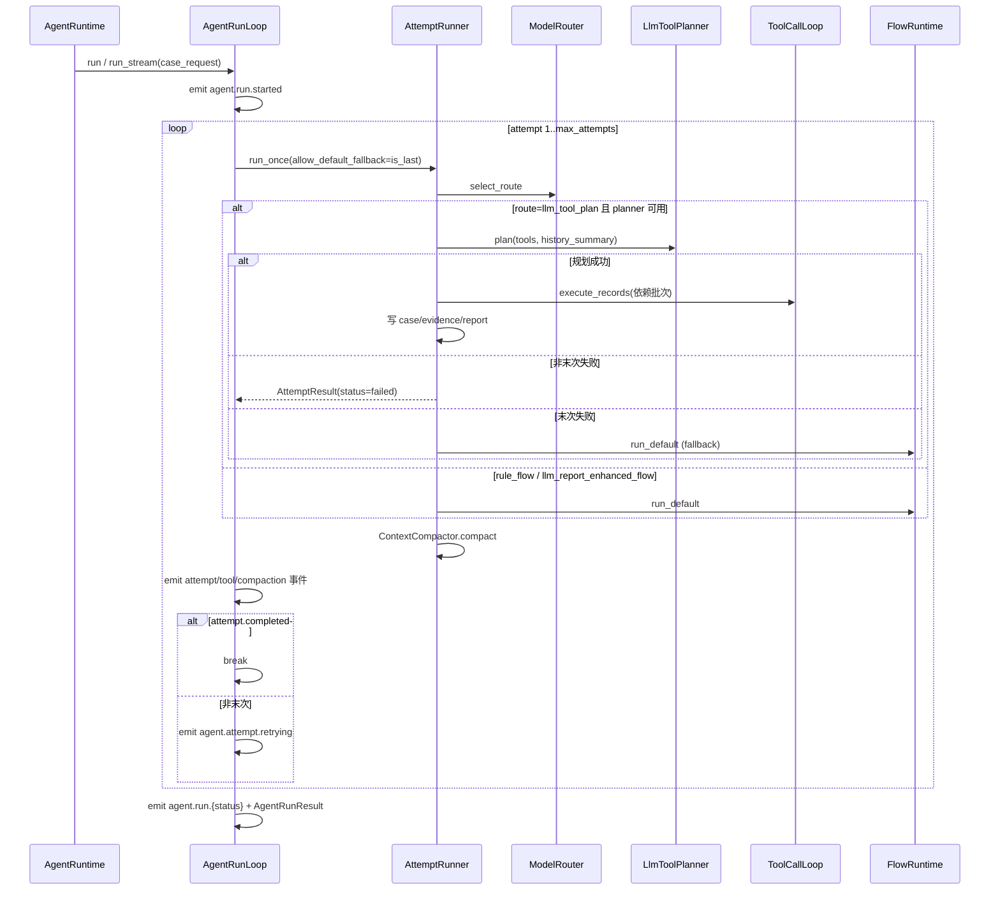

# Agent 运行时（Agent Runtime）

## 1. 业务目标

Agent 运行时是 RootSeeker V2 在**确定性默认排查 Flow 之上**的可选编排层：对同一 `CaseCreateRequest`，先尝试由 LLM 产出经 JSON 校验的 MCP 工具计划并执行；若规划失败或非末次尝试，则记录失败快照并重试；**仅在最后一次尝试**仍无法产出可执行计划时，降级到 `FlowRuntime.run_default`（与 [03-default-triage-flow.md](./03-default-triage-flow.md) 同路径）。

**谁触发：** 生产入口经 `DevRuntime.run_agent_from_case_request` / `run_flow_from_payload` 统一路由；显式启用方式：`use_agent: true`（请求体/metadata）或环境变量 `ROOTSEEKER_AGENT_FLOW_ENABLED=true`。已接入：`POST /cases/run-default`、`POST /cases/run-agent`、`POST /webhook/{channel}`、Gateway `case.create`、`TaskExecutor` `CASE_RUN`（`use_agent`）、CLI `demo --use-agent`、Admin `/api/error-chat`。

**解决什么问题：** 在 LLM 可用时动态选择 MCP 工具组合与依赖顺序；多次尝试间通过 `history_summary` 与上下文压缩摘要实现规划自修复；全程保留 attempt 快照、prompt 快照、工具 trace 与 audit 流式事件，便于回放与排障。

**成功时产出：** `AgentRunResult`——`status=completed`，含一个或多个 `AttemptResult`；LLM 规划路径写入 `case_store` / `evidence_store` / `report_store`；默认 Flow 降级路径复用 bootstrap 写入（见 [03-default-triage-flow.md](./03-default-triage-flow.md)）。流式 API 另产出 `AgentRunEvent` 序列并最终携带完整 `AgentRunResult`。

**失败时落到哪里：** 非末次 LLM 规划失败 → `AttemptResult.status=failed`（`_build_failed_planner_attempt`），触发 `agent.attempt.retrying` 后进入下一 attempt；末次仍失败 → 降级 `run_default`；若默认 Flow 步骤失败 → `AttemptResult.status=failed`，`AgentRunResult.status=failed`。Planner 在末次 attempt 且 `allow_default_fallback=False` 的边界场景下直接返回 failed attempt（当前 run_loop 仅在末次传入 `allow_default_fallback=True`）。

---

## 2. 入口一览

### 2.1 Agent 运行时入口（库 API）

| 入口类型 | 路径 / 符号 | 说明 |
| --- | --- | --- |
| 库 API | `rootseeker/agent_runtime/runtime.py:AgentRuntime.run_case` | `CaseCreateRequest` → `AgentRunLoop.run`，返回 `case_id` |
| 库 API | `rootseeker/agent_runtime/runtime.py:AgentRuntime.run_case_detailed` | 返回完整 `AgentRunResult`（含 attempts、compacted_context、metadata） |
| 库 API | `rootseeker/agent_runtime/runtime.py:AgentRuntime.run_case_stream` | 流式 `Iterator[AgentRunEvent]` |
| 库 API | `rootseeker/agent_runtime/runtime.py:AgentRuntime.run_payload` / `run_payload_detailed` / `run_payload_stream` | 经 `webhook_payload_to_case_create` 归一化后同上（见 [10-channel-routing.md](./10-channel-routing.md)） |
| 内部 | `rootseeker/agent_runtime/run_loop.py:AgentRunLoop.run` / `run_stream` | 多 attempt 循环、audit 事件、最终 `AgentRunResult` 组装 |

### 2.2 确定性默认 Flow 入口（不经 AgentRuntime）

以下路径**不经过** Agent 运行时，直接执行默认 YAML Flow：

| 入口类型 | 路径 / 符号 | 说明 |
| --- | --- | --- |
| HTTP REST | `apps/api/main.py:run_default_case` | `POST /cases/run-default` → `run_default_flow_from_payload` |
| HTTP Webhook | `apps/api/main.py:handle_webhook` | `POST /webhook/{channel}` → `run_default_flow_from_case_request` |
| Admin | `apps/admin/main.py`（error-chat 等） | `run_default_flow_from_payload` |
| CLI | `apps/cli/main.py` | `run_default_flow_from_payload` |
| Worker / Task | `rootseeker/task_runtime/task_executor.py` → `FlowRuntime.run_default` | `FLOW_*` 任务种类 |
| FlowRuntime | `rootseeker/flow_runtime/runtime.py:FlowRuntime.run_default` | 包装 `FlowExecutor.execute_default` 并写 checkpoint |
| Bootstrap | `rootseeker/bootstrap/runtime.py:DevRuntime.run_default_flow_from_case_request` | 底层 `execute_default_log_triage_flow` + Store 写入 |
| Gateway WS | `rootseeker/gateway/methods/case_methods.py` / `flow_methods.py` | Case 创建与 Flow 恢复 |

Agent 降级路径在 `attempt_runner.py` 内调用 `FlowRuntime.run_default`，与上表 Worker/FlowRuntime 路径汇合（见 §3.4）。

---

## 3. 主调用链（逐步）

### 3.1 总览：AgentRunLoop 多 attempt 循环

1. `rootseeker/agent_runtime/runtime.py` → `AgentRuntime.run_case_detailed`
   - 入：`CaseCreateRequest`
   - 出：委托 `AgentRunLoop.run`
   - 下一步：`run_loop.py`

2. `rootseeker/agent_runtime/run_loop.py` → `AgentRunLoop.run_stream`
   - 入：`case_request`；`max_attempts` 来自 `RootSeekerSettings.agent_max_attempts`（默认 2）
   - 出：依次 yield `AgentRunEvent`；末事件 `result=AgentRunResult`
   - 副作用：每条事件经 `build_agent_event` 写入 `runtime.audit_log`
   - 下一步：循环调用 `AttemptRunner.run_once`

3. `rootseeker/agent_runtime/run_loop.py` → `AttemptRunner.run_once` 参数
   - 入：`prior_attempts`（此前 attempt 列表）、`allow_default_fallback=is_last_attempt`
   - **关键语义：** 仅**最后一次** attempt 允许降级默认 Flow；非末次规划失败则返回 failed attempt 以触发重试

### 3.2 单次 Attempt：路由与 Prompt 快照

4. `rootseeker/agent_runtime/history_builder.py` → `build_attempt_history_summary`
   - 入：最近 3 次 `AttemptResult`
   - 出：多行文本（attempt 序号、status、route、failed_tools、planner_error）；供 planner 与 prompt 自修复
   - 下一步：`PromptBuilder.build_messages`

5. `rootseeker/agent_runtime/prompt_builder.py` → `PromptBuilder.build_messages`
   - 入：`case_request`、`history_summary`
   - 出：可审计 `prompt_messages`（system + user，含 title/symptom/service_name/metadata/history_summary）
   - 消费：`AttemptResult.prompt_messages` 快照；`ContextCompactor` 估算体积

6. `rootseeker/agent_runtime/model_router.py` → `ModelRouter.select_route`
   - 入：`CaseCreateRequest` + `RootSeekerSettings`
   - 出：`ModelRoute`，`mode` 三选一：
     - `llm_tool_plan`：`llm_enabled` 且 base_url/api_key/model 齐全 **且** `agent_llm_tool_planning_enabled=True`
     - `llm_report_enhanced_flow`：LLM 已配置但 agent 工具规划关闭
     - `rule_flow`：LLM 未配置或禁用
   - 下一步：`AttemptRunner.run_once` 分支（仅 `llm_tool_plan` + planner 非 None 时走 LLM 规划）

### 3.3 LLM 工具规划路径

7. `rootseeker/agent_runtime/llm_tool_planner.py` → `OpenAICompatibleToolPlanner.plan`
   - 入：`case_request`、`ToolRegistry.list_specs()`（可过滤 write 工具）、`history_summary`
   - 出：`ToolPlanResult`（provider/model/elapsed_ms/raw_content/plan/error）
   - 工具过滤：`agent_llm_allow_write_tools=False` 时仅保留 `ToolPermissionLevel.READ`
   - 下一步：`parse_tool_plan_content`

8. `rootseeker/agent_runtime/tool_plan.py` → `parse_tool_plan_content`
   - 入：LLM 原始 JSON 字符串、`allowed_tools`、`max_tool_calls`（`agent_llm_max_tool_calls`，默认 6）、`case_request`
   - 校验：剥离 code fence → `json.loads`；`tool_calls` 必须为 list；未知工具名丢弃；空 calls → `None`
   - 参数：`build_default_tool_arguments` 经 `RuleStepArgumentResolver` 与 case 默认值合并
   - 依赖：`_filter_dependencies` 剔除未知 step_id；解析 `depends_on`、`timeout_seconds`、`required`
   - 出：`ToolPlan` 或 `None`（触发 `ToolPlanResult.ok=False`）

9. `rootseeker/agent_runtime/attempt_runner.py` → `_build_case_from_plan`
   - 入：`ToolPlanResult`
   - 出：`CaseRecord`（skill_slug=`agent/llm-tool-plan`，steps 为 RUNNING）；metadata 含 `llm_tool_plan` payload
   - 下一步：依赖感知调度 + `ToolCallLoop`

10. `rootseeker/agent_runtime/attempt_runner.py` → 依赖批次调度（`_run_llm_tool_plan` 内 while 循环）
    - 入：pending step_id 队列、`ToolPlanCall.depends_on`、`required` 标记
    - **就绪批次：** 所有 `depends_on` 已在 `finished_step_ids` 中的 step 组成一批
    - **并发执行：** `ToolCallLoop.execute_records(ready_batch)`（见 §3.5）
    - **依赖失败：** 若依赖 step 在 `blocking_step_ids`（required 且失败）→ 当前 step `SKIPPED`，trace `error_code=DEPENDENCY_FAILED`
    - **依赖环：** 无 ready 且无 skip 进展 → 剩余 step 标 `DEPENDENCY_CYCLE` 并 SKIP
    - **optional 依赖：** `required=False` 的失败不加入 `blocking_step_ids`，下游 required step 仍可执行（见测试 `test_agent_attempt_continues_after_optional_dependency_failure`）

11. `rootseeker/agent_runtime/attempt_runner.py` → 证据与报告
    - 成功工具：`append_tool_json_evidence` + step `COMPLETED`
    - 失败工具：step `FAILED`；任一 **required** step `FAILED/SKIPPED` → case `FAILED`
    - 写 Store：`case_store.put`、`evidence_store.put_pack`、`report_store.put`（`build_case_report` + metadata.agent）
    - 详情见 [08-evidence-root-cause.md](./08-evidence-root-cause.md)

### 3.4 降级：确定性默认 Flow

12. `rootseeker/agent_runtime/attempt_runner.py` → `AttemptRunner.run_once`（fallback 分支）
    - 触发条件（任一）：
      - `ModelRoute.mode != "llm_tool_plan"` 或 `OpenAICompatibleToolPlanner.from_settings()` 返回 `None`
      - LLM 规划失败且 `allow_default_fallback=True`（**末次 attempt**）
    - 调用：`self.flow_runtime.run_default(case_request)`
    - 下一步：`FlowExecutor.execute_default` → `DevRuntime.run_default_flow_from_case_request`（[03-default-triage-flow.md](./03-default-triage-flow.md)、[05-skill-runtime-flow-executor.md](./05-skill-runtime-flow-executor.md)）

13. `rootseeker/agent_runtime/tool_call_loop.py` → `ToolCallLoop.from_flow_result`
    - 入：`FlowExecutionResult`
    - 出：从 trace steps 提取 `ToolExecutionTrace`（供 compaction 与 audit，非重新 invoke）
    - metadata：`AttemptResult.metadata["fallback"]=True` 当原 route 为 `llm_tool_plan`

### 3.5 ToolCallLoop：MCP 执行与并发

14. `rootseeker/agent_runtime/tool_call_loop.py` → `ToolCallLoop.execute_records`
    - 入：`list[ToolCallRequest]`、`actor="agent-runtime"`、可选 `plan_metadata_by_step_id`
    - 单条：`gateway.invoke(request)` → `ToolCallExecution` + `ToolExecutionTrace`
    - 并发：当 `max_concurrency > 1` 且请求数 > 1 时，`ThreadPoolExecutor` 并行 invoke（上限 `min(max_concurrency, len(requests))`）；配置项 `agent_tool_call_max_concurrency`（默认 4）
    - MCP 细节见 [07-mcp-plane.md](./07-mcp-plane.md)
    - **注意：** `ToolPlanCall.timeout_seconds` 仅写入 `plan_metadata` 与 audit trace，**未**传入 `McpGateway.invoke`（生产级 timeout/cancel 待 hardened，见 §6）

### 3.6 上下文压缩与流式事件

15. `rootseeker/agent_runtime/context_compactor.py` → `ContextCompactor.compact`
    - 入：`prompt_messages`、`tool_traces`
    - 触发：`len(tool_traces) > max_tool_traces`（默认 6）**或** 序列化体积 > `max_content_chars`（默认 2400）
    - 保留策略：所有失败 step_id + 最近 `max_tool_traces` 条 trace 的 step_id（去重）；其余记入 `omitted_step_ids`
    - 出：`CompactedContext`（`compacted`、`summary`、`retained_step_ids`、`source_token_estimate`）
    - 挂载：`AttemptResult.compacted_context` → 最终 `AgentRunResult.compacted_context`

16. `rootseeker/agent_runtime/run_loop.py` → 流式 / audit 事件
    - `agent.run.started` —  run 开始
    - `agent.attempt.{completed|failed}` — 单次 attempt 结束
    - `agent.attempt.retrying` — 非末次 failed 后、下一 attempt 前
    - `agent.tool.trace` / `agent.tool.error` — 逐步工具 trace
    - `agent.context.compacted` — 发生压缩时
    - `agent.run.{completed|failed}` — 最终 run，末事件 `result=AgentRunResult`

---

## 4. 关键数据结构

定义于 `rootseeker/agent_runtime/result.py`：

| 类型 | 字段要点 | 谁填充 | 谁消费 |
| --- | --- | --- | --- |
| `ModelRoute` | `mode`、`provider_name`、`model`、`reason`、`metadata` | `ModelRouter.select_route` | `AttemptResult.route`；audit `route_mode` |
| `ToolExecutionTrace` | `step_id`、`tool_name`、`ok`、`content_preview`、`error_code`、`plan_metadata` | `ToolCallLoop` | audit 事件；`ContextCompactor`；`build_attempt_history_summary` |
| `CompactedContext` | `compacted`、`summary`、`retained_step_ids`、`omitted_step_ids`、`source_token_estimate` | `ContextCompactor.compact` | `AgentRunResult`；`agent.context.compacted` 事件 |
| `AttemptResult` | `attempt_id`、`case_id`、`status`、`prompt_messages`、`route`、`tool_traces`、`compacted_context`、`flow_run_id`、`metadata` | `AttemptRunner` | `AgentRunLoop` 重试；`history_summary` |
| `AgentRunResult` | `case_id`、`status`、`attempts`、`trace_id`、`compacted_context`、`metadata` | `AgentRunLoop.run_stream` | `run_case_detailed` 调用方 |
| `AgentRunEvent` | `event_type`、`case_id`、`attempt_id`、`payload`、`result?` | `AgentRunLoop._emit` | `run_case_stream` 消费方 |

`rootseeker/agent_runtime/tool_plan.py`：

| 类型 | 说明 |
| --- | --- |
| `ToolPlanCall` | 单步规划：`tool_name`、`step_id`、`arguments`、`depends_on`、`timeout_seconds`、`required`、`rationale` |
| `ToolPlan` | `tool_calls` 列表 + `rationale` + 可选 `final_answer` |
| `ToolPlanResult` | 规划成败包装；`to_payload()` 写入 attempt/report metadata |

契约层 Case/Step 状态语义见 [02-contracts-state-machines.md](./02-contracts-state-machines.md)。

---

## 5. 状态与副作用

### Case / Step 状态

- **LLM 规划路径：** `_build_case_from_plan` 创建 `CaseStatus.RUNNING`；逐步更新为 `COMPLETED` / `FAILED` / `SKIPPED`；终态 `COMPLETED` 或 `FAILED`（required 步失败/跳过）。`AttemptResult.status` 字符串 `"completed"` / `"failed"` 与 case 终态对应。
- **默认 Flow 降级路径：** 状态由 skill runtime 驱动（[05-skill-runtime-flow-executor.md](./05-skill-runtime-flow-executor.md)）；Agent 仅通过 `_status_from_flow_result` 映射 attempt 级 `"completed"` / `"failed"`。

### Store 写入

| 路径 | case_store | evidence_store | report_store | checkpoint |
| --- | --- | --- | --- | --- |
| LLM 规划成功/失败（有 case） | put | put_pack | put | 不写 |
| 降级 `run_default` | bootstrap 写 | bootstrap 写 | bootstrap 写 | `FlowRuntime.run_default` 写 checkpoint |

### 审计与可观测性

- 所有 `AgentRunEvent` 经 `build_agent_event` → `InMemoryAuditLog.append`
- Prometheus：`render_prometheus_metrics` 统计 `agent.run.completed`、`agent.tool.trace` 等（见 `tests/unit/observability/test_observability_components.py`）

### 对外 I/O

- MCP 工具：`ToolCallLoop` → `McpGateway.invoke`（[07-mcp-plane.md](./07-mcp-plane.md)）
- LLM：`OpenAICompatibleToolPlanner` → `OpenAICompatibleReportClient.complete`（与报告 LLM 共用 `LlmReportConfig`）

---

## 6. 分支与错误

| 条件 | 代码位置 | 行为 |
| --- | --- | --- |
| LLM 未配置 / `agent_llm_tool_planning_enabled=False` | `model_router.py` / `llm_tool_planner.py:from_settings` | route=`rule_flow` 或 planner=None；直接 `run_default` |
| LLM 已配置但仅 report 增强 | `model_router.py` | route=`llm_report_enhanced_flow`；**AttemptRunner 不区分**，仍走 `run_default`（Flow 内 LLM 参数/报告增强见 [05](./05-skill-runtime-flow-executor.md)、[08](./08-evidence-root-cause.md)） |
| 非末次规划失败 | `attempt_runner.py:_run_llm_tool_plan` + `run_loop.py` | `return_failed_plan=True` → `_build_failed_planner_attempt`；`agent.attempt.retrying`；`history_summary` 带入下一 attempt |
| **末次**规划失败 | `attempt_runner.py:run_once` | `return_failed_plan=False` → 返回 None → **`flow_runtime.run_default` fallback**；metadata.fallback=True |
| JSON 无效 / 无合法 tool_calls | `tool_plan.py:parse_tool_plan_content` | `ToolPlanResult.ok=False`；同上重试或 fallback |
| required 依赖失败 | `attempt_runner.py` 调度循环 | 下游 `StepStatus.SKIPPED`，`DEPENDENCY_FAILED` |
| 依赖环 / 无法解析 | 同上 | `DEPENDENCY_CYCLE`，剩余 step SKIP |
| optional 依赖失败 | 同上 | 不阻塞 downstream required step |
| 默认 Flow 步骤失败 | `_status_from_flow_result` | `AttemptResult.status=failed`；若末 attempt 则 `AgentRunResult.status=failed` |
| gateway 缺失 | `tool_call_loop.py` | `ValueError("gateway is required...")` |
| 生产 timeout / cancel | `tool_plan.py`（metadata） / `tool_call_loop.py` | **`timeout_seconds` 仅记录在 plan_metadata**；并发 batch 无 cancel；`docs/implementation-status.md` 标注为 **Partial / future hardening** |

---

## 7. 相关测试

| 测试文件 | 覆盖点 |
| --- | --- |
| `tests/unit/agent_runtime/test_agent_runtime.py` | `run_payload` / detailed / stream；audit 事件序列；compaction；JSON plan 解析；LLM plan 执行；重试 + history；依赖失败/optional/并行批次 |
| `tests/unit/observability/test_observability_components.py` | Agent run 后 Prometheus `agent.run.completed` 与 tool 指标 |
| `tests/unit/flow_runtime/test_flow_runtime.py` | Agent 降级所依赖的 `FlowRuntime.run_default` 与 checkpoint |

---

## 8. 与其他文档的关系

| 文档 | 关系 |
| --- | --- |
| [03-default-triage-flow.md](./03-default-triage-flow.md) | Agent **末次 fallback** 与生产主路径均执行同一 `execute_default_log_triage_flow`；本篇描述何时绕开 LLM 规划直接走该链 |
| [05-skill-runtime-flow-executor.md](./05-skill-runtime-flow-executor.md) | 降级路径下步骤执行、参数规划、checkpoint；Agent LLM 路径**不**经 `execute_skill_flow`，但工具 invoke 与 sanitize 语义一致 |
| [07-mcp-plane.md](./07-mcp-plane.md) | `ToolCallLoop.execute_records` 与 Flow 步骤共用 `McpGateway.invoke`、PolicyGuard 与审计 |
| [02-contracts-state-machines.md](./02-contracts-state-machines.md) | LLM 规划路径下 Case/Step 状态写入约定 |
| [08-evidence-root-cause.md](./08-evidence-root-cause.md) | LLM 规划路径的 `append_tool_json_evidence` 与 `build_case_report` |
| [10-channel-routing.md](./10-channel-routing.md) | `run_payload*` 复用 `webhook_payload_to_case_create` 归一化 |
| [01-bootstrap-wiring.md](./01-bootstrap-wiring.md) | `DevRuntime` / `FlowRuntime` 装配；Agent 构造时默认 `FlowRuntime(runtime)` |

**实现成熟度（诚实声明）：** Agent 运行时已接入主要生产入口（见上文「谁触发」）。**生产级 timeout/cancellation 尚未完成**——`ToolPlanCall.timeout_seconds` 未 enforced，`ToolCallLoop` 并发 batch 无取消语义。
