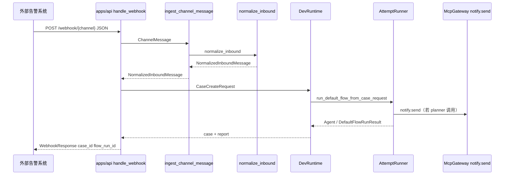
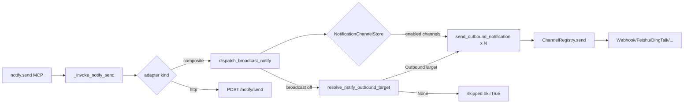

# 渠道路由（Channel Routing）

## 1. 业务目标

渠道路由模块负责将外部告警系统与 RootSeeker 内部 Case 创建、默认排查 Flow 及出站通知打通。入站侧，HTTP Webhook 或 MCP 工具传入的原始 JSON 会被归一化为统一的 `NormalizedInboundMessage`，再组装为 `CaseCreateRequest` 触发默认排查。出站侧，`notify.send` MCP 工具默认经 **NotificationChannelStore** 读取 Admin 配置的已启用渠道并广播报告摘要；关闭全局广播或未配置渠道时，可回退到环境变量单 URL（legacy）。

成功时：入站 Webhook 返回 `case_id` 与 `flow_run_id`；Flow 末尾的 `notify.send` 向已配置渠道发出通知（或未配置时显式跳过）。失败时：JSON 解析失败降级为空 payload 继续归一化；出站 HTTP 失败返回 `ok=False` 与 `error` 字段；若配置 `ROOTSEEKER_WEBHOOK_SIGNING_SECRET` 或 `ROOTSEEKER_WEBHOOK_ALLOWLIST_IPS`，`POST /webhook/{channel}` 经 `build_channel_security_from_settings` → `ingest_channel_message` 校验，失败返回 HTTP 403。

## 2. 入口一览

| 入口类型 | 路径 / 符号 | 说明 |
| --- | --- | --- |
| HTTP | `apps/api/main.py` → `handle_webhook` | `POST /webhook/{channel}`，接收 aliyun/sls/prometheus/webhook 告警并触发默认 Flow |
| HTTP | `apps/api/main.py` → `run_default_case` | `POST /cases/run-default`，经 `webhook_payload_to_case_create` 间接复用归一化逻辑 |
| MCP 内部工具 | `mcp_servers/internal/handlers.py` → `_invoke_incident_normalize` | `incident.normalize`，内部调用 `webhook_payload_to_case_create` |
| MCP 内部工具 | `mcp_servers/internal/handlers.py` → `_invoke_notify_send` | `notify.send`，经 `InternalToolAdapter.send_notification` 出站 |
| 库 API | `rootseeker/channel_routing/inbound.py` → `ingest_channel_message` | 归一化入口，可选 `ChannelSecurity` |
| 库 API | `rootseeker/channel_routing/webhook.py` → `webhook_payload_to_case_create` | payload dict → `CaseCreateRequest` |
| 库 API | `rootseeker/channel_routing/notify_dispatch.py` → `dispatch_broadcast_notify` | `notify.send` 出站广播（读 NotificationChannelStore + 生产适配器） |
| 库 API | `rootseeker/channel_routing/notify_dispatch.py` → `dispatch_env_resolved_notify` | legacy 单渠道（读环境变量 URL） |
| 库 API | `rootseeker/channel_routing/notify_config.py` → `list_enabled_outbound_targets` | Store 记录 → `OutboundTarget` 列表 |
| Admin API | `apps/admin/main.py` → `/api/notification-channels` | 通知渠道 CRUD / 测试（[18-apps-api-admin-cli.md](./18-apps-api-admin-cli.md)） |
| Bootstrap | `rootseeker/bootstrap/runtime.py` → `run_default_flow_from_payload` | CLI/回放等路径，payload → `webhook_payload_to_case_create` → 默认 Flow |
| Agent | `rootseeker/agent_runtime/runtime.py` → `run_payload` / `run_payload_detailed` | Agent 运行入口，同样经 `webhook_payload_to_case_create` |

## 3. 主调用链（逐步）

### 3.1 入站：POST /webhook/{channel} → 默认 Flow

1. `apps/api/main.py` → `handle_webhook`
   - 入：路径参数 `channel`（`webhook` / `aliyun` / `sls` / `prometheus`）；请求体 JSON；`Request.headers`；`request.client.host`
   - 出：解析 JSON（失败则 `{}`）；写入 `payload["_channel"] = channel`
   - 下一步：`ChannelMessage` 构造

2. `apps/api/main.py` → `handle_webhook`（构造消息）
   - 入：`channel`、`payload`、headers、`remote_ip`
   - 出：`ChannelMessage(channel=channel, payload=..., headers=..., remote_ip=...)`
   - 下一步：`ingest_channel_message`

3. `rootseeker/channel_routing/inbound.py` → `ingest_channel_message`
   - 入：`ChannelMessage`；可选 `security: ChannelSecurity`
   - 出：`NormalizedInboundMessage`（API 路径**未传入** `security`，跳过校验）
   - 下一步：`normalize_inbound`

4. `rootseeker/channel_routing/normalizer.py` → `normalize_inbound`
   - 入：`ChannelMessage.channel` 与 `payload`
   - 分支：
     - `aliyun` → `normalize_aliyun_alert`
     - `sls` → `normalize_sls_alert`
     - `prometheus` → `normalize_prometheus_alert`
     - 其他（含 `webhook`）→ 通用字段映射 + `resolve_service_name`
   - 出：`NormalizedInboundMessage`（含 `title`、`symptom`、`service_name`、`tenant`、`environment`、`severity`、`team`、`trace_id`、`metadata`）
   - 下一步：`handle_webhook` 内联组装 `CaseCreateRequest`

5. `apps/api/main.py` → `handle_webhook`（组装 Case）
   - 入：`normalized.*`
   - 出：`CaseCreateRequest(title, symptom, service_name, source=channel, metadata=...)`
   - metadata 合并规则：`trace_id` 写入 metadata；`tenant` / `environment` / `severity` / `team` 经 `setdefault` 补齐
   - 下一步：`DevRuntime.run_default_flow_from_case_request`

6. `rootseeker/bootstrap/runtime.py` → `run_default_flow_from_case_request`
   - 入：`CaseCreateRequest`
   - 出：`DefaultFlowRunResult`（case / evidence_pack / report）
   - 副作用：写入 `case_store`、`evidence_store`、`report_store`
   - 下一步：`run_agent_from_case_request` → `AttemptRunner`

7. `rootseeker/agent_runtime/attempt_runner.py` → `AttemptRunner.run_once`
   - 入：case_request + playbook + gateway
   - 出：完整排查结果（planner 可能调用 `notify.send`，见 §3.3）
   - 下一步：`handle_webhook` 保存 checkpoint 并返回 `WebhookResponse`

8. `apps/api/main.py` → `handle_webhook`（收尾）
   - 入：`result.case`、`build_execution_trace(...)`
   - 出：`WebhookResponse(ok=True, case_id=..., flow_run_id=trace.execution_id, message=...)`
   - 副作用：`flow_runtime.checkpoints.save(...)`

### 3.2 入站：payload dict → CaseCreateRequest（复用路径）

1. `rootseeker/channel_routing/webhook.py` → `webhook_payload_to_case_create`
   - 入：`payload: dict`；`source = payload.get("source") or "webhook"`
   - 出：`CaseCreateRequest`
   - 中间：`ingest_channel_message(ChannelMessage(channel=source, payload=payload))`
   - 消费方：`run_default_flow_from_payload`、`incident.normalize`、Agent `run_payload` 等

与 `handle_webhook` 的差异：`handle_webhook` 用路径参数 `channel` 作为 `ChannelMessage.channel` 与 `CaseCreateRequest.source`；`webhook_payload_to_case_create` 用 payload 内 `source` 字段（默认 `"webhook"`）作为 channel。

### 3.3 出站：notify.send → 渠道适配器

1. `skills/builtin/default-log-triage/SKILL.md`（playbook 正文约定报告后再 `notify.send`）
   - 入：Agent playbook 上下文；引擎不强制 `defer_until`
   - 出：若 planner 调用 `notify.send`（绑定 helper `notify-send`）

2. `rootseeker/skill_runtime/rule_step_argument_resolver.py` → `build_notify_args`
   - 入：`CaseCreateRequest`、`CaseReport`
   - 出：`{"channel": metadata.notify_channel 或 "webhook", "message": "[service] title | root_cause=... | evidence=N"}`

3. `rootseeker/mcp_plane` → `McpGateway.invoke`（工具名 `notify.send`）
   - 入：`channel`、`message`（schema 见 `mcp_servers/internal/tool_schemas.py`）
   - 下一步：`mcp_servers/internal/handlers.py` → `_invoke_notify_send`

4. `mcp_servers/internal/handlers.py` → `_invoke_notify_send`
   - 入：`args["channel"]`（默认 `"webhook"`）、`args["message"]`
   - 出：`adapter.send_notification(channel, message)`
   - 下一步：取决于 `InternalToolAdapter` 实现

5a. **默认 composite 适配器**（`rootseeker/config/internal_adapter.py` → `CompositeProductionAdapter`）

- `mcp_servers/external/composite_adapter.py` → `send_notification`
  - 出：调用 `dispatch_broadcast_notify(message, channel=...)`

5b. **HTTP 内部适配器**（`ROOTSEEKER_INTERNAL_ADAPTER_KIND=http`）

- `mcp_servers/internal/adapters.py` → `HttpInternalToolAdapter.send_notification`
  - 出：`POST {base_url}/notify/send`（该路由由外部 internal HTTP 服务实现，**未在 `apps/api` 中找到**）

6. `rootseeker/channel_routing/notify_dispatch.py` → `dispatch_broadcast_notify`
   - 入：`message`；可选 legacy `channel`（广播关闭时）
   - 出：加载 `build_notification_channel_store(repo_root)` + `broadcast_enabled`
   - 分支：
     - `broadcast_enabled=false` → `dispatch_env_resolved_notify(channel, message)`（legacy）
     - 无启用渠道 → `ok=True, metadata.skipped=True`
     - 否则 → 对每个启用渠道 fan-out
   - 下一步：`list_enabled_outbound_targets` → `send_outbound_notification`

7. `rootseeker/channel_routing/notify_config.py` → `list_enabled_outbound_targets`
   - 入：`NotificationChannelStore`
   - 出：`list[OutboundTarget]`（`channel_type` → `channel`，`endpoint_url` → `endpoint`，`team` 固定 `"default"`）

8. `rootseeker/channel_routing/notify_dispatch.py` → `dispatch_env_resolved_notify`（legacy）
   - 入：`channel`、`message`
   - 出：若 URL 未配置 → `ok=True, metadata.skipped=True`；否则继续发送
   - 下一步：`resolve_notify_outbound_target` → `send_outbound_notification`

9. `rootseeker/channel_routing/notify_env.py` → `resolve_notify_outbound_target`
   - 入：渠道名（如 `webhook`、`feishu`、`wechat_work`）
   - 解析顺序：渠道专属 `ROOTSEEKER_NOTIFY_*` → legacy 变量（如 `FEISHU_WEBHOOK_URL`）→ `ROOTSEEKER_NOTIFY_DEFAULT_URL`
   - 出：`OutboundTarget` 或 `None`

10. `rootseeker/channel_routing/outbound.py` → `send_outbound_notification`
   - 入：`OutboundTarget`、`message`；registry 默认 `get_production_channel_registry()`
   - 出：`dict`（`ok`、`channel`、`message`、`error`、`metadata`）
   - 下一步：`ChannelRegistry.send`（定义于 `adapter.py`）

11. `rootseeker/channel_routing/adapter.py` → `ChannelRegistry.send`
   - 入：`target.channel` 查找已注册 `ChannelAdapter`
   - 出：`SendResult`；无适配器时 `ok=False, error="no adapter registered for channel: ..."`
   - 下一步：具体 `*ChannelAdapter.send`

12. `rootseeker/channel_routing/adapters.py` → 各适配器 `send`
    - 经 `httpx.Client.post` 向 `target.endpoint` 发送渠道特定 JSON
    - 成功判定因渠道而异（如 Feishu `code==0`、Slack 响应 `"ok"`、Discord HTTP 200/204）

### 3.4 辅助模块（当前未接入 Webhook 主链）

以下函数已导出并在单元测试中验证，**生产 Webhook / 默认 Flow 主路径未调用**：

| 函数 | 文件 | 作用 |
| --- | --- | --- |
| `build_session_key` | `session_key.py` | 对 `tenant\|environment\|service_name\|severity\|[team]\|[trace_id]` 做 SHA-256，用于会话去重键 |
| `resolve_route` | `router.py` | 由 severity 推导 `priority`（`critical`/`error`/`sev1` → `high`）与 labels |
| `resolve_outbound_target` | `target_resolver.py` | 由 `ResolvedRoute` 解析出站 endpoint（含模板占位符；无配置时使用 example.com 占位 URL） |

## 4. 关键数据结构

### 入站

- `ChannelMessage` — `rootseeker/channel_routing/models.py`
  - `channel`：渠道标识（路径参数或 payload.source）
  - `payload`：原始 JSON
  - `headers`：HTTP 头（供签名校验）
  - `remote_ip`：客户端 IP（供 IP 白名单）
  - 填充：`handle_webhook` / `webhook_payload_to_case_create`
  - 消费：`ingest_channel_message` → `normalize_inbound`

- `NormalizedInboundMessage` — `rootseeker/channel_routing/models.py`
  - 统一字段：`channel`、`tenant`、`environment`、`service_name`、`severity`、`team`、`title`、`symptom`、`trace_id`、`metadata`
  - 填充：各 `normalize_*` 函数
  - 消费：`CaseCreateRequest` 组装、`build_session_key`、`resolve_route`

- `CaseCreateRequest` — `rootseeker/contracts/case.py`
  - `title`、`symptom`、`service_name`、`source`、`metadata`
  - 填充：`handle_webhook` / `webhook_payload_to_case_create`
  - 消费：`run_default_flow_from_case_request`、`AttemptRunner`

### 路由 / 出站

- `ResolvedRoute` — `rootseeker/channel_routing/models.py`
  - `channel`、`tenant`、`team`、`priority`、`labels`
  - 填充：`resolve_route`
  - 消费：`resolve_outbound_target`

- `OutboundTarget` — `rootseeker/channel_routing/models.py`
  - `channel`、`endpoint`（HTTPS URL）、`team`、`metadata`
  - 填充：`list_enabled_outbound_targets`（广播主路径）、`resolve_notify_outbound_target`（legacy env）、或 `resolve_outbound_target`（测试/预留）
  - 消费：各 `ChannelAdapter.send`

- 通知渠道记录 — `rootseeker/storage/notification_channels.py`（Admin CRUD + 广播读取）
  - `channel_id`、`name`、`channel_type`、`endpoint_url`、`secret`、`enabled`、`sort_order`、`metadata`
  - 持久化：跟随 `ROOTSEEKER_STORAGE_BACKEND`（见 [16-storage.md](./16-storage.md) §3.4.1）
  - 消费：Admin UI / `dispatch_broadcast_notify`

- `SendResult` — `rootseeker/channel_routing/adapter.py`
  - `ok`、`channel`、`message`、`error`、`metadata`
  - 消费：`send_outbound_notification` 转为 dict 返回 MCP

### 入站渠道字段映射摘要

| 渠道 | 关键 payload 字段 | service_name 来源 | title / symptom 模式 |
| --- | --- | --- | --- |
| `webhook`（默认） | `title`/`alert_name`、`message`/`description`、`service_name`/`service` | `resolve_service_name(...)` | 直接映射 |
| `aliyun` | `alertName`、`alertState`、`curValue`、`instanceName`、`metricName` | `instanceName` | `[Aliyun] {alertName}` / metric 描述 |
| `sls` | `alertName`、`project`、`logstore`、`count`、`message` | `project` | `[SLS] {alertName}` / 匹配数描述 |
| `prometheus` | `alerts[0].labels/annotations`、`status` | `labels.service` 或 `job` | `[Prometheus] {alertname}` / summary |

未映射字段进入 `metadata`（各渠道有 `_RESERVED_KEYS` 过滤）。

### 出站适配器清单（`get_production_channel_registry`）

| channel 名 | 适配器类 | 说明 |
| --- | --- | --- |
| `webhook` | `WebhookChannelAdapter` | 通用 JSON POST |
| `feishu` | `FeishuChannelAdapter` | 飞书机器人 Webhook |
| `dingtalk` | `DingTalkChannelAdapter` | 钉钉机器人 Webhook |
| `wechat_work` | `WeChatWorkAdapter` | 企业微信机器人 Webhook |
| `slack` | `SlackChannelAdapter` | Slack Incoming Webhook |
| `discord` | `DiscordChannelAdapter` | Discord Webhook |

`notify_env.py` 另映射 `wechat` → `ROOTSEEKER_NOTIFY_WECHAT_URL`，但生产 registry **未注册** `wechat` 适配器；notify 应使用 `wechat_work` 渠道名。

`RecordingChannelAdapter` 仅用于测试，不在默认 registry 中。

## 5. 状态与副作用

### Case / Flow 状态

- 入站 Webhook 成功后 Case 经默认 Flow 执行至 `CaseStatus.COMPLETED`（与 `/cases/run-default` 相同路径）。
- Flow 最后一步 `notify` 在报告生成后执行（`defer_until: after_report`）。

### Store 写入

| Store | 触发位置 | 内容 |
| --- | --- | --- |
| `case_store` | `run_default_flow_from_case_request` | 完整 Case 含 steps |
| `evidence_store` | 同上 | `EvidencePack` |
| `report_store` | 同上 | `CaseReport`（供 `build_notify_args` 读取根因） |
| `flow_runtime.checkpoints` | `handle_webhook` | execution trace + step 快照 |

### 对外 I/O

- **入站**：外部告警系统 → HTTP POST `/webhook/{channel}`
- **出站 notify.send**：HTTPS POST 至 Admin 配置的各渠道 Webhook URL（广播）；legacy 模式仍可读环境变量
- **无配置降级**：无启用渠道或 legacy URL 未配置时 `metadata.skipped=True`，工具调用仍 `ok=True`

## 6. 分支与错误

| 条件 | 代码位置 | 行为 |
| --- | --- | --- |
| Webhook JSON 解析失败 | `apps/api/main.py` → `handle_webhook` | `payload = {}`，仍继续归一化（可能得到默认 title/symptom） |
| 未知入站 channel | `normalizer.py` → `normalize_inbound` | 走通用 webhook 分支（不按渠道名 fail-fast） |
| Prometheus 空 alerts | `normalize_prometheus_alert` | 返回占位 `NormalizedInboundMessage`（symptom="No alert details provided"） |
| IP 不在白名单 | `security.py` → `ChannelSecurity.validate` | `ValueError("source ip is not allowed")` |
| HMAC 签名不匹配 | `security.py` → `ChannelSecurity.validate` | `ValueError("invalid signature")`；签名算法：`HMAC-SHA256(secret, str(sorted(payload.items())))`，头 `x-signature` |
| API Webhook 未启用安全 | `handle_webhook` | **未传入** `ChannelSecurity`，上述两项校验不生效 |
| 全局广播开启但无启用渠道 | `notify_dispatch.py` → `dispatch_broadcast_notify` | `ok=True`，`metadata.skipped=True`，不发起 HTTP |
| 全局广播关闭且 legacy URL 未配置 | `notify_dispatch.py` → `dispatch_env_resolved_notify` | `ok=True`，`metadata.skipped=True`，不发起 HTTP |
| 广播部分渠道失败 | `dispatch_broadcast_notify` | `ok=False`（或 partial），`results[]` 含各渠道 error；其余渠道仍发送 |
| 出站渠道无适配器 | `adapter.py` → `ChannelRegistry.send` | `ok=False`，`error="no adapter registered for channel: ..."` |
| 出站 HTTP 非 2xx / 超时 | 各 `*ChannelAdapter.send` | `ok=False`，`error` 含 HTTP 状态或异常信息 |
| 默认 Flow 插件缺失 | `default_log_triage_flow/runner.py` → `_validate_default_flow_registration` | `ValueError` |

## 7. 相关测试

| 测试文件 | 覆盖点 |
| --- | --- |
| `tests/unit/channel_routing/test_channel_routing.py` | `webhook_payload_to_case_create` metadata；`ingest_channel_message` + `resolve_route` + `build_session_key` + 出站；`ChannelSecurity` IP/签名 |
| `tests/unit/channel_routing/test_channel_adapters.py` | 各出站适配器与 `ChannelRegistry.send`；`send_outbound_notification` 默认 registry |
| `tests/unit/channel_routing/test_notify_env.py` | `resolve_notify_outbound_target` 环境变量优先级与 skip 条件 |
| `tests/unit/channel_routing/test_notify_broadcast.py` | `dispatch_broadcast_notify` fan-out / skip / legacy 回退 |
| `tests/unit/storage/test_notification_channel_store.py` | NotificationChannelStore CRUD（file/sqlite） |
| `tests/integration/test_api_default_flow.py` | `POST /webhook/webhook\|aliyun\|sls\|prometheus` 端到端返回 `case_id` |
| `tests/integration/test_default_flow.py` | 默认 Flow 闭环含 `notify.send` 工具调用 |
| `tests/unit/mcp_plane/test_all_internal_tools.py` | Gateway 调用 `notify.send`（含 feishu 渠道） |
| `tests/unit/mcp_plane/test_http_adapter_all_routes.py` | HTTP 适配器 `notify.send` → `/notify/send` 路由映射 |

## 8. 与其他文档的关系

| 相关文档 | 关系 |
| --- | --- |
| [03-default-triage-flow.md](./03-default-triage-flow.md) | Webhook 入站后的默认排查 Flow、步骤顺序及 `notify` 步骤时机 |
| [05-skill-runtime-flow-executor.md](./05-skill-runtime-flow-executor.md) | `defer_until: after_report`、`build_notify_args` 与步骤参数解析 |
| [07-mcp-plane.md](./07-mcp-plane.md) | `notify.send` / `incident.normalize` 工具注册、Gateway 策略与适配器选择 |
| [01-bootstrap-wiring.md](./01-bootstrap-wiring.md) | `create_dev_runtime`、`CompositeProductionAdapter` 与 Store 装配 |
| [18-apps-api-admin-cli.md](./18-apps-api-admin-cli.md) | `apps/api/main.py` 全部 HTTP 入口（含 `/webhook/{channel}`） |
| [02-contracts-state-machines.md](./02-contracts-state-machines.md) | `CaseCreateRequest`、`CaseRecord` 状态与字段契约 |
| [16-storage.md](./16-storage.md) | NotificationChannelStore 子后端（跟随 `storage_backend`） |
| [19-observability-infra.md](./19-observability-infra.md) | 环境变量、网络与运行时配置（legacy `ROOTSEEKER_NOTIFY_*`） |
