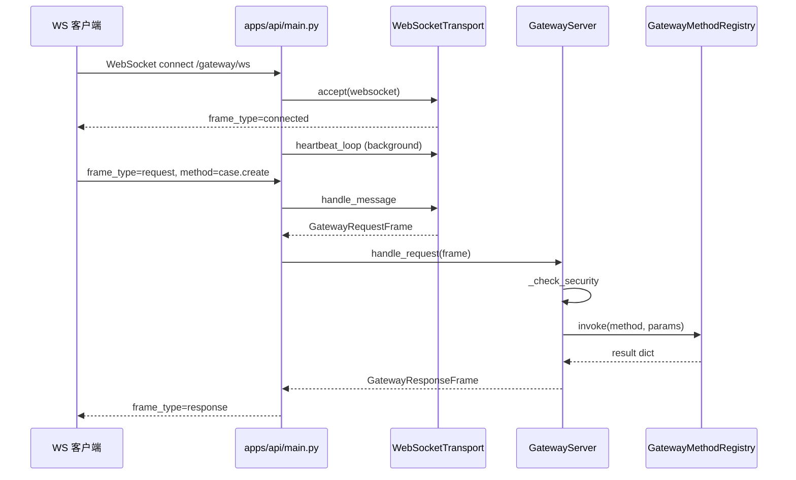
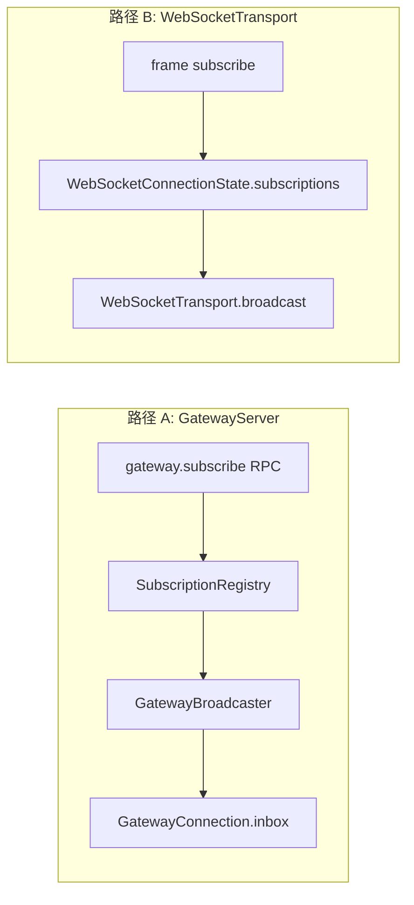

# Gateway 控制面

## 1. 业务目标

Gateway 控制面为 RootSeeker V2 提供统一的 **RPC + 事件订阅** 协议：客户端通过 JSON 帧调用 `case.*`、`flow.*`、`skill.*`、`tool.*`、`approval.*` 等业务方法，或通过 topic 订阅 Case/Agent 等运行时事件。HTTP 侧由 `GatewayServer.handle_http_request` 解析 dict 载荷；生产入口为 FastAPI **`WebSocket /gateway/ws`**，经 `WebSocketTransport` 收发帧后委派 `GatewayServer.handle_request`。

**谁触发：** 外部控制台、CLI、集成测试、或任意 WebSocket 客户端连接 `/gateway/ws` 并发送 `frame_type=request` 帧。

**成功时产出：** `GatewayResponseFrame`（`ok=True` + `result` 字典）；订阅方 inbox 或 WS 推送收到 `GatewayEventFrame`；业务方法返回 case_id、flow_run_id、工具 content 等结构化结果。

**失败时落到：** `GatewayResponseFrame`（`ok=False` + `error.code/message`）；`build_gateway_server` 按 `ROOTSEEKER_GATEWAY_AUTH_*` / `ROOTSEEKER_GATEWAY_RATE_LIMIT_*` 注入鉴权与限流（默认关闭）；未授权返回 `unauthorized` / `forbidden`；速率超限返回 `rate_limited`。

## 2. 入口一览

| 入口类型 | 路径 / 符号 | 说明 |
| --- | --- | --- |
| WebSocket | `apps/api/main.py` → `gateway_websocket` | 生产入口 `/gateway/ws`；`WebSocketTransport.accept` + `handle_message` → `GatewayServer.handle_request` |
| HTTP（程序内） | `rootseeker/gateway/server.py` → `handle_http_request` | 将 dict 校验为 `GatewayRequestFrame` 并调用 `handle_request`；**未在 `apps/api` 暴露 REST 路由**，单测与进程内调用使用 |
| 连接列表 | `apps/api/main.py` → `GET /gateway/connections` | 列出 `WebSocketTransport` 活跃连接 |
| 服务构造 | `rootseeker/gateway/server.py` → `GatewayServer.__init__` | 装配 registry、broadcaster、subscriptions；传入 `DevRuntime` 时注册业务方法 |
| 方法注册 | `rootseeker/gateway/methods/__init__.py` → `register_all_business_methods` | 批量注册 case/flow/skill/tool/approval |
| 传输抽象 | `rootseeker/gateway/transport.py` → `GatewayTransport` | WS/SSE 等传输层接口；当前实现为 `WebSocketTransport` |
| Bootstrap | `rootseeker/bootstrap/runtime.py` → `create_dev_runtime` | `GatewayServer(runtime)` 依赖的 Store、McpGateway、ApprovalStore 等 |

## 3. 主调用链（逐步）

### 3.1 协议帧类型与分发

`rootseeker/gateway/protocol.py` 定义 `GatewayFrameType`：

| 帧类型 | 用途 | 主要处理位置 |
| --- | --- | --- |
| `request` | RPC 请求 | `GatewayServer.handle_request` / WS `handle_message` |
| `response` | RPC 响应 | `handle_request` 返回；WS 回写客户端 |
| `event` | 广播事件 | `GatewayBroadcaster.broadcast` / `WebSocketTransport.broadcast` |
| `connected` | 连接建立 | `apps/api/main.py` 握手后发送 |
| `ping` / `pong` | 心跳 | `WebSocketTransport.handle_message` / `heartbeat_loop` |
| `subscribe` / `subscribed` | WS 层订阅 | `WebSocketTransport.handle_message` |
| `unsubscribe` / `unsubscribed` | WS 层退订 | `WebSocketTransport.handle_message` |

**请求 dispatch 核心路径：**

1. `rootseeker/gateway/server.py` → `handle_http_request(payload)` 或 WS 收到 JSON
   - 入：`dict` 或已解析的 `GatewayRequestFrame`
   - 出：`GatewayResponseFrame.model_dump`
   - 下一步：`handle_request`

2. `rootseeker/gateway/server.py` → `handle_request(frame)`
   - 入：`GatewayRequestFrame`（`request_id`、`method`、`params`、`client_id?`）
   - **步骤 2a**：`_check_security(frame)` — 可选 rate limit + auth + authorize
   - **步骤 2b**：`GatewayMethodRegistry.invoke(method, params)`
   - 出：`GatewayResponseFrame(ok=True, result=...)` 或 `_error_response`
   - 下一步：各 `methods/*` 处理器

3. `rootseeker/gateway/method_registry.py` → `invoke(method, params)`
   - 缺失 handler → `GatewayMethodNotFoundError`（`code=method_not_found`）
   - 有 handler → `handler(dict(params))` → `dict`

### 3.2 WebSocket `/gateway/ws` 生命周期

1. `apps/api/main.py` → `gateway_websocket(websocket)`
   - 创建 `WebSocketTransport`、`build_gateway_server(runtime)`、`GatewayWsBridge`
   - `runtime.event_bus.subscribe("case.completed", …)` 转发 WS 广播
   - 下一步：`ws_transport.accept(websocket)` → `gateway_ws_bridge.ensure_client`

2. `rootseeker/gateway/websocket_transport.py` → `accept`
   - 入：`WebSocket`
   - 出：`TransportConnection`（`connection_id = ws-*`）
   - 注册 `_connections[connection_id]`

3. `apps/api/main.py` 发送握手帧
   - `{"frame_type": "connected", "connection_id": "<id>"}`

4. 启动后台任务 `asyncio.create_task(ws_transport.heartbeat_loop(connection_id))`
   - 默认每 30s 发送 `{"frame_type": "ping", "timestamp": ...}`

5. 接收循环：`websocket.receive_json()` → `ws_transport.handle_message(connection_id, data)`
   - `ping` → 回复 `pong`，更新 `last_ping_at`
   - `pong` → 更新 `last_pong_at`
   - `subscribe` / `unsubscribe` → 经 `GatewayWsBridge` 同步 **传输层** 与 `SubscriptionRegistry`（支持 `case.*` 通配）
   - `request` → 校验为 `GatewayRequestFrame`，注入 `client_id` → 返回 frame 供上层处理

6. 若 `handle_message` 返回 `GatewayRequestFrame` → `gateway_server.handle_request(frame)` → `websocket.send_json(response)`

7. `finally`：取消 heartbeat 任务 → `ws_transport.close(connection_id, reason="disconnect")`

### 3.3 业务方法示例：`case.create` → 默认 Flow

1. `rootseeker/gateway/methods/case_methods.py` → `case_create(params)`
   - 入：`title`、`symptom`、`service_name`、`source`（默认 `"gateway"`）、`metadata`
   - 构造 `CaseCreateRequest`
   - 下一步：`runtime.run_default_flow_from_case_request(req)`

2. `rootseeker/bootstrap/runtime.py` → `run_default_flow_from_case_request`
   - 执行默认 triage flow，写 case/evidence/report store
   - 详见 [03-default-triage-flow.md](./03-default-triage-flow.md)

3. 返回 `{"case_id", "status", "evidence_count"}`

### 3.4 业务方法示例：`tool.invoke` → MCP 平面

1. `rootseeker/gateway/methods/tool_methods.py` → `tool_invoke(params)`
   - 构造 `ToolCallRequest`（默认 `case_id=gateway-case`、`step_id=gateway-step`）
   - 下一步：`runtime.gateway.invoke(req, plugin_id="gateway", actor="gateway-method")`

2. `rootseeker/mcp_plane/gateway.py` → `McpGateway.invoke`
   - PolicyGuard 可能抛出审批要求
   - 详见 [07-mcp-plane.md](./07-mcp-plane.md)

3. 返回 `{"ok", "tool_name", "content", "error"}`

### 3.5 订阅与广播（两套路径）

**路径 A — GatewayServer 内存 inbox（RPC 方法驱动）：**

1. 客户端须先 `GatewayServer.connect()` 获得 `client_id`（**当前 `/gateway/ws` 未调用 `connect`**，此路径主要用于单测与进程内集成）
2. `gateway.subscribe` → `_method_subscribe` → `SubscriptionRegistry.subscribe` + 更新 `GatewayConnection.subscriptions`
3. `gateway.publish` 或 `GatewayServer.publish(topic, payload)` → `GatewayBroadcaster.broadcast`
4. `GatewayBroadcaster`：`InMemoryEventSink.publish` + 按 `SubscriptionRegistry.resolve_clients`（支持 `case.*` 前缀通配）投递到 `connection.inbox`
5. 客户端 `poll_events(client_id)` 拉取 inbox

**路径 B — WebSocketTransport 传输层订阅：**

1. 客户端发送 `{"frame_type": "subscribe", "topic": "case.xxx"}`
2. `WebSocketTransport.subscribe` 写入 `WebSocketConnectionState.subscriptions`
3. `WebSocketTransport.broadcast(topic, event)` 向匹配连接 `send_json(event)`
4. **与路径 A 的 `SubscriptionRegistry` 未在 `main.py` 中桥接**；WS 业务 RPC 与 WS 帧级订阅各自独立

### 3.6 Gateway 方法一览

| 方法名 | 实现文件 | 函数 | 下游 |
| --- | --- | --- | --- |
| **system** | | | |
| `system.ping` | `rootseeker/gateway/server.py` | `_register_builtin_methods` 内 lambda | 返回 `{"pong": true}` |
| `system.list_methods` | `rootseeker/gateway/server.py` | `_register_builtin_methods` 内 lambda | `methods.list_methods()` |
| **gateway** | | | |
| `gateway.subscribe` | `rootseeker/gateway/server.py` | `_method_subscribe` | `SubscriptionRegistry.subscribe` |
| `gateway.unsubscribe` | `rootseeker/gateway/server.py` | `_method_unsubscribe` | `SubscriptionRegistry.unsubscribe` |
| `gateway.publish` | `rootseeker/gateway/server.py` | `_method_publish` | `GatewayServer.publish` → `GatewayBroadcaster` |
| **case** | | | |
| `case.create` | `rootseeker/gateway/methods/case_methods.py` | `case_create` | `DevRuntime.run_default_flow_from_case_request` |
| `case.get` | `rootseeker/gateway/methods/case_methods.py` | `case_get` | `runtime.case_store.get` |
| `case.list` | `rootseeker/gateway/methods/case_methods.py` | `case_list` | `runtime.case_store.list_all` |
| `case.resume` | `rootseeker/gateway/methods/case_methods.py` | `case_resume` | `FlowRuntime.resume_default` |
| **flow** | | | |
| `flow.run` | `rootseeker/gateway/methods/flow_methods.py` | `flow_run` | `FlowRuntime.run_default` |
| `flow.resume` | `rootseeker/gateway/methods/flow_methods.py` | `flow_resume` | `FlowRuntime.resume_default` |
| `flow.step` | `rootseeker/gateway/methods/flow_methods.py` | `flow_step` | `FlowExecutor.execute_from_checkpoint` |
| `flow.checkpoints` | `rootseeker/gateway/methods/flow_methods.py` | `flow_checkpoints` | `FlowRuntime.list_checkpoints` |
| **skill** | | | |
| `skill.list` | `rootseeker/gateway/methods/skill_methods.py` | `skill_list` | `runtime.skill_registry.list_skills` |
| `skill.get` | `rootseeker/gateway/methods/skill_methods.py` | `skill_get` | `runtime.skill_registry.get` |
| **tool** | | | |
| `tool.invoke` | `rootseeker/gateway/methods/tool_methods.py` | `tool_invoke` | `runtime.gateway.invoke`（McpGateway） |
| `tool.list` | `rootseeker/gateway/methods/tool_methods.py` | `tool_list` | `runtime.tool_registry.list_specs` |
| **approval** | | | |
| `approval.list` | `rootseeker/gateway/methods/approval_methods.py` | `approval_list` | `runtime.approval_store.list` |
| `approval.get` | `rootseeker/gateway/methods/approval_methods.py` | `approval_get` | `runtime.approval_store.get` |
| `approval.approve` | `rootseeker/gateway/methods/approval_methods.py` | `approval_approve` | `runtime.approval_store.approve` |
| `approval.reject` | `rootseeker/gateway/methods/approval_methods.py` | `approval_reject` | `runtime.approval_store.reject` |

### 3.7 鉴权 / 授权 / 速率限制（可选注入）

`GatewayServer.__init__` 接受三个可选依赖，**均未在 `apps/api/main.py` 传入**：

| 组件 | 文件 | 行为 |
| --- | --- | --- |
| `AuthProvider` | `rootseeker/gateway/auth.py` | `_check_security` 从 `params.token` 取 token → `authenticate` → `validate`；失败 `code=unauthorized` |
| `Authorizer` | `rootseeker/gateway/authorizer.py` | `authorize(credentials, method)` 按 `DEFAULT_METHOD_CAPABILITIES` 校验 capability；admin 绕过；失败 `code=forbidden` |
| `RateLimiter` | `rootseeker/gateway/authorizer.py` | 令牌桶 per `client_id`（默认 60 req/min，burst 10）；失败 `code=rate_limited` |

`_check_security` 逻辑（`server.py` L77–93）：

- `client_id = frame.client_id or "anonymous"`
- 若 `_auth_provider is None` → **跳过全部鉴权**（当前 API 默认行为）
- 否则必须 `params.token` 有效且 `Authorizer` 通过

`TokenAuthProvider` 支持内存 token、`create_signed_token` / `verify_signed_token`（HMAC + 时效）。

## 4. 关键数据结构

| 类型 | 定义文件 | 字段 / 含义 | 谁填充 | 谁消费 |
| --- | --- | --- | --- | --- |
| `GatewayRequestFrame` | `rootseeker/gateway/protocol.py` | `request_id`、`method`、`params`、`client_id?`、`protocol_version` | 客户端 / WS `handle_message` | `handle_request` |
| `GatewayResponseFrame` | `rootseeker/gateway/protocol.py` | `request_id`、`ok`、`result`、`error?` | `handle_request` | 客户端 |
| `GatewayEventFrame` | `rootseeker/gateway/protocol.py` | `event_id`、`topic`、`payload`、`created_at` | `publish` / broadcaster | 订阅方 inbox 或 WS push |
| `GatewayConnection` | `rootseeker/gateway/connection.py` | `client_id`、`capabilities`、`subscriptions`、`inbox` | `GatewayServer.connect` | broadcaster、subscribe RPC |
| `WebSocketConnectionState` | `rootseeker/gateway/websocket_transport.py` | `connection_id`、`subscriptions`、`last_ping_at`、`last_pong_at` | `accept` | WS subscribe/broadcast/heartbeat |
| `BroadcastResult` | `rootseeker/gateway/broadcaster.py` | `topic`、`delivered_count`、`dropped_clients` | `GatewayBroadcaster.broadcast` | `publish` 返回值 |
| `CaseCreateRequest` | `rootseeker/contracts/case.py` | case/flow 方法共用入参 | `case_*` / `flow_*` handlers | bootstrap / FlowRuntime |
| `ToolCallRequest` | `rootseeker/contracts/tool.py` | `tool.invoke` 入参 | `tool_invoke` | `McpGateway.invoke` |
| `AuthCredentials` | `rootseeker/gateway/auth.py` | `client_id`、`token`、`capabilities`、`expires_at` | `AuthProvider` | `Authorizer` |

`topic_matches(pattern, topic)`（`subscriptions.py`）：精确匹配或 `pattern.endswith(".*")` 前缀匹配。

## 5. 状态与副作用

### 连接生命周期

| 阶段 | 位置 | 行为 |
| --- | --- | --- |
| 建立 | `WebSocketTransport.accept` | 分配 `ws-*` connection_id，可选映射 `client_id` |
| 握手 | `apps/api/main.py` | 发送 `connected` 帧 |
| 活跃 | 接收循环 + heartbeat | ping/pong；RPC request/response |
| 断开 | `WebSocketTransport.close` / `GatewayServer.disconnect` | WS 关闭；传输层清理 `_connections`；`disconnect` 还调用 `SubscriptionRegistry.remove_client` |

`WebSocketTransport` 构造参数：`heartbeat_interval_seconds=30`、`connection_timeout_seconds=60`（**heartbeat_loop 当前仅周期发 ping，未用 timeout 主动断连**）。

### 业务副作用

| 方法 | Store / 外部 I/O |
| --- | --- |
| `case.create` | `case_store`、`evidence_store`、`report_store`（经 bootstrap） |
| `flow.run` / `flow.resume` / `flow.step` | checkpoint store、case store（经 FlowRuntime） |
| `tool.invoke` | `McpGateway` → 审计 log、可能创建 `ApprovalStore` 待审批项 |
| `approval.approve` / `reject` | `ApprovalStore` 状态变更 + 可选 webhook event_sink |
| `gateway.publish` | `InMemoryEventSink` 追加事件；订阅 client inbox（上限 200 条，超出记入 `dropped_clients`） |

`GatewayServer` 无 `runtime` 时仅注册 builtin 方法（`system.*`、`gateway.*`），不含业务方法。

## 6. 分支与错误

| 条件 | 代码位置 | 行为 |
| --- | --- | --- |
| 载荷校验失败 | `server.py` → `handle_http_request` | `GatewayValidationError` → `error.code=validation_error` |
| 未知方法 | `method_registry.py` → `invoke` | `GatewayMethodNotFoundError` → `method_not_found` |
| 速率超限 | `server.py` → `_check_security` | `GatewayError(code=rate_limited)` + retry_after 提示 |
| 未配置 AuthProvider | `server.py` → `_check_security` | **跳过鉴权**，直接 invoke |
| token 无效 / 过期 | `auth.py` → `TokenAuthProvider.authenticate` | `unauthorized` |
| capability 不足 | `authorizer.py` → `authorize` | `forbidden` |
| subscribe 缺 client_id/topic | `server.py` → `_method_subscribe` | `GatewayValidationError` |
| subscribe 未知 client_id | `server.py` → `_method_subscribe` | `GatewayValidationError` |
| inbox 满（≥200） | `broadcaster.py` → `broadcast` | 跳过投递，client_id 记入 `dropped_clients` |
| WS 帧无效 request | `websocket_transport.py` → `handle_message` | 返回 `GatewayResponseFrame(ok=False, code=invalid_frame)` |
| 写工具需审批 | `tool.invoke` → `McpGateway` | `ok=False`，error 含 `APPROVAL_REQUIRED` 与 `approval_id`；可用 `approval.approve` 后重试 |
| handler 未捕获异常 | `server.py` → `handle_request` | 包装为 `GatewayError` → `gateway_error` |

业务 handler 内部错误（如 `case_get` 缺 case_id）多在 **result 字典** 中返回 `{"error": "..."}` 而非抛出 `GatewayError`，HTTP 层仍 `ok=True`。

## 7. 相关测试

| 测试文件 | 覆盖点 |
| --- | --- |
| `tests/unit/gateway/test_gateway_server.py` | 协议帧类型；`handle_http_request` ping；method_not_found；subscribe/broadcast/unsubscribe + `poll_events` |
| `tests/unit/gateway/test_gateway_business_methods.py` | 传入 `DevRuntime` 注册业务方法；`case.create`、`flow.run/resume/step`；`tool.invoke`；审批全流程 |
| `tests/unit/gateway/test_websocket_transport.py` | `WebSocketTransport` 初始化、broadcast 空连接、handler 注册、close 安全 |
| `tests/unit/gateway/test_gateway_auth.py` | `TokenAuthProvider` HMAC 签名 token 校验与时区 |

## 8. 与其他文档的关系

| 文档 | 关系 |
| --- | --- |
| [03-default-triage-flow.md](./03-default-triage-flow.md) | `case.create` 经 `run_default_flow_from_case_request` 触发默认 triage；与 HTTP webhook 入口汇合 |
| [07-mcp-plane.md](./07-mcp-plane.md) | `tool.invoke` 转发至 `McpGateway.invoke`；PolicyGuard 审批与审计 |
| [17-approval-governance-replay.md](./17-approval-governance-replay.md) | `approval.*` 方法操作 `ApprovalStore`；与写工具审批、部署策略、回放门禁衔接（文档待编写） |
| [01-bootstrap-wiring.md](./01-bootstrap-wiring.md) | `GatewayServer(runtime)` 依赖 `create_dev_runtime` 装配的 Store 与 gateway |
| [05-skill-runtime-flow-executor.md](./05-skill-runtime-flow-executor.md) | `flow.step` / `flow.resume` 使用 `FlowExecutor` 与 checkpoint |
| [10-channel-routing.md](./10-channel-routing.md) | 通道 webhook 与 Gateway WS 为并列外部入口，均可达默认 flow |
