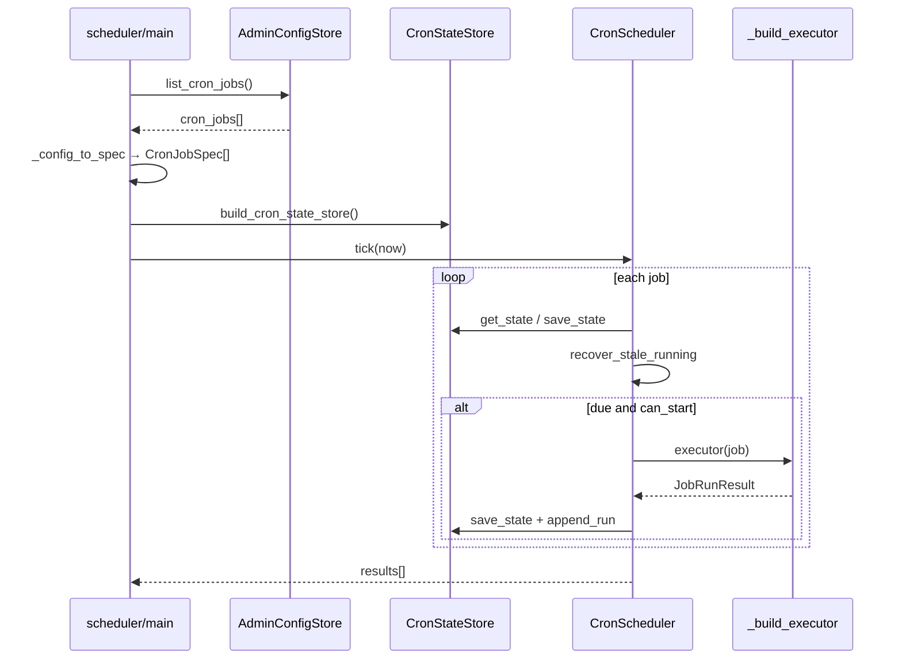

# Cron 调度

## 1. 业务目标

RootSeeker V2 需要按 cron 表达式周期性执行两类后台任务：**仓库同步**（增量或全量，并触发代码索引）与 **默认 Flow 回放评估**（经 Task Runtime 跑 replay suite，并检查 deployment quality gate）。

**谁触发：** 运维/开发者通过 `apps/scheduler/main.py` CLI 启动常驻 `run_loop`，或 Admin UI 调用 `POST /api/cron-jobs/{job_id}/run` 手动触发；任务定义持久化在 Admin 配置 `cron_jobs` 中。

**解决什么问题：** 将「何时跑、跑什么、失败如何重试、并发如何限制、状态如何持久化」从业务 handler 中剥离，形成可复用的 `CronScheduler` 内核；应用入口只负责注册 executor 与加载配置。

**成功时产出：** `JobRunResult`（`status=succeeded`）写入 cron state store 的 `runs` 历史；`CronJobState` 更新 `last_success_at`、`next_run_at`（按 schedule 计算下一窗口）。

**失败时落到哪里：** handler 返回或 executor 捕获异常 → `JobRunResult(status=failed)` + `CronJobState.last_error`；若未耗尽 `retry_policy.max_attempts` 则 `next_run_at` 设为指数退避重试时刻，否则按正常 schedule 推进；CLI `run_loop` 对整次 tick 异常另有外层重试。

---

## 2. 入口一览

| 入口类型 | 路径 / 符号 | 说明 |
| --- | --- | --- |
| CLI 单次 tick | `apps/scheduler/main.py:run_once` | 读配置 → 一次 `CronScheduler.tick`，无到期任务时 exit 1 |
| CLI 常驻循环 | `apps/scheduler/main.py:run_loop` | 每隔 `interval_seconds` 调 tick；tick 本身失败可重试 |
| CLI 主函数 | `apps/scheduler/main.py:main` | `--loop` 选 `run_loop`，否则 `run_once` |
| Admin 手动执行 | `apps/scheduler/main.py:run_job_now` | Admin `POST /api/cron-jobs/{id}/run` 后台调用 |
| Admin CRUD | `apps/admin/main.py` | `GET/POST/PUT/DELETE /api/cron-jobs`、`GET .../runs` |
| 调度内核 | `rootseeker/cron/scheduler.py:CronScheduler.tick` | 单 tick：遍历 job → due → 并发门 → 执行 → 存状态 |
| 配置加载 | `apps/scheduler/main.py:_load_jobs_from_config` | 从 `AdminConfigStore.list_cron_jobs()` 转 `CronJobSpec` |
| 状态存储工厂 | `rootseeker/cron/state_store.py:build_cron_state_store` | 按 settings 选 File JSON 或 MySQL |
| 内置 replay 辅助 | `rootseeker/cron/case_replay.py:run_scheduled_replay` | 独立 replay 入口（scheduler 主链经 TaskRuntime，不直接调此函数） |

---

## 3. 主调用链（逐步）

### 3.1 CLI 常驻循环（`run_loop`）

1. `apps/scheduler/main.py` → `run_loop`
   - 入：`interval_seconds`、`max_runs`、`retries`、`retry_delay_seconds`、CLI 覆盖的 `suite_name`/`schedule` 等
   - 出：循环调用 `_run_scheduler_tick`；有执行结果时打印；非 succeeded 打印 quality gate 提示
   - 下一步：每轮 sleep 后再次 tick

2. `apps/scheduler/main.py` → `_run_scheduler_tick`
   - 入：`repo_root`、`config_path`、CLI 参数
   - 出：`list[JobRunResult]`
   - 下一步：`build_admin_config_store` → `_load_jobs_from_config` → `build_cron_state_store` → `CronScheduler.tick`

3. `_load_jobs_from_config` → `_config_to_spec`
   - 入：Admin 中每条 `cron_jobs` dict；若列表为空则 fallback `BUILTIN_CRON_JOBS`
   - 出：`list[CronJobSpec]`
   - 特殊：`job_id == cron.default-flow-replay` 时 CLI 的 `suite_name`/`repeat_each`/`schedule`/`timezone` 可覆盖 metadata 与空 schedule
   - 下一步：构造 `CronScheduler`

4. `CronScheduler.tick`（见 3.3）→ `_build_executor` 注册的 handler

### 3.2 Admin 手动执行（`run_job_now`）

1. `apps/admin/main.py` → `POST /api/cron-jobs/{job_id}/run`
   - 入：`job_id`；若 state 为 `running` 且 `<5s` 则 fast-fail 返回 skipped
   - 出：`BackgroundTasks` 调度 `run_job_now`
   - 下一步：`run_job_now`

2. `apps/scheduler/main.py` → `run_job_now`
   - 入：`job_id`、`repo_root`、`state_path`
   - 强制 `enabled=True`；若 stuck `RUNNING`（≥5s）则清状态
   - `_mark_job_due` 将 `next_run_at=now` → 单 job `CronScheduler.tick`
   - 出：`JobRunResult`

### 3.3 单 tick 内核（`CronScheduler.tick`）

对每个 `job_id` 顺序执行：

1. `rootseeker/cron/scheduler.py` → `_state_for`
   - 入：`job`、`now`
   - 无状态时初始化：`next_run_at = parse_schedule(...).next_after(now)`，`status=IDLE`
   - 出：`CronJobState`

2. `rootseeker/cron/recovery.py` → `recover_stale_running`
   - 入：`job`、`state`、`now`
   - 若 `status=RUNNING` 且 `now - last_started_at > stale_after_seconds`（默认 900s）→ 置 `FAILED`、清零 `running_count`、`consecutive_failures += 1`
   - 出：可能变更的 `state`（尚未 persist，后续步骤会 save）

3. **enabled 检查**
   - `enabled=False` → `status=DISABLED`，`save_state`，跳过

4. **到期检查** — `_is_due`
   - 条件：`next_run_at is not None and next_run_at <= now`
   - 未到期 → `save_state`，跳过

5. **并发门** — `rootseeker/cron/concurrency.py:ConcurrencyGuard.can_start`
   - 条件：`state.running_count < job.max_concurrent_runs`（默认 1）
   - 不满足 → `save_state`，跳过（本次 tick 不执行，下次再试）

6. **执行** — `_run_job`
   - `status=RUNNING`，`mark_started`（`running_count += 1`），`save_state`
   - 调 `executor(job)`；异常包装为 `JobRunResult(FAILED)`
   - `mark_finished`，更新 counters 与时间戳
   - **成功**：`consecutive_failures=0`，`next_run_at = parse_schedule(...).next_after(finished_at)`
   - **失败且可重试**（`can_retry`）：`next_run_at = next_retry_at(...)`（指数退避）
   - **失败且不可重试**：`next_run_at` 按正常 schedule 推进
   - **SKIPPED**：`status=IDLE`，schedule 推进
   - `save_state` + `append_run(result)`

7. `apps/scheduler/main.py` → `_build_executor`（handler 分发）
   - `repo.sync_changed` → `RepoSyncService` + `repo_sync_changed_tool(..., trigger_index=True)`
   - `repo.sync_all` → `repo_sync_all_tool(..., trigger_index=True)`
   - `replay.default_flow` → `create_dev_runtime` + `TaskRuntime.submit(CRON)` + `run_once`（见 [12-task-runtime.md](./12-task-runtime.md)）



### 3.4 Admin 配置 → Scheduler 加载

1. `apps/admin/config_store.py` → `AdminConfigStore.load`
   - 首次或缺失时 `_seed_builtin_cron_jobs([])` 写入内置任务
   - 每次 load 对已有列表 merge 内置 job（handler/builtin/deletable 锁定，schedule/enabled 保留用户编辑）

2. Admin API 写配置
   - `upsert_cron_job` → `_normalize_cron_job` 校验 handler ∈ `ALLOWED_CRON_HANDLERS` → `save`
   - Scheduler 下次 tick 通过 `_load_jobs_from_config` 读取，**无热推送**；改 enabled 时 Admin `update_cron_job` 同步写 cron state store 的 `status`

3. 默认配置文件路径：`data/admin/config.json`（或 `ROOTSEEKER_ADMIN_CONFIG_PATH` / MySQL `admin_config` 表）

### 3.5 Stagger（错峰）

`rootseeker/cron/stagger.py:stable_stagger_seconds(job_id, max_offset_seconds)` 基于 `job_id` 的 SHA256 生成 `[0, max_offset_seconds]` 内稳定偏移。

**当前主链未调用此函数**（仅 `tests/unit/cron/test_scheduler.py` 单测覆盖）。tick 内的「到期」完全由 `next_run_at` 与 `_is_due` 决定，未在 schedule 计算或 tick 入口叠加 stagger 偏移。

---

## 4. 关键数据结构

### 4.1 契约模型 — `rootseeker/cron/jobs.py`

| 类型 | 字段 | 含义 / 谁填充 |
| --- | --- | --- |
| `CronJobSpec` | `job_id` | 唯一 ID；Admin 配置或内置常量 |
| | `name` | 展示名 |
| | `schedule` | cron 五段式或 `@hourly`/`@daily`/`@weekly` |
| | `timezone` | IANA 时区，默认 `UTC` |
| | `enabled` | 是否参与 tick |
| | `handler` | 执行器键：`repo.sync_changed` / `repo.sync_all` / `replay.default_flow` |
| | `max_concurrent_runs` | 并发上限，默认 1 |
| | `retry_policy` | `RetryPolicy`：见下 |
| | `stale_after_seconds` | RUNNING 超时回收阈值，默认 900 |
| | `metadata` | handler 扩展；replay 用 `suite_name`、`repeat_each` |
| `RetryPolicy` | `max_attempts` | 最大连续失败次数（含首次），默认 1 |
| | `base_delay_seconds` / `max_delay_seconds` / `backoff_multiplier` | 失败重试退避 |
| `CronJobState` | `status` | `idle`/`running`/`succeeded`/`failed`/`disabled` |
| | `next_run_at` | 下次 tick 可执行时刻 |
| | `last_started_at` / `last_finished_at` / `last_success_at` | 时间线 |
| | `last_error` | 最近错误文案 |
| | `consecutive_failures` | 连续失败计数，供 retry 判定 |
| | `running_count` | 当前占用的并发槽 |
| | `run_count` | 累计执行次数 |
| `JobRunResult` | `status` | `succeeded` / `failed` / `skipped` |
| | `attempt` | 第几次尝试 |
| | `message` / `payload` | handler 返回细节 |

### 4.2 Admin 配置项 — `apps/admin/config_store.py`

除上述逻辑字段外，Admin JSON 还有：

- `builtin` / `deletable` / `notes` — 仅 Admin 层使用，不进入 `CronJobSpec`
- `ALLOWED_CRON_HANDLERS` — 三套 handler 白名单
- `BUILTIN_CRON_JOBS` — 内置两条：
  - `cron.repo-sync-changed` → `repo.sync_changed`，默认 **enabled**
  - `cron.default-flow-replay` → `replay.default_flow`，默认 **disabled**

### 4.3 Schedule 解析 — `rootseeker/cron/schedule.py`

- `parse_schedule(expression, timezone)` → `CronSchedule`
- 支持别名：`@hourly`→`0 * * * *`，`@daily`，`@weekly`
- 解析器为**精简实现**：仅解析 **分钟 + 小时** 两域（五段式后三段不参与匹配逻辑）
- `CronSchedule.next_after(now)`：在指定时区找下一匹配分钟，返回 UTC `datetime`

---

## 5. 状态与副作用

### 5.1 Cron State Store 选型

`build_cron_state_store(repo_root, state_path=...)`（`rootseeker/cron/state_store.py`）：

| 条件 | 实现 | 持久化 |
| --- | --- | --- |
| `resolve_cron_state_store(settings) == "mysql"` | `MysqlCronStateStore` | 表 `cron_job_states`、`cron_job_runs`（JSON payload） |
| 否则 | `FileCronStateStore` | 默认 `{repo_root}/data/cron/scheduler-state.json` |

`resolve_cron_state_store`（`rootseeker/storage/backend_resolve.py`）：

- `ROOTSEEKER_CRON_STATE_STORE=mysql|file` 显式指定
- `auto`（默认）：`storage_backend==mysql` → mysql，否则 file

**注意：** cron 状态**不使用 SQLite**；与 case/evidence 等主存储的 sqlite 路径无关。

### 5.2 读写内容

- `save_state`：每个 job 一条 `CronJobState`
- `append_run`：追加 `JobRunResult` 历史（Admin `GET /api/cron-jobs/{id}/runs` 读取）

### 5.3 Handler 副作用

| Handler | 主要 I/O | 成功判定 |
| --- | --- | --- |
| `repo.sync_changed` | `RepoSyncService`：clone/pull 变更仓、Zoekt/Qdrant/GitNexus（见 [14-code-index.md](./14-code-index.md)） | `payload.ok==True` |
| `repo.sync_all` | 全量同步所有 Admin 注册仓 | `payload.ok` 且全部 `results[].success` |
| `replay.default_flow` | `TaskRuntime` → `ReplayRunner.run_suite` → `DeploymentPolicyOrchestrator` | task `completed` 且 `release_allowed` |

`repo.sync_*` 从 Admin `list_repos` / `list_repo_remotes` 解析 Git 凭证（`_admin_repo_credential_resolver`）。

---

## 6. 分支与错误

| 条件 | 代码位置 | 行为 |
| --- | --- | --- |
| 配置无 cron_jobs | `_load_jobs_from_config` | fallback `BUILTIN_CRON_JOBS` |
| handler 不在白名单 | `_build_executor` | 立即 `JobRunResult(FAILED, unsupported cron handler)` |
| job 未到期 | `CronScheduler._is_due` | 跳过，仅 save_state |
| 并发已满 | `ConcurrencyGuard.can_start` | 跳过本次 tick |
| job disabled | `CronScheduler.tick` | `status=DISABLED`，不执行 |
| executor 抛异常 | `CronScheduler._run_job` | 捕获 → FAILED，`message=str(exc)` |
| 连续失败未超 max_attempts | `retry.can_retry` + `next_retry_at` | `next_run_at` = 失败时刻 + 退避延迟 |
| 连续失败已达 max_attempts | `_run_job` else 分支 | 按 schedule 正常排下一窗口 |
| RUNNING 超时 | `recover_stale_running` | 置 FAILED，清 running_count，失败计数 +1 |
| 手动 run 5s 内重复 | `run_job_now` / Admin run API | SKIPPED，「任务正在执行中…」 |
| stuck RUNNING ≥5s 后手动 run | `run_job_now` | 清 RUNNING 状态后继续 |
| tick 整体异常 | `run_loop` 内层 while | 打印错误，sleep `retry_delay_seconds` 后重试，超 `retries` exit 2 |
| replay gate 未过 | `_build_executor` replay 分支 | FAILED，`deployment policy did not allow release` |
| 非法 cron 表达式 | `parse_schedule` / `ScheduleParseError` | 初始化 state 或成功后排期时抛出 |
| 内置 job 删改 handler | `upsert_cron_job` / Admin API | 内置仅允许改 name/schedule/timezone/enabled/notes/metadata |
| 配置 enabled=false | Admin `update_cron_job` | 同步 cron state `status=DISABLED` |

### 6.1 两层「重试」语义

1. **Job 级**（`rootseeker/cron/retry.py`）：单次 handler 返回 FAILED 后，是否缩短 `next_run_at` 以便尽快重跑；由 `CronJobSpec.retry_policy` 控制（scheduler CLI `--retries` 写入 `max_attempts`）。
2. **Tick 级**（`run_loop`）：`_run_scheduler_tick` 整体抛异常（如配置/存储故障）时的进程级重试，与单个 job 的 retry_policy 独立。

---

## 7. 相关测试

| 文件 | 覆盖点 |
| --- | --- |
| `tests/unit/cron/test_scheduler.py` | schedule 下一时刻、`stable_stagger_seconds` 稳定性、`FileCronStateStore` 持久化、tick 成功更新 state、失败 retry 延迟、`recover_stale_running` |
| `tests/unit/apps/test_scheduler_main.py` | CLI `main`/`run_once`/`run_loop`、executor 三分支（replay/repo sync）、config 加载、quality gate 失败 |
| `tests/unit/storage/test_backend_resolve.py` | `resolve_cron_state_store` 在 mysql/file/auto 下的解析 |

---

## 8. 与其他文档的关系

| 文档 | 关系 |
| --- | --- |
| [12-task-runtime.md](./12-task-runtime.md) | `replay.default_flow` handler 经 `TaskRuntime.submit(TaskKind.CRON)` → `TaskExecutor` 跑 replay suite 与 deployment gate |
| [14-code-index.md](./14-code-index.md) | `repo.sync_changed` / `repo.sync_all` 调用 `RepoSyncService` 与 `internal_repo_tools`，触发 Zoekt/Qdrant/索引 |
| [18-apps-api-admin-cli.md](./18-apps-api-admin-cli.md) | `apps/scheduler` CLI 参数、`apps/admin` cron REST 路由与 `run_job_now` 衔接 |
| [01-bootstrap-wiring.md](./01-bootstrap-wiring.md) | replay handler 内 `create_dev_runtime` 装配路径 |
| [16-storage.md](./16-storage.md) | `resolve_cron_state_store` 与 MySQL 表结构（若已文档化） |

---

## 附录：Handler 与内置 Job 速查

| handler | 内置 job_id | metadata | 执行摘要 |
| --- | --- | --- | --- |
| `repo.sync_changed` | `cron.repo-sync-changed` | `{}` | 仅同步有变更的仓库，`trigger_index=True` |
| `repo.sync_all` | （无内置，需 Admin 创建） | `{}` | 同步全部注册仓库 |
| `replay.default_flow` | `cron.default-flow-replay` | `suite_name`, `repeat_each` | 提交 CRON task，跑默认 replay suite，检查 release gate |

CLI 常用启动示例（文档用途，非部署规范）：

```bash
python -m apps.scheduler.main --loop --interval-seconds 60 --config-path data/admin/config.json
```
