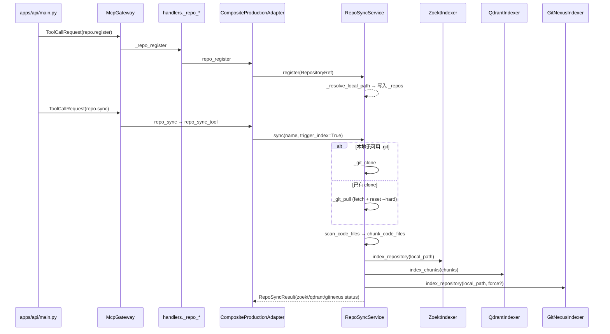
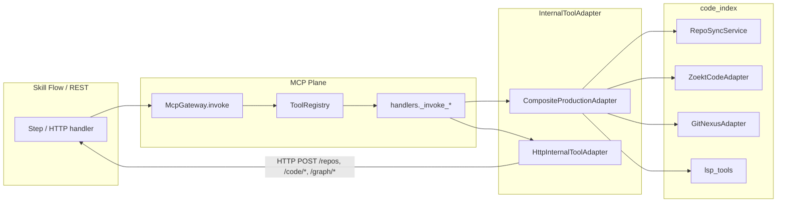

# 代码索引与仓库同步

## 1. 业务目标

RootSeeker V2 的代码索引平面负责把 Git 仓库拉取到本机、构建三类可查询索引（**Zoekt 词法**、**Qdrant 语义**、**GitNexus 结构图谱**），并向排查 Flow、Agent 与 REST 管理接口提供统一的代码检索能力。

**谁触发：** 运维经 `POST /repos` 注册仓库后 `POST /repos/{name}/sync`；Cron 经 `repo.sync_changed` / `repo.sync_all` 批量同步；默认排查 Flow 经 MCP 工具 `code.search`、`code.find_callers`、`graph.*` 等间接消费索引结果。

**解决什么问题：** 将分散在 Zoekt/Qdrant/GitNexus/LSP 的代码能力收敛到 `RepoSyncService` + `CompositeProductionAdapter`，避免 Flow 步骤直接依赖外部 CLI 或 HTTP 细节。

**成功时产出：** 本地 clone（`RepositoryRef.local_path`）、`RepoSyncStatus.state=completed`、各索引 `IndexStatus.ready=True`；查询侧返回 Zoekt hits、Qdrant 向量结果或 GitNexus 图谱 JSON。

**失败时落到哪里：** Git 操作失败 → `RepoSyncState.FAILED` + `error_message`；Zoekt/Qdrant 索引失败视为**硬失败**阻断 sync 成功态；GitNexus 失败为**软失败**（记录在 `error_message` 但不改变 zoekt/qdrant 成功路径）。

---

## 2. 入口一览

| 入口类型 | 路径 / 符号 | 说明 |
| --- | --- | --- |
| HTTP REST | `apps/api/main.py` → `register_repo` / `sync_repo` / `list_repos` 等 | `/repos*` 薄封装，经 `_invoke_builtin_repo_tool` 走 MCP |
| HTTP REST | `apps/api/main.py` → `semantic_search_code` | `POST /code/semantic-search` → `repo.semantic_search` |
| HTTP REST | `apps/api/main.py` → `find_callers_code` | `POST /code/find_callers` → `code.find_callers` |
| HTTP REST | `apps/api/main.py` → `graph_*` | `POST /graph/*` → 对应 `graph.*` MCP 工具 |
| MCP 内置 | `mcp_servers/internal/handlers.py` → `register_internal_tools` | 注册 `code.*`、`graph.*`、`index.*`、`repo.*`、`lsp.*` |
| MCP Plugin | `plugins/builtin/code_index/plugin.yaml` | `builtin.code_index` connector，声明上述工具 capability |
| 适配层 | `mcp_servers/external/composite_adapter.py` → `CompositeProductionAdapter` | 默认 in-process 实现，聚合 Zoekt/Qdrant/GitNexus/RepoSync |
| HTTP 远程适配 | `mcp_servers/internal/adapters.py` → `HttpInternalToolAdapter` | `internal_adapter_kind=http` 时将工具调用转发到 API base URL |
| Bootstrap | `rootseeker/config/internal_adapter.py` → `build_internal_adapter_from_settings` | 装配 `RepoSyncService` 并注入 `CompositeProductionAdapter` |
| Cron | `apps/scheduler/main.py` → `REPO_SYNC_CHANGED_HANDLER` | 周期性 `repo.sync_changed`（见 [13-cron-scheduler.md](./13-cron-scheduler.md)） |
| Flow 步骤 | `skills/builtin/flows/default-log-triage/SKILL.md` | `code-search`、`code-read`、`find-callers`、`graph-impact` 等步骤 |
| 内部核心 | `rootseeker/code_index/repo_sync.py` → `RepoSyncService` | 注册表、clone/pull、触发三索引 |

> **说明：** `HttpInternalToolAdapter` 期望 API 提供 `POST /code/search`、`POST /code/read`、`POST /index/get_status` 等路由；当前 `apps/api/main.py` **已实现** `/repos*`、`/code/semantic-search`、`/code/find_callers`、`/graph/*`，**未实现** `/code/search`、`/code/read`、`/index/get_status`（composite 模式下 Flow 仍可直接调用 MCP，不受影响）。详见 [18-apps-api-admin-cli.md](./18-apps-api-admin-cli.md)（规划）。

---

## 3. 主调用链（逐步）

### 3.1 注册 → clone/pull → 三索引

1. `apps/api/main.py` → `_invoke_builtin_repo_tool(runtime, "repo.register", ...)`
   - 入：`name`、`url`、`branch`、`metadata`
   - 经 `McpGateway.invoke(..., plugin_id="builtin.code_index")`
   - 下一步：`CompositeProductionAdapter.repo_register` → `internal_repo_tools.repo_register_tool`

2. `rootseeker/code_index/internal_repo_tools.py` → `repo_register_tool`
   - 构造 `RepositoryRef`，调用 `RepoSyncService.register`
   - 出：`{"ok": True, "repo": ...}`

3. `rootseeker/code_index/repo_sync.py` → `RepoSyncService.register`
   - `repo.local_path = str(_resolve_local_path(repo))`（优先 `base_path/name`，兼容 Docker 路径 `/data/repos/...`）
   - 写入内存 dict `_repos[name]`

4. `repo_sync_tool` / `RepoSyncService.sync`
   - 入：`repo_name`、`trigger_index`（默认 True）、`force_reclone`、`force_gitnexus`
   - Git：`SYNCING` → clone 或 pull → 记录 `commit_hash`
   - 索引：`INDEXING` → 并行逻辑上依次 zoekt → qdrant → gitnexus
   - 出：`RepoSyncResult`（含各 `IndexStatus`）
   - 状态：`COMPLETED` 或 `FAILED`（仅 zoekt/qdrant 硬失败）

5. `rootseeker/code_index/file_scanner.py` → `scan_code_files`
   - 过滤 `node_modules`、`.git` 等目录，按扩展名收集 `CodeFile`

6. `rootseeker/code_index/chunker.py` → `chunk_code_files`
   - 按 method/class 符号切分 `CodeChunk`（供 Qdrant）

7. `rootseeker/code_index/zoekt_indexer.py` → `ZoektIndexer.index_repository`
   - 远程：`POST {index_endpoint}/v1/index`，路径经 `ROOTSEEKER_ZOEKT_PATH_MAP` 重写
   - 本地：执行 `zoekt-index -index {index_dir} {local_path}`

8. `rootseeker/code_index/qdrant_indexer.py` → `QdrantIndexer.index_chunks`
   - `ensure_collection` → `delete_repo` → embedding → upsert points

9. `rootseeker/code_index/gitnexus_indexer.py` → `GitNexusIndexer.index_repository`
   - 调用 `GitNexusCli.analyze(local_path, force=...)`
   - 产出 `{local_path}/.gitnexus` 图谱目录

### 3.2 增量同步（Cron / sync-changed）

1. `repo_sync_changed_tool` → `RepoSyncService.sync_changed`
   - 对每个注册仓 `has_remote_updates`（fetch + 比较 `origin/{branch}`）
   - 有变更则 `sync(..., force_gitnexus=True)` 强制重建图谱
   - 出：`{checked, changed, synced, skipped, failed_checks, ok}`

### 3.3 词法搜索 `code.search`

1. Flow / Gateway → `handlers._invoke_code_search`
2. `CompositeProductionAdapter.search_code` → `ZoektCodeAdapter.search_code`
3. `mcp_servers/external/zoekt_adapter.py` → `POST {ZOEKT_ENDPOINT}/api/search`
   - 查询经 `_prepare_zoekt_query` 附加 `ZOEKT_NOISE_FILTERS`（来自 `search_query.py`）
4. 出：`{query, hits[], total}`，hit 含 `repo`、`path`、`line_start`、`snippet`

Flow 参数解析：`rootseeker/skill_runtime/rule_step_argument_resolver.py` 对 `code.search` 调用 `build_zoekt_search_query(symptom)` 从症状文本提取标识符。

### 3.4 语义搜索 `code.semantic_search` / `repo.semantic_search`

1. `handlers._invoke_code_semantic_search` 或 `POST /code/semantic-search`
2. `CompositeProductionAdapter.semantic_search_code` → `RepoSyncService.semantic_search`
3. `QdrantIndexer.search_similar_text`
   - `embedding_provider.embed_query(query)` → 向量检索 → `lexical_overlap_score` 重排
4. 出：`{ok, query, result[], reranked: true}`

### 3.5 读文件 `code.read`

1. `handlers._invoke_code_read` → `CompositeProductionAdapter.read_code`
2. `ZoektCodeAdapter.read_file`
   - 优先 `GET {endpoint}/api/file?path=&repo=`
   - 失败则从 index list 解析 `Source` 本地路径直读
3. 出：`{path, repo, content, start_line, end_line, total_lines}`

### 3.6 静态调用链 `code.find_callers`

1. `handlers._invoke_code_find_callers` → `CompositeProductionAdapter.find_callers`
2. `rootseeker/analysis/find_callers.py` → `analyze_call_chain`
   - 入：`call_chain[]` 或 `(class_name, method_name, file_path, line)`；`prefer_graph`（默认 True）
   - **图谱优先：** `GitNexusAdapter.callers_for_symbol` → `GitNexusCli` impact/context
   - **Zoekt 回退：** `build_caller_search_query` + `search_code` + `read_file` 启发式对齐
3. 出：静态 caller 帧、HTTP 入口映射、runtime/static 对齐结果

### 3.7 知识图谱查询 `graph.*`

| MCP 工具 | graph_tools 函数 | GitNexusAdapter 方法 |
| --- | --- | --- |
| `graph.impact` | `graph_impact_tool` | `impact(symbol, direction, repo, file, uid, kind)` |
| `graph.context` | `graph_context_tool` | `context(symbol, repo, file, uid)` |
| `graph.query` | `graph_query_tool` | `query(search_query, repo)` |
| `graph.cypher` | `graph_cypher_tool` | `cypher(query, repo)` |
| `graph.trace` | `graph_trace_tool` | `trace(source, target, repo)` |
| `graph.list_repos` | `graph_list_repos_tool` | `list_repos(limit, offset)` |
| `graph.detect_changes` | `graph_detect_changes_tool` | `detect_changes(repo)` |

`GitNexusAdapter._cwd_for_repo` 经 `repo_path_resolver` 把 repo 名映射到 `RepoSyncService` 的本地 clone 路径。

### 3.8 索引状态

| 工具 | 实现 | 范围 |
| --- | --- | --- |
| `index.get_status` | `ZoektCodeAdapter.get_index_status` | 全局 Zoekt `/api/list` |
| `repo.index_status` | `RepoSyncService.get_index_status(repo_name)` | 单仓 zoekt + qdrant + gitnexus |

REST 对应：`GET /repos/{repo_name}/index-status` → `repo.index_status`。

### 3.9 MCP 工具到达服务的完整路径

- **Composite 模式（默认）：** `create_dev_runtime` → `build_internal_adapter_from_settings` → `CompositeProductionAdapter.from_env(repo_sync_service=...)`
- **HTTP 模式：** 同一套 MCP 工具名，由 `HttpInternalToolAdapter` 转发到 `ROOTSEEKER_INTERNAL_HTTP_BASE_URL` 下的 REST 路由

### 3.10 LSP 工具（辅助，非索引写入）

| MCP 工具 | `lsp_tools` 函数 | 说明 |
| --- | --- | --- |
| `lsp.references` | `find_symbol_references` | 需 `file_path` + 文档符号匹配 |
| `lsp.definition` | `go_to_definition` | Pyright 等 LSP 客户端 |
| `lsp.hover` | `get_hover_info` | |
| `lsp.symbols` | `get_document_symbols` | |

`LspToolsService` 按 `(root_path, server_type)` 缓存 `LspClient`；默认 root 来自 `ROOTSEEKER_LSP_ROOT`。

---

## 4. 关键数据结构

| 类型 | 定义文件 | 含义 |
| --- | --- | --- |
| `RepositoryRef` | `rootseeker/contracts/repository.py` | 仓名、url、branch、`local_path`、`sync_status`、`metadata`（含 git token） |
| `RepoSyncStatus` / `RepoSyncState` | 同上 | `pending`→`syncing`→`indexing`→`completed`/`failed` |
| `RepoSyncResult` | `rootseeker/code_index/repo_sync.py` | sync 返回值：`success`、`zoekt_status`、`qdrant_status`、`gitnexus_status` |
| `IndexStatus` / `IndexKind` | `rootseeker/contracts/indexing.py` | 单索引就绪态与 `detail` 诊断 |
| `CodeFile` | `rootseeker/code_index/file_scanner.py` | 扫描到的源文件（path、language、content、sha256） |
| `CodeChunk` | `rootseeker/code_index/chunker.py` | Qdrant point 载荷：`repo`、`path`、行号、`symbol`、`stable_key` |
| `GitNexusCliConfig` | `rootseeker/code_index/gitnexus_cli.py` | CLI/HTTP endpoint、`path_map`、timeout、workers 等 |
| `GitNexusCommandResult` | 同上 | CLI/HTTP 执行结果 |

**谁填充 / 谁消费：**

- `RepositoryRef`：Admin/API 注册时写入；`RepoSyncService.sync` 更新 `sync_status` 与 `local_path`
- `CodeChunk`：`chunk_code_files` 生成 → `QdrantIndexer.index_chunks` 消费
- Zoekt hits / Qdrant result：`code.search` / `code.semantic_search` 返回 → `evidence_mapper` 写入 `EvidencePack`（见 [08-evidence-root-cause.md](./08-evidence-root-cause.md)）

---

## 5. 状态与副作用

### 5.1 内存与磁盘

| 存储 | 位置 | 内容 |
| --- | --- | --- |
| 注册表 | `RepoSyncService._repos` | 进程内 dict，重启丢失（需重新 register 或从 Admin 配置恢复） |
| Git clone | `ROOTSEEKER_REPO_BASE_PATH`（默认 `repos/`） | 完整工作树 |
| Zoekt 索引 | 本地 `ROOTSEEKER_ZOEKT_INDEX_DIR` 或远程 sidecar `/data/index` | 词法索引 shard |
| Qdrant | 集合 `code_chunks`（可配置） | 向量 points，payload 含 repo/path/symbol |
| GitNexus | `{clone}/.gitnexus/` | 结构图谱与 CLI 状态 |

### 5.2 对外 I/O

- **Git：** `git clone` / `fetch` / `reset --hard`；凭证经 `git_auth.build_authenticated_git_url`
- **Zoekt HTTP：** search `/api/search`、list `/api/list`、file `/api/file`；index sidecar `/v1/index`
- **Qdrant HTTP：** collections CRUD、points upsert/search/delete
- **GitNexus：** 本地 CLI 或 HTTP sidecar `/v1/exec`
- **Embedding：** `build_embedding_provider_from_env` → HTTP OpenAI 兼容或 `HashEmbeddingProvider`

### 5.3 Path Map（Hybrid / Docker）

| 环境变量 | 用途 | 格式示例 |
| --- | --- | --- |
| `ROOTSEEKER_ZOEKT_PATH_MAP` | Zoekt index sidecar 路径重写 | `E:/CodeProjects/root-seeker-v2/repos:/repos` |
| `ROOTSEEKER_GITNEXUS_PATH_MAP` | GitNexus sidecar 路径重写 | `E:/CodeProjects/root-seeker-v2/repos:/data/repos` |

实现：`gitnexus_cli._rewrite_path_for_sidecar(value, path_map)` — `host_prefix:container_prefix`，Windows 盘符安全拆分。Zoekt 远程索引复用同一函数（`zoekt_indexer._index_remote`）。

`RepoSyncService._resolve_local_path` 刻意返回**不跟随 junction** 的绝对路径，以便 path map 与项目 `repos/` 目录键一致。

### 5.4 主要环境变量（节选）

| 变量 | 作用 |
| --- | --- |
| `ROOTSEEKER_REPO_BASE_PATH` | clone 根目录 |
| `ROOTSEEKER_REPO_ENABLE_ZOEKT/QDRANT/GITNEXUS` | 索引开关 |
| `ZOEKT_ENDPOINT` / `ROOTSEEKER_ZOEKT_ENDPOINT` | Zoekt 搜索 |
| `ROOTSEEKER_ZOEKT_INDEX_ENDPOINT` | 远程 index sidecar |
| `QDRANT_ENDPOINT` / `ROOTSEEKER_QDRANT_*` | Qdrant 连接 |
| `ROOTSEEKER_GITNEXUS_ENDPOINT` | GitNexus HTTP sidecar |
| `ROOTSEEKER_GITNEXUS_COMMAND` | 自定义 CLI（如 `npx -y gitnexus@latest`） |

---

## 6. 分支与错误

| 条件 | 代码位置 | 行为 |
| --- | --- | --- |
| 仓未注册 | `RepoSyncService.sync` | 返回 `success=False`，message `Repository not found` |
| 无 URL 且本地非 git | `RepoSyncService.sync` | 硬失败：需要 URL 或有效 local_path |
| 损坏 clone（有 `.git` 无 HEAD） | `RepoSyncService.sync` | 自动删除目录后 reclone |
| 远端分支不存在 | `_git_clone` / `_git_pull` / `has_remote_updates` | 尝试 `detect_remote_default_branch` 或 master/develop |
| Zoekt 无 binary 且无 index endpoint | `ZoektIndexer.index_repository` | `IndexStatus.ready=False`，hint 配置 sidecar |
| Qdrant collection 维度不匹配 | `QdrantIndexer.ensure_collection` | 删除并重建 collection |
| GitNexus 不可用 | `GitNexusIndexer.index_repository` | 软失败；sync 仍可 COMPLETED |
| Zoekt/Qdrant 索引失败 | `RepoSyncService.sync` | `RepoSyncState.FAILED`，硬失败 |
| Zoekt 未配置 | `ZoektCodeAdapter.search_code` | `{hits:[], error, configured:false}` |
| Qdrant 禁用 | `RepoSyncService.semantic_search` | `{ok:false, error:"qdrant indexer disabled"}` |
| GitNexus 禁用 | `GitNexusAdapter.*` | `{ok:false, error:"gitnexus unavailable"}` |
| `prefer_graph=True` 但图谱无结果 | `analyze_call_chain` | 回退 Zoekt 启发式 caller 搜索 |
| HTTP internal 模式缺 REST 路由 | `HttpInternalToolAdapter._post` | 404/500（`/code/search` 等未在 main.py 暴露） |

---

## 7. 相关测试

| 测试文件 | 覆盖点 |
| --- | --- |
| `tests/unit/code_index/test_repo_sync_path_resolve.py` | Docker/Windows 路径解析、junction 行为 |
| `tests/unit/code_index/test_repo_sync_git_auth.py` | HTTPS 凭证注入 clone/pull |
| `tests/unit/code_index/test_repo_sync_changed.py` | 增量 sync 与 `force_gitnexus` |
| `tests/unit/code_index/test_repo_sync_force_reclone.py` | `force_reclone` 删除重建 |
| `tests/unit/code_index/test_gitnexus_sync_hook.py` | sync 触发 GitNexus analyze |
| `tests/unit/code_index/test_gitnexus_path_map.py` | `ROOTSEEKER_GITNEXUS_PATH_MAP` 重写 |
| `tests/unit/code_index/test_gitnexus_adapter.py` | 图谱查询与 find_callers 集成 |
| `tests/unit/code_index/test_search_query.py` | Zoekt 查询构建与标识符提取 |
| `tests/unit/code_index/test_chunker_symbols.py` | 符号级分块 |
| `tests/unit/code_index/test_full_code_indexing.py` | 端到端 scan→chunk→index  smoke |
| `tests/unit/analysis/test_find_callers.py` | 静态调用链解析与 Zoekt 回退 |
| `tests/unit/mcp_plane/test_all_internal_tools.py` | MCP 工具注册与 composite 委托 |
| `tests/unit/mcp_plane/test_http_adapter_all_routes.py` | HTTP 适配器路由映射 |
| `tests/unit/mcp_plane/test_repo_sync_real_docker.py` | Docker 环境真实 repo 同步 |
| `tests/unit/config/test_internal_adapter_config.py` | settings → RepoSyncService 装配 |

---

## 8. 与其他文档的关系

| 文档 | 关系 |
| --- | --- |
| [03-default-triage-flow.md](./03-default-triage-flow.md) | 默认 Flow 步骤 `code-search`、`find-callers`、`graph-impact` 经 Gateway 调用本篇 MCP 工具 |
| [07-mcp-plane.md](./07-mcp-plane.md) | `McpGateway.invoke`、handlers 注册表、`CompositeProductionAdapter` 与 HTTP 适配器分支 |
| [08-evidence-root-cause.md](./08-evidence-root-cause.md) | `code.search`/`code.read` 工具结果经 `evidence_mapper` 进入 `EvidencePack` |
| [13-cron-scheduler.md](./13-cron-scheduler.md) | `repo.sync_changed` / `repo.sync_all` cron handler 触发 `RepoSyncService` |
| [15-service-catalog-log-data.md](./15-service-catalog-log-data.md) | `CompositeProductionAdapter` 同进程装配 SLS/Jaeger；`find_callers` 可带 `service_name` 对齐 catalog |
| [18-apps-api-admin-cli.md](./18-apps-api-admin-cli.md) | API `/repos` 与 MCP 薄封装、HTTP internal 模式 REST 路由完整性（规划） |
| [04-skill-system.md](./04-skill-system.md) | `tools/code-lookup`、`tools/graph-lookup` 工具组与 Flow step 参数解析 |
| [06-plugin-system.md](./06-plugin-system.md) | `builtin.code_index` plugin manifest 声明 MCP 工具列表 |
