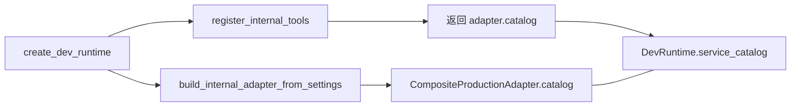
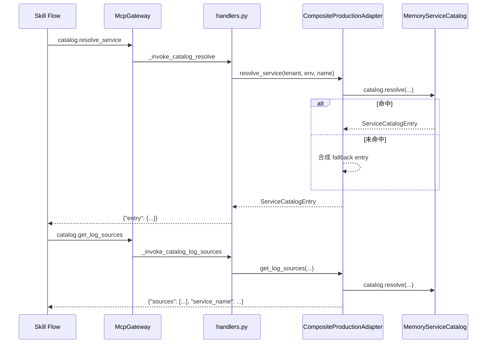

# 服务目录解析与日志数据面

## 1. 业务目标

RootSeeker V2 在排查 Flow 中需要先把告警里的 `service_name` 映射到**可查询的数据平面资源**（日志 store、链路源、仓库等），再按 `trace_id` 或日志模板拉取结构化日志，最终写入 `EvidencePack` 供根因分析消费。

**谁触发：** 默认排查 Flow 的步骤 2–4（`catalog.resolve_service` → `catalog.get_log_sources` → `log.query_by_trace_id`）；Admin 经 `/api/catalog` 维护目录；Bootstrap 启动时装配 `MemoryServiceCatalog` 并注入 `CompositeProductionAdapter`。

**解决什么问题：** 将 `(tenant, environment, service_name)` 三元组解析为 `ServiceCatalogEntry`（含 `log_sources[]`），再经 MCP 工具平面调用 SLS 等外部适配器执行日志检索，输出符合 `LogQueryResult` 契约的结果。

**成功时产出：** MCP 工具返回 JSON（目录条目 / 日志源列表 / 日志查询结果）；Skill Flow 经 `map_tool_result_to_evidence` 写入 `EvidenceType.SERVICE_CATALOG` 或 `EvidenceType.LOG` 的 `EvidenceItem`；Flow 结束后持久化到 `evidence_store`。

**失败时落到哪里：** 目录未命中时 `CompositeProductionAdapter` **合成 fallback 条目**（非 fail-fast）；SLS 未配置时返回 `metadata.configured=false` 与空 `records`（不伪造日志行）；工具未注册或执行异常时 gateway 返回 `TOOL_NOT_REGISTERED` / `TOOL_EXEC_ERROR`，对应 CaseStep 标 `failed`。默认 Flow 步骤编排见 [03-default-triage-flow.md](./03-default-triage-flow.md)。

---

## 2. 入口一览

| 入口类型 | 路径 / 符号 | 说明 |
| --- | --- | --- |
| MCP 内部工具 | `mcp_servers/internal/handlers.py:_invoke_catalog_resolve` | `catalog.resolve_service` → `adapter.resolve_service` |
| MCP 内部工具 | `mcp_servers/internal/handlers.py:_invoke_catalog_log_sources` | `catalog.get_log_sources` → `adapter.get_log_sources` |
| MCP 内部工具 | `mcp_servers/internal/handlers.py:_invoke_log_by_trace` | `log.query_by_trace_id` → `adapter.query_logs_by_trace_id` |
| MCP 内部工具 | `mcp_servers/internal/handlers.py:_invoke_log_by_template` | `log.query_by_template` → `adapter.query_logs_by_template` |
| Bootstrap 装配 | `rootseeker/bootstrap/runtime.py:create_dev_runtime` | 创建 adapter、`register_internal_tools`，返回共享 `MemoryServiceCatalog` |
| Adapter 工厂 | `rootseeker/config/internal_adapter.py:build_internal_adapter_from_settings` | 注入 `catalog` 到 `CompositeProductionAdapter` |
| 程序式解析 | `rootseeker/service_catalog/resolver.py:resolve_service` | 对 `ServiceCatalogStore` 做 `(tenant, env, name)` 查找 |
| 源提取 | `rootseeker/service_catalog/source_resolver.py:resolve_log_sources` | 从已解析 `ServiceCatalogEntry` 取出 `log_sources[]` |
| 日志数据面工具 | `rootseeker/log_data/` | 模板渲染、时间窗、脱敏、证据映射等可复用函数 |
| Admin HTTP | `apps/admin/main.py` → `GET/POST/DELETE /api/catalog` | 读写 `runtime.service_catalog`（与 adapter 共享同一内存实例） |
| Skill 参数回退 | `rootseeker/skill_runtime/rule_step_argument_resolver.py:RuleStepArgumentResolver` | 为 catalog/log 步骤构造 tenant/environment/service_name/trace_id |
| 证据映射 | `rootseeker/skill_runtime/evidence_mapper.py:map_tool_result_to_evidence` | 工具 JSON → `EvidencePack` |
| 插件归属 | `plugins/builtin/service_catalog/`、`plugins/builtin/log_query/` | capability 索引 `catalog.*` / `log.*` 工具 |

MCP 注册、Gateway invoke 与 PolicyGuard 细节见 [07-mcp-plane.md](./07-mcp-plane.md)。

---

## 3. 主调用链（逐步）

### 3.1 启动：目录与 Adapter 共享

1. `rootseeker/bootstrap/runtime.py` → `create_dev_runtime`
   - 入：可选 `catalog: MemoryServiceCatalog | None`
   - 出：`DevRuntime.service_catalog` 与 adapter 内 `catalog` 字段指向**同一** `MemoryServiceCatalog` 实例（若 adapter 无 catalog 则 `register_internal_tools` 返回 `MemoryServiceCatalog.seeded_default()`）
   - 下一步：`build_internal_adapter_from_settings(catalog=catalog or seeded_default())`

2. `mcp_servers/internal/handlers.py` → `register_internal_tools`
   - 注册 `catalog.resolve_service`、`catalog.get_log_sources`、`log.query_by_trace_id`、`log.query_by_template`
   - 出：`getattr(adapter, "catalog")` 若为 `MemoryServiceCatalog` 则原样返回，否则新建 `seeded_default()`

3. `apps/admin/main.py` → `_load_admin_config`
   - 入：`AdminConfigStore.list_catalog()`
   - 出：`runtime.service_catalog.upsert(entry)` — 运行时 MCP 调用立即可见（共享内存）

### 3.2 service_name → ServiceCatalogEntry → log_sources

#### 步骤 1：参数构造（Flow 步骤 2–3）

1. `rootseeker/skill_runtime/rule_step_argument_resolver.py` → `RuleStepArgumentResolver._build_step_args`
   - 入：`CaseCreateRequest`、前序 `normalize-incident` 的 `case_request` / `extracted`
   - 出：`catalog.resolve_service` / `catalog.get_log_sources` 共用 `{tenant, environment, service_name}`
   - `tenant` / `environment` 默认 `"demo"` / `"prod"`，来自 `metadata`
   - `service_name` 经 `resolve_service_name(...)` 归一化；缺省为 `"unknown-service"`
   - 下一步：`McpGateway.invoke`

#### 步骤 2：MCP Handler → Adapter 解析

2. `mcp_servers/internal/handlers.py` → `_invoke_catalog_resolve`
   - 入：`tenant`、`environment`、`service_name`（字符串，默认 `"demo"` / `"prod"` / `"unknown"`）
   - 出：`{"entry": entry.model_dump(mode="json")}`
   - 下一步：`adapter.resolve_service(...)`

3. `mcp_servers/external/composite_adapter.py` → `CompositeProductionAdapter.resolve_service`
   - 入：`(tenant, environment, service_name)`
   - 查：`self.catalog.resolve(...)`（`MemoryServiceCatalog`）
   - **未命中分支：** 合成 `ServiceCatalogEntry`，`display_name=service_name.title()`，`log_sources=[{"type":"sls","source_id":f"log-{service_name}"}]`
   - 出：`ServiceCatalogEntry`（永不为 `None`）
   - 下一步：返回 handler → Flow → `map_tool_result_to_evidence`

4. `mcp_servers/internal/handlers.py` → `_invoke_catalog_log_sources`
   - 入：同 resolve
   - 出：`{"sources": sources, "service_name": service_name}`
   - 下一步：`adapter.get_log_sources(...)`

5. `mcp_servers/external/composite_adapter.py` → `CompositeProductionAdapter.get_log_sources`
   - 查：`self.catalog.resolve(...)`
   - **未命中：** 返回 `[{"source_id": "sls-fallback", "type": "sls"}]`
   - **命中：** 返回 `[dict(source) for source in entry.log_sources]`
   - 说明：当前 adapter **未**调用 `resolve_log_sources()`；该函数用于从已持有 `ServiceCatalogEntry` 的程序式提取（见 §4）

#### 步骤 3：程序式 Store 路径（非 MCP 主路径）

6. `rootseeker/service_catalog/resolver.py` → `resolve_service`
   - 入：`ServiceCatalogStore`、`tenant`、`environment`、`service_name`
   - 出：`ServiceCatalogEntry | None`（**无 fallback**）
   - 下一步：`store.get(...)` — key 经 `(tenant, environment, service_name)` 小写 + strip 归一化

7. `rootseeker/service_catalog/loader.py` → `load_entries_into_store`
   - 批量 `upsert` 到 `ServiceCatalogStore`（测试 / 离线加载场景）

### 3.3 日志查询：trace / template → LogQueryResult → 证据

#### 步骤 4：trace 查询（Flow 步骤 4）

1. `RuleStepArgumentResolver` → `log.query_by_trace_id`
   - 入：`metadata.trace_id`（默认 `"trace-unknown"`）、可选 `service_name`
   - 出：`{"trace_id": ..., "service_name": ...}`

2. `mcp_servers/internal/handlers.py` → `_invoke_log_by_trace`
   - 出：`adapter.query_logs_by_trace_id(trace_id, service_name=service_name)`

3. `mcp_servers/external/composite_adapter.py` → `query_logs_by_trace_id`
   - 委派：`SlsLogAdapter.query_logs_by_trace_id`

4. `mcp_servers/external/sls_adapter.py` → `SlsLogAdapter.query_logs_by_trace_id`
   - 时间窗：`time_range_minutes=30`（Unix 秒，`to_time=now`，`from_time=now-30min`）
   - 查询串：`trace_id: "{trace_id}"`；若 `service_name` 非空追加 `AND service_name: "{service_name}"`
   - 出：`_log_result_dict(...)` — 字段对齐 `LogQueryResult`（`query_key`、`records`、`truncated`、`metadata`）
   - **SLS 未配置：** `metadata.configured=false`，`records=[]`，含明确 error 文案（不合成假日志）
   - **HTTP 异常：** `metadata.error` 记录异常，`records=[]`

#### 步骤 5：template 查询（Flow 步骤 5）

5. `RuleStepArgumentResolver` → `log.query_by_template`
   - 出：`template_id="default.error_window"` + 可选 `service_name`

6. `SlsLogAdapter.query_logs_by_template`
   - 查询串：`template_id: "{template_id}"` + 可选 `service_name` 过滤
   - 时间窗：同样默认 30 分钟

#### 步骤 6：`rootseeker/log_data/` 工具函数（契约层，与 SLS 并行）

| 函数 | 文件 | 行为 | 与生产 adapter 关系 |
| --- | --- | --- | --- |
| `render_query_template` | `log_data/query_renderer.py` | 对 `LogQueryTemplate.template_body` 做 `{{key}}` 占位符替换 | SLS adapter **未**调用；供注册模板 + 参数渲染场景 |
| `resolve_time_window` | `log_data/time_window.py` | 默认回溯 15 分钟，返回 `(start_iso, end_iso)` | SLS adapter 使用独立 30 分钟 Unix 时间窗 |
| `redact_log_result` | `log_data/post_filter.py` | 正则脱敏 `password/secret/token` 字段，`metadata.redacted=true` | Flow 证据路径**当前未**自动调用 |
| `log_result_to_evidence` | `log_data/evidence_mapper.py` | 委托 `append_log_query_evidence` | 生产 Flow 走 `skill_runtime/evidence_mapper.py` |
| `extract_trace_id` | `log_data/trace_extractor.py` | 从 dict 读 `trace_id/traceId/x_trace_id/trace` | 与 incident 归一化中 `metadata.trace_id` 互补 |

#### 步骤 7：工具结果 → EvidencePack

7. `rootseeker/skill_runtime/evidence_mapper.py` → `map_tool_result_to_evidence`
   - `catalog.resolve_service` / `catalog.get_log_sources` → `EvidenceType.SERVICE_CATALOG`，经 `sanitize_tool_result_for_evidence` 后 `append_tool_json_evidence`
   - `log.query_by_trace_id` → 校验 `LogQueryResult.model_validate(content)` → `append_log_query_evidence`
   - `log.query_by_template` → `EvidenceType.LOG`，走通用 JSON 路径（**不**强制 `LogQueryResult` 校验分支）

8. `rootseeker/evidence/builder.py` → `append_log_query_evidence`
   - 入：`LogQueryResult`
   - 出：`EvidenceItem(type=LOG, source=tool_name, content={query_key, truncated, record_count, metadata})`
   - 说明：**不**嵌入完整 `records[]`，仅摘要计数与 metadata；根因引擎与 LLM 上下文经 `build_context_window` 裁剪

证据与根因后续链路见 [08-evidence-root-cause.md](./08-evidence-root-cause.md)。

---

## 4. 关键数据结构

### 4.1 服务目录

- `ServiceCatalogEntry` — `rootseeker/contracts/service_catalog.py`
  - 主键语义：`(tenant, environment, service_name)` → 数据平面映射
  - `log_sources: list[dict]` — 日志 store 定位（通常含 `type`、`source_id`、`project`、`store` 等）
  - `trace_sources` / `metric_sources` / `repositories` — 链路、指标、代码仓库
  - `enabled_skills` / `enabled_tools` / `allowed_mcp_tools` — 服务级能力开关
  - **谁填充：** Admin `/api/catalog`、`MemoryServiceCatalog.upsert`、`seeded_default()`；adapter fallback 合成
  - **谁消费：** `CompositeProductionAdapter.resolve_service/get_log_sources`、证据映射、`resolve_log_sources`

- `LogSource` — `rootseeker/contracts/log_source.py`
  - 结构化日志源定位：`type`（sls/elasticsearch/loki）、`source_id`、`project`、`store`、`secret_ref` 等
  - 目录条目中 `log_sources[]` 为 dict；可 `LogSource.model_validate(dict)` 规范化（adapter 当前返回 raw dict）

### 4.2 日志查询契约

- `LogQueryTemplate` — `rootseeker/contracts/log_query.py`
  - `template_id`、`render_kind`（如 `sls_sql`、`lucene`）、`template_body`、`parameter_schema`
  - 由 `render_query_template` 渲染为 provider 查询串

- `LogQueryByTraceIdRequest` / `LogQueryByTemplateRequest`
  - 请求侧契约：`trace_id` 或 `template_id`，可选 `time_from/time_to/limit`
  - MCP tool schema（`mcp_servers/internal/tool_schemas.py`）当前**未**暴露时间窗参数；adapter 使用内置默认窗

- `LogRecord` — 归一化单行：`timestamp`、`message`、`level`、`trace_id`、`raw`
  - SLS `_normalize_record` 从 `msg/content/__topic__` 等字段提取 message

- `LogQueryResult` — 查询结果：`query_key`（审计稳定 id）、`records[]`、`truncated`、`metadata`
  - SLS `_log_result_dict` 保证与契约字段一致

### 4.3 内存目录实现对比

| 类型 | 文件 | 用途 |
| --- | --- | --- |
| `MemoryServiceCatalog` | `service_catalog/memory_catalog.py` | **运行时主存储**；`upsert/resolve/list_entries/remove`；`seeded_default()` 预置 demo/prod 下 `api-gateway`、`order-service` |
| `ServiceCatalogStore` | `service_catalog/store.py` | 轻量 store + `resolve_service()` 函数；**未**直接挂接 MCP adapter |

两者 key 归一化规则相同：`(tenant, environment, service_name)` 均 `lower().strip()`。

---

## 5. 状态与副作用

### 5.1 Case / Step / Evidence

- 默认 Flow 步骤 2–5 成功后：`CaseStep.status=completed`，`outputs` 存 MCP 返回 JSON（经 `sanitize_tool_result_for_persistence` 裁剪）
- 每步成功调用 `map_tool_result_to_evidence`，向内存 `EvidencePack.items` append
- Flow 结束：`DevRuntime.run_default_flow_from_case_request` → `evidence_store.put_pack`

### 5.2 目录写入

- `MemoryServiceCatalog.upsert` — 内存覆盖同 key 条目；Admin POST `/api/catalog` 同步写 `AdminConfigStore`
- `MemoryServiceCatalog.remove` — Admin DELETE 时从运行时移除
- **无**独立 catalog 持久化 Store；重启后依赖 Admin 配置或 `seeded_default()`

### 5.3 审计

- MCP invoke 统一写 `InMemoryAuditLog`（`action="mcp.invoke"`，detail 含 tool_name、latency）
- `build_catalog_audit_event`（`service_catalog/audit.py`）提供 `action="catalog.resolve_service"` 的 `AuditEvent` 构造器；供需要显式目录审计的调用方使用，**非** MCP handler 自动路径

### 5.4 对外 I/O

- 生产日志查询：`SlsLogAdapter` → 阿里云 SLS HTTP API（需 `SLS_*` 环境变量）
- HTTP internal 模式：`HttpInternalToolAdapter` 转发至 `ROOTSEEKER_INTERNAL_HTTP_BASE_URL` 的 `/catalog/*`、`/log/*` 路由
- 目录条目内 `log_sources` 的 `project/store/endpoint` 描述目标 store；实际查询仍经 SLS adapter 的全局 config（`SLS_PROJECT` / `SLS_LOGSTORE`），**当前未**按 `log_sources[]` 逐源路由

---

## 6. 分支与错误

| 条件 | 代码位置 | 行为 |
| --- | --- | --- |
| 目录 key 未命中（adapter 路径） | `composite_adapter.py:resolve_service` | 合成 fallback `ServiceCatalogEntry`，保证 resolve 总有条目 |
| 目录 key 未命中（Store 路径） | `service_catalog/store.py:get` | 返回 `None` |
| log_sources 未命中 | `composite_adapter.py:get_log_sources` | 返回 `[{"source_id":"sls-fallback","type":"sls"}]` |
| SLS 凭证缺失 | `sls_adapter.py:_not_configured_response` | `records=[]`，`metadata.configured=false`，明确 error |
| SLS HTTP 失败 | `sls_adapter.py:_query_logs` except | `records=[]`，`metadata.error=str(e)` |
| 工具未注册 | `mcp_plane/gateway.py` | `TOOL_NOT_REGISTERED`，步骤 failed |
| Policy 拒绝 / 需审批 | `PolicyGuard.enforce` | catalog/log 工具为读操作，通常直接通过；写工具见 [07-mcp-plane.md](./07-mcp-plane.md) |
| `log.query_by_trace_id` content 非 LogQueryResult | `skill_runtime/evidence_mapper.py` | `model_validate` 抛错 → 步骤 `TOOL_EXEC_ERROR` |
| Admin catalog upsert | `apps/admin/main.py:upsert_catalog` | 双写 `runtime.service_catalog` + `AdminConfigStore` |
| HTTP adapter 模式缺 base URL | `internal_adapter.py` | 启动 `ValueError` fail-fast |

**降级策略摘要：** 目录层允许 synthetic fallback；日志层缺配置时返回空结果 + 显式 error，**不**伪造日志行；证据层日志项仅保留摘要字段，完整 records 不进入 EvidencePack。

---

## 7. 相关测试

| 测试文件 | 覆盖点 |
| --- | --- |
| `tests/unit/service_catalog/test_memory_catalog.py` | `seeded_default` 解析、`upsert` 覆盖 |
| `tests/unit/service_catalog/test_catalog_runtime_components.py` | `ServiceCatalogStore` + `load_entries_into_store` + `resolve_service` + `resolve_log_sources/trace/repositories` + `build_catalog_audit_event` |
| `tests/unit/log_data/test_log_data_runtime.py` | `render_query_template`、`resolve_time_window`、`redact_log_result`、`log_result_to_evidence`、`extract_trace_id` |
| `tests/unit/mcp_servers/test_composite_adapter.py` | adapter 目录解析、log sources、SLS 委派与 unconfigured 响应 |
| `tests/unit/mcp_servers/test_external_adapters.py` | `SlsLogAdapter` 配置检测、unconfigured 响应、`_normalize_records` 契约形状 |
| `tests/unit/mcp_plane/test_http_internal_adapter.py` | HTTP 模式 `/catalog/resolve_service`、`/catalog/get_log_sources`、`/log/query_by_trace_id` |
| `tests/unit/mcp_plane/test_gateway.py` | Gateway invoke `catalog.resolve_service` 与审计事件 |
| `tests/unit/evidence/test_builder.py` | `append_log_query_evidence` 构造 EvidenceItem |
| `tests/integration/test_dev_runtime_smoke.py` | 端到端 smoke：catalog resolve + log evidence append |
| `tests/unit/contracts/test_phase1_contracts_coverage.py` | `LogQueryResult` / `LogRecord` 契约序列化 |

---

## 8. 与其他文档的关系

| 文档 | 关系 |
| --- | --- |
| [03-default-triage-flow.md](./03-default-triage-flow.md) | 默认 Flow YAML 步骤 2–5 编排；`RuleStepArgumentResolver` 参数来源；Gateway 逐步 invoke |
| [07-mcp-plane.md](./07-mcp-plane.md) | `register_internal_tools` 注册 catalog/log 工具；`McpGateway.invoke` 链；`CompositeProductionAdapter` / `HttpInternalToolAdapter` 委派 |
| [08-evidence-root-cause.md](./08-evidence-root-cause.md) | `map_tool_result_to_evidence` 分支；`append_log_query_evidence` 字段；根因引擎消费 LOG / SERVICE_CATALOG 证据 |
| [04-skill-system.md](./04-skill-system.md) | Tool Skill slug 映射（`catalog-resolve-service`、`catalog-log-sources`、`log-query-trace`） |
| [06-plugin-system.md](./06-plugin-system.md) | `builtin.service_catalog` / `builtin.log_query` 插件 capability 索引 |
| [01-bootstrap-wiring.md](./01-bootstrap-wiring.md) | `create_dev_runtime` 装配顺序；`DevRuntime.service_catalog` 字段 |

### 扩展点

1. **持久化目录：** 实现 `ServiceCatalogStore` 的 DB 后端，或在 adapter 层替换 `MemoryServiceCatalog`；保持 `(tenant, environment, service_name)` key 归一化契约。
2. **按 log_sources 路由：** 在 `SlsLogAdapter._query_logs` 消费 `LogSource.project/store`，而非全局 `SLS_PROJECT`/`SLS_LOGSTORE`。
3. **模板渲染接入：** 在 adapter 的 template 查询路径调用 `render_query_template(LogQueryTemplate, parameters)`，再提交 SLS。
4. **证据脱敏：** Flow 在 `map_tool_result_to_evidence` 前对 `LogQueryResult` 调用 `redact_log_result`。
5. **时间窗统一：** 将 `LogQueryByTraceIdRequest.time_from/time_to` 暴露到 MCP schema，或让 adapter 调用 `resolve_time_window`。
6. **HTTP 分离部署：** `internal_adapter_kind=http` 将 catalog/log 查询转发至独立 internal REST 服务。
