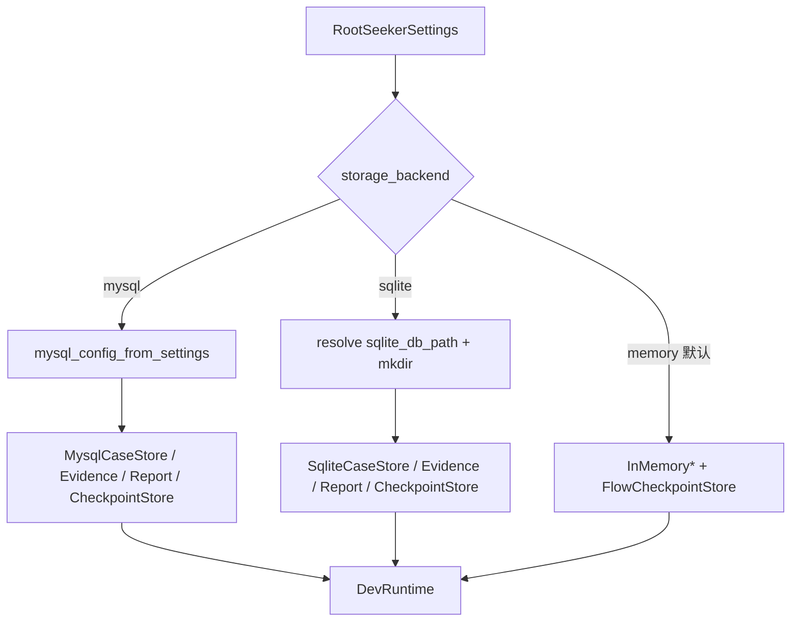

# 存储层（Storage Backend 解析与 Store 选型）

## 1. 业务目标

RootSeeker V2 将 Case、Evidence、Report、Flow Checkpoint、Task 等核心业务对象抽象为独立 Store 接口，由环境变量 `ROOTSEEKER_STORAGE_BACKEND` 在 **memory / sqlite / mysql** 三种主后端间切换。Bootstrap 层（`create_dev_runtime`）负责装配 case/evidence/report/checkpoint；Task 层（`TaskRuntime`）单独解析 task store，但读取同一 `storage_backend` 字段。

**谁触发：** 任意调用 `create_dev_runtime` 或 `TaskRuntime(runtime)` 的进程——API、Worker、Scheduler、CLI、单测。Admin / Cron / error_history 子系统通过 `backend_resolve.py` 的 helper 独立解析，可与主业务库「双轨」运行（例如主库 sqlite、Admin 仍用 JSON 文件）。

**成功时产出：** 选定后端上的持久化读写（或 memory 模式下的进程内 dict）；sqlite/mysql 模式下 Store 构造时 `CREATE TABLE IF NOT EXISTS` 自愈建表。

**失败时落到哪里：** mysql 连接失败在首次 Store 操作时抛异常（PyMySQL / 连接池）；非法 `storage_backend` 由 `RootSeekerSettings` 校验拒绝；Replay 历史经 `DevRuntime.replay_store` 装配（memory 时为进程内 `ReplayStore`；sqlite/mysql 时为 `SqliteReplayHistoryStore` / `MysqlReplayHistoryStore`）。

运维细节见 [../storage-sqlite.md](../storage-sqlite.md)、[../storage-mysql.md](../storage-mysql.md)。

## 2. 入口一览

| 入口类型 | 路径 / 符号 | 说明 |
| --- | --- | --- |
| Bootstrap 主 Store | `rootseeker/bootstrap/runtime.py:create_dev_runtime` → `_build_storage` | 装配 case / evidence / report / flow_checkpoint_store |
| Task Store | `rootseeker/task_runtime/runtime.py:TaskRuntime.__init__` → `_build_default_task_store` | 未显式传入 `store` 时按 backend 选 TaskStore |
| Admin 配置 | `apps/admin/config_store.py:build_admin_config_store` | `resolve_admin_store` → file 或 MySQL |
| Cron 状态 | `rootseeker/cron/state_store.py:build_cron_state_store` | `resolve_cron_state_store` → file 或 MySQL |
| Error 历史 | `apps/admin/error_history.py:build_error_history_store` | `resolve_error_history_store` → file / sqlite / MySQL |
| 子后端解析 | `rootseeker/storage/backend_resolve.py` | `resolve_admin_store` / `resolve_cron_state_store` / `resolve_error_history_store` |
| Replay（运行时） | `rootseeker/storage/sqlite_replay_history.py`、`mysql_replay_history.py` | `create_dev_runtime` → `_build_replay_store` 按 backend 选择 |
| 设置源 | `rootseeker/infra_core/settings.py:RootSeekerSettings` | `ROOTSEEKER_*` 环境变量，`storage_backend` 默认 `memory` |

## 3. 主调用链（逐步）

### 3.1 主业务 Store：`create_dev_runtime` → `_build_storage`

1. `rootseeker/bootstrap/runtime.py` → `create_dev_runtime`
   - 入：`repo_root`（默认 `Path.cwd()`）
   - 出：`DevRuntime`，含四个 Store 字段
   - 下一步：调用 `_build_storage(root, settings)`

2. `rootseeker/bootstrap/runtime.py` → `_build_storage`
   - 入：`settings.storage_backend`、`settings.sqlite_db_path` 或 `ROOTSEEKER_MYSQL_*`
   - 出：`(case_store, evidence_store, report_store, flow_checkpoint_store)` 四元组
   - 分支见 §3.3 决策表

3. **Case / Evidence / Report 写入**（Flow 成功路径）
   - `DevRuntime.run_default_flow_from_case_request` → `execute_default_log_triage_flow` 返回 `DefaultFlowRunResult`
   - `case_store.put` / `evidence_store.put_pack` / `report_store.put`
   - Checkpoint 由 `FlowRuntime` / `FlowExecutor` 经 `runtime.flow_checkpoint_store.save` 写入（见 [01-bootstrap-wiring.md](./01-bootstrap-wiring.md)）

### 3.2 Task Store：`TaskRuntime` 独立解析

Task Store **不在** `_build_storage` 中装配；`TaskRuntime` 构造时单独分支：

1. `rootseeker/task_runtime/runtime.py` → `TaskRuntime.__init__`
   - 入：`DevRuntime`；可选显式 `store`
   - 出：`self.store = store or _build_default_task_store(runtime)`

2. `rootseeker/task_runtime/runtime.py` → `_build_default_task_store`
   - `mysql` → `MysqlTaskStore(mysql_config_from_settings(settings))`
   - `sqlite` → `SqliteTaskStore(db_path)`，相对路径相对 `runtime.repo_root`，`mkdir` 父目录
   - 其他 → `TaskStore()`（`rootseeker/task_runtime/task_store.py`，进程内 dict）

3. `TaskRuntime.submit` → `store.save(task)`；`run_once` → `_next_pending_task_id` 可从持久化 Store 捞 `PENDING` 任务（跨进程重启场景）

详见 [12-task-runtime.md](./12-task-runtime.md)。

### 3.3 决策表：`ROOTSEEKER_STORAGE_BACKEND` → Store 类

环境变量 `ROOTSEEKER_STORAGE_BACKEND` 映射 `RootSeekerSettings.storage_backend`（合法值：`memory` | `sqlite` | `mysql`，**代码默认 `memory`**；Docker `.env.docker` 通常为 `mysql`；本地 `start-local.ps1` 非 `-Mysql` 时设 `sqlite`）。

| `storage_backend` | case | evidence | report | task | checkpoint | replay（运行时） |
| --- | --- | --- | --- | --- | --- | --- |
| **`memory`**（默认） | `InMemoryCaseStore` | `InMemoryEvidenceStore` | `InMemoryReportStore` | `TaskStore` | `FlowCheckpointStore` | `ReplayStore`（内存） |
| **`sqlite`** | `SqliteCaseStore` | `SqliteEvidenceStore` | `SqliteReportStore` | `SqliteTaskStore` | `SqliteCheckpointStore` | `ReplayStore`（内存；**未接线** `SqliteReplayStore`） |
| **`mysql`** | `MysqlCaseStore` | `MysqlEvidenceStore` | `MysqlReportStore` | `MysqlTaskStore` | `MysqlCheckpointStore` | `ReplayStore`（内存；**无** `MysqlReplayStore`） |

**装配位置：**

| Store 域 | 解析函数 | 源文件 |
| --- | --- | --- |
| case / evidence / report / checkpoint | `_build_storage` | `rootseeker/bootstrap/runtime.py` |
| task | `_build_default_task_store` | `rootseeker/task_runtime/runtime.py` |
| replay | 调用方直接 `ReplayStore()` | `rootseeker/replay/store.py`；`TaskExecutor` / `cron/case_replay.py` / CLI |

**sqlite 单文件：** case / evidence / report / task / checkpoint 共用 `ROOTSEEKER_SQLITE_DB_PATH`（默认 `data/rootseeker.db`），各 Store 在**同一 db 文件**内建各自表（`cases`、`evidence_packs`、`reports`、`tasks`、`checkpoints`）。

**mysql 单库：** 五类主 Store 共用 `mysql_config_from_settings`（`ROOTSEEKER_MYSQL_*`，连接池 `ROOTSEEKER_MYSQL_POOL_SIZE` 默认 8）。

### 3.4 子 Store 双轨：`backend_resolve`（Admin / Cron / error_history）

与主 `storage_backend` **解耦**，由 `rootseeker/storage/backend_resolve.py` 解析：

| 环境变量 | 合法值 | `auto` 行为（默认） |
| --- | --- | --- |
| `ROOTSEEKER_ADMIN_STORE` | `auto` / `file` / `mysql` | `storage_backend==mysql` → **mysql**；否则 → **file** |
| `ROOTSEEKER_CRON_STATE_STORE` | `auto` / `file` / `mysql` | 同上 |
| `ROOTSEEKER_ERROR_HISTORY_STORE` | `auto` / `file` / `sqlite` / `mysql` | `storage_backend==mysql` → **mysql**；否则 → **file**（**不是** sqlite） |

显式 override 示例：`ROOTSEEKER_STORAGE_BACKEND=mysql` + `ROOTSEEKER_ADMIN_STORE=file` → 主业务走 MySQL，Admin 配置仍写 `data/admin/config.json`。

**工厂与持久化位置：**

| 解析结果 | 工厂 | 实现类 | 默认路径 / 表 |
| --- | --- | --- | --- |
| admin **file** | `build_admin_config_store` | `AdminConfigStore(path=...)` | `{repo_root}/data/admin/config.json` |
| admin **mysql** | 同上 | `AdminConfigStore(..., mysql=...)` | MySQL 文档表（与 init 脚本对齐） |
| cron **file** | `build_cron_state_store` | `FileCronStateStore` | `{repo_root}/data/cron/scheduler-state.json` |
| cron **mysql** | 同上 | `MysqlCronStateStore` | `cron_job_states` / `cron_job_runs` |
| error **file** | `build_error_history_store` | `FileErrorChatHistoryStore` | `data/admin/error_history.json` |
| error **sqlite** | 同上 | `SqliteErrorChatHistoryStore` | `ROOTSEEKER_ERROR_HISTORY_SQLITE_PATH`（默认 `data/admin/error_history.db`，**独立文件**） |
| error **mysql** | 同上 | `MysqlErrorChatHistoryStore` | `error_chat_history` 表 |

**重要：** Cron 状态**没有** sqlite 分支；`storage_backend=sqlite` 且子 Store 为 `auto` 时，Admin/Cron/error_history 均落**文件**，与主业务 SQLite 文件分离。详见 [13-cron-scheduler.md](./13-cron-scheduler.md) §5.1。

### 3.5 Replay 持久化现状（诚实说明）

| 组件 | 状态 |
| --- | --- |
| `SqliteReplayStore` | 已实现（`replay_cases` / `replay_results` 表），**仅**单测与 `tests/integration/test_e2e_full_chain.py` 手动注入 |
| `MysqlReplayStore` | **未在代码中找到** |
| 生产路径 | `TaskExecutor`（CRON/REPLAY）、`rootseeker/cron/case_replay.py`、`rootseeker/cli_commands/commands/replay.py` 均 `ReplayRunner(..., ReplayStore())` |
| MySQL init | `mysql/init/01_schema.sql` 注释：「Replay tables intentionally omitted」 |

因此：**无论 `ROOTSEEKER_STORAGE_BACKEND` 为何值，回放基准用例与历史 run 均不跨进程持久化**；部署门禁结论仅体现在 Task `result_ref` / 日志，不写入 replay 专用表。

## 4. 关键数据结构

主 Store 读写的契约类型（定义于 `rootseeker/contracts/`）：

| 契约 | Store 方法 | 持久化键 |
| --- | --- | --- |
| `CaseRecord` | `put` / `get` / `list_all` | `case_id` |
| `EvidencePack` | `put_pack` / `get_pack` / `append_items` | `case_id` |
| `CaseReport` | `put` / `get` | `case_id` |
| `TaskRecord` | `save` / `get` / `list_by_status` | `task_id` |
| checkpoint payload `dict` | `save(flow_run_id, payload)` / `get` | `flow_run_id`（通常 = execution_id） |

**Checkpoint 记录包装：**

- 内存：`FlowCheckpointRecord` — `rootseeker/flow_runtime/checkpoint.py`
- sqlite/mysql：`FlowCheckpointRecord` — `rootseeker/storage/sqlite_checkpoint.py`（MySQL checkpoint 复用同 dataclass）

**Replay（内存契约，非主 Store）：**

- `ReplayCaseSpec` / `ReplayRunSnapshot` — `rootseeker/contracts/replay.py`
- `ReplayStore` 内部 `ReplayHistory` — `rootseeker/replay/store.py`

**连接配置：**

- `MysqlConnectConfig` — `rootseeker/storage/mysql_conn.py`；由 `mysql_config_from_settings(settings)` 从 `ROOTSEEKER_MYSQL_*` 构建

## 5. 状态与副作用

### 5.1 主 Store 写入时机

| 对象 | 典型写入者 | Store |
| --- | --- | --- |
| Case / Evidence / Report | `DevRuntime.run_default_flow_from_case_request`；`FlowRuntime.run_default` 间接调用 | case / evidence / report |
| Flow checkpoint | `FlowRuntime` / `FlowExecutor` 步骤间 | `flow_checkpoint_store` |
| Task 状态机 | `TaskRuntime.submit` → `PENDING`；`TaskExecutor.execute` → `completed` / `failed` | task store |
| Replay run | `ReplayRunner.run_suite` | **仅** `ReplayStore` 内存 |

### 5.2 未持久化（与 storage_backend 无关）

以下组件在 `create_dev_runtime` 中**固定内存**，切换 sqlite/mysql **不改变**其行为：

| 组件 | 类 | 说明 |
| --- | --- | --- |
| 审计日志 | `InMemoryAuditLog` | MCP 工具调用审计 |
| 审批 | `ApprovalStore` | 写工具审批队列 |
| 任务队列 | `TaskQueue` | 同进程 FIFO；持久化靠 task store 的 pending 扫描 |
| 插件 / Skill / 工具注册表 | `ManifestRegistry` / `SkillRegistry` / `ToolRegistry` | 启动时从 bundled 目录加载 |
| 服务目录 | `MemoryServiceCatalog` | internal tools 注册产物 |
| Replay 历史 | `ReplayStore` | 见 §3.5 |

### 5.3 表 / 文件副作用摘要

**SQLite 主库**（`ROOTSEEKER_SQLITE_DB_PATH`）：`cases`、`evidence_packs`、`reports`、`tasks`、`checkpoints`。

**MySQL 主库**：同上表名 + JSON 列；Store 构造时 `CREATE TABLE IF NOT EXISTS`；运维 init 见 `mysql/init/01_schema.sql`、`scripts/init_mysql.py`。

**子 Store 文件**（`auto` + 非 mysql）：`data/admin/config.json`、`data/cron/scheduler-state.json`、`data/admin/error_history.json`（或独立 error sqlite 文件）。

## 6. 分支与错误

| 条件 | 代码位置 | 行为 |
| --- | --- | --- |
| `storage_backend == "mysql"` | `_build_storage` / `_build_default_task_store` | `mysql_config_from_settings` + 各 `Mysql*Store` |
| `storage_backend == "sqlite"` | 同上 | 解析相对 `repo_root` 的 db_path，`mkdir` 父目录 |
| 默认 / `memory` | `_build_storage` | lazy import `FlowCheckpointStore`；InMemory 三 Store |
| 默认 / `memory` | `_build_default_task_store` | `TaskStore()` 无 `list_by_status`，`_next_pending_task_id` 用 `list_all` 过滤 |
| `ROOTSEEKER_ADMIN_STORE=auto` + mysql 主库 | `resolve_admin_store` | → mysql Admin |
| `ROOTSEEKER_ADMIN_STORE=auto` + sqlite/memory 主库 | `resolve_admin_store` | → file |
| `ROOTSEEKER_ERROR_HISTORY_STORE=sqlite` | `build_error_history_store` | 独立 sqlite 文件，与主库路径无关 |
| PyMySQL 未安装 / 连接失败 | `mysql_conn.connect_mysql` / Store 首次 I/O | 抛 `ImportError` 或连接异常 |
| Replay 需跨重启保留 | 运行时路径 | **不支持**；须自行扩展接线 `SqliteReplayStore` 或未来 `MysqlReplayStore` |

## 7. 相关测试

| 测试文件 | 覆盖点 |
| --- | --- |
| `tests/unit/test_bootstrap_storage.py` | sqlite 下 case/report/evidence/checkpoint 跨两个 `create_dev_runtime` 实例持久化；TaskRuntime pending 任务跨实例执行 |
| `tests/unit/storage/test_sqlite_store.py` | `SqliteCaseStore` / Evidence / Report / Task / Checkpoint / **SqliteReplayStore** CRUD |
| `tests/unit/storage/test_backend_resolve.py` | `auto` 跟随 mysql→mysql、sqlite→file；显式 override |
| `tests/unit/storage/test_mysql_pool.py` | MySQL 连接池 acquire/release |
| `tests/unit/storage/test_mysql_json.py` | `decode_mysql_json` 边界 |
| `tests/integration/test_e2e_full_chain.py` | 手动组合 Sqlite 主 Store + SqliteReplayStore 全链路 |

## 8. 与其他文档的关系

| 文档 | 关系 |
| --- | --- |
| [01-bootstrap-wiring.md](./01-bootstrap-wiring.md) | `create_dev_runtime` 装配顺序；`_build_storage` 三分支；DevRuntime 字段与 Flow 写入 Store |
| [12-task-runtime.md](./12-task-runtime.md) | `_build_default_task_store`；Task 持久化与 `TaskQueue` 分工；Worker/Scheduler 入口 |
| [13-cron-scheduler.md](./13-cron-scheduler.md) | `build_cron_state_store` + `resolve_cron_state_store`；Cron 无 sqlite 子后端 |
| [../storage-sqlite.md](../storage-sqlite.md) | SQLite 环境变量、运维、`auto` 下子 Store 仍为文件的说明 |
| [../storage-mysql.md](../storage-mysql.md) | Docker 默认 mysql、连接参数、init/reset 脚本 |

**实现索引（`rootseeker/storage/`）：**

| 模块 | 职责 |
| --- | --- |
| `memory.py` | `InMemoryCaseStore` / Evidence / Report |
| `sqlite.py` | Sqlite case / evidence / report |
| `sqlite_task.py` | `SqliteTaskStore` |
| `sqlite_checkpoint.py` | `SqliteCheckpointStore`、`FlowCheckpointRecord` |
| `sqlite_replay.py` | `SqliteReplayStore`（未接入运行时） |
| `mysql.py` | Mysql case / evidence / report |
| `mysql_task.py` | `MysqlTaskStore` |
| `mysql_checkpoint.py` | `MysqlCheckpointStore` |
| `mysql_conn.py` | `MysqlConnectConfig`、连接池、`mysql_config_from_settings` |
| `backend_resolve.py` | Admin / Cron / error_history 子后端解析 |
