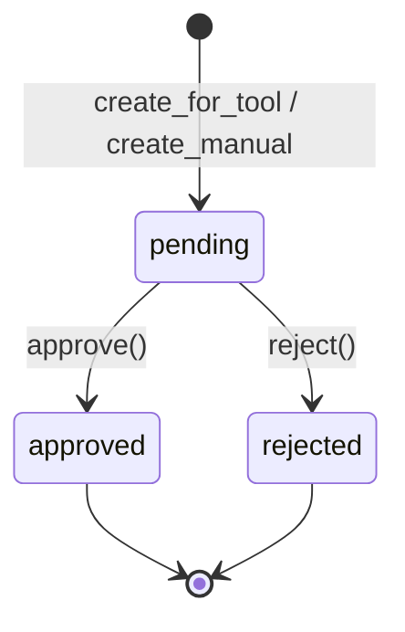
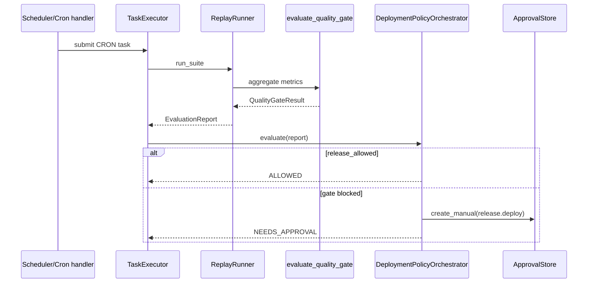

# 审批、治理、回放与质量门禁

## 1. 业务目标

RootSeeker V2 在两条治理轴上约束「危险操作」与「发布放行」：

1. **写工具审批**：当启用 `ROOTSEEKER_APPROVAL_REQUIRED_FOR_WRITE_TOOLS` 时，所有非 `READ` 权限的 MCP 工具（`WRITE` / `ADMIN`）在首次 invoke 前必须经过人工批准；审批记录由内存 `ApprovalStore` 维护，可选 webhook 向外广播生命周期事件。
2. **回放评估与发布门禁**：`ReplayRunner` 对基准用例集重复执行默认 triage flow，聚合指标后经 `evaluate_quality_gate` 判定 `release_allowed`；若门禁未放行，`DeploymentPolicyOrchestrator` 可创建 **manual override** 审批（`tool_name=release.deploy`），批准后方可视为发布允许。

**谁触发：** 操作员经 Gateway `tool.invoke` / `approval.*`；Worker 处理 `CRON`/`REPLAY` 任务；CLI `run_replay_command`；Cron scheduler 的 `replay.default_flow` handler。

**成功时产出：** 写工具：审批后重试 invoke 返回 `ok=True`；回放：生成 `EvaluationReport`（含 `gate_policy_name`、`release_allowed`）及 `DeploymentPolicyDecision`；Cron job 仅在 `release_allowed=True` 时记为 SUCCEEDED。

**失败时落到：** 写工具：`APPROVAL_REQUIRED`（可重试）或 `POLICY_DENIED`（不可重试）；门禁失败：`NEEDS_APPROVAL` / `BLOCKED`；scheduler 返回 `deployment policy did not allow release`。

## 2. 入口一览

| 入口类型 | 路径 / 符号 | 说明 |
| --- | --- | --- |
| Bootstrap | `rootseeker/bootstrap/runtime.py` → `create_dev_runtime` | 构造 `ApprovalStore`（可选 `WebhookApprovalEventSink`）并注入 `PolicyGuard` |
| MCP 策略 | `rootseeker/mcp_plane/policy.py` → `PolicyGuard.enforce` | 写工具审批拦截（详见 [07-mcp-plane.md](./07-mcp-plane.md)） |
| MCP Gateway | `rootseeker/mcp_plane/gateway.py` → `McpGateway.invoke` | 捕获 `ApprovalRequiredError` → `APPROVAL_REQUIRED` |
| Gateway RPC | `rootseeker/gateway/methods/approval_methods.py` | `approval.list` / `get` / `approve` / `reject`（协议见 [11-gateway-control-plane.md](./11-gateway-control-plane.md)） |
| Task Worker | `rootseeker/task_runtime/task_executor.py` → `TaskExecutor.execute` | `CRON`/`REPLAY` → 回放 + `DeploymentPolicyOrchestrator` |
| Cron Scheduler | `apps/scheduler/main.py` → `_build_executor` replay 分支 | 提交 CRON 任务并读 `report_release_allowed` |
| CLI | `rootseeker/cli_commands/commands/replay.py` → `run_replay_command` | 本地回放；exit 0/2 由 `gate_passed` 决定 |
| 内部 API | `rootseeker/cron/case_replay.py` → `run_scheduled_replay` | 仅回放，不调用部署编排器 |

## 3. 主调用链（逐步）

### 3.1 ApprovalStore 生命周期与 Webhook Sink

1. `rootseeker/bootstrap/runtime.py` → `create_dev_runtime`
   - 入：`settings.approval_webhook_url`（可选）
   - 出：`ApprovalStore(event_sink=WebhookApprovalEventSink(...))` 或 `event_sink=None`
   - 下一步：注入 `PolicyGuard` 与 `DevRuntime.approval_store`

2. `rootseeker/policies/approval.py` → `ApprovalStore.create_for_tool` / `create_manual`
   - 入：工具调用上下文或手工字段（`case_id`、`step_id`、`tool_name`、`permission_level`、`reason`）
   - 出：`ApprovalRequest`，`status=PENDING`，`approval_id=new_id("approval-")`
   - 副作用：`_emit("approval.requested", ...)`
   - 下一步：等待 `approve` / `reject`

3. `rootseeker/policies/approval.py` → `ApprovalStore.approve` / `reject`
   - 入：`approval_id`，`actor`，`reason`
   - 出：更新 `status` 为 `APPROVED` / `REJECTED`，填充 `decided_at`、`decided_by`、`decision_reason`
   - 副作用：`_emit("approval.approved" | "approval.rejected", ...)`
   - 下一步：写工具重试或部署编排器重评估

4. `rootseeker/policies/approval.py` → `WebhookApprovalEventSink.emit`
   - 入：`ApprovalEvent`（含 `event.to_payload()`）
   - 出：HTTP POST JSON 至 webhook URL；失败时 `last_error` 写入 sink，**不阻断** Store 状态变更

### 3.2 写 / Admin 工具审批（PolicyGuard）

> MCP 注册、审计与 `TOOL_EXEC_ERROR` 等细节见 [07-mcp-plane.md](./07-mcp-plane.md)；本节只描述与 `ApprovalStore` 的衔接。

1. `rootseeker/mcp_plane/gateway.py` → `McpGateway.invoke`
   - 入：`ToolCallRequest`（含 `case_id`、`step_id`、`tool_name`、`arguments`）
   - 出：调用 `PolicyGuard.enforce` 后再执行 handler
   - 下一步：`policy.py` → `PolicyGuard.enforce`

2. `rootseeker/mcp_plane/policy.py` → `PolicyGuard.enforce`
   - 入：`request`，`ToolSpec`（含 `permission_level`）
   - 分支 A：`deny_write=True` 且非 READ → `PolicyDeniedError`
   - 分支 B：`require_approval_for_write=False` 或 READ → 直接返回
   - 分支 C：`arguments` 含有效 `approval_id`（或 `_approval_id`）且 `is_approved_for` 为真 → 返回
   - 分支 D：否则 `create_for_tool` → `ApprovalRequiredError(approval)`

3. `rootseeker/mcp_plane/gateway.py`（续）捕获 `ApprovalRequiredError`
   - 出：`ToolCallResult(ok=False, error.code="APPROVAL_REQUIRED", details=approval.to_payload(), retryable=True)`
   - 下一步：操作员 `approval.approve` 后，调用方在 **同一** request 的 `arguments` 附带 `approval_id` 重试

4. `rootseeker/policies/approval.py` → `ApprovalStore.is_approved_for`
   - 入：`approval_id`，`request`，`spec`
   - 校验：`status==APPROVED` 且 `case_id` / `step_id` / `tool_name` / `permission_level` 四元组一致

**当前需审批的工具：** 凡 `ToolSpec.permission_level != READ` 且在 `require_approval_for_write=True` 时均拦截；内置 WRITE 工具包括 `notify.send`、`repo.register`、`repo.sync` 等（完整列表见 [07-mcp-plane.md](./07-mcp-plane.md) §6.1）。

### 3.3 Gateway 审批 RPC

Gateway 方法注册于 `rootseeker/gateway/methods/approval_methods.py`，经 [11-gateway-control-plane.md](./11-gateway-control-plane.md) 的 `GatewayMethodRegistry.invoke` 分发：

| 方法 | 处理器 | 入参关键字段 | 出参 |
| --- | --- | --- | --- |
| `approval.list` | `approval_list` | `status?`，`limit`（默认 200） | `{items: [...], total}` |
| `approval.get` | `approval_get` | `approval_id` | `{found, approval?}` |
| `approval.approve` | `approval_approve` | `approval_id`，`actor`，`reason?` | `{approval: payload}` |
| `approval.reject` | `approval_reject` | `approval_id`，`actor`，`reason?` | `{approval: payload}` |

典型写工具闭环：`tool.invoke` → `APPROVAL_REQUIRED` → `approval.approve` → 带 `approval_id` 的 `tool.invoke` 重试（见 `tests/unit/gateway/test_gateway_business_methods.py`）。

### 3.4 回放执行 → 指标 → 质量门禁

1. `rootseeker/replay/runner.py` → `ReplayRunner.run_suite`
   - 入：`suite_name`，`repeat_each`（≥1）
   - 出：`ReplaySuiteResult(report, traces, snapshots)`
   - 下一步：逐 case 跑 flow

2. 对每个 `ReplayCaseSpec`（来自 `ReplayStore.list_cases`）：
   - `DevRuntime.run_default_flow_from_payload(case.alert_payload)` → `DefaultFlowRunResult`
   - `rootseeker/evaluation/metrics.py` → `evaluate_run_metrics(case, run)` → 单次 run 指标 dict
   - 写入 `ReplayRunSnapshot` 至 `ReplayStore.add_run`
   - 每个 case 内多轮 run 用 `aggregate_suite_metrics` 平均

3. `rootseeker/evaluation/metrics.py` → `aggregate_suite_metrics`
   - 入：全部 run 指标列表
   - 出：各 metric 键的算术均值（空列表返回 `{}`）

4. `rootseeker/evaluation/quality_gate.py` → `evaluate_quality_gate`
   - 入：`aggregate_metrics`，可选 `QualityGatePolicy`
   - 出：`QualityGateResult(passed, reasons, policy_name, blocking)`
   - `release_allowed = passed or not blocking`

5. `rootseeker/evaluation/reporting.py` → `build_evaluation_report`
   - 入：`report_id`，`suite_name`，`case_count`，`aggregate_metrics`，`gate_result`，`case_summaries`
   - 出：`EvaluationReport`（字段 `gate_passed`、`gate_policy_name`、`release_allowed`、`gate_reasons`）

**默认门禁阈值**（`default_quality_gate_policy`，`name="default-release"`，`blocking=True`）：

| 类型 | 指标 | 阈值 |
| --- | --- | --- |
| min | `service_accuracy` | ≥ 0.95 |
| min | `trace_id_accuracy` | ≥ 0.8 |
| min | `audit_completeness` | ≥ 0.99 |
| min | `stability_score` | ≥ 0.95 |
| max | `tool_fail_rate` | ≤ 0.05 |
| max | `sensitive_leak_count` | ≤ 0.0 |

`evaluate_run_metrics` 另产出 `log_coverage`、`trace_coverage`、`code_coverage`、`report_bullet_coverage` 等辅助指标，默认策略不用于 blocking 判定。

### 3.5 DeploymentPolicyOrchestrator（评估报告 + 人工覆盖）

1. `rootseeker/governance/deployment_policy.py` → `DeploymentPolicyOrchestrator.evaluate`
   - 入：`EvaluationReport`，可选 `approval_id`
   - 出：`DeploymentPolicyDecision`

2. 决策分支：

   - **`report.release_allowed == True`** → `status=ALLOWED`，`release_allowed=True`，携带 `gate_passed` / `gate_policy_name`
   - **门禁失败且 `allow_manual_override=False`** → `status=BLOCKED`，`release_allowed=False`，`reasons=gate_reasons`
   - **门禁失败且传入已批准 `approval_id`** → `status=ALLOWED`，`reasons=["manual release override approved"]`
   - **门禁失败且传入已拒绝 `approval_id`** → `status=BLOCKED`，reasons 追加 `"manual release override rejected"`
   - **门禁失败且无有效 approval** → `create_manual(..., tool_name="release.deploy", permission_level="admin", step_id="release-gate")` → `status=NEEDS_APPROVAL`，`approval_ids=[新 id]`

3. 二次评估：操作员 `approval.approve(approval_id)` 后，再次 `evaluate(report, approval_id=...)` 即可得到 `ALLOWED`。

### 3.6 Task / Cron 集成链路

1. `rootseeker/task_runtime/task_executor.py`（`TaskKind.CRON` / `REPLAY`）
   - `ReplayRunner.run_suite` → `DeploymentPolicyOrchestrator.evaluate(result.report)`
   - 写入 task：`result_ref=report_id`，`payload["report_gate_passed"]`，`payload["report_release_allowed"]`，`payload["deployment_decision"]`
   - task 状态：`COMPLETED`（即使 gate 未过也 completed；放行与否在 payload）

2. `apps/scheduler/main.py` replay handler
   - `TaskRuntime.submit(CRON)` → `run_once`
   - 成功条件：`executed.status=="completed"` **且** `report_release_allowed==True`
   - 否则 `JobRunStatus.FAILED`，`message="deployment policy did not allow release"`

Worker 队列与持久化语义见 [12-task-runtime.md](./12-task-runtime.md)；Cron 调度与 job 重试见 [13-cron-scheduler.md](./13-cron-scheduler.md)。

## 4. 关键数据结构

| 符号 | 定义文件 | 关键字段 | 谁填充 | 谁消费 |
| --- | --- | --- | --- | --- |
| `ApprovalStatus` | `rootseeker/policies/approval.py` | `pending` / `approved` / `rejected` | Store 状态变更 | list 过滤、编排器判定 |
| `ApprovalRequest` | 同上 | `approval_id`，`case_id`，`step_id`，`tool_name`，`permission_level`，`status`，`metadata` | `create_*` | Gateway details、webhook payload |
| `ApprovalEvent` | 同上 | `event_type`，`approval`，`actor`，`reason` | `_emit` | EventSink |
| `QualityGatePolicy` | `rootseeker/evaluation/quality_gate.py` | `name`，`min_thresholds`，`max_thresholds`，`blocking` | 调用方或默认 | `evaluate_quality_gate` |
| `QualityGateResult` | 同上 | `passed`，`reasons`，`policy_name`，`blocking`；属性 `release_allowed` | 门禁函数 | `build_evaluation_report` |
| `EvaluationReport` | `rootseeker/evaluation/reporting.py` | `report_id`，`suite_name`，`aggregate_metrics`，`gate_*`，`release_allowed`，`case_summaries` | `ReplayRunner` | `DeploymentPolicyOrchestrator` |
| `DeploymentPolicyDecision` | `rootseeker/governance/deployment_policy.py` | `status`，`release_allowed`，`reasons`，`approval_ids`，`gate_passed`，`gate_policy_name` | 编排器 | task payload、Cron job payload |
| `ReplayCaseSpec` | `rootseeker/contracts/replay.py` | `replay_id`，`alert_payload`，`case_request`，`expected_report_bullets` | `default_replay_suite` / 调用方 | `ReplayRunner` |
| `ReplayRunSnapshot` | 同上 | `replay_id`，`run_id`，`metrics`，`passed`，`errors` | 每次 run | `ReplayStore` 历史对比 |
| `ReplaySuiteResult` | `rootseeker/replay/runner.py` | `report`，`traces`，`snapshots` | `run_suite` | CLI exit code、TaskExecutor |

## 5. 状态与副作用

### 5.1 Approval 状态

| 事件 | 状态变化 | 存储 | 外部 I/O |
| --- | --- | --- | --- |
| `create_for_tool` / `create_manual` | → `PENDING` | 内存 `_items[approval_id]` | webhook `approval.requested` |
| `approve` | `PENDING` → `APPROVED` | 同上 | webhook `approval.approved` |
| `reject` | `PENDING` → `REJECTED` | 同上 | webhook `approval.rejected` |

`ApprovalStore` **无持久化**；进程重启后待审批项丢失。Webhook 失败时 `ApprovalStore.last_event_error` 或 `WebhookApprovalEventSink.last_error` 记录错误，状态仍已更新。

### 5.2 ReplayStore 副作用

- `upsert_case`：基准 fixture 写入内存 `_cases`
- `add_run`：追加 `ReplayRunSnapshot` 至对应 `ReplayHistory.runs`（支持同 `replay_id` 多 run 对比）
- **不写** case_store / evidence_store / report_store（回放经 `run_default_flow_from_payload` 走完整 flow，但 snapshot 仅存在 ReplayStore）

### 5.3 评估与部署决策副作用

- `EvaluationReport.report_id` 作为 CRON/REPLAY task 的 `result_ref`
- `deployment_decision.to_payload()` 写入 task payload，Cron 再透传至 `JobRunResult.payload`
- manual override 审批与写工具审批共用同一 `ApprovalStore` 实例（`DevRuntime.approval_store`）

## 6. 分支与错误

| 条件 | 代码位置 | 行为 |
| --- | --- | --- |
| 写工具需审批 | `policy.py` → `PolicyGuard.enforce` | `ApprovalRequiredError` → Gateway `APPROVAL_REQUIRED` |
| 审批 Store 未配置 | `policy.py` | `require_approval_for_write=True` 且无 store → `PolicyDeniedError` |
| dry-run 拒绝写 | `policy.py` | `deny_write=True` 且非 READ → `PolicyDeniedError` → `POLICY_DENIED` |
| approval_id 不匹配 | `approval.py` → `is_approved_for` | 视为未批准，创建新 pending 项 |
| approval_id 不存在 | `approval.py` → `_require` | `KeyError`（Gateway approve/reject 未捕获则向上抛） |
| 门禁通过 | `quality_gate.py` | `passed=True` → `release_allowed=True` |
| 非 blocking 策略 | `quality_gate.py` | `passed=False` 但 `blocking=False` → `release_allowed=True` |
| 门禁失败 + 无 override | `deployment_policy.py` | `NEEDS_APPROVAL`，创建 `release.deploy` pending |
| override 已拒绝 | `deployment_policy.py` | `BLOCKED`，`release_allowed=False` |
| `allow_manual_override=False` | `deployment_policy.py` | 门禁失败直接 `BLOCKED` |
| `repeat_each < 1` | `runner.py` → `run_suite` | `ValueError` |
| Replay case 未注册即 add_run | `store.py` | `ValueError: Replay case not found` |
| Cron replay 未放行 | `apps/scheduler/main.py` | `JobRunStatus.FAILED` |
| CLI 门禁未过 | `cli_commands/commands/replay.py` | 进程 exit code `2` |
| Webhook POST 失败 | `WebhookApprovalEventSink.emit` | 捕获 `OSError`/`URLError`，写 `last_error` |
| EventSink 抛异常 | `ApprovalStore._emit` | 捕获任意异常，写 `last_event_error`，状态已提交 |

## 7. 相关测试

| 测试文件 | 覆盖点 |
| --- | --- |
| `tests/unit/mcp_plane/test_gateway.py` | `PolicyGuard` + `ApprovalStore`：`APPROVAL_REQUIRED` 与 approve 后重试 invoke |
| `tests/unit/gateway/test_gateway_business_methods.py` | Gateway `approval.list/approve` 与写工具 `repo.register` 全流程 |
| `tests/unit/governance/test_deployment_policy.py` | 门禁通过、`NEEDS_APPROVAL`、override approve/reject、EventSink 事件序列、sink 失败不丢状态 |
| `tests/replay/test_quality_gate.py` | 阈值 pass/fail、`blocking=False` 时 advisory 放行 |
| `tests/replay/test_replay_runner.py` | 完整 suite 回放、指标聚合、自定义 `QualityGatePolicy`、ReplayStore 多 run 历史 |

## 8. 与其他文档的关系

| 文档 | 关系 |
| --- | --- |
| [07-mcp-plane.md](./07-mcp-plane.md) | `McpGateway.invoke`、`PolicyGuard` 拦截语义、`APPROVAL_REQUIRED` 错误码与 WRITE 工具列表；本文 §3.2 仅保留与 `ApprovalStore` 的衔接 |
| [11-gateway-control-plane.md](./11-gateway-control-plane.md) | `approval.*` RPC 注册、WS/HTTP 协议帧、`tool.invoke` 与审批方法并列于业务方法层 |
| [12-task-runtime.md](./12-task-runtime.md) | `TaskKind.CRON`/`REPLAY` 分派至 `ReplayRunner` + `DeploymentPolicyOrchestrator`；task payload 字段 `report_release_allowed` |
| [01-bootstrap-wiring.md](./01-bootstrap-wiring.md) | `create_dev_runtime` 装配 `ApprovalStore`、webhook 与 `ROOTSEEKER_APPROVAL_REQUIRED_FOR_WRITE_TOOLS` |
| [13-cron-scheduler.md](./13-cron-scheduler.md) | `replay.default_flow` handler 依赖 task 结果判定 job SUCCEEDED/FAILED |
| [03-default-triage-flow.md](./03-default-triage-flow.md) | 回放每条 case 调用 `run_default_flow_from_payload`，与线上 triage 同路径 |
