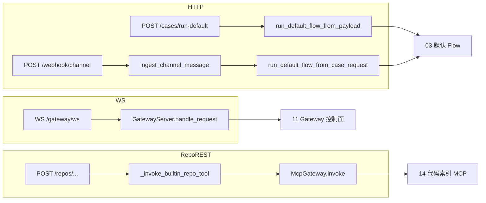

# 应用入口（API / Admin / Worker / Scheduler / CLI）

## 1. 业务目标

RootSeeker V2 通过五个独立进程入口对外暴露能力：**HTTP API** 供集成方触发排查、查询产物与 Gateway 控制面；**Admin** 提供配置控制台、错误排查聊天与仓库/定时任务管理；**Worker** 异步消费 Task 队列；**Scheduler** 按 cron 执行仓库同步与 Flow 回放门禁；**CLI** 供本地开发与运维一次性操作。

**谁触发：** 外部告警系统、运维人员、开发者或自动化脚本分别调用对应 `apps/*` 入口；各进程启动时均经 [01-bootstrap-wiring.md](./01-bootstrap-wiring.md) 的 `create_dev_runtime` 装配 `DevRuntime`。

**解决什么问题：** 将「HTTP 适配」「配置持久化」「异步任务」「定时调度」「命令行工具」从 Flow 内核中剥离，使默认排查链路（见 [03-default-triage-flow.md](./03-default-triage-flow.md)）可被多种触发方式复用，而不在每个入口重复装配 Store / Gateway。

**成功时产出：** API/Webhook 返回 `case_id` / `flow_run_id` 与 Case/Report/Evidence JSON；Admin 将配置写入 `AdminConfigStore` 并在启动时回放至内存 runtime；Worker/Scheduler/CLI 按各自语义打印任务或 Job 结果并更新对应 Store。

**失败时落到哪里：** HTTP 层 `HTTPException`（404/400/500/502）；Gateway WS 异常静默断开连接；Worker 空队列 exit 1、任务失败 exit 1；Scheduler 无到期 Job exit 1、门禁未过 exit 2；CLI 命令按子命令返回 0/1/2。

---

## 2. 入口一览

| 入口类型 | 路径 / 符号 | 说明 |
| --- | --- | --- |
| API 应用 | `apps/api/main.py:create_app` / `app` | FastAPI；REST + Webhook + Gateway WS |
| Admin 应用 | `apps/admin/main.py:create_app` / `app` | FastAPI；SPA 静态页 + `/api/*` 管理 API |
| Worker | `apps/worker/main.py:main` | `rootseeker-worker`；Task 队列单次/循环消费 |
| Scheduler | `apps/scheduler/main.py:main` | `rootseeker-scheduler`；Cron tick 单次/循环 |
| CLI | `apps/cli/main.py:main` | `rootseeker`；`demo` / `replay` / `resume` / `resume-list` |
| CLI 回放模块 | `rootseeker/cli_commands/commands/replay.py:run_replay_command` | `replay` 子命令实现 |
| Admin 配置 | `apps/admin/config_store.py:build_admin_config_store` | JSON 或 MySQL 持久化 Admin 配置 |
| 错误聊天历史 | `apps/admin/error_history.py:build_error_history_store` | file / sqlite / MySQL 持久化 error-chat 记录 |

### 2.1 Worker / Scheduler / CLI 职责对比

| 维度 | Worker | Scheduler | CLI |
| --- | --- | --- | --- |
| 核心抽象 | `TaskRuntime`（[12-task-runtime.md](./12-task-runtime.md)） | `CronScheduler`（[13-cron-scheduler.md](./13-cron-scheduler.md)） | 直接调 `DevRuntime` 或 `TaskRuntime` |
| 典型 TaskKind | `CASE_RUN`（demo seed） | `CRON`（`replay.default_flow` handler） | `FLOW_RESUME`（`resume`）；`demo` 不经 Task |
| 配置来源 | 无独立配置 Store；依赖 runtime Store | `AdminConfigStore.cron_jobs` + CLI 覆盖 | 命令行参数 |
| 运行模式 | `run_once` 或 `run_loop` 轮询 | `run_once` 或 `run_loop` tick | 单次执行后退出 |
| 与 Admin 关系 | 独立进程 | Admin `POST /api/cron-jobs/{id}/run` 后台调 `run_job_now` | 无 HTTP 耦合 |
| 默认 Flow 触发 | 经 TaskExecutor → FlowRuntime | 经 TaskExecutor → Replay + gate | `demo` 直接 `run_default_flow_from_payload` |

---

## 3. 主调用链（逐步）

### 3.1 公共装配（各进程共性）

1. `rootseeker/bootstrap/runtime.py` → `create_dev_runtime(repo_root)`
   - 入：仓库根路径（默认 `Path.cwd()`）
   - 出：`DevRuntime`（Store、Gateway、Skill/Plugin Registry）
   - 详见 [01-bootstrap-wiring.md](./01-bootstrap-wiring.md)

2. Admin 额外路径 → `apps/admin/main.py:_create_admin_runtime`
   - 构造带 `_admin_repo_credential_resolver` 的 `RepoSyncService`
   - `set_repo_sync_service` 注入全局；`_load_admin_config` 从 `AdminConfigStore` 回放 repos/catalog/skills

### 3.2 API 应用（`apps/api/main.py`）

#### 3.2.1 健康与可观测

| 方法 | 路径 | Handler | 下游 |
| --- | --- | --- | --- |
| GET | `/healthz` | `healthz` | `rootseeker/observability.py:build_runtime_health` |
| GET | `/readyz` | `readyz` | 同上 |
| GET | `/metrics` | `metrics` | `render_prometheus_metrics(runtime)` |
| GET | `/skills` | `list_skills` | `runtime.skill_registry.list_skills()` → [04-skill-system.md](./04-skill-system.md) |

#### 3.2.2 Case / Flow / 审计查询

| 方法 | 路径 | Handler | 下游 |
| --- | --- | --- | --- |
| POST | `/cases/run-default` | `run_default_case` | `DevRuntime.run_default_flow_from_payload` → [03-default-triage-flow.md](./03-default-triage-flow.md)；`FlowRuntime.checkpoints.save` |
| GET | `/cases/{case_id}` | `get_case` | `runtime.case_store.get` → [16-storage.md](./16-storage.md) |
| GET | `/reports/{case_id}` | `get_report` | `runtime.report_store.get` |
| GET | `/evidence/{case_id}` | `get_evidence` | `runtime.evidence_store.get_pack` |
| GET | `/cases/{case_id}/audit` | `get_case_audit` | `runtime.audit_log.list_events` |
| GET | `/flows/checkpoints` | `list_flow_checkpoints` | `FlowRuntime.list_checkpoints` → [05-skill-runtime-flow-executor.md](./05-skill-runtime-flow-executor.md) |

#### 3.2.3 Webhook 渠道 ingress

| 方法 | 路径 | Handler | 下游 |
| --- | --- | --- | --- |
| POST | `/webhook/{channel}` | `handle_webhook` | `ingest_channel_message` → [10-channel-routing.md](./10-channel-routing.md)；`CaseCreateRequest` → `run_default_flow_from_case_request` → [03-default-triage-flow.md](./03-default-triage-flow.md) |

支持 channel 路径参数：`webhook`、`aliyun`、`sls`、`prometheus` 等（由 channel 路由层识别）。

#### 3.2.4 Gateway WebSocket 控制面

| 方法 | 路径 | Handler | 下游 |
| --- | --- | --- | --- |
| WS | `/gateway/ws` | `gateway_websocket` | `WebSocketTransport.accept` → `GatewayServer.handle_request` → [11-gateway-control-plane.md](./11-gateway-control-plane.md) |
| GET | `/gateway/connections` | `list_gateway_connections` | `WebSocketTransport.list_connections` |

#### 3.2.5 仓库 / 代码 / 图谱 REST（薄 MCP 封装）

REST 路由统一经 `_invoke_builtin_repo_tool` → `runtime.gateway.invoke(actor="rest-api", plugin_id="builtin.code_index")`，工具名见 [14-code-index.md](./14-code-index.md)。

| 方法 | 路径 | Handler | MCP 工具 |
| --- | --- | --- | --- |
| POST | `/repos` | `register_repo` | `repo.register` |
| GET | `/repos` | `list_repos` | `repo.list` |
| GET | `/repos/{repo_name}` | `get_repo` | `repo.get` |
| DELETE | `/repos/{repo_name}` | `unregister_repo` | `repo.unregister` |
| POST | `/repos/{repo_name}/sync` | `sync_repo` | `repo.sync` |
| POST | `/repos/sync-all` | `sync_all_repos` | `repo.sync_all` |
| POST | `/repos/sync-changed` | `sync_changed_repos` | `repo.sync_changed` |
| GET | `/repos/{repo_name}/index-status` | `get_repo_index_status` | `repo.index_status` |
| POST | `/code/semantic-search` | `semantic_search_code` | `repo.semantic_search` |
| POST | `/code/find_callers` | `find_callers_code` | `code.find_callers` |
| POST | `/graph/impact` | `graph_impact` | `graph.impact` |
| POST | `/graph/context` | `graph_context` | `graph.context` |
| POST | `/graph/query` | `graph_query` | `graph.query` |
| POST | `/graph/cypher` | `graph_cypher` | `graph.cypher` |
| POST | `/graph/trace` | `graph_trace` | `graph.trace` |
| POST | `/graph/list_repos` | `graph_list_repos` | `graph.list_repos` |
| POST | `/graph/detect_changes` | `graph_detect_changes` | `graph.detect_changes` |

### 3.3 Admin 应用（`apps/admin/main.py`）

Admin 分三层：**SPA 页面路由**（返回 `admin-web/dist/index.html` 或 fallback `static/admin.html`）、**REST 管理 API**（`/api/*`）、**业务子链路**（error-chat / repo discover / cron）。

#### 3.3.1 SPA 与静态资源

| 方法 | 路径 | Handler | 说明 |
| --- | --- | --- | --- |
| GET | `/`, `/admin`, `/models`, `/advanced-settings`, `/skills`, `/repos`, `/catalog`, `/plugins`, `/notification-channels`, `/semantic-search`, `/error-chat`, `/overview`, `/schedules` | `admin_page` | 同一 SPA 入口 |
| GET | `/assets/{path:path}` | `admin_assets` | 前端静态资源 |
| GET | `/healthz` | `healthz` | `{"status":"ok"}` |

#### 3.3.2 系统状态与配置

| 方法 | 路径 | Handler | 下游 |
| --- | --- | --- | --- |
| GET | `/api/status` | `status` | skill/plugin 计数；`_invoke_admin_tool("repo.list")`；`index.get_status` |
| GET | `/api/settings` | `get_settings` | `AdminConfigStore.get_settings` |
| PUT | `/api/settings` | `update_settings` | `AdminConfigStore.update_settings` |
| GET | `/api/env-vars` | `list_env_vars` | `AdminConfigStore.list_env_vars`（secret 掩码） |
| POST | `/api/env-vars` | `upsert_env_var` | `AdminConfigStore.upsert_env_var` |
| DELETE | `/api/env-vars/{key}` | `delete_env_var` | `AdminConfigStore.delete_env_var` |

#### 3.3.3 AI Provider

| 方法 | 路径 | Handler | 下游 |
| --- | --- | --- | --- |
| GET/POST/DELETE | `/api/ai-providers` 及 `/{name}`、`/default`、`/models/{model}/switch`、`/test` | 各同名 handler | `AdminConfigStore` AI provider CRUD + `test_openai_compatible_connection` |

#### 3.3.4 通知渠道（Notification Channels）

| 方法 | 路径 | Handler | 下游 |
| --- | --- | --- | --- |
| GET | `/api/notification-channels` | `list_notification_channels` | `NotificationChannelStore.list_channels`（secret 掩码） |
| POST | `/api/notification-channels` | `create_notification_channel` | `upsert_channel` |
| PUT | `/api/notification-channels/{channel_id}` | `update_notification_channel` | `upsert_channel` |
| PATCH | `/api/notification-channels/{channel_id}` | `patch_notification_channel` | 部分更新（如 `enabled`） |
| DELETE | `/api/notification-channels/{channel_id}` | `delete_notification_channel` | `delete_channel` |
| POST | `/api/notification-channels/{channel_id}/test` | `test_notification_channel` | `ChannelAdapter.send` 测试消息 |
| GET | `/api/notification-channel-settings` | `get_notification_channel_settings` | `broadcast_enabled` 等 |
| PUT | `/api/notification-channel-settings` | `update_notification_channel_settings` | 更新全局广播开关 |

Store 工厂：`build_notification_channel_store(config_root)`；持久化规则见 [16-storage.md](./16-storage.md) §3.4.1。Flow 报告生成后 `notify.send` 经 [10-channel-routing.md](./10-channel-routing.md) 向**所有已启用渠道**广播。

#### 3.3.5 Skill / Plugin / Tool / Catalog

| 方法 | 路径 | Handler | 下游 |
| --- | --- | --- | --- |
| GET/PUT/POST/DELETE | `/api/skills` 及 `/{slug}`、`/content`、`/quick` | 各同名 handler | skill registry + store → [04-skill-system.md](./04-skill-system.md) |
| GET | `/api/plugins` | `list_plugins` | plugin registry → [06-plugin-system.md](./06-plugin-system.md) |
| GET | `/api/tools` | `list_tools` | tool registry → [07-mcp-plane.md](./07-mcp-plane.md) |
| GET/POST/DELETE | `/api/catalog` 及 `/{tenant}/{environment}/{service_name}` | 各同名 handler | service catalog → [15-service-catalog-log-data.md](./15-service-catalog-log-data.md) |

---

### 3.4 Admin 子链路：错误排查聊天（Error Chat）

**业务：** Admin UI「错误排查」页粘贴堆栈/日志，同步跑默认 Flow，可选 LLM 二次解读，历史持久化。

| 方法 | 路径 | Handler | 下游 |
| --- | --- | --- | --- |
| GET | `/api/error-chat` | `list_error_chat` | `ErrorChatHistoryStore.list_items` |
| POST | `/api/error-chat` | `submit_error_chat` | 见下方调用链 |
| DELETE | `/api/error-chat` | `clear_error_chat` | `ErrorChatHistoryStore.clear` |

**`submit_error_chat` 调用链：** `resolve_service_name` → `run_default_flow_from_payload`（[03-default-triage-flow.md](./03-default-triage-flow.md)）→ `_save_default_flow_checkpoint` → 同步或后台 `_run_llm_analysis`（`_build_llm_error_chat_payload` + `OpenAICompatibleReportClient`）→ `history_store.append`。历史经 `build_error_history_store` 持久化（[16-storage.md](./16-storage.md)）。

---

### 3.5 Admin 子链路：仓库发现与同步（Repo Discover / Sync）

Admin 在 API REST 之上增加 **远端配置**、**批量发现**、**本地导入** 与 **配置双写**（runtime MCP + `AdminConfigStore`）。

#### 远端与发现

| 方法 | 路径 | Handler | 下游 |
| --- | --- | --- | --- |
| GET | `/api/repo-remotes` | `list_repo_remotes` | `AdminConfigStore.list_repo_remotes`（token 掩码） |
| POST | `/api/repo-remotes` | `upsert_repo_remote` | store；yunxiao 校验 `git_username` |
| DELETE | `/api/repo-remotes/{name}` | `delete_repo_remote` | `AdminConfigStore.delete_repo_remote` |
| POST | `/api/repos/discover` | `discover_repos` | `_discover_repos_from_remote` → GitHub/Gitee/云效 HTTP API |

**发现链路：** `_discover_repos_from_remote` → `_discover_remote_repos`（GitHub/Gitee/云效 HTTP）→ `_normalize_remote_repo` → 云效 `_enrich_yunxiao_repos_parallel` → `_annotate_discovered_repos_import_status`。

#### 注册 / 同步 / 索引

| 方法 | 路径 | Handler | 下游 |
| --- | --- | --- | --- |
| GET | `/api/repos` | `list_repos` | `_invoke_admin_tool("repo.list")` |
| POST | `/api/repos` | `register_repo` | `repo.register` + `AdminConfigStore.upsert_repo` |
| POST | `/api/repos/import-local` | `import_local_repo` | 校验 `.git` → `repo.register`；可选 `repo.sync` |
| GET | `/api/repos/{repo_name}` | `get_repo` | `repo.get` |
| DELETE | `/api/repos/{repo_name}` | `unregister_repo` | `repo.unregister` + `store.delete_repo` |
| POST | `/api/repos/{repo_name}/sync` | `sync_repo` | `repo.sync` + `_persist_repo_state` |
| GET | `/api/repos/{repo_name}/index-status` | `repo_index_status` | `repo.index_status` |
| POST | `/api/code/semantic-search` | `semantic_search` | `repo.semantic_search` |

Admin 工具调用统一经 `_invoke_admin_tool` → `gateway.invoke(actor="admin", plugin_id="builtin.code_index")`，详见 [14-code-index.md](./14-code-index.md)。

**凭证解析：** `_admin_repo_credential_resolver` 从 repo `metadata.remote_name` 关联 `AdminConfigStore.list_repo_remotes` 的 token/username，注入 `RepoSyncService`。

---

### 3.6 Admin 子链路：Cron 配置

Cron **定义**在 Admin；**执行**在 Scheduler（[13-cron-scheduler.md](./13-cron-scheduler.md)）。

| 方法 | 路径 | Handler | 下游 |
| --- | --- | --- | --- |
| GET | `/api/cron-jobs` | `list_cron_jobs` | `AdminConfigStore.list_cron_jobs` + `CronStateStore.get_state` |
| POST | `/api/cron-jobs` | `create_cron_job` | `store.upsert_cron_job`；handler ∈ `ALLOWED_CRON_HANDLERS` |
| PUT | `/api/cron-jobs/{job_id}` | `update_cron_job` | upsert；builtin job 不可改 handler |
| DELETE | `/api/cron-jobs/{job_id}` | `delete_cron_job` | `store.delete_cron_job` |
| POST | `/api/cron-jobs/{job_id}/run` | `run_cron_job` | `BackgroundTasks` → `apps/scheduler/main.py:run_job_now` |
| GET | `/api/cron-jobs/{job_id}/runs` | `list_cron_job_runs` | `CronStateStore.list_runs` |

**允许 handler**（`apps/admin/config_store.py:ALLOWED_CRON_HANDLERS`）：

| handler | 含义 | 执行体 |
| --- | --- | --- |
| `repo.sync_changed` | 增量同步有变更仓库 | `repo_sync_changed_tool` |
| `repo.sync_all` | 全量同步 | `repo_sync_all_tool` |
| `replay.default_flow` | 默认 Flow 回放 + 门禁 | `TaskRuntime.submit(CRON)` → [17-approval-governance-replay.md](./17-approval-governance-replay.md) |

内置 Job ID：`cron.repo-sync-changed`、`cron.default-flow-replay`（`BUILTIN_CRON_JOBS`）。

---

### 3.7 Worker（`apps/worker/main.py`）

| 命令 / 模式 | 符号 | 调用链 |
| --- | --- | --- |
| 默认（单次） | `run_once` | `create_dev_runtime` → `TaskRuntime` → 可选 `_seed_demo_task(CASE_RUN)` → `task_runtime.run_once()` |
| `--loop` | `run_loop` | 循环 `run_once()`；空队列达 `max_empty_polls` 退出；间隔 `interval_seconds` |
| CLI 参数 | `--seed-demo` | 提交 demo CASE_RUN payload |
| | `--max-empty-polls` / `--max-runs` | 空闲/上限控制 |

Task 执行分派见 [12-task-runtime.md](./12-task-runtime.md)；**不**直接调用 HTTP 或 Admin API。

---

### 3.8 Scheduler（`apps/scheduler/main.py`）

CLI 参数（细节见 [13-cron-scheduler.md](./13-cron-scheduler.md)）：

| 参数 | 默认 | 说明 |
| --- | --- | --- |
| `--loop` | off | 常驻 tick 循环 |
| `--suite-name` | `cron-default-flow` | 覆盖 replay job metadata |
| `--repeat-each` | `1` | 每 case 重复次数 |
| `--schedule` / `--timezone` | `@hourly` / `UTC` | 仅 legacy replay job 空 schedule 时生效 |
| `--state-path` | settings | Cron 状态文件/MySQL |
| `--config-path` | `data/admin/config.json` | Admin cron_jobs 来源 |
| `--run-immediately` / `--no-run-immediately` | True | 首次 tick 前 `_mark_job_due` |
| `--interval-seconds` | `60` | loop 间隔 |
| `--max-runs` | `0`（无限） | loop 最多执行 Job 次数 |
| `--retries` / `--retry-delay-seconds` | `2` / `5` | tick 外层异常重试 |

| 命令 | 符号 | 调用链 |
| --- | --- | --- |
| 默认 | `run_once` | `_run_scheduler_tick` → `CronScheduler.tick` |
| `--loop` | `run_loop` | 周期性 `_run_scheduler_tick` |
| Admin 触发 | `run_job_now(job_id)` | 单 Job 强制 due → tick |

---

### 3.9 CLI（`apps/cli/main.py` + `rootseeker/cli_commands/`）

| 子命令 | Handler | 调用链 | 退出码 |
| --- | --- | --- | --- |
| `demo` | `_run_demo` | `create_dev_runtime` → `run_default_flow_from_payload` → [03-default-triage-flow.md](./03-default-triage-flow.md) | 0 / 1 |
| `replay` | `run_replay_command` | `ReplayRunner` + `default_replay_suite` → [17-approval-governance-replay.md](./17-approval-governance-replay.md) | 0 / 2 |
| `resume` | `_run_resume` | `TaskRuntime.submit(FLOW_RESUME)` → `run_once` → [05-skill-runtime-flow-executor.md](./05-skill-runtime-flow-executor.md) | 0 / 2 |
| `resume-list` | `_run_resume_list` | `FlowRuntime.list_checkpoints` | 0 |

**`resume` 参数：** `--flow-run-id`、`--title`、`--symptom`、`--service-name`、`--source`、`--trace-id`、`--force`。

---

## 4. 关键数据结构

| 名称 | 定义位置 | 谁填充 | 谁消费 |
| --- | --- | --- | --- |
| `RunCaseRequest` | `apps/api/main.py` | API `/cases/run-default` 客户端 | `run_default_case` → payload dict |
| `WebhookResponse` | `apps/api/main.py` | `handle_webhook` | Webhook 调用方 |
| `AdminErrorChatSubmitRequest` | `apps/admin/main.py` | Admin UI POST body | `submit_error_chat` |
| `AdminCronJobCreateRequest` / `UpdateRequest` | `apps/admin/main.py` | Admin cron CRUD | `AdminConfigStore.upsert_cron_job` |
| `AdminNotificationChannelRequest` 等 | `apps/admin/main.py` | Admin 通知渠道 CRUD | `NotificationChannelStore` |
| `AdminDiscoverReposFromRemoteRequest` | `apps/admin/main.py` | Admin repo discover | `_discover_repos_from_remote` |
| `ToolCallRequest` | `rootseeker/contracts/tool.py` | `_invoke_*_repo_tool` / `_invoke_admin_tool` | `McpGateway.invoke` → [07-mcp-plane.md](./07-mcp-plane.md) |
| `GatewayRequestFrame` | `rootseeker/gateway/` | WS 客户端 JSON | `GatewayServer.handle_request` → [11-gateway-control-plane.md](./11-gateway-control-plane.md) |
| `ChannelMessage` | `rootseeker/channel_routing/` | `handle_webhook` | `ingest_channel_message` → [10-channel-routing.md](./10-channel-routing.md) |
| `RepositoryRef` | `rootseeker/contracts/repository.py` | repo 工具返回 / Admin store | `RepoSyncService.register` |
| `ServiceCatalogEntry` | `rootseeker/contracts/service_catalog.py` | Admin catalog API | runtime catalog + store |
| Admin 配置文档 | `apps/admin/config_store.py` | Admin API 写入 | 启动时 `_load_admin_config` 回放 |
| Error chat item | `apps/admin/error_history.py` | `history_store.append` | Admin UI 列表展示 |

**AdminConfigStore 文档字段**（`_empty_admin_data`）：`repos`、`catalog`、`skills`、`settings`、`env_vars`、`ai_providers`、`error_chat`（预留）、`repo_remotes`、`cron_jobs`。

---

## 5. 状态与副作用

| 入口 | 读写 Store / 外部 I/O |
| --- | --- |
| API `/cases/run-default`、Webhook | 写 case / evidence / report / flow checkpoint / audit（Flow 内工具经 Gateway） |
| API 仓库 REST | 经 MCP 写 repo 状态、触发 Zoekt/Qdrant/GitNexus（[14-code-index.md](./14-code-index.md)） |
| API Gateway WS | 内存连接表；Gateway 方法可读 Case Store（[11-gateway-control-plane.md](./11-gateway-control-plane.md)） |
| Admin 配置 API | 写 `AdminConfigStore`（file 或 MySQL，[16-storage.md](./16-storage.md)） |
| Admin 通知渠道 API | 写 `NotificationChannelStore`（跟随 `storage_backend`，[16-storage.md](./16-storage.md) §3.4.1） |
| Admin error-chat | 写 case/evidence/report/checkpoint + `ErrorChatHistoryStore`；可选 LLM HTTP |
| Admin repo sync | MCP repo 工具 + `AdminConfigStore.upsert_repo` 双写 |
| Admin cron CRUD | 写 `cron_jobs`；手动 run 写 `CronStateStore` runs |
| Worker | 读写在 `TaskStore`；CASE_RUN 间接写 Case 等（[12-task-runtime.md](./12-task-runtime.md)） |
| Scheduler | 读 Admin cron 配置；写 Cron state；handler 可能调 repo sync 或 Task CRON |
| CLI demo | 同 API 默认 Flow 写 Case Store |
| CLI replay | 内存 `ReplayStore`（不持久化，[16-storage.md](./16-storage.md)） |

---

## 6. 分支与错误

| 条件 | 代码位置 | 行为 |
| --- | --- | --- |
| Case/Report/Evidence 不存在 | `apps/api/main.py:get_*` | HTTP 404 |
| MCP repo 工具失败 | `_invoke_builtin_repo_tool` / `_invoke_admin_tool` | HTTP 500 |
| repo.register 返回 `ok=false` | API `register_repo` | HTTP 400 |
| Webhook JSON 解析失败 | `handle_webhook` | 空 dict 继续规范化 |
| WS 断开或异常 | `gateway_websocket` | 取消 heartbeat；`close(connection_id)` |
| Admin cron handler 非法 | `create_cron_job` / `update_cron_job` | HTTP 400 |
| Admin cron 正在运行 | `run_cron_job`（<5s） | 返回 `started=false`, skipped |
| Admin repo sync 失败 | `sync_repo` | HTTP 502 |
| 云效 remote 缺 git_username | `upsert_repo_remote` | HTTP 400 + 提示 |
| discover remote 不存在 | `_discover_repos_from_remote` | HTTP 404 |
| AI provider 未配置 | `submit_error_chat` | Flow 仍成功；`ai_analysis.skipped` |
| Worker 无任务 | `run_once` | 打印 `no task executed`，exit 1 |
| Worker 任务非 completed | `run_once` / `run_loop` | exit 1 |
| Scheduler 无到期 Job | `run_once` | exit 1 |
| Scheduler gate 未过 | `_build_executor` replay 分支 | `JobRunStatus.FAILED` |
| CLI replay gate 失败 | `run_replay_command` | exit 2 |
| CLI resume checkpoint 缺失 | `_run_resume` | exit 2 |

---

## 7. 相关测试

| 测试文件 | 覆盖点 |
| --- | --- |
| `tests/integration/test_api_default_flow.py` | API `/cases/run-default`、report 查询、多 channel Webhook |
| `tests/unit/apps/test_admin_main.py` | Admin 健康页、repo remote/discover、catalog、error-chat、cron、配置持久化 |
| `tests/unit/apps/test_cli_entrypoints.py` | CLI demo/resume/resume-list；Worker/Scheduler CLI 入口 |
| `tests/replay/test_cli_cron_replay.py` | CLI `replay` 退出码 |
| `tests/unit/cron/test_scheduler.py` | `CronScheduler.tick` 状态机（Scheduler 内核） |

---

## 8. 与其他文档的关系

- [01-bootstrap-wiring.md](./01-bootstrap-wiring.md) — 各进程 `create_dev_runtime` 装配
- [03-default-triage-flow.md](./03-default-triage-flow.md) — 默认排查 Flow（API/Admin/Webhook/CLI demo）
- [05-skill-runtime-flow-executor.md](./05-skill-runtime-flow-executor.md) — checkpoint / resume
- [10-channel-routing.md](./10-channel-routing.md) — Webhook 归一化；通知渠道广播出站
- [11-gateway-control-plane.md](./11-gateway-control-plane.md) — Gateway WS 协议
- [12-task-runtime.md](./12-task-runtime.md) — Worker / CLI resume / Scheduler CRON 任务
- [13-cron-scheduler.md](./13-cron-scheduler.md) — Scheduler 执行细节
- [14-code-index.md](./14-code-index.md) — 仓库 REST 与 MCP 工具
- [15-service-catalog-log-data.md](./15-service-catalog-log-data.md) — Admin catalog
- [16-storage.md](./16-storage.md) — Admin / Cron / error-chat 存储后端
- [17-approval-governance-replay.md](./17-approval-governance-replay.md) — replay 与部署门禁
