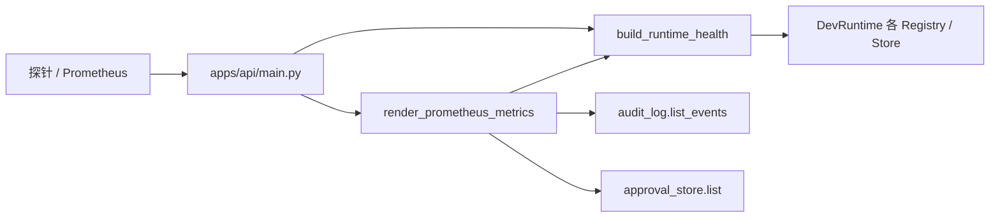
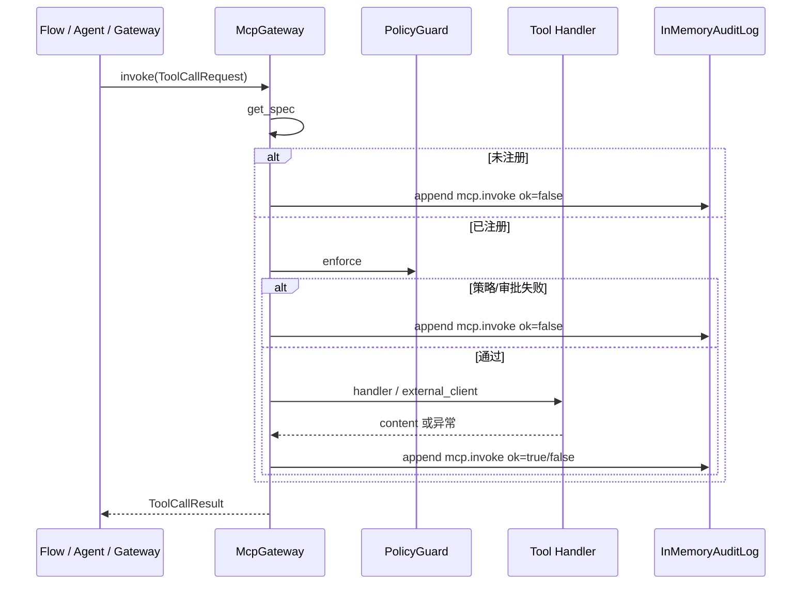

# 可观测性与基础设施防护

## 1. 业务目标

RootSeeker V2 在 API / Admin / Worker 等多进程运行时，需要统一的**健康探测、Prometheus 指标、进程内审计、日志脱敏与诊断采集**，以便运维与排障；同时提供一组**基础设施防护原语**（路径沙箱、出站 URL 校验、命令执行审批、原子 JSON 读写、事件总线、OpenAI 兼容层、密钥解析），供上层按需组合。

**谁触发：** K8s / 负载均衡探活调用 `/healthz`、`/readyz`；Prometheus 或运维脚本抓取 `/metrics`；每次 MCP 工具调用经 `McpGateway.invoke` 写审计；Agent 循环经 `AgentRunLoop._emit` 写 agent 事件；配置或契约中的 `SecretRef` 经 `resolve_secret` 解析。

**解决什么问题：** 避免各入口重复实现探针与指标格式；敏感字段在结构化日志中统一脱敏；MCP 与 Agent 工具轨迹可查询、可聚合；出站 HTTP / LLM / 文件写入有独立可测的安全边界。

**成功时产出：** `/healthz` 与 `/readyz` 返回组件计数 JSON；`/metrics` 返回 Prometheus 文本；`InMemoryAuditLog` 追加 `AuditEvent`；`StructuredLogger` 记录已脱敏 payload；`resolve_secret` 返回明文密钥字符串。

**失败时落到哪里：** 健康组件计数异常时 `status=degraded`；密钥缺失或 exec 失败 `ValueError`；`NetworkGuard` / `SafePathGuard` / `ExecApprovalGuard` 校验失败 `ValueError` 或 `ExecApprovalResult(approved=False)`；审计本身不阻断业务（Gateway 在返回 `ToolCallResult` 前/后均 append）。

---

## 2. 入口一览

| 入口类型 | 路径 / 符号 | 说明 |
| --- | --- | --- |
| HTTP 存活 | `apps/api/main.py` → `GET /healthz` | 返回 `build_runtime_health(runtime)` |
| HTTP 就绪 | `apps/api/main.py` → `GET /readyz` | 同上（当前与 healthz 等价） |
| HTTP 指标 | `apps/api/main.py` → `GET /metrics` | `render_prometheus_metrics(runtime)`，`text/plain` |
| Case 审计查询 | `apps/api/main.py` → `GET /cases/{case_id}/audit` | `audit_log.list_events(case_id=...)` |
| Bootstrap 装配 | `rootseeker/bootstrap/runtime.py` → `create_dev_runtime` | 创建 `InMemoryAuditLog()` 并注入 `McpGateway` |
| MCP 审计写入 | `rootseeker/mcp_plane/gateway.py` → `McpGateway.invoke` | 每次 invoke 结束 `_audit()` → `audit.append` |
| Agent 事件写入 | `rootseeker/agent_runtime/run_loop.py` → `AgentRunLoop._emit` | `build_agent_event` → `audit_log.append` |
| 健康聚合 | `rootseeker/observability/health.py` → `build_runtime_health` | 统计 skills/plugins/tools/cases/audit/checkpoints |
| Prometheus 渲染 | `rootseeker/observability/metrics.py` → `render_prometheus_metrics` | 基于 health + audit + approval_store |
| 密钥解析 | `rootseeker/secrets/resolver.py` → `resolve_secret` | 支持 env / file / exec 三种 `SecretRefKind` |
| 路径沙箱 | `rootseeker/infra_core/fs_safe.py` → `SafePathGuard.ensure_safe` | 限制路径在 workspace_root 内 |
| 出站 URL 校验 | `rootseeker/infra_core/network_guard.py` → `NetworkGuard.validate_url` | http/https + 私网/回环拦截 |
| 命令审批 | `rootseeker/infra_core/exec_approval.py` → `ExecApprovalGuard.check` | deny_all / allowlist 前缀匹配 |
| 原子 JSON | `rootseeker/infra_core/json_files.py` → `AtomicJsonStore` | 临时文件 + replace，经 `SafePathGuard` |
| 进程内总线 | `rootseeker/infra_core/event_bus.py` → `EventBus` | topic subscribe / publish |
| Agent 审计工厂 | `rootseeker/infra_core/agent_events.py` → `build_agent_event` | 构造 `AuditCategory.SYSTEM` 事件 |
| OpenAI 兼容 | `rootseeker/infra_core/openai_compat.py` | MiMo base URL、headers、连通性探测 |
| 出站 HTTP | `rootseeker/infra_core/http_client.py` | `outbound_http_client`、`resolve_http_proxy` |
| 全局配置 | `rootseeker/infra_core/settings.py` → `RootSeekerSettings` | `ROOTSEEKER_*` 环境变量 |
| 日志脱敏 | `rootseeker/observability/redaction.py` | `redact_payload` / `redact_value` |
| 结构化日志 | `rootseeker/observability/logger.py` → `StructuredLogger` | info/error，写入前脱敏 |
| 诊断采集 | `rootseeker/observability/diagnostic.py` → `DiagnosticCollector` | 委托 `StructuredLogger` 记录 `diagnostic.*` |

> **说明：** 代码中密钥解析入口为函数 `resolve_secret`，**未找到**名为 `SecretResolver` 的类。

---

## 3. 主调用链（逐步）

### 3.1 API 探针与指标（`/healthz` / `/readyz` / `/metrics`）

1. `apps/api/main.py` → `create_app`
   - 入：`repo_root`（默认 `Path.cwd()`）
   - 出：`runtime = create_dev_runtime(...)`，注册三个 GET 路由
2. `GET /healthz` 或 `GET /readyz` → `build_runtime_health(runtime)`
   - 入：`DevRuntime`（含 skill_registry、plugin_registry、tool_registry、case_store、audit_log、flow_checkpoint_store）
   - 出：`{"status": "ok"|"degraded", "components": {...}}`
   - 下一步：直接 JSON 响应
3. `GET /metrics` → `render_prometheus_metrics(runtime)`
   - 入：同上 `DevRuntime`
   - 出：Prometheus 文本（`rootseeker_up`、`rootseeker_*_total`、`rootseeker_component_up`、`rootseeker_audit_events_total`、`rootseeker_agent_tool_events_total`、`rootseeker_approvals_total`）
   - 下一步：`Response(content=..., media_type="text/plain; version=0.0.4; charset=utf-8")`

### 3.2 健康状态聚合

1. `rootseeker/observability/health.py` → `build_runtime_health(runtime)`
   - 对每个组件调用 `_count_component(counter)`：
     - `skills` → `len(skill_registry.list_skills())`
     - `plugins` → `len(plugin_registry.list_plugins())`
     - `tools` → `len(tool_registry.list_specs())`
     - `cases` → `_store_count(case_store)`
     - `audit` → `audit_log.count()`
     - `checkpoints` → `_store_count(flow_checkpoint_store)`
   - `_store_count` 依次尝试 `count()`、`list_all()`、`list_records(limit=-1)`
   - 任一组件 `_count_component` 抛错 → 该组件 `status=error`；全部 ok 则顶层 `status=ok`，否则 `degraded`

### 3.3 MCP Gateway 审计链

1. `rootseeker/bootstrap/runtime.py` → `create_dev_runtime`
   - `audit = InMemoryAuditLog()`
   - `gateway = McpGateway(tools, policy, audit)`
2. 任意调用方构造 `ToolCallRequest` → `McpGateway.invoke(...)`
   - 调用方含：Flow executor、Agent `ToolCallLoop`、Gateway `tool.*` 方法、Admin/API REST（见 [07-mcp-plane.md](./07-mcp-plane.md)）
3. `rootseeker/mcp_plane/gateway.py` → `invoke` 内部 `_audit(ok, err, content)`
   - 入：`case_id`、`step_id`、`skill_name`、`tool_name`、`latency_ms`、`arguments_keys`、可选 `plugin_id`、`error`、`content_preview`（最多 5 键）
   - 出：`AuditEvent(event_id=audit-{uuid}, category=TOOL_CALL, action="mcp.invoke", actor=..., target=tool_name)`
   - 下一步：`self._audit.append(event)` → `InMemoryAuditLog._events`
4. **审计时机：** 未注册工具、策略拒绝、审批要求、handler 异常、成功执行——**五种结局均写审计**
5. Case 级查询：`apps/api/main.py` → `GET /cases/{case_id}/audit`
   - `audit_log.list_events(case_id=case_id, limit=limit)`，匹配 `event.target == case_id` 或 `detail.case_id == case_id`

### 3.4 Agent 事件与 Prometheus 活动指标

1. `rootseeker/agent_runtime/run_loop.py` → `AgentRunLoop.run_stream`
   - 生命周期：`agent.run.started` →（每 attempt）`agent.tool.trace` / `agent.tool.error` → 可选 `agent.context.compacted` → `agent.attempt.retrying` → `agent.run.{completed|failed}`
2. `_emit` → `build_agent_event(action, actor="agent-runtime", target, detail)` → `runtime.audit_log.append`
   - 同时 yield `AgentRunEvent` 供 `run_payload_stream` 消费（**不经过** `infra_core.EventBus`）
3. `render_prometheus_metrics` 读取全量 audit：
   - `rootseeker_audit_events_total{action=...}` — 按 `event.action` 计数
   - `rootseeker_agent_tool_events_total{tool_name,ok,error_code}` — 过滤 `agent.tool.trace`、`agent.tool.error`、`mcp.invoke`
   - `rootseeker_approvals_total{status=pending|approved|rejected}` — 来自 `approval_store.list(limit=100000)`

### 3.5 日志脱敏与诊断

1. `StructuredLogger.info/error(event, payload)` → `redact_payload(payload)`
2. `redact_payload`：键名（小写）命中 `token|secret|password|api_key|authorization` → `[REDACTED]`；字符串内 PEM 块 → `[REDACTED_PEM]`；含 token/secret 的长串 → `[REDACTED]`
3. `DiagnosticCollector.record(name, payload)` → `logger.info("diagnostic.{name}", payload)`

### 3.6 密钥解析（SecretRef）

1. 契约定义：`rootseeker/infra_core/secret_ref.py` → `SecretRefKind`（`env` / `file` / `exec`）、`SecretRef(kind, ref)`
2. `rootseeker/secrets/resolver.py` → `resolve_secret(ref, workspace_root=..., timeout_seconds=3.0)`
   - **env：** `os.getenv(ref.ref)`，缺失 → `ValueError("env secret not found: ...")`
   - **file：** 相对路径时 `workspace_root / ref`；不存在 → `ValueError`；读取 UTF-8 并 `strip()`
   - **exec：** `subprocess.run(ref.ref, shell=True, ...)`；非零退出 → `ValueError(stderr)`；stdout `strip()`
3. 消费方：`contracts/log_source.py` 中 `secret_ref` 字段为引用键（非内联密钥）；**当前生产路径未在 grep 范围内发现对 `resolve_secret` 的调用**，仅单元测试覆盖

### 3.7 基础设施防护原语

| 组件 | 核心方法 | 行为摘要 | 当前装配 |
| --- | --- | --- | --- |
| `SafePathGuard` | `ensure_safe(target)` | `resolve()` 后必须 `relative_to(workspace_root)` | 被 `AtomicJsonStore` 使用 |
| `AtomicJsonStore` | `write` / `read` | 临时文件 + `replace` 原子写；读前 `ensure_safe` | **仅单元测试**；cron/admin 各自实现文件读写 |
| `NetworkGuard` | `validate_url(url)` | 仅 http/https；字面 IP 且 private/loopback/link_local 且 `allow_private=False` 时拒绝 | `DevRuntime.network_guard` |
| `ExecApprovalGuard` | `check(command)` | `deny_all` 全拒；无 allowlist 则放行；否则前缀匹配 `allow_patterns` | `DevRuntime.exec_approval_guard` |
| `EventBus` | `subscribe` / `publish` | 同 topic 多 handler，payload 浅拷贝 | `DevRuntime.event_bus`；`case.completed` → `GatewayWsBridge` WS 广播 |

### 3.8 OpenAI 兼容与出站 HTTP

1. `openai_compat.py`：`resolve_mimo_base_url` 按 api_key 前缀 `tp-` 与 legacy URL 映射 MiMo 端点；`build_openai_compat_headers` 设置 Bearer + `api-key`；`build_openai_compat_chat_payload` 对 Kimi Coding 省略 temperature；`test_openai_compatible_connection` 探测 `/models` 或 fallback `/chat/completions`
2. 消费：`rootseeker/analysis/llm_report.py`（报告增强）、`apps/admin/main.py`（Provider 测试与配置）、`rootseeker/code_index/embedding.py`（向量 headers）
3. `http_client.py`：`resolve_http_proxy` 读 `ROOTSEEKER_HTTP_PROXY` / 标准代理 env，Docker 内 `127.0.0.1` ↔ `host.docker.internal` 互换；`outbound_http_client` 构建 `httpx.Client`

---

## 4. 关键数据结构

| 名称 | 定义文件 | 字段 / 含义 | 谁填充 | 谁消费 |
| --- | --- | --- | --- | --- |
| `AuditEvent` | `rootseeker/contracts/audit.py` | `event_id`, `category`, `action`, `actor`, `target`, `detail`, `occurred_at` | `McpGateway._audit`、`build_agent_event` | `InMemoryAuditLog`、API `/cases/{id}/audit`、`render_prometheus_metrics` |
| `AuditCategory` | 同上 | `TOOL_CALL`, `APPROVAL`, `STATE_CHANGE`, `SECURITY`, `SYSTEM` | Gateway（TOOL_CALL）、Agent（SYSTEM） | 查询 / 指标（按 action 聚合） |
| `InMemoryAuditLog` | `rootseeker/observability/audit.py` | 内存 `_events: list[AuditEvent]` | `append` | `list_events`, `count`, metrics |
| 健康 JSON | `health.py` 返回值 | `status`, `components.{name}.{status,count?,error?}` | `build_runtime_health` | `/healthz`, `/readyz`, metrics 前缀 |
| `SecretRef` / `SecretRefKind` | `rootseeker/infra_core/secret_ref.py` | `kind`: env/file/exec；`ref`: 变量名或路径或 shell 命令 | 配置 / 契约 | `resolve_secret` |
| `ExecApprovalResult` | `rootseeker/infra_core/exec_approval.py` | `approved: bool`, `reason: str` | `ExecApprovalGuard.check` | 调用方（待集成） |
| `AgentRunEvent` | `rootseeker/agent_runtime/result.py` | `event_type`, `case_id`, `attempt_id`, `payload`, `result?` | `AgentRunLoop._emit` | 流式 API / 测试 |
| `RootSeekerSettings` | `rootseeker/infra_core/settings.py` | 存储、LLM、审批、索引、Agent 等 `ROOTSEEKER_*` | 环境 / `.env` | `create_dev_runtime`、各 app |
| `PresenceRecord` | `rootseeker/infra_core/system_presence.py` | 节点心跳 `node_id`, `role`, `last_seen_at` | `DevRuntime.heartbeat_presence` | `GET /system/presence`、`system.list_presence`、health `components.presence` |

---

## 5. 状态与副作用

### 审计 Store

- **写入：** 仅 append，无 update/delete；进程重启后 `InMemoryAuditLog` 清空（与 memory/sqlite/mysql 业务 Store 独立）
- **MCP 路径：** 每次 `invoke` 1 条 `action=mcp.invoke`；`detail.ok` 反映成败
- **Agent 路径：** 一次 run 多条 SYSTEM 事件（started、tool traces、compacted、completed/failed）
- **可读：** `GET /cases/{case_id}/audit`；metrics 全量扫描 `list_events(limit=-1)`

### 健康 / 指标

- **无持久化：** 每次请求实时计数各 Registry / Store
- **副作用：** 只读；`approval_store.list(limit=100000)` 在 metrics 路径可能较重

### 日志 / 诊断

- `StructuredLogger` 内存 `_records`；`DiagnosticCollector` 不单独存储

### 防护组件

- `SafePathGuard` / `NetworkGuard` / `ExecApprovalGuard`：纯函数式校验，无内部状态变更
- `AtomicJsonStore.write`：创建目录、写临时文件、原子 replace（磁盘副作用）
- `resolve_secret` exec 分支：启动子 shell 进程

### 与 Bootstrap 的关系

见 [01-bootstrap-wiring.md](./01-bootstrap-wiring.md)：`create_dev_runtime` 第 2 步 `InMemoryAuditLog()`，第 11 步 `McpGateway(..., audit)`；`DevRuntime.audit_log` 字段供 API 与 Agent 共享。

---

## 6. 分支与错误

| 条件 | 代码位置 | 行为 |
| --- | --- | --- |
| Store 无 `count/list_all/list_records` | `health.py:_store_count` | 抛 `AttributeError` → 组件 `status=error` → 顶层 `degraded` |
| 组件 counter 任意异常 | `health.py:_count_component` | 捕获后组件 `status=error`，`error=str(exc)` |
| MCP 工具未注册 | `gateway.py:invoke` | `TOOL_NOT_REGISTERED`，仍 `_audit(False, ...)` |
| 写工具需审批 | `gateway.py` + `PolicyGuard` | `APPROVAL_REQUIRED`，审计 `ok=false` |
| 策略 dry-run 拒绝 | 同上 | `POLICY_DENIED` |
| Handler 异常 | `gateway.py` | `TOOL_EXEC_ERROR`，审计含 `error` 字典 |
| env 密钥缺失 | `secrets/resolver.py` | `ValueError("env secret not found: ...")` |
| file 密钥不存在 | 同上 | `ValueError("file secret not found: ...")` |
| exec 非零退出 | 同上 | `ValueError("exec secret failed: ...")` |
| 非 http(s) URL | `network_guard.py:validate_url` | `ValueError("only http/https are allowed")` |
| 私网 / 回环 IP | `network_guard.py:_validate_host` | `ValueError("private/loopback address is blocked: ...")` |
| 路径逃逸 workspace | `fs_safe.py:ensure_safe` | `ValueError("path escapes workspace root: ...")` |
| `ExecApprovalGuard.deny_all=True` | `exec_approval.py:check` | `approved=False, reason="execution denied by policy"` |
| 命令不在 allowlist | 同上 | `approved=False, reason="command not in allowlist"` |
| 不支持的 secret kind | `secrets/resolver.py` | `ValueError("unsupported secret ref kind: ...")` |

---

## 7. 相关测试

| 测试文件 | 覆盖点 |
| --- | --- |
| `tests/unit/observability/test_observability_components.py` | 脱敏键名；StructuredLogger + DiagnosticCollector；`build_runtime_health` 组件计数；Prometheus 含 agent/approval 活动指标 |
| `tests/unit/infra_core/test_infra_components.py` | SafePathGuard 逃逸拦截；AtomicJsonStore 读写；NetworkGuard 私网拦截；ExecApprovalGuard allowlist；EventBus + PresenceRegistry |
| `tests/unit/infra_core/test_openai_compat.py` | MiMo base URL 解析；Kimi Coding temperature 省略；chat payload 构建 |
| `tests/unit/secrets/test_secret_resolver.py` | `resolve_secret` 三种 kind（env / file / exec） |
| `tests/integration/test_api_default_flow.py` | API `/healthz`、`/readyz`、`/metrics` 端到端 |
| `tests/unit/mcp_plane/test_gateway.py` | Gateway invoke 审计 append |
| `tests/unit/agent_runtime/test_agent_runtime.py` | Agent 事件 action 集合（含 `agent.tool.trace`、`agent.run.completed`） |
| `tests/unit/storage/test_memory_store.py` | Store 与 `InMemoryAuditLog` 协同 |

---

## 8. 与其他文档的关系

| 文档 | 关系 |
| --- | --- |
| [01-bootstrap-wiring.md](./01-bootstrap-wiring.md) | `create_dev_runtime` 创建 `InMemoryAuditLog` 并注入 `McpGateway`；`DevRuntime.audit_log` 字段说明 |
| [07-mcp-plane.md](./07-mcp-plane.md) | MCP 调用链与 `McpGateway.invoke` 审计 detail 字段；PolicyGuard 与审计时序 |
| [11-gateway-control-plane.md](./11-gateway-control-plane.md) | Gateway WS 订阅/广播（独立于 `infra_core.EventBus`）；`/gateway/ws` 与 API 同进程 |
| [09-agent-runtime.md](./09-agent-runtime.md) | Agent `build_agent_event` → audit；Prometheus agent 指标 |
| [03-default-triage-flow.md](./03-default-triage-flow.md) | Flow 步骤经 Gateway 产生的 `mcp.invoke` 审计 |
| [17-approval-governance-replay.md](./17-approval-governance-replay.md) | `rootseeker_approvals_total` 与 `ApprovalStore` 状态 |

### 装配现状摘要

- **已接线：** `InMemoryAuditLog` ← Bootstrap ← MCP Gateway / Agent；API `/healthz` `/readyz` `/metrics` `/cases/{id}/audit`；LLM/Admin 使用 `openai_compat` + `http_client`
- **库就绪、待业务集成：** `NetworkGuard`、`ExecApprovalGuard`、`EventBus`、`AtomicJsonStore`（生产 cron/admin 使用各自 Store 实现，未统一走 `AtomicJsonStore`）
- **密钥：** `SecretRef` 契约 + `resolve_secret` 已实现；log source 等字段预留 `secret_ref` 字符串键

---

*文档范围：`rootseeker/observability/`、`rootseeker/infra_core/`、`rootseeker/secrets/` 及 `apps/api/main.py` 探针路由。*
