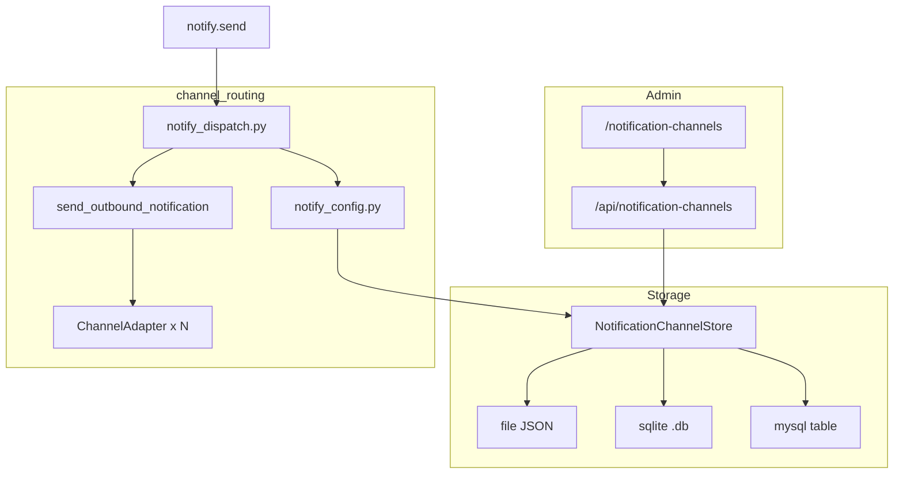

# 通知渠道管理（Notification Channels）设计规格

**日期：** 2026-08-17  
**状态：** 已批准并实现（方案 2 + 策略 A 全局广播）  
**相关模块：** `rootseeker/channel_routing/`、`rootseeker/storage/`、`apps/admin/`

---

## 1. 背景与目标

RootSeeker 默认排查 Flow 在报告生成后执行 `notify.send`（`defer_until: after_report`），向外部 IM 渠道推送分析结论摘要。

**现状问题：**

- 出站 notify 经 `dispatch_env_resolved_notify` 读 **环境变量**，仅支持单 URL。
- Admin「消息回调」页（`/callbacks`）可 CRUD 多条记录，但运行时 **不读取** `callbacks[]` 列表。
- 保存 callback 时写入 `AdminConfigStore.settings` 的 `ROOTSEEKER_NOTIFY_*`，API/Worker 进程 **不会自动加载** 这些 settings。
- `test_callback` 发通用 JSON，不走 `ChannelAdapter` 的真实渠道格式。
- 无「启用多条 → 广播」能力。

**目标：**

1. 新建 Admin「通知渠道」页，支持添加/编辑/启用/测试飞书、钉钉、企微、Slack、Discord、通用 Webhook。
2. 分析结论生成后，向 **所有已启用渠道** 广播同一条摘要（策略 A）。
3. 渠道配置持久化于 **独立 NotificationChannelStore**；后端 **固定跟随** `ROOTSEEKER_STORAGE_BACKEND`（`sqlite`→sqlite 文件，`mysql`→MySQL 表，`memory`→本地 JSON），**不提供**单独的环境变量 override。
4. 运行时（API / Worker / Admin）在 notify 时懒加载 Store，改配置后下一 Case 生效。

---

## 2. 非目标（MVP 不做）

- 按 service / severity / team 的条件路由（策略 B）。
- 将渠道表并入主库 `data/rootseeker.db` 的 `cases` 等同文件（子 Store 使用独立 sqlite 文件）。
- 自定义消息模板编辑器（沿用 `build_notify_args` 固定模板）。

---

## 3. 架构



### 3.1 移除旧 `/callbacks`

旧「消息回调」页与 `/api/callbacks` 为未接入运行时的半成品，**本特性实现时一并删除**，不保留 redirect、不保留 deprecated API。

| 删除项 | 说明 |
| --- | --- |
| Admin 路由 | `/callbacks` SPA 路由与侧栏入口 |
| Admin API | `GET/POST/DELETE /api/callbacks`、`POST /api/callbacks/{name}/test` |
| AdminConfigStore | `callbacks[]` 字段及 `list_callbacks` / `upsert_callback` / `delete_callback` |
| 静态 fallback | `apps/admin/static/admin.html` 中 callbacks 视图 |
| 相关测试 | `test_admin_main.py` 中 callbacks 用例改为 notification-channels |

**可选一次性数据迁移（仅代码内，无旧 API）：** 若 `data/admin/config.json`（或 MySQL admin 文档）中仍有历史 `callbacks[]`，Admin 首次启动时可导入到新 Store 后从 admin 文档中清除该字段。不对外暴露旧接口。

---

## 4. 存储后端（跟随 `STORAGE_BACKEND`）

### 4.1 两个「库」不要混淆

RootSeeker 存在 **主业务 Store** 与 **子 Store** 两层：

| 层级 | 环境变量 | 作用 | sqlite 时的文件 |
| --- | --- | --- | --- |
| **主业务 Store** | `ROOTSEEKER_STORAGE_BACKEND` | Case / Evidence / Report / Task / Checkpoint | `data/rootseeker.db` |
| **通知渠道子 Store** | （无独立 env；**固定跟随**上一列） | 仅通知渠道配置 | `data/admin/notification_channels.db` |

**「sqlite 主库 → sqlite 渠道库」的含义：**

- 当 `ROOTSEEKER_STORAGE_BACKEND=sqlite` 时，通知渠道 Store **自动**使用 sqlite 实现。
- 渠道数据写入 **独立文件**（默认 `data/admin/notification_channels.db`），**不会**写入 `data/rootseeker.db`。
- 用户 **无需、也无法** 单独配置 `NOTIFICATION_CHANNEL_STORE`；与主库模式始终一致。

### 4.2 解析规则（仅内部，不对用户暴露）

| `ROOTSEEKER_STORAGE_BACKEND` | NotificationChannelStore 实现 | 持久化位置 |
| --- | --- | --- |
| `mysql` | `MysqlNotificationChannelStore` | MySQL 表 `notification_channels`（连接参数同 `ROOTSEEKER_MYSQL_*`） |
| `sqlite` | `SqliteNotificationChannelStore` | `data/admin/notification_channels.db`（独立 sqlite 文件） |
| `memory` | `FileNotificationChannelStore` | `data/admin/notification_channels.json`（本地开发/单测默认） |

```python
# rootseeker/storage/backend_resolve.py
def resolve_notification_channel_store(
    settings: RootSeekerSettings,
) -> Literal["file", "sqlite", "mysql"]:
    backend = settings.storage_backend
    if backend == "mysql":
        return "mysql"
    if backend == "sqlite":
        return "sqlite"
    return "file"
```

### 4.3 Settings 字段（仅路径，无 store 模式开关）

```python
# rootseeker/infra_core/settings.py — 不新增 notification_channel_store
notification_channel_file: str = "data/admin/notification_channels.json"
notification_channel_sqlite_path: str = "data/admin/notification_channels.db"
```

**刻意不提供的配置：**

- `ROOTSEEKER_NOTIFICATION_CHANNEL_STORE`
- Admin UI / 高级设置中的「渠道存储模式」选项

---

## 5. 数据模型

### 5.1 渠道记录 `NotificationChannelRecord`

| 字段 | 类型 | 说明 |
| --- | --- | --- |
| `channel_id` | string (PK) | UUID |
| `name` | string | 显示名，Store 内唯一 |
| `channel_type` | enum | `webhook` \| `feishu` \| `dingtalk` \| `wechat_work` \| `slack` \| `discord` |
| `endpoint_url` | string | HTTPS Webhook URL |
| `secret` | string? | 钉钉签名校验等；API 列表掩码 |
| `enabled` | bool | 是否参与广播 |
| `sort_order` | int | UI 排序，默认 0 |
| `metadata` | object | 预留 |
| `created_at` | ISO8601 | |
| `updated_at` | ISO8601 | |

### 5.2 全局设置 `NotificationChannelSettings`

| 字段 | 类型 | 默认 | 说明 |
| --- | --- | --- | --- |
| `broadcast_enabled` | bool | `true` | 关闭时回退 legacy 单渠道（env / `notify_channel` metadata） |

存储方式：Store 内 singleton 行（sqlite/mysql 独立 `notification_channel_settings` 表或 JSON 文件顶层 `settings` 键）。

### 5.3 Sqlite / MySQL 表

**`notification_channels`**

```sql
CREATE TABLE IF NOT EXISTS notification_channels (
    channel_id VARCHAR(64) PRIMARY KEY,
    name VARCHAR(255) NOT NULL UNIQUE,
    channel_type VARCHAR(32) NOT NULL,
    endpoint_url TEXT NOT NULL,
    secret TEXT,
    enabled TINYINT(1) NOT NULL DEFAULT 1,
    sort_order INT NOT NULL DEFAULT 0,
    metadata JSON,
    created_at VARCHAR(64) NOT NULL,
    updated_at VARCHAR(64) NOT NULL
);
```

**`notification_channel_settings`**

```sql
CREATE TABLE IF NOT EXISTS notification_channel_settings (
    settings_key VARCHAR(64) PRIMARY KEY,
    payload JSON NOT NULL
);
-- 固定 key = 'default'
```

---

## 6. Store 接口

```python
class NotificationChannelStore(Protocol):
    def list_channels(self) -> list[dict[str, Any]]: ...
    def get_channel(self, channel_id: str) -> dict[str, Any] | None: ...
    def upsert_channel(self, channel: dict[str, Any]) -> dict[str, Any]: ...
    def delete_channel(self, channel_id: str) -> None: ...
    def get_settings(self) -> dict[str, Any]: ...
    def update_settings(self, patch: dict[str, Any]) -> dict[str, Any]: ...
```

工厂：`build_notification_channel_store(repo_root, settings=None) -> NotificationChannelStore`

实现类：

- `FileNotificationChannelStore`
- `SqliteNotificationChannelStore`
- `MysqlNotificationChannelStore`

---

## 7. channel_routing 改动

### 7.1 `notify_config.py`（新）

```python
def list_enabled_outbound_targets(
    store: NotificationChannelStore,
) -> list[OutboundTarget]:
    """Map enabled channel records to OutboundTarget for adapters."""
```

映射规则：`channel_type` → `OutboundTarget.channel`；`endpoint_url` → `endpoint`；`secret` 等入 `metadata`。`OutboundTarget.team` 固定为 `"default"`（内部契约，**不提供** UI/API 字段）。

### 7.2 `notify_dispatch.py`（改）

新增：

```python
def dispatch_broadcast_notify(
    message: str,
    *,
    repo_root: Path,
    settings: RootSeekerSettings | None = None,
) -> dict[str, Any]:
```

逻辑：

1. 加载 Store + `broadcast_enabled`。
2. 若 `broadcast_enabled=false` → 调用现有 `dispatch_env_resolved_notify(channel, message)`（legacy）。
3. 若启用渠道列表为空 → `{ok: true, metadata: {skipped: true}}`。
4. 对每个 `OutboundTarget` 调用 `send_outbound_notification`（best-effort，单条失败不中断其余）。
5. 返回聚合结果：

```json
{
  "ok": true,
  "sent": 2,
  "failed": 0,
  "results": [
    {"ok": true, "channel": "feishu", "message": "..."},
    {"ok": true, "channel": "dingtalk", "message": "..."}
  ],
  "metadata": {"broadcast": true}
}
```

### 7.3 接入点

- `mcp_servers/external/composite_adapter.py` → `send_notification` 改调 `dispatch_broadcast_notify(message=...)`（忽略单 `channel` 参数，或仅 legacy 模式使用）。
- 消息正文仍由 `build_notify_args` 生成，模板不变：

```
[{service}] {title} | root_cause={cause} | evidence={N}
```

### 7.4 支持的适配器（不变）

| channel_type | 适配器 |
| --- | --- |
| `webhook` | `WebhookChannelAdapter` |
| `feishu` | `FeishuChannelAdapter` |
| `dingtalk` | `DingTalkChannelAdapter` |
| `wechat_work` | `WeChatWorkAdapter` |
| `slack` | `SlackChannelAdapter` |
| `discord` | `DiscordChannelAdapter` |

---

## 8. Admin API

| 方法 | 路径 | 说明 |
| --- | --- | --- |
| GET | `/api/notification-channels` | 列表；`secret` 掩码 |
| POST | `/api/notification-channels` | 创建 |
| PUT | `/api/notification-channels/{channel_id}` | 全量更新 |
| PATCH | `/api/notification-channels/{channel_id}` | 部分更新（如 `enabled`） |
| DELETE | `/api/notification-channels/{channel_id}` | 删除 |
| POST | `/api/notification-channels/{channel_id}/test` | 经 `ChannelAdapter` 发送测试消息 |
| GET | `/api/notification-channel-settings` | 读取 `broadcast_enabled` 等 |
| PUT | `/api/notification-channel-settings` | 更新全局设置 |

**测试消息模板：**

```
[RootSeeker] 通知渠道测试 | channel={channel_type} | name={name}
```

---

## 9. Admin UI（`apps/admin-web`）

### 9.1 路由

- 页面：`/notification-channels`
- 侧栏：「通知渠道」（icon: `NotificationOutlined` 或复用 `MessageOutlined`）
- **删除** 原 `/callbacks` 路由与菜单项（不 redirect）

### 9.2 页面结构

1. **顶栏**：标题 + 描述 +「添加渠道」按钮 + 全局广播 Switch。
2. **统计**：`已启用 N / 共 M`。
3. **渠道卡片列表**（或 Table）：
   - 名称、渠道类型 Tag、启用 Switch、URL（ellipsis）
   - 操作：测试、编辑、删除
4. **Modal**：添加/编辑表单（§5.1 字段）。

---

## 10. 错误处理

| 场景 | 行为 |
| --- | --- |
| `broadcast_enabled=false` | Legacy 单渠道：env → `resolve_notify_outbound_target` |
| 无启用渠道 | `ok=true`, `skipped=true` |
| 部分渠道 HTTP 失败 | 其余继续；`ok=false` 或 `partial=true`；`results[]` 含 error |
| 未知 `channel_type` | 该条 `ok=false`, `error=no adapter` |
| Store 不可用 | notify 返回 `ok=false`；**不**导致 Flow 整体失败 |

---

## 11. 测试计划

| 文件 | 覆盖 |
| --- | --- |
| `tests/unit/storage/test_notification_channel_store.py` | File / Sqlite / Mysql CRUD + settings |
| `tests/unit/storage/test_backend_resolve.py` | `resolve_notification_channel_store` 跟随 `storage_backend` |
| `tests/unit/channel_routing/test_notify_broadcast.py` | fan-out、skip、partial failure |
| `tests/unit/apps/test_admin_main.py` | 新 REST API + test 走 adapter |
| `tests/integration/test_default_flow.py` | Flow 结束后 notify 广播（RecordingAdapter） |

---

## 12. 文档更新清单

- `docs/business-logic/10-channel-routing.md` — §3.3 出站改为 Store 广播
- `docs/business-logic/16-storage.md` — 新增 NotificationChannelStore 子后端
- `docs/business-logic/18-apps-api-admin-cli.md` — 新 Admin 路由；移除 callbacks 文档

---

## 13. 实现顺序建议

1. Storage：`backend_resolve` + `notification_channels.py` + 单元测试
2. Routing：`notify_config` + `dispatch_broadcast_notify` + 单元测试
3. Admin API + 删除旧 callbacks 代码；可选从 legacy admin 文档导入数据
4. Admin UI 新页；移除 callbacks 路由/菜单
5. 集成测试 + business-logic 文档

---

## 14. 决策记录

| 决策 | 选择 | 理由 |
| --- | --- | --- |
| 广播策略 | A 全局广播 | 用户确认 |
| 存储方案 | 方案 2 独立 Store | 用户确认；真 sqlite/mysql 双轨 |
| 存储跟随规则 | 仅读 `storage_backend`：mysql→mysql, sqlite→sqlite, memory→file | 不对用户暴露子 Store 开关 |
| 旧 callbacks | 路由/API/Store 字段全部删除 | 用户要求不保留 |
