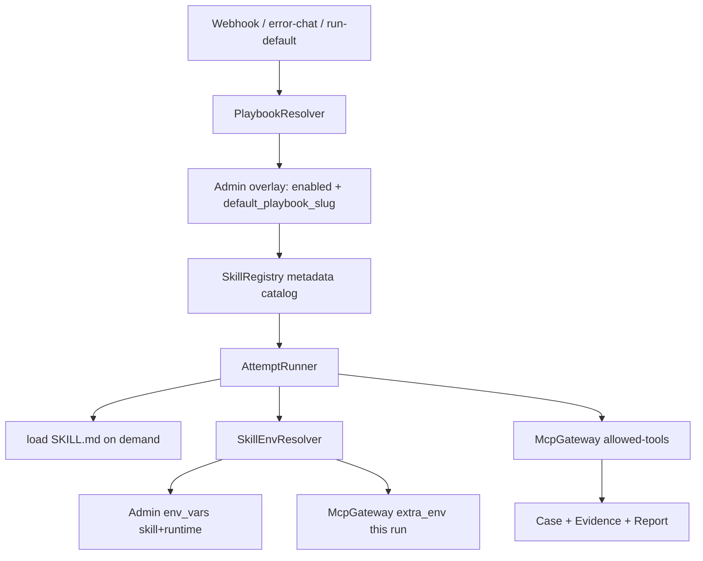

# 用标准 Skills 替换 Flow（路径 B）设计规格

**日期：** 2026-08-19  
**状态：** 已实现（2026-08-19）  
**相关模块：** `rootseeker/skill_system/`、`rootseeker/skill_runtime/`、`rootseeker/agent_runtime/`、`rootseeker/bootstrap/`、`apps/admin/`、`skills/`

---

## 1. 背景与目标

当前 Skill 系统是「内置排查 Flow 的 YAML 步进编排器」：`SKILL.md` 给人看，`rootseeker-skill.yaml` 驱动 `execute_skill_flow`。启动只扫 `skills/builtin/`；主流程 slug 写死为 `flows/default-log-triage`；Admin 自定义技能是 JSON `SkillSpec`，没有技能目录；Admin `scope=skill` 环境变量被刻意排除，从未注入运行时。这与 [Agent Skills](https://agentskills.io/specification) 及 `npx skills add` 分发模型不兼容。

**目标：**

1. 默认排查流程本身也是标准 Skill 包（`SKILL.md` + 标准 frontmatter），不是特殊引擎。
2. 执行器改为 Agent：Webhook / 错误聊天 / `run-default` 只走 `AttemptRunner` 类路径，按主流程正文 + 渐进加载 helper Skills，经 MCP 调工具。
3. **无过渡期、无双栈**：一次切过去。`execute_skill_flow` 不再作为任何默认入口的回退。
4. builtin playbook 不可删除、可以禁用；任意已启用的 playbook（含用户新建或外部安装）可被设为当前主流程。
5. Skill 若声明了环境变量键名，开跑时从 Admin / 进程环境正确加载；secret 不进 prompt。
6. 支持从 GitHub / 本地目录 / zip 安装标准 Skill 到 `skills/external/`。

**成功时：** 一次告警或错误聊天会解析当前主流程 Skill，Agent 产出 tool plan，MCP 执行，写入 Case / Evidence / Report；`skill_slug` 为当前 playbook 的 `name`。

**失败时：** Planner 失败、缺主流程、缺必需 env、工具不在 `allowed-tools` 内 → Case 失败并带明确错误码，**不会**调用旧 Flow 步进器。

---

## 2. 非目标

- 不执行 Skill 包内 `scripts/`（工具面只有 MCP Gateway）。
- 不接入 skills.sh 账号体系或官方 marketplace UI；安装输入是 Git URL / `owner/repo` / 本地路径 / zip。
- 不做按 service / symptom 的自动多 Skill 组合引擎；一次 Run 只有一个主流程 playbook，helper 由 Agent 按 description 点名加载。
- 不恢复 YAML `defer_until` / `skip_if` / 按 `start_from_step_index` 续跑。通知「报告后再发」写在 playbook 正文里，引擎不强制；未调用 `notify.send` 时报告 metadata 记 `notify_skipped`，默认不当硬失败。
- 不把密钥写入仓库内 `SKILL.md`。
- 不在本规格实现技能自动沉淀（DraftBuilder / Review / Publisher）。那些模块若仍写入 sidecar JSON，视为后续工作；本次不把它们接到默认执行路径。

---

## 3. 架构



**保留：** Case / Evidence / Report Store、MCP Gateway、ToolRegistry、Admin 高级设置 env_vars、Agent tool plan 与并发调用。

**替换：** `SkillComposer.compose` → `PlaybookResolver.resolve`。`DevRuntime.run_default_flow_from_case_request` 改为跑 Agent playbook（函数名可暂时保留以免无谓改 HTTP 路径，但实现不得再进 `execute_skill_flow`）。

**删除主路径：** `execute_skill_flow` 步进循环、`plugins/builtin/default_log_triage_flow` 对它的委托、Gateway `flow.resume` 按步恢复的成功路径、Task `FLOW_STEP` / `FLOW_RESUME` 的逐步语义。这些入口改为返回明确错误码 `FLOW_STEP_UNSUPPORTED`（或删除 API；实现时选删除，测试同步删）。

### 3.1 标识符

- 技能主键是 Agent Skills 的 `name`（kebab-case，与目录名一致，≤64）。
- 不再使用 `flows/default-log-triage` 这种带路径前缀的 slug。出厂主流程 `name` 为 `default-log-triage`。
- 注册表、Admin API、Case `selected_skills`、报告 metadata 一律用 `name`。
- 旧配置里若仍存 `flows/default-log-triage`，加载 overlay 时归一成 `default-log-triage`。这是启动时的标识符归一，不是双执行栈。

### 3.2 Playbook vs helper

frontmatter：

```yaml
metadata:
  role: playbook   # 或省略/helper
```

- 有效 role = overlay.role（若有）否则 frontmatter `metadata.role`，再否则 `helper`。
- 仅有效 role 为 `playbook` 的技能可被设为主流程。
- helper 不能 `set_default`。外部安装的标准包默认是 helper；用户可在 Admin 把它标成 playbook（只写 overlay，不改安装目录里的文件），然后再设为主流程。
- 出厂：`default-log-triage` 在文件内即为 playbook；现有工具类技能为 helper。

---

## 4. Skill 文件格式

每个技能是一个目录：

```
<name>/
  SKILL.md          # 必填
  references/       # 可选，Agent 点名后再读
  assets/           # 可选，不自动加载
  scripts/          # 允许存在，运行时不执行
```

`SKILL.md` 必须符合 agentskills.io：YAML frontmatter + Markdown 正文。必填 `name`、`description`。`name` 必须等于目录名。

RootSeeker 使用的扩展（全部放在 `metadata` 下，避免冒充标准必填字段）：

| 键 | 含义 | 缺省 |
| --- | --- | --- |
| `role` | `playbook` 或 `helper` | `helper` |
| `env` | 字符串列表，本技能需要的环境变量键名 | `[]`（不额外加载） |
| `env_optional` | 允许缺失的键名 | `[]`；`env` 里其余键均为 required |

标准字段 `allowed-tools`：空格分隔的 MCP 工具名（与现有 `bound_tools` / step `action` 对齐，例如 `code.search`）。Playbook 应列出本流程允许调用的工具。Helper 列出自己相关的工具。本轮 Run 的允许集合 = playbook 的 `allowed-tools` ∪ 已加载 helper 的 `allowed-tools`。未列出的工具调用被拒绝。

**不再需要** `rootseeker-skill.yaml` 才能运行。仓库内现有 sidecar 在实现时删除或忽略；解析器只读 `SKILL.md`。

builtin `default-log-triage` 的正文必须把今天 14 步排查顺序写成 Agent 可执行的指令（含「先出报告再 notify.send」）。各 helper 的现有 `SKILL.md` + `references/` 保留为渐进披露内容。

---

## 5. 发现、覆盖层、启用/禁用

### 5.1 扫描根

按顺序扫描并注册（后写同名覆盖前者，但 **禁止** 用 custom/external 覆盖 builtin 文件；同名冲突见安装节）：

1. `{repo_root}/skills/builtin/`
2. `{repo_root}/skills/custom/`（Admin 新建）
3. `{repo_root}/skills/external/`（安装产物）

只认目录内名为 `SKILL.md` 的包。`source_kind`：builtin / custom / external（`SkillSourceKind.CUSTOM` 表示 custom 目录；external 用 `source_kind=custom` 会混在一起——**明确用三个值**）。契约层将 `SkillSourceKind` 扩展为 `builtin | custom | generated | external`。`generated` 本规格不加载。

### 5.2 Overlay（Admin 持久化）

存在 `AdminConfigStore.settings`（或独立 `skills_overlay` 字段，实现时选 settings 下命名空间 `skills`）：

```yaml
skills:
  default_playbook: default-log-triage
  overlays:
    default-log-triage: { enabled: true }
    my-db-triage: { enabled: true, role: playbook }
```

- `enabled` 缺省为 `true`。
- `role` 可选，覆盖文件内 `metadata.role`，用于把已安装的标准包标成排查流程。
- 禁用与 role 覆盖只改 overlay，不改 builtin / external 文件。
- 启动：发现 → 校验 frontmatter → 套 overlay → 注册表只缓存：`name`、`description`、`path`、`role`、`allowed-tools`、`env` 键列表、`source_kind`、`enabled`。正文按需读取。

### 5.3 保护规则

| 操作 | 规则 |
| --- | --- |
| 删除 `source_kind=builtin` | 拒绝 `SKILL_BUILTIN_PROTECTED` |
| 禁用任意技能 | 允许；写入 overlay `enabled: false` |
| 删除 custom/external | 允许（若不是当前主流程，或先切主流程） |
| 禁用/删除当前主流程 | 若 builtin `default-log-triage` 仍存在且 enabled → 自动把 `default_playbook` 设回它并记录；否则拒绝 `SKILL_DEFAULT_REQUIRED` |
| 无任何 enabled playbook | 拒绝开跑 `SKILL_DEFAULT_UNAVAILABLE` |

Admin `DELETE /api/skills/{name}` 必须走上述规则，不得再 `unregister` 掉 builtin。

---

## 6. 安装与新建

**输入：** GitHub `owner/repo`、完整 Git URL、本地目录、zip。可选指定单个技能目录名。

**步骤：**

1. 取出内容到临时目录。
2. 发现其中所有 `SKILL.md` 包，按 agentskills 规则校验（`name`、description 非空、目录名匹配、无路径穿越）。
3. 与 builtin `name` 冲突 → 拒绝，不落盘。
4. 与已有 custom/external 同名 → 拒绝，除非请求带 `overwrite=true`（仍不能覆盖 builtin）。
5. 拷贝到 `skills/external/<name>/`。
6. `registry.upsert`。**不**修改 `default_playbook`。
7. zip 失败或 clone 失败：删除临时目录与任何半成品目标目录。

新建：Admin 在 `skills/custom/<name>/` 写入 `SKILL.md`（创建表单选 role=playbook 或 helper），同一套校验与注册。禁止再把完整 `SkillSpec` JSON 当作技能本体存进 `config.json` 的 `skills[]`。实现时读取到旧 `skills[]` JSON 则忽略（不迁移执行语义）；用户需按标准包重建。这是切断旧模型，不是双栈。

Gateway 增加：`skill.install`、`skill.set_default`、`skill.disable` / `skill.enable`。现有 `skill.list` / `skill.get` 改为返回标准元数据（含 `role`、`enabled`、`source_kind`、是否为当前主流程）。

---

## 7. 主流程解析

顺序（第一条命中且 enabled 且 `role=playbook` 即用）：

1. Case metadata `preferred_skill` / `skill_slug` / `selected_skills[0]`（值按 3.1 归一）
2. Overlay `default_playbook`
3. builtin `default-log-triage` 若 enabled
4. 否则失败 `SKILL_DEFAULT_UNAVAILABLE`

`skill.set_default(name)`：目标必须存在、enabled、`role=playbook`。写入 overlay。立即对后续 Run 生效（下一次入站读取 overlay，不要求重启进程；注册表在 set/install/disable 时 upsert）。

Webhook / `POST /cases/run-default` / Admin 错误聊天全部使用同一解析器。

---

## 8. 一次 Run（Agent）

1. `PlaybookResolver.resolve`。
2. `SkillEnvResolver` 收集 playbook 声明的 env 键（helper 的键在该 helper 被加载后再并入；开跑时先校验 playbook 的 required 键）。
3. 构造 Planner 输入：
   - system / playbook：主流程 `SKILL.md` 全文（非 secret 的 `${KEY}` 已替换）
   - catalog：所有 **enabled** 技能的 `name` + `description`（不含未点名 helper 正文）
   - case 标题 / symptom / metadata
4. Planner 产出 tool plan。每个 `tool_name` 必须 ∈ 当前允许集合。
5. Agent 需要 helper 细节时，`ContentLoader` 读该 helper 的 body + `references/`（受 `skill_context_max_chars` 限制），并合并该 helper 的 env 声明后补齐 extra_env；缺 required 键则该次加载失败并让 Case 失败。
6. `ToolCallLoop` 经 Gateway 执行。本轮 MCP `extra_env` = 全局 runtime/mcp 注入 ∪ 本轮 SkillEnv。
7. `Case.steps` 来自这次 tool plan，不是 YAML。写 Case / Evidence / Report。
8. 若允许集合含 `notify.send` 且本次未调用，报告 metadata `notify_skipped: true`。

Planner 失败：Case `failed`，错误码 `SKILL_PLANNER_FAILED`。无 Flow 回退。

恢复：用 Agent `prior_attempts` 摘要重试。旧 checkpoint 的 `start_from_step_index` 不再被执行；相关 API 删除或固定返回 `FLOW_STEP_UNSUPPORTED`。实现选择：**删除** `flow.resume` / `FLOW_STEP` / `FLOW_RESUME` 的成功语义及对应测试，避免假装还能按步恢复。

---

## 9. 环境变量

Skill 只声明键名。值来自 Admin `env_vars` 或进程环境，不写进技能文件。

**取值优先级（后者覆盖前者）：**

1. 进程环境
2. Admin `scope=runtime`
3. Admin `scope=skill`

`scope=mcp` 仍只进入 MCP 全局 extra_env（现有 `env_from_admin_items`），不因 Skill 声明而进入 Agent 正文替换。

**注入：**

- MCP 本轮 extra_env：并入本轮已解析键。
- SKILL.md / catalog 注入 Agent：只替换 Admin 中 `secret=false`（或缺省非密）的 `${KEY}`。`secret=true` 的值禁止出现在 prompt、`compacted_context`、Case metadata。
- `env` 中不在 `env_optional` 的键，若进程环境与 Admin skill/runtime 均无值 → 开跑失败 `SKILL_ENV_MISSING`，不进 Planner。
- 未声明 `env` 的技能：不并入任何 skill-only 变量（与当前「skill 作用域不进 MCP」一致，除非被本轮其他已加载技能声明）。

安装与 `set_default` **不**要求 env 已配齐。Admin 技能详情列出声明的键及是否已配置（值掩码）。

---

## 10. 错误码

| 码 | 何时 |
| --- | --- |
| `SKILL_INVALID_PACKAGE` | 安装/新建校验失败 |
| `SKILL_NAME_CONFLICT` | 与 builtin 或未 overwrite 的已有包冲突 |
| `SKILL_BUILTIN_PROTECTED` | 删除 builtin |
| `SKILL_NOT_PLAYBOOK` | 对 helper 调用 set_default |
| `SKILL_DEFAULT_REQUIRED` | 禁用/删除当前主流程且无法切回 builtin |
| `SKILL_DEFAULT_UNAVAILABLE` | 开跑时无可用 playbook |
| `SKILL_ENV_MISSING` | 缺 required env |
| `SKILL_PLANNER_FAILED` | Planner 无可用 tool plan |
| `SKILL_TOOL_NOT_ALLOWED` | 工具不在 allowed-tools |
| `FLOW_STEP_UNSUPPORTED` | 仅当暂时保留旧 URL 时返回；优选直接删除该 API |

---

## 11. 测试边界

- 无 sidecar 的标准 `SKILL.md` 可注册；`name` 与目录不一致则拒绝。
- builtin 删除失败；禁用成功；禁用当前主流程则 `default_playbook` 回到 `default-log-triage`（若其仍 enabled）。
- 安装 fixture 到 `external/` 不改变主流程；`set_default` 后 `run-default` 的 `selected_skills[0]` / metadata `skill_slug` 为新 playbook。
- 用户新建 playbook 可设为主流程；helper 调用 `set_default` 失败。overlay 把已安装 helper 标成 playbook 后可以 `set_default`。
- Agent 输入含 playbook 全文 + 其他技能 description；不含未点名 helper 全文。
- 不在 `allowed-tools` 的调用 → `SKILL_TOOL_NOT_ALLOWED`。
- `run-default` 测试断言调用栈不进入 `execute_skill_flow`（函数应已删除或仅测试其不存在）。
- Planner 失败 → Case failed，无 Flow 产物冒充成功。
- playbook 声明 `FOO`，Admin skill 作用域有值 → MCP 侧可 `echo_env` 读到；`secret=true` 不出现在 prompt。
- 无 `env` 声明 → skill-only Admin 变量不出现在本轮 extra_env。
- 缺 required env → `SKILL_ENV_MISSING`。

---

## 12. 实现时必须改动的边界（便于拆 plan）

- 契约：`SkillSpec` 主键改为 `name`；`skill_kind` 可保留兼容字段但运行时以 `metadata.role` 为准。实现时删除对 `steps` 的执行依赖；`steps` 字段不再由 builtin 填充。
- `build_registry_from_builtin_skills` 改为扫描三个根目录的通用 `build_skill_registry`。
- `graph-lookup` 等历史 `tools:` 字段随 sidecar 删除而消失；工具名写进 `allowed-tools`。
- Admin-web Skills 页：系统/用户分栏改为 builtin vs custom/external；增加禁用、设为默认、安装入口；去掉对 JSON upsert 的依赖。
- `AttemptRunner`：去掉「planner 失败则 `flow_runtime.run_default`」的回退（当前 `allow_default_fallback`）。无过渡期要求这条回退删除。

---

## 13. 规格自检记录

- 无 TBD/TODO。过渡期已明确禁止。
- 主流程指针、保护规则、Agent 加载、env 优先级、删除旧步进器彼此一致。
- 本规格是单一产品切分（Skill 格式 + 发现安装 + 默认指针 + Agent 执行 + env）。实现 plan 应按模块拆任务，但发布必须同一次切到 Agent，不允许「先上安装器仍跑 YAML」。
- 已钉死：标识符用 `name`；旧 slug 只做 overlay 归一；scripts 不执行；secret 不进 prompt；无 Flow 回退。
