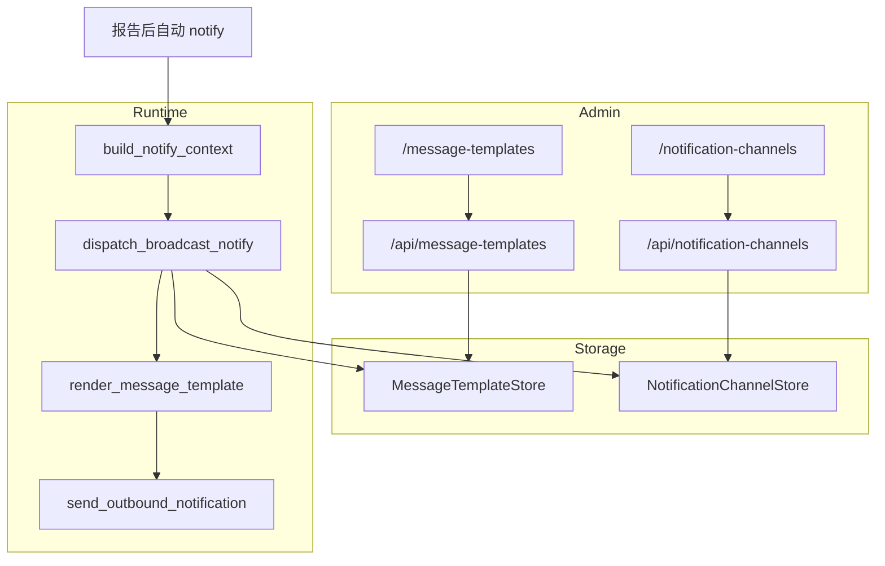

# 消息通知模板系统设计规格

**日期：** 2026-09-09  
**状态：** 已实现（方案 1；渲染 B；渠道未选回退系统模板）  
**分支：** `v1.1.1`  
**相关模块：** `rootseeker/storage/`、`rootseeker/channel_routing/`、`rootseeker/skill_runtime/`、`apps/admin/`、`apps/admin-web/`  
**前置规格：** `docs/superpowers/specs/2026-08-17-notification-channels-design.md`（该文档 MVP 明确不做自定义消息模板；本规格补齐该能力）

---

## 1. 背景与目标

RootSeeker 在报告生成后向已启用通知渠道广播分析摘要。当前文案由 `build_notify_args` → `_build_notify_message` **硬编码**拼装，Admin「通知渠道」页无法配置格式。

**目标：**

1. Admin 新增「消息模板」菜单：可编辑通知正文格式，并标明可用变量名称与含义。
2. 明确发送通知前可填充的变量集合（由现有 Case / Report 结构推导），发送前填充模板。
3. 「通知渠道」编辑时可选模板；选定后该渠道出站文案按模板渲染。
4. 将现有默认通知固化为**系统模板**（可查看/修改，禁止删除）；普通模板默认不存在，创建后可增删改。

---

## 2. 非目标（本规格不做）

- 按 service / severity / team 条件选不同模板。
- 富文本 / 渠道原生卡片 DSL（飞书卡片 JSON 等）；模板输出仍为**纯文本字符串**，再交给现有 `ChannelAdapter`。
- 模板版本历史、导入导出、多语言。
- 在 Skill / playbook 层暴露自定义模板编辑（仍由 Admin 配置驱动）。

---

## 3. 已确认 / 暂定决策

| 议题 | 决策 | 说明 |
| --- | --- | --- |
| 架构 | **独立 MessageTemplateStore** + 渠道 `template_id` | 对齐 NotificationChannelStore 模式 |
| 渲染语法 | **`{{var}}` + `{{#var}}...{{/var}}`** | 空值时条件块整段省略，接近现有行为 |
| 渠道未选模板 | **回退系统模板** | 兼容现有渠道，零配置仍可发 |
| 广播语义 | **按渠道分别渲染** | 不同渠道可绑不同模板；不再共用一条预渲染文案 |
| 系统模板变更 | 用户可改 body；**kind 仍为 system**，禁止删除 | 不提供「恢复出厂」MVP（可选后续） |

> 若产品确认推翻上表，以确认结果为准并改本规格。

---

## 4. 架构



### 4.1 发送数据流

1. Case 完成报告后，组装 **notify 变量上下文**（见 §6）。
2. 读取已启用渠道列表。
3. 对每个渠道：解析 `template_id` → 加载模板（缺失则系统模板）→ `render(body, context)` → `send_outbound_notification`。
4. 聚合各渠道结果，保持现有 broadcast 元数据结构（扩展为可含 per-channel `message` 摘要，便于排查）。

### 4.2 与现状差异

| 现状 | 本规格 |
| --- | --- |
| `_build_notify_message` 直接产出最终字符串 | 改为 `build_notify_context` + 模板渲染 |
| `dispatch_broadcast_notify(message)` 全渠道同一文案 | 改为传入 context（或内部重建），**按渠道渲染** |
| 渠道无模板字段 | 渠道增加可选 `template_id` |

---

## 5. 数据模型

### 5.1 消息模板记录

```json
{
  "template_id": "system-default",
  "name": "默认通知",
  "kind": "system",
  "body": "【RootSeeker】{{headline}}\n...",
  "description": "系统内置默认通知模板",
  "created_at": "...",
  "updated_at": "..."
}
```

| 字段 | 类型 | 约束 |
| --- | --- | --- |
| `template_id` | string | 主键；系统模板固定为 `system-default` |
| `name` | string | 必填，展示名 |
| `kind` | `"system"` \| `"custom"` | 系统仅允许一条 `system` |
| `body` | string | 必填，模板正文 |
| `description` | string | 可选 |
| `created_at` / `updated_at` | ISO8601 | |

**删除规则：** `kind == "system"` → API 返回 400/403，UI 禁用删除。  
**创建规则：** 用户新建一律 `kind=custom`；禁止经 API 创建第二个 system。

### 5.2 系统模板正文（初始值）

对齐当前 `_build_notify_message` 的字段与顺序（条件块对应「有值才输出」）：

```text
【RootSeeker】{{headline}}
{{#problem}}问题：{{problem}}
{{/problem}}{{#service}}服务：{{service}}
{{/service}}{{#cause}}结论：{{cause}}
{{/cause}}{{#narrative}}说明：{{narrative}}
{{/narrative}}{{#confidence}}置信度：{{confidence}}
{{/confidence}}Case：{{case_id}}
```

说明：

- `confidence` 变量在上下文中预格式化为如 `62%`（空或 0 时视为 falsy，条件块不输出），与现网「confidence > 0 才显示」一致。
- 现有函数中「cause/narrative 与 headline/problem 去重」等启发式：迁入 **`build_notify_context`**，保证系统模板变量已是清洗后的值；普通模板直接使用同一上下文。

### 5.3 渠道扩展

在 `NotificationChannelStore` 规范化 payload 中增加：

| 字段 | 类型 | 默认 | 说明 |
| --- | --- | --- | --- |
| `template_id` | string \| `""` | `""` | 空表示使用系统模板 |

校验：若非空，创建/更新时可校验模板存在（软校验：发送时再回退系统模板，避免删模板后渠道不可编辑）。

### 5.4 存储后端

与通知渠道一致，**跟随** `ROOTSEEKER_STORAGE_BACKEND`：

| backend | MessageTemplateStore | 默认路径 / 表 |
| --- | --- | --- |
| `mysql` | Mysql | 表 `message_templates` |
| `sqlite` | Sqlite | `data/admin/message_templates.db` |
| `memory` | File JSON | `data/admin/message_templates.json` |

Store 在首次加载时 **ensure 系统模板存在**（若不存在则写入初始 body）。

---

## 6. 变量目录（发送前可填充）

上下文由 `CaseCreateRequest` + `CaseReport`（及现有清洗逻辑）构建。Admin「消息模板」页以只读列表展示下表。

| 变量 | 含义 | 主要来源 |
| --- | --- | --- |
| `headline` | 通知标题行 | 异常摘要 → 清洗后结论 → 可用 Case 标题 → `"排查完成"` |
| `problem` | 问题摘要 | `report.metadata.problem_summary` / summary / `build_problem_summary` |
| `service` | 服务名 | 解析后的服务名（占位名置空） |
| `cause` | 结论标题 | `root_cause.title` 清洗，并与 headline/problem 去重 |
| `narrative` | 说明 | `root_cause.narrative`（过滤过程性文案，截断） |
| `confidence` | 置信度展示串 | `root_cause.confidence` → `"62%"`；≤0 为空 |
| `case_id` | Case ID | `report.case_id` |
| `title` | Case 原始标题 | `case_request.title` |
| `exception` | 异常摘要 | 从 symptom 提取 |
| `symptom` | 症状原文 | `case_request.symptom`（可截断，默认上限与现网摘要策略一致或 500 字） |

**Truthy 规则（条件块）：** 去掉首尾空白后非空字符串为真；其余类型按 Python 真值，但推荐上下文一律用 `str`。

---

## 7. 模板渲染器

新建小模块（建议路径：`rootseeker/channel_routing/message_template_render.py`）：

- 支持 `{{name}}` 替换。
- 支持 `{{#name}}...{{/name}}`：name 为真则保留内部并递归替换，否则整段删除。
- **不支持** else、嵌套复杂逻辑、循环（YAGNI）。
- 未知变量：替换为空串；未知条件块：视为假（整段删除）。
- 不引入 Mustache/Jinja 依赖（自研极简解析器即可，便于单测）。

---

## 8. Admin API

### 8.1 消息模板

| Method | Path | 说明 |
| --- | --- | --- |
| GET | `/api/message-templates` | 列表；附带 `variables` 元数据（变量目录） |
| GET | `/api/message-templates/{template_id}` | 详情 |
| POST | `/api/message-templates` | 创建普通模板 |
| PUT | `/api/message-templates/{template_id}` | 更新 name/body/description（系统允许改这些字段） |
| DELETE | `/api/message-templates/{template_id}` | 仅 `custom`；`system` → 错误 |

`GET` 列表响应示例字段：`items[]`、`variables: [{ name, description }]`。

### 8.2 通知渠道

创建/更新/补丁请求体增加可选 `template_id`。列表/详情返回该字段。

测试发送 `POST /api/notification-channels/{id}/test`：使用该渠道绑定模板 + **样例上下文**（固定 fixture）渲染后发送，便于验证模板格式。

---

## 9. Admin UI

### 9.1 侧栏

在「通知渠道」旁新增：**消息模板**（路由 `/message-templates`）。

### 9.2 消息模板页

- 表格：名称、类型（系统/普通）、更新时间、操作（编辑；删除仅普通）。
- 编辑抽屉/弹窗：名称、正文（多行）、可用变量提示（标签或表格，只读）。
- 新建：仅普通模板。

### 9.3 通知渠道表单

增加「消息模板」下拉：选项含系统模板 + 全部普通模板；允许「默认（系统模板）」空值。

---

## 10. 运行时改动清单

| 位置 | 改动 |
| --- | --- |
| `rule_step_argument_resolver.py` | `_build_notify_message` 拆为 `build_notify_context`；保留兼容路径或改为渲染系统模板 |
| `attempt_runner` / notify 调用链 | 传递 context 或仍调 `build_notify_args`，但最终广播按渠道渲染 |
| `notify_dispatch.dispatch_broadcast_notify` | 签名调整为接受 `message` **或** `context`；有 context 时按渠道渲染 |
| `notify_config.list_enabled_outbound_targets` | 携带 `channel_id` / `template_id`（扩展 `OutboundTarget.metadata` 或模型字段） |
| 新 Store + `backend_resolve` | 解析 message template store |
| Admin `main.py` + `admin-web` | API 与页面 |

**兼容：** 无模板数据、无 `template_id` 时行为与现网默认文案一致（系统模板初始 body + 同一上下文清洗）。

---

## 11. 测试计划

- 渲染器：变量替换、条件块真/假、未知变量、嵌套文本换行。
- Store：ensure 系统模板；禁止删系统；普通 CRUD；backend file/sqlite（及现有 mysql 模式若有测例）。
- 渠道：`template_id` 读写；空则回退。
- `build_notify_context`：覆盖现有 `test_build_notify_args_*` 语义（headline/service/去过程性 narrative 等）。
- 广播：两渠道绑不同模板 → 发出两条不同 message。
- Admin API：删系统模板失败；列表含 variables。

---

## 12. 实现顺序建议

1. 渲染器 + 变量上下文（保留现有单测绿）。
2. MessageTemplateStore + ensure 系统模板。
3. 渠道 `template_id` + dispatch 按渠道渲染。
4. Admin API。
5. Admin Web 菜单与表单。
6. 回归通知相关单测与手工测通道。

---

## 13. 产品细则（已拍板）

1. **不做**系统模板「恢复出厂」按钮；用户改坏需手工改回或对照本规格 §5.2。
2. **`symptom` 公开**于变量目录；填充时截断（建议上限 500 字符）。
3. 删除普通模板后，仍引用该 `template_id` 的渠道在**发送时回退系统模板**；渠道表单下拉中失效 id 可显示为「模板已失效」，保存时可清空为默认。
