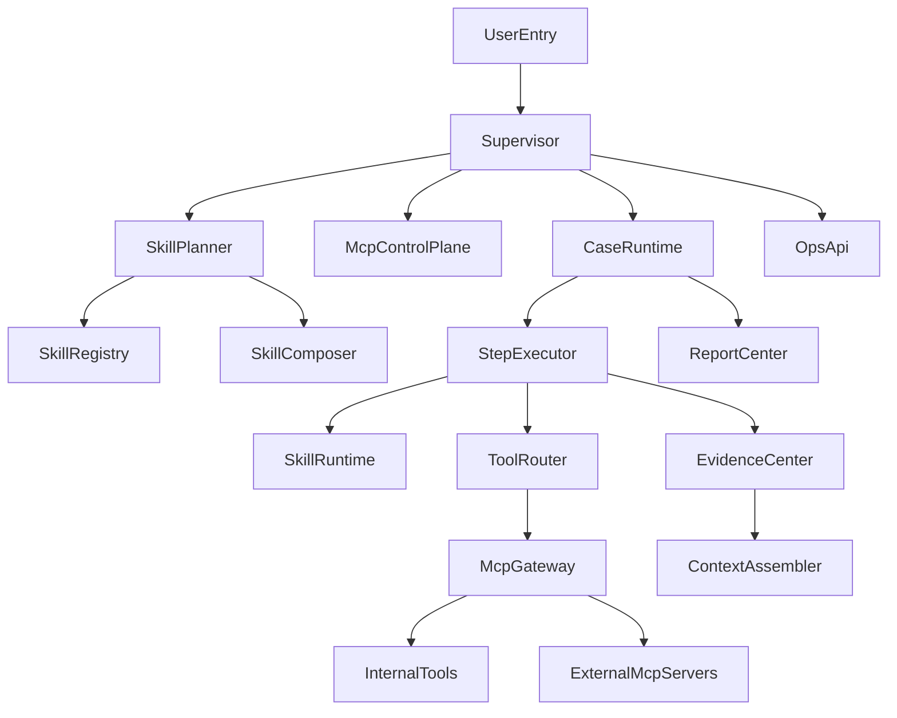

# RootSeeker V2 重构蓝图

## 1. 项目背景

当前有三个重要参考对象：

- `root_seek`：现有 RootSeeker 项目，定位为企业级故障排查系统，重点在日志链路故障分析。
- `hermes-agent`：可参考其 `skills` 机制，以及基于历史执行结果自动沉淀/生成 `skills` 的思路。
- `openclaw-main` / `openclaw-analysis`：可参考其插件化、控制面/执行面分离、以及 Lobster 风格的可恢复工作流能力。

本次目标不是在现有 `root_seek` 上继续堆功能，而是重写一套新的 `RootSeeker V2`，重点提升：

- 兼容性
- 扩展能力
- 技能化排查能力
- MCP 化工具接入能力
- 大规模工程下的模块拆解与上下文控制能力

---

## 2. 总体目标

RootSeeker V2 的重构目标如下：

1. 将所有排查流程抽象为 `Skill`，而不是写死在业务服务中。
2. 将所有排查工具统一收口为 `MCP` 接入模型，避免多套工具协议并存。
3. 将现有大而重的分析逻辑拆为 `总控 -> 模块 -> 功能 -> 类文件` 的 4 级结构。
4. 支持规则驱动、LLM 驱动、人工审批、可暂停/可恢复工作流。
5. 让系统具备自动沉淀经验、自动生成 `Skill Draft` 的能力。

第一优先级约束：

- V2 必须先完成现有 `root_seek` 的核心能力对齐。
- V2 必须先跑通现网日志链路故障排查默认 Flow。
- Agent Runtime、插件系统、Gateway、CLI、Cron、Infra 都是服务于 Case 排查主链路的工程能力，不是把系统泛化成通用 AI 助手平台。
- 在日志数据面、服务映射、SLS 查询、trace 补全、代码索引、报告输出没有明确契约前，不应继续机械拆分更多低价值任务文档。

---

## 3. 技术栈建议

### 3.1 结论

主基底优先推荐 **Python 3**。

### 3.2 技术栈优先级

1. **Python 3 优先**
2. 如果某些高吞吐或企业现有 SDK 强依赖 Java，可引入 **Java 侧车**
3. Node.js 不作为主后端，仅在需要时承载前端控制台或少量边缘能力

### 3.3 选择 Python 的原因

- 现有 `root_seek` 核心已是 Python，迁移成本最低
- `hermes-agent` 的 `skills` 机制非常适合用 Python + Markdown 迁移
- MCP、LLM 编排、异步执行、脚本化工具生态在 Python 上更成熟
- 更适合快速构建“技能系统 + 工具平面 + 推理中台”

### 3.4 Java 的定位

Java 不建议作为主编排内核，但可以承担：

- 企业内部已有 Java SDK 的平台接入
- 批量日志处理
- 高吞吐规则引擎
- 某些必须复用的中间件适配能力

---

## 4. 核心设计原则

### 4.1 Skill First

每类排查能力必须优先建模为 `Skill`，再进入系统运行时。

### 4.2 MCP Native

所有工具能力必须统一通过 `MCP` 接入，不再允许出现独立工具协议散落在各模块中。

### 4.3 Case / Step 分离

- `Case` 是业务对象，代表一次完整排查任务
- `Step` 是执行对象，代表 Case 内的单个执行步骤

禁止把流程状态直接散落在工具层。

### 4.4 Context Budget 集中治理

统一由预算策略控制：

- token 数量
- 工具返回大小
- 证据拼装大小
- 最大推理轮次

### 4.5 Generated Skill 必须审核

自动沉淀生成的技能先进入 `generated/`，经审核后再进入正式技能目录。

---

## 5. 总体架构分层




---

## 6. 建议目录树

```text
rootseeker-v2/
├── apps/
│   ├── api/                        # FastAPI / BFF
│   ├── worker/                     # 异步执行器
│   ├── scheduler/                  # 定时任务 / 巡检
│   └── cli/                        # 调试、回放、导入导出
├── rootseeker/
│   ├── supervisor/                 # 总控层
│   ├── agent_runtime/              # Agent 主循环、Attempt、工具循环、上下文压缩
│   ├── case_runtime/               # Case 生命周期与状态机
│   ├── skill_system/               # skills 定义/发现/组合/沉淀
│   ├── plugin_system/              # 流程插件、能力插件、插件发现与 manifest
│   ├── channel_routing/            # 多通道异常消息接入与路由
│   ├── gateway/                    # RPC / WebSocket / 事件帧网关
│   ├── step_engine/                # 单步骤执行框架
│   ├── mcp_plane/                  # MCP 注册、路由、权限、协议适配
│   ├── evidence/                   # 证据中心、上下文裁剪、摘要
│   ├── analysis/                   # 根因推理、报告生成、评估
│   ├── providers/                  # LLM/日志/代码/拓扑/通知 Provider
│   ├── connectors/                 # 企业平台连接器
│   ├── contracts/                  # DTO、事件、协议、错误码
│   ├── policies/                   # 权限、预算、重试、超时、审批策略
│   ├── cron/                       # 定时任务、巡检、错峰、重试
│   ├── storage/                    # case/skill/evidence/audit 持久化
│   ├── observability/              # trace/log/metrics/audit
│   ├── infra_core/                 # 安全文件、网络防护、执行审批、系统存在性
│   └── bootstrap/                  # 配置与依赖装配
├── skills/
│   ├── builtin/                    # 内置排查 skills
│   ├── generated/                  # 自动沉淀生成的 skills
│   ├── templates/                  # skill 模板
│   └── schemas/                    # skill frontmatter/schema
├── mcp_servers/
│   ├── internal/                   # 项目内建 MCP Server
│   └── adapters/                   # 外部平台适配
├── plugins/
│   ├── connectors/
│   ├── tools/
│   └── policies/
├── tests/
│   ├── unit/
│   ├── contract/
│   ├── integration/
│   ├── replay/
│   └── evaluation/
├── docs/
│   ├── architecture/
│   ├── skills/
│   ├── mcp/
│   └── migrations/
└── scripts/
```

---

## 7. 四级拆解

## 7.1 总控层

### `supervisor`

职责：

- 接收排查请求
- 创建 Case
- 决定是否立即执行或进入等待队列
- 组织 Skill 选择、Step 规划、执行与收敛

输入：

- `CaseCreateRequest`
- 告警事件
- 回放请求

输出：

- `CaseAccepted`
- `CasePlanSnapshot`
- Case 任务句柄

### `bootstrap`

职责：

- 配置加载
- 组件注册
- 启动顺序控制
- 依赖注入装配

输入：

- 配置文件
- 环境变量
- 插件声明

输出：

- `AppContainer`

### `ops_api`

职责：

- 对外暴露 Case、Skill、Tool、审计、回放、评估接口

输入：

- HTTP / RPC 请求

输出：

- DTO
- 流式事件
- 操作结果

---

## 7.2 模块层

### `case_runtime`

负责：

- Case 状态机
- 阶段推进
- 暂停、恢复、重试
- 人工审批断点

### `skill_system`

负责：

- Skill 注册
- Skill 装载
- 条件过滤
- 技能组合
- 自动沉淀生成

### `agent_runtime`

参考 OpenClaw Agent 代理核心模块，将一次排查执行拆成稳定的 Agent 运行循环。

负责：

- Agent Entry 定义
- Run Loop
- Attempt 执行
- Prompt / Context 构建
- Tool Call Loop
- Streaming / Complete 两类推理模式
- Context Compaction
- Agent Hook 与事件发布

### `plugin_system`

参考 OpenClaw 插件系统架构，将流程、工具、连接器、通道、策略都做成可声明、可发现、可注册的插件。

负责：

- 插件发现
- Manifest 解析
- 插件来源优先级
- 插件能力契约
- 插件注册 API
- 流程插件执行入口

### `channel_routing`

参考 OpenClaw 通道与路由模块，将异常消息来源抽象为统一通道。

这里的通道不只包含企微、飞书、钉钉，也包括：

- 阿里云告警平台
- SLS 告警
- Prometheus / Alertmanager
- Webhook
- API 直连
- 企业机器人出站通知

负责：

- Inbound 消息归一化
- 通道安全策略
- Allowlist
- Route Binding
- Session Key
- Outbound Target 解析

### `gateway`

参考 OpenClaw Gateway 网关模块，作为控制面通信枢纽。

负责：

- RPC 请求帧
- 响应帧
- 事件帧
- WebSocket / HTTP 接入
- 客户端握手
- 广播事件
- 会话订阅
- 节点/Worker 调用

### `mcp_plane`

负责：

- MCP Server 注册
- 工具发现
- 工具调用网关
- 权限与超时控制
- 审计

### `evidence`

负责：

- 证据采集
- 证据归档
- 证据裁剪
- 上下文拼装
- 向量索引

### `analysis`

负责：

- 假设生成
- 假设验证
- 根因收敛
- 报告生成
- 知识沉淀

### `providers/connectors`

负责：

- 日志
- trace
- 代码检索
- CMDB
- 告警系统
- 通知系统
- 向量存储

### `cli_commands`

参考 OpenClaw CLI 和命令模块分析，为 RootSeeker V2 提供工程化运维入口。

负责：

- 命令注册
- 命令分组
- Pre-action hooks
- 配置检查
- 诊断命令
- 回放命令
- Skill / Tool / Plugin 管理命令

### `cron`

参考 OpenClaw Cron 定时任务系统，为企业级巡检、定时排查、索引刷新提供调度能力。

负责：

- Cron 表达式解析
- 定时任务注册
- 确定性错峰
- 并发控制
- 失败重试
- 陈旧任务清理
- 调度状态持久化

### `infra_core`

参考 OpenClaw 基础设施文档组，承载系统安全与可靠性底座。

负责：

- 安全文件读写
- 原子 JSON 写入
- SecretRef
- 执行审批
- 网络请求守卫
- SSRF 防护
- System Presence
- Agent Events
- Logging / Redaction
- 状态迁移

---

## 7.3 功能层

### `case_runtime/planner`

把 Case 展开为 `step graph`。

### `case_runtime/checkpoint`

支持：

- 暂停
- 恢复
- 重试
- 回放

### `agent_runtime/run_loop`

参考 OpenClaw `run.ts` 的 Agent 主运行循环。

负责：

- 加载会话或 Case 执行上下文
- 获取下一条执行消息或 Step
- 判断终止条件
- 调用 Attempt
- 处理 Attempt 结果
- 发布生命周期事件

### `agent_runtime/attempt`

参考 OpenClaw `attempt.ts`。

负责：

- 构建执行历史
- 选择模型或推理策略
- 构建 prompt
- 执行 streaming / complete 推理
- 接收 tool call
- 汇总 AttemptResult

### `plugin_system/manifest_registry`

参考 OpenClaw `openclaw.plugin.json` 与 manifest registry。

负责：

- 插件发现
- Manifest 加载
- 来源优先级去重
- 能力契约合并
- 插件配置 schema 合并

### `channel_routing/router`

参考 OpenClaw `resolveAgentRoute` 与 binding routing。

负责：

- 标准化通道 ID
- 构造 Session Key
- 根据通道、账户、告警源、服务名做路由
- 支持会话绑定与线程/告警聚合

### `gateway/protocol`

参考 OpenClaw Gateway 协议。

负责定义：

- `RequestFrame`
- `ResponseFrame`
- `EventFrame`
- `ConnectParams`
- `GatewayError`

### `cli_commands/registry`

参考 OpenClaw CLI command catalog。

负责：

- 命令路径注册
- 命令懒加载
- 命令启动策略
- 配置守卫策略

### `cron/scheduler`

参考 OpenClaw Cron 调度系统。

负责：

- Cron 解析缓存
- 下一次唤醒时间计算
- 稳定错峰偏移
- 并发运行限制
- 任务运行状态清理

### `skill_system/registry`

负责：

- 扫描 `SKILL.md`
- 解析 frontmatter
- 构建技能目录

### `skill_system/composer`

负责把多个 Skill 组合成一条排查剧本。

### `skill_system/synthesizer`

基于历史 Case 自动生成 Skill 草稿。

### `mcp_plane/gateway`

统一工具调用入口。

### `mcp_plane/policy_guard`

负责：

- 白名单
- 权限约束
- 只读限制
- 审计拦截

### `evidence/context_assembler`

负责控制 token/window 并构建 `EvidencePack`。

### `analysis/root_cause_engine`

执行：

- 假设提出
- 假设验证
- 收敛结论

### `analysis/reporting`

负责：

- 生成 Case 报告
- 输出执行摘要
- 形成知识沉淀材料

---

## 7.4 类/文件类型层

### contracts

- `contracts/case.py`
- `contracts/skill.py`
- `contracts/tool.py`
- `contracts/evidence.py`

### registry

- `SkillRegistry`
- `ToolRegistry`
- `ConnectorRegistry`
- `PluginManifestRegistry`
- `ChannelRegistry`
- `CliCommandRegistry`

### service

- `CaseService`
- `SkillService`
- `McpGatewayService`

### engine

- `StepExecutor`
- `SkillExecutor`
- `AgentRunLoop`
- `AttemptRunner`
- `RootCauseEngine`

### policy

- `TimeoutPolicy`
- `RetryPolicy`
- `ApprovalPolicy`
- `BudgetPolicy`

### store

- `CaseStore`
- `EvidenceStore`
- `SkillStore`
- `AuditStore`

### adapters

- `SlsAdapter`
- `TraceAdapter`
- `ZoektAdapter`
- `QdrantAdapter`
- `AlertChannelAdapter`
- `RobotOutboundAdapter`
- `WebhookChannelAdapter`

### gateway

- `GatewayServer`
- `GatewayProtocol`
- `GatewayBroadcaster`
- `GatewaySessionStore`

### infrastructure

- `SecretRefResolver`
- `SafeFileSystem`
- `AtomicJsonStore`
- `ExecApprovalPolicy`
- `SystemPresenceStore`
- `AgentEventBus`
- `RedactingLogger`

---

## 8. 核心对象与输入输出约束

## 8.1 Supervisor

输入：

- 用户请求
- 告警事件
- 回放任务

输出：

- Case 任务
- 执行事件流
- 审计记录

## 8.2 SkillSystem

输入：

- `SkillSource`
- 历史 Case
- 用户确认

输出：

- `SkillCatalog`
- `SkillExecutionPlan`
- `GeneratedSkillDraft`

## 8.3 McpPlane

输入：

- `ToolCallRequest`

输出：

- `ToolCallResult`
- `ToolError`
- `AuditEvent`

## 8.4 EvidenceCenter

输入：

- 日志片段
- trace
- 代码片段
- 拓扑信息
- 指标数据

输出：

- `EvidencePack`
- `ContextWindow`
- `EvidenceIndexEntry`

## 8.5 AnalysisEngine

输入：

- `EvidencePack`
- `SkillExecutionTrace`

输出：

- `HypothesisSet`
- `RootCauseConclusion`
- `CaseReport`

---

## 9. Skill 系统设计

### 9.1 技能格式

每个 Skill 使用 `SKILL.md` 组织，至少包含：

- `name`
- `description`
- `triggers`
- `required_tools`
- `steps`

建议增加：

- `tags`
- `conditions`
- `version`
- `source_kind`

### 9.2 技能生命周期

1. 扫描 `skills/` 目录
2. 解析 `SKILL.md`
3. 构建技能目录
4. 根据当前 Case 条件筛选 Skill
5. 组合为执行计划
6. 执行完成后可沉淀为 `GeneratedSkillDraft`
7. 经审核后升级为正式 Skill

### 9.3 技能分类建议

建议至少分为：

- 基础排查技能
- 中间件专项技能
- 数据库专项技能
- 链路追踪技能
- 代码定位技能
- 依赖拓扑技能
- 回放验证技能
- 人工审批型技能

---

## 10. MCP 工具平面设计

### 10.1 定位

MCP 平面是 RootSeeker V2 的统一工具接入层。

### 10.2 能力范围

- 内部工具注册
- 外部 MCP Server 接入
- 工具描述统一化
- 调用超时控制
- 调用权限控制
- 调用审计

### 10.3 工具分类建议

- 日志查询类工具
- trace / 调用链类工具
- 代码搜索类工具
- 依赖拓扑类工具
- 向量检索类工具
- 环境诊断类工具
- 报告生成类工具

### 10.4 强制约束

- 工具必须声明输入参数
- 工具必须声明输出结构
- 工具必须声明权限等级
- 工具必须声明超时策略

---

## 11. 证据与推理内核

### 11.1 Evidence Center

目标：

- 统一吸收多源数据
- 转换为标准证据结构
- 支撑上下文压缩与证据检索

证据来源包括：

- 日志
- trace
- metrics
- 代码
- 拓扑
- 历史知识

### 11.2 Context Assembler

负责：

- 证据裁剪
- 摘要合并
- token 预算控制
- 证据顺序组织

### 11.3 Root Cause Engine

负责：

1. 根据证据提出多个假设
2. 逐步验证假设
3. 合并并收敛到最终结论
4. 形成建议动作

---

## 12. 迁移策略

### 12.1 从 `root_seek` 继承

可迁移：

- 日志摄入思路
- 证据中心思路
- Provider 分层
- MCP 工具思路

不建议直接平移：

- 大型 `app.py`
- 过重的 `services/analyzer.py`
- 过重的 `ai/orchestrator.py`

建议只迁移：

- 契约
- 经验
- 流程模型

### 12.2 从 `hermes-agent` 借鉴

借鉴重点：

- `SKILL.md` 契约
- 技能目录扫描
- 条件过滤
- 自动沉淀技能
- 技能缓存与渐进加载

### 12.3 从 `openclaw` 借鉴

借鉴重点：

- manifest-first
- 插件发现机制
- 控制面 / 执行面分离
- Lobster 风格可恢复工作流

### 12.4 从 OpenClaw Agent 代理核心模块借鉴

参考文档：

- `/Users/beisen/PycharmProjects/openclaw-analysis/05-Agent代理核心模块分析.md`

借鉴重点：

- `PiAgentEntry` 这类 Agent 入口定义方式
- `run.ts` 中的主运行循环
- `attempt.ts` 中的单轮推理执行模型
- `tool-catalog` 的工具目录思想
- `compact.ts` 的上下文压缩思想
- streaming / complete 两类推理路径
- Agent hooks 与 runtime services 的分层

映射到 RootSeeker V2：

- `agent_runtime/run_loop.py`
- `agent_runtime/attempt_runner.py`
- `agent_runtime/context_compactor.py`
- `agent_runtime/tool_call_loop.py`
- `agent_runtime/runtime_services.py`

### 12.5 从 OpenClaw 插件系统架构借鉴

参考文档：

- `/Users/beisen/PycharmProjects/openclaw-analysis/04-插件和Provider系统分析.md`

借鉴重点：

- 插件来源优先级：`config > workspace > global > bundled`
- manifest-first 插件声明
- 插件能力契约 `contracts`
- 插件注册 API
- Provider / Channel / Tool / Hook / Service 多类型插件
- 配置 schema 合并

映射到 RootSeeker V2：

- 将排查流程做成 `flow plugin`
- 将企业平台接入做成 `connector plugin`
- 将排查工具做成 `tool plugin`
- 将通道接入做成 `channel plugin`
- 将策略能力做成 `policy plugin`

### 12.6 从 OpenClaw 通道与路由模块借鉴

参考文档：

- `/Users/beisen/PycharmProjects/openclaw-analysis/03-通道和路由模块分析.md`

借鉴重点：

- Inbound / Outbound 分离
- Channel Plugin 宽接口 + 可选适配器
- Allowlist / Security / Binding Routing
- Session Key
- Target Resolution
- Thread / Conversation 绑定

映射到 RootSeeker V2：

- 异常消息不只来自聊天工具，也可以来自阿里云告警、SLS 告警、Alertmanager、Webhook、OpenAPI
- 机器人通知也应作为 Outbound Channel，而不是写死在通知 Provider 中
- 告警源、服务、环境、租户都应参与路由决策

### 12.7 从 OpenClaw Gateway 网关模块借鉴

参考文档：

- `/Users/beisen/PycharmProjects/openclaw-analysis/06-Gateway网关模块分析.md`

借鉴重点：

- Request / Response / Event 三类帧
- Connect handshake
- WebSocket 连接管理
- 广播系统
- Session 订阅
- Gateway methods 注册
- Runtime State

映射到 RootSeeker V2：

- UI、CLI、Worker、Scheduler 都通过 Gateway 控制面通信
- Case 状态、Agent 事件、Tool 事件通过 EventFrame 推送
- 长任务不阻塞 API，通过 Gateway 订阅事件流

### 12.8 从 OpenClaw CLI 和命令模块借鉴

参考文档：

- `/Users/beisen/PycharmProjects/openclaw-analysis/02-CLI和命令模块分析.md`

借鉴重点：

- 命令分组注册
- 命令懒加载
- Pre-action hooks
- Config guard
- command catalog
- doctor / status / config / plugin / channel 类命令

映射到 RootSeeker V2：

- `rootseeker case create`
- `rootseeker case replay`
- `rootseeker skill list`
- `rootseeker skill review`
- `rootseeker tool list`
- `rootseeker plugin list`
- `rootseeker channel test`
- `rootseeker doctor`

### 12.9 从 OpenClaw 配置与基础设施模块借鉴

参考文档：

- `/Users/beisen/PycharmProjects/openclaw-analysis/08-配置和基础设施模块分析.md`
- `/Users/beisen/PycharmProjects/openclaw-analysis/infra/01-core-infrastructure.ts.md`
- `/Users/beisen/PycharmProjects/openclaw-analysis/infra/01-infra-overview.ts.md`
- `/Users/beisen/PycharmProjects/openclaw-analysis/infra/01-deep-infrastructure.ts.md`
- `/Users/beisen/PycharmProjects/openclaw-analysis/infra/01-agent-events.ts.md`
- `/Users/beisen/PycharmProjects/openclaw-analysis/infra/02-system-presence.ts.md`
- `/Users/beisen/PycharmProjects/openclaw-analysis/logging/01-logging-system.ts.md`

借鉴重点：

- 配置 schema 合并
- SecretRef
- 原子文件写入
- 安全文件系统
- 执行审批
- 网络请求守卫和 SSRF 防护
- Agent Events
- System Presence
- 日志脱敏
- 诊断日志
- 状态迁移

映射到 RootSeeker V2：

- 企业级环境必须把配置、密钥、安全、事件、日志放到基础设施层，而不是散落在业务模块里
- Agent 事件与 Case 事件应统一进入事件总线
- 所有敏感字段在日志和工具输出中必须脱敏

### 12.10 从 OpenClaw Cron 定时任务系统借鉴

参考文档：

- `/Users/beisen/PycharmProjects/openclaw-analysis/cron/01-cron-scheduling-system.ts.md`
- `/Users/beisen/PycharmProjects/openclaw-analysis/cron/01-cron-service.ts.md`

借鉴重点：

- Cron 表达式解析缓存
- 确定性错峰算法
- 并发控制
- 指数退避重试
- 陈旧运行标记清理
- 调度状态持久化

映射到 RootSeeker V2：

- 定时巡检
- 定时索引刷新
- 定时技能评估
- 定时健康检查
- 定时重放历史故障样本

### 12.11 从核心模块方法级分析借鉴

参考文档：

- `/Users/beisen/PycharmProjects/openclaw-analysis/10-核心模块方法级分析.md`

借鉴重点：

- 方法级输入输出说明
- 关键函数签名沉淀
- CLI、插件、通道、Gateway、Agent 的方法边界

映射到 RootSeeker V2：

- 后续子任务文档也应继续拆到方法级
- 每个模块需要明确入口函数、参数、返回值和失败模式

---

## 13. 分阶段实施路线

### Phase 0：架构冻结

目标：

- 定义 `Case`、`Skill`、`Tool`、`Evidence` 四大核心契约
- 明确哪些能力迁移，哪些能力重写

产出：

- 核心契约文档
- 状态机草图
- 模块边界说明

### Phase 1：骨架工程

目标：

- 建立最小可运行主骨架

范围：

- `apps/api`
- `apps/worker`
- `rootseeker/supervisor`
- `skill_system`
- `mcp_plane`
- `contracts`

最小链路：

`创建 Case -> 选择 Skill -> 调 MCP Tool -> 生成报告`

### Phase 2：Skill 化改造

目标：

- 把现有排查流程拆成 builtin skills
- 建技能模板与 frontmatter schema
- 建 review 流程

### Phase 3：MCP 工具平面

目标：

- 把现有工具统一归口到 `mcp_plane`
- 对接外部平台 MCP Server

### Phase 4：证据与推理内核

目标：

- 重写 `EvidencePack`
- 重写 `ContextAssembler`
- 重写 `RootCauseEngine`
- 建回放测试与评估集

### Phase 5：自动沉淀与运营化

目标：

- 落地 `skill_synthesizer`
- 把高质量 Case 自动转成 Skill 草稿
- 增加审批、版本、灰度、回滚机制

### Phase 6：OpenClaw 架构借鉴模块补齐

目标：

- 补齐 Agent Runtime
- 补齐 Plugin System
- 补齐 Channel Routing
- 补齐 Gateway Control Plane
- 补齐 CLI Commands
- 补齐 Cron Scheduler
- 补齐 Infra Core

说明：

这不是后置附加功能，而是把 OpenClaw 中值得借鉴的工程化能力分批纳入 RootSeeker V2。实际实施时，`Agent Runtime`、`Plugin System`、`Channel Routing` 和 `Gateway` 应尽早参与骨架设计，避免后期返工。

---

## 14. 首批优先生成的类文件

- `contracts/case.py`
- `contracts/skill.py`
- `contracts/tool.py`
- `supervisor/case_supervisor.py`
- `case_runtime/case_state_machine.py`
- `skill_system/skill_registry.py`
- `skill_system/skill_synthesizer.py`
- `mcp_plane/mcp_gateway.py`
- `step_engine/step_executor.py`
- `evidence/evidence_service.py`
- `analysis/root_cause_engine.py`
- `storage/case_store.py`
- `agent_runtime/run_loop.py`
- `agent_runtime/attempt_runner.py`
- `plugin_system/manifest_registry.py`
- `plugin_system/plugin_runtime.py`
- `channel_routing/channel_registry.py`
- `channel_routing/router.py`
- `gateway/protocol.py`
- `gateway/gateway_server.py`
- `cli_commands/registry.py`
- `cron/scheduler.py`
- `infra_core/agent_events.py`
- `infra_core/system_presence.py`
- `observability/redacting_logger.py`

---

## 15. 风险与预留

### 15.1 架构风险

- 现有 `root_seek` 中分析链路太重，不适合直接平移
- 自动生成 Skill 会带来质量漂移
- 若直接接大量企业平台，会导致连接器层快速膨胀

### 15.2 工程风险

- 多团队、多租户、多审批流如果不提前建模，后续会返工
- 工具协议若没有统一 schema，会再次出现多套工具调用方式
- 技能目录如果没有审核与版本化，后期会失控

### 15.3 预留点

- `connectors/java_bridge`
- 多租户 `CaseStore`
- 审计级 `AuditStore`
- Skill 发布审核流
- Skill 版本灰度与回滚
- 插件 manifest 兼容策略
- 多通道告警路由策略
- Gateway 协议版本兼容
- Cron 分布式锁和错峰策略
- 基础设施安全策略与日志脱敏策略

---

## 16. 待修改项

下面这些位置建议你后续继续确认：

- 是否要把 `Java Bridge` 单独作为一级模块
- `Skill` 是否需要再细分为 `原子技能 / 复合技能`
- `MCP Plane` 是否要区分 `内部工具网关` 和 `外部平台网关`
- `Evidence` 是否要拆成 `采集层 / 索引层 / 上下文层`
- `Case Runtime` 是否需要引入更强的工作流引擎能力
- 是否要把 `权限/审批/审计` 提升为单独一级模块

---

## 17. 下一步建议

如果你继续修改这份蓝图，建议下一轮按下面顺序细化：

1. 先定最终目录树
2. 再定四大核心对象契约
3. 再定 Skill 的 frontmatter 规范
4. 再定 MCP Tool 的输入输出 schema
5. 最后再拆首批要生成的类文件与子任务树

---

## 18. 子任务目录说明

为了避免主文档继续膨胀，后续子任务拆解单独放到目录：

- `rootseeker-v2-子任务/`

其中有 6 份纠偏文档必须优先阅读：

1. `17-V1能力对齐与迁移清单.md`
2. `18-日志数据面契约.md`
3. `19-服务目录与日志源映射.md`
4. `20-内置默认故障排查Flow.md`
5. `21-代码索引与仓库同步路线图.md`
6. `22-回放与评估基准.md`

这些文档用于把蓝图重新收束到企业级现网日志链路故障排查主目标上。

纠偏文档已经升级为正式任务树：

1. `23-T14-Task与Flow运行时.md`
2. `24-T15-日志数据面任务树.md`
3. `25-T16-服务目录任务树.md`
4. `26-T17-代码索引插件任务树.md`
5. `27-T18-回放与评估任务树.md`

建议按“总索引 + 分阶段文档”组织：

1. `00-子任务总览.md`
2. `01-架构冻结与核心契约.md`
3. `02-骨架工程与最小链路.md`
4. `03-Skill系统改造.md`
5. `04-MCP工具平面.md`
6. `05-证据与推理内核.md`
7. `06-自动沉淀与运营化.md`
8. `07-Agent运行时内核.md`
9. `08-插件化流程系统.md`
10. `09-通道与路由系统.md`
11. `10-Gateway控制面.md`
12. `11-CLI命令体系.md`
13. `12-Cron定时任务.md`
14. `13-配置与基础设施.md`

这些子文档的定位如下：

- 主文档负责描述总体方向、原则、边界和总图
- 子任务文档负责描述可执行拆解、输入输出、依赖关系、验收标准和建议生成顺序

---

## 19. 子任务拆解原则

后续所有子任务文档统一遵守以下拆解方式：

### 19.1 拆解层次

每个子任务至少拆到四层：

1. 总任务
2. 模块任务
3. 功能任务
4. 类文件任务

### 19.2 描述模板

每个子任务都需要明确：

- 目标
- 范围
- 上游依赖
- 输入
- 输出
- 非目标
- 风险
- 验收标准
- 建议生成顺序

### 19.3 任务命名建议

子任务建议采用统一编号，便于后续继续拆分：

- `T1`：架构冻结
- `T2`：骨架工程
- `T3`：Skill 系统
- `T4`：MCP 平面
- `T5`：证据与推理
- `T6`：自动沉淀与运营化
- `T7`：Agent 运行时
- `T8`：插件化流程
- `T9`：通道与路由
- `T10`：Gateway 控制面
- `T11`：CLI 命令体系
- `T12`：Cron 定时任务
- `T13`：配置与基础设施
- `T14`：Task 与 Flow 运行时
- `T15`：日志数据面
- `T16`：服务目录
- `T17`：代码索引插件
- `T18`：回放与评估

如果后续还要继续往下细分，则扩展为：

- `T1.1`
- `T1.2`
- `T2.1`
- `T2.2`

---

## 20. 子任务与主蓝图的关系

主蓝图和子任务文档之间的关系如下：

- 本文档是“总控蓝图”
- `rootseeker-v2-子任务/00-子任务总览.md` 是“任务导航页”
- 其余子文档是“可执行任务说明书”

建议你后面修改时遵循这个顺序：

1. 如果改的是方向、原则、架构边界，就改主蓝图
2. 如果改的是阶段目标、执行步骤、验收标准，就改子任务文档
3. 如果改的是某个模块内部实现细节，再继续在对应子任务下补二级文档

